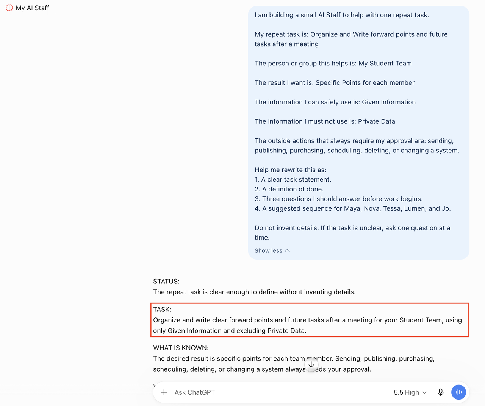

# Choose Your Task

## Introduction

Your Staff is most useful when it starts with a real need. Choose one repeat task that is useful but safe to practice. The task should have a beginning, a middle, and a result that you can recognize.

Examples:

- Turn meeting notes into decisions, follow-ups, and a short recap.
- Organize a weekly personal planning routine.
- Prepare a first draft of a career or community announcement.
- Sort a list of questions into themes and identify what needs research.
- Create a study plan from a list of topics and deadlines.
- Prepare a small event checklist and a draft reminder.

Avoid choosing a task that requires a real password, a real customer list, a real medical record, or an automatic outside action.

### Objectives

- Select one repeat task.
- Define who benefits and what a good result looks like.
- Identify the information that is approved for practice.
- Identify information and actions that are out of scope.
- Decide whether you need three, four, or five teammates.

### Hands-on Scenario

You are the owner of a repeat task that takes attention away from other priorities. You will describe the task, define a useful result, and give your Staff clear limits. The example can be personal, professional, community-based, or school-related. Use a fictional or approved version for practice.

Estimated Time: **5 minutes**

## Task 1: Describe The Repeat Task

Paste this prompt into the Staff Room and replace the bracketed text.

```text
<copy>
I am building a small AI Staff to help with one repeat task.

My repeat task is: [DESCRIBE THE TASK IN ONE OR TWO SENTENCES]

The person or group this helps is: [WHO BENEFITS]

The result I want is: [WHAT SHOULD COME BACK]

The information I can safely use is: [FICTIONAL OR APPROVED SOURCES]

The information I must not use is: [SENSITIVE OR OUT-OF-SCOPE INFORMATION]

The outside actions that always require my approval are: sending, publishing, purchasing, scheduling, deleting, or changing a system.

Help me rewrite this as:
1. A clear task statement.
2. A definition of done.
3. Three questions I should answer before work begins.
4. A suggested sequence for Maya, Nova, Tessa, Lumen, and Jo.

Do not invent details. If the task is unclear, ask one question at a time.
</copy>
```

### Expected Result: A Clear Starting Point

You should have a task statement, a definition of done, a short list of missing information, and a first idea of which roles are needed.



Use fictional or approved information. The example shows the task being made concrete before roles are created.

## Task 2: Create Your Definition Of Done

Use this prompt in the Staff Room.

```text
<copy>
For my repeat task, help me define what good looks like.

Task:
[TASK STATEMENT]

Create:
1. Three to five checks that show the result is complete.
2. The facts or sources that must be present.
3. The information that must be excluded.
4. The actions that require my approval.
5. The conditions that should make a teammate stop and ask a question.

Use plain language. Do not invent standards, facts, or approvals. If you are not sure, add a CONCERNS section that explains what needs clarification.
</copy>
```

Write down the result. Tessa will use it later.

## Task 3: Select Three To Five Teammates

Start with the smallest useful group.

| Teammate | Use This Role When | Path |
| --- | --- | --- |
| Maya, Coordinator | The request needs clarification, planning, routing, or tracking. | Required |
| Nova, Researcher | The work needs approved information organized or turned into a first pass. | Required |
| Tessa, Reviewer | The result needs a quality, privacy, inclusion, or readiness check. | Required |
| Lumen, Memory Keeper | The work includes stable decisions, preferences, or reusable instructions. | Optional |
| Jo, Publisher | The approved result needs a draft for a specific audience or channel. | Optional |

Use three roles if you want to finish the core path in 55 minutes. Add Lumen or Jo when the task clearly needs the extra step.

### Expected Result: A Small Team With A Purpose

You know which three roles are required for your task and whether one or both optional roles will add value.

Continue to [Build The Staff](#next).

## Acknowledgements

* **Author** - Angela Wall
* **Source Pattern** - Oracle LiveLabs finance LiveStack task module structure
* **Last Updated By/Date** - Draft for review, September 2026
