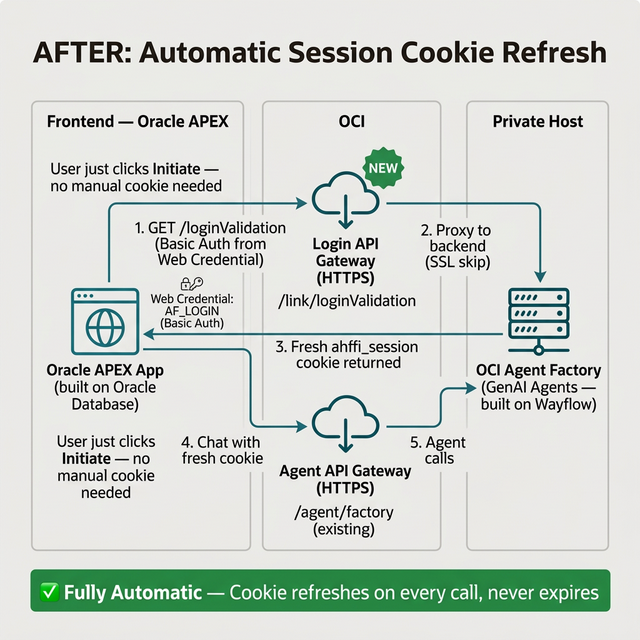
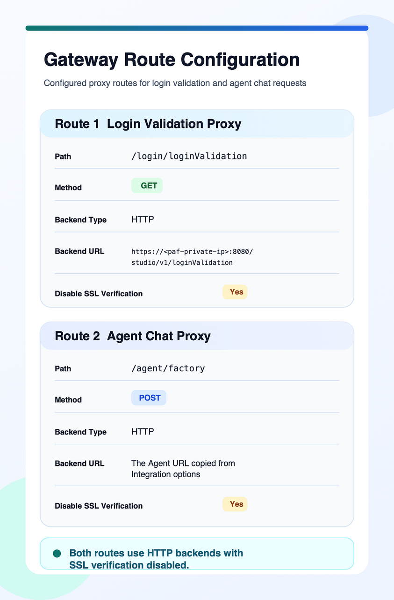

# Lab 3: Bridge PAF with API Gateway

## Introduction

Now that you know the direct call path fails, you can insert OCI API Gateway as the trusted public front door. In this lab, you will define the proxy model, create the gateway routes, and validate the login route before you move into APEX.

Estimated Time: 20 minutes

### Objectives

In this lab, you will:

- Map the API Gateway role in the end-to-end architecture.
- Create gateway routes for login validation and agent chat traffic.
- Validate that the login route returns a fresh session cookie through the gateway.

## Task 1: Map the Proxy Architecture

1. Review the bridge design from the source material. The API Gateway sits between APEX and the private PAF service.

    

2. Confirm these properties before you create routes:

    - the API Gateway presents a trusted public certificate to APEX,
    - the gateway can reach the private PAF backend inside the network path you control,
    - the gateway is allowed to skip backend certificate verification for the self-signed PAF service.

## Task 2: Create the Gateway Routes

1. Create or update a deployment with a login route that exposes a public path such as `/login/loginValidation` and forwards it to the private backend path:

    ```text
    https://<paf-host>:8080/studio/v1/loginValidation
    ```

2. Create a second route that exposes a public path such as `/agent/factory` and forwards it to the published agent endpoint you captured in Lab 1.

3. Set **Disable SSL Verification** to **Yes** for both routes. Without this setting, the gateway will reject the private self-signed backend certificate.

    

4. Review the route layout in the OCI Console and confirm both routes are part of the same deployment.

    

## Task 3: Validate the Public Login Route

1. Test the gateway login route with Basic Authentication.

    ```bash
    curl -u "your.email@company.com:password" \
      "https://<gateway-id>.apigateway.<region>.oci.customer-oci.com/login/loginValidation"
    ```

2. Confirm the response contains `VALID_USER` and a `Set-Cookie` header for `agent_factory_session`.

3. Record the gateway base URL and the two public routes. The remaining labs will use only the gateway URLs, not the private backend URLs.

## Acknowledgements

* **Author** - Lavkesh Singh, Cloud Solution Engineer, JAPAC Hub
* **Last Updated By/Date** - Lavkesh Singh, April 2026
