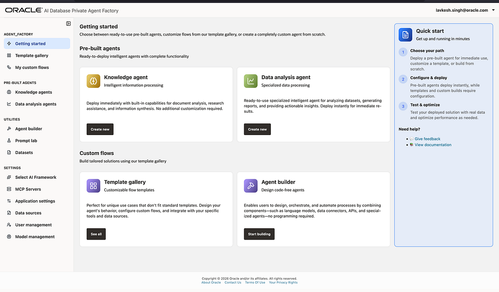
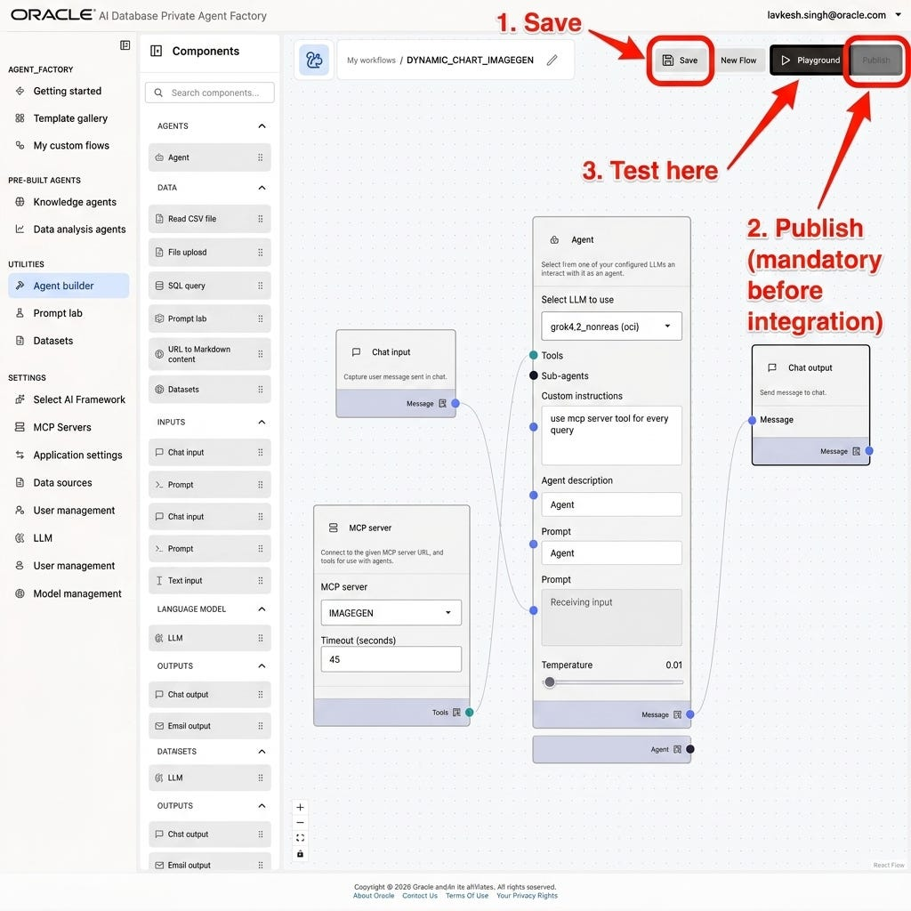
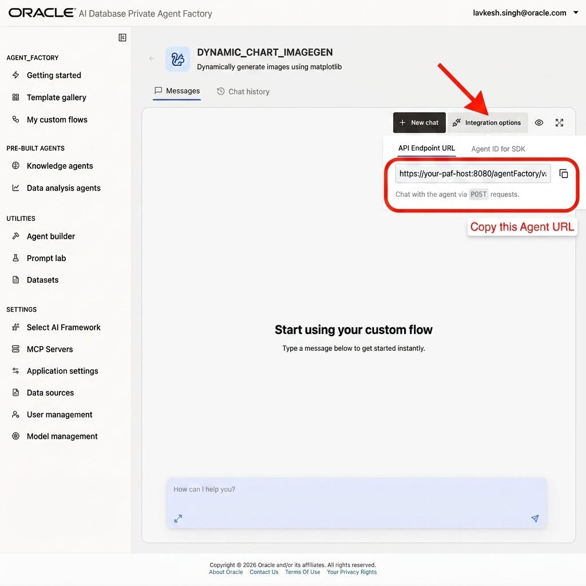

# Lab 1: Build and Publish Your Agent

## Introduction

Before you can integrate anything with APEX, you need a published Agent Factory agent and the exact endpoint that handles chat traffic. In this lab, you will confirm the builder flow, publish the agent, and record the endpoint that the API Gateway will expose later.

Estimated Time: 15 minutes

### Objectives

In this lab, you will:

- Review the minimum Agent Factory flow required for the integration.
- Publish the agent so the endpoint becomes available.
- Capture the API endpoint URL you will proxy in a later lab.

## Task 1: Review the Agent Builder Flow

1. Sign in to Oracle AI Database Private Agent Factory and open the main landing page.

    

2. Create a new agent or open an existing one in **Agent builder**. Confirm the flow includes the components you need for a conversational path, such as **Chat input**, **Agent**, optional **Tools** or **MCP servers**, and **Chat output**.

    

3. Save the flow, then publish it. Do not skip publishing. The builder can save a draft, but the integration endpoint is only useful after the agent is published.

## Task 2: Capture the Integration Endpoint

1. Open **Playground** for the published agent and then open **Integration options**.

    

2. Copy the API endpoint URL and store it in a secure note. It should follow a pattern similar to:

    ```text
    https://<your-paf-host>:8080/agentFactory/v1/...
    ```

3. Record two facts about this endpoint before you continue:

    - It expects `POST` requests for chat traffic.
    - It returns agent events in `application/x-ndjson` format.

## Task 3: Prepare Your Working Notes

1. Capture these values for the remaining labs:

    - the published agent endpoint from this lab,
    - the PAF host name,
    - the account you will use for Basic Authentication,
    - the APEX page where you will place the integration code.

2. Keep the builder open if you want to make later adjustments, but do not change the endpoint path once you start the API Gateway configuration.

## Acknowledgements

* **Author** - Lavkesh Singh, Cloud Solution Engineer, JAPAC Hub
* **Last Updated By/Date** - Lavkesh Singh, April 2026
