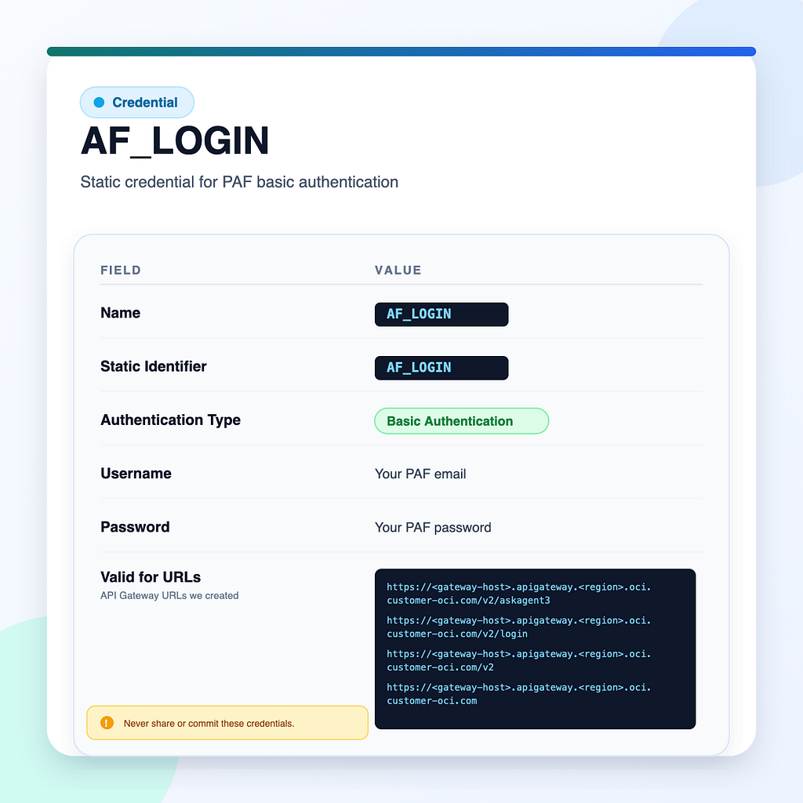

# Lab 4: Configure APEX and Initialize Chat

## Introduction

With the gateway in place, APEX can now log in without handling private certificates directly. In this lab, you will create APEX Web Credentials, define the page items required for session state, and add the PL/SQL block that fetches a fresh cookie and creates a chat room.

Estimated Time: 20 minutes

### Objectives

In this lab, you will:

- Store the PAF credentials in APEX Web Credentials.
- Prepare APEX page items for the cookie and room ID.
- Add the initialization PL/SQL that logs in and starts the room.

## Task 1: Create the APEX Web Credential

1. In APEX, open **Shared Components**, then open **Web Credentials** and create a new credential.

    

2. Give the credential a static ID such as `AF_LOGIN` and store the same email and password you used when validating the login route with `curl`.

3. Keep the credential inside APEX. Do not hardcode the password inside the PL/SQL process.

## Task 2: Prepare the APEX Page State

1. On the APEX page that hosts the chat experience, create hidden items to store the session cookie and the room identifier.

    ```text
    P1_COOKIE
    P1_ROOM
    ```

2. Add an **Initiate** button or equivalent action that will run the initialization logic the first time a user starts a chat.

3. Confirm that the page already has a place to show notifications, because the PL/SQL block will report failures through the standard APEX inline notification pattern.

## Task 3: Add the Session-Initialization PL/SQL

1. Create a page process or dynamic action step that runs this PL/SQL block when the user clicks **Initiate**. Replace the gateway host placeholder before you run it.

    ```plsql
    DECLARE
        l_login_url  VARCHAR2(4000) := 'https://<your-gateway>/login/loginValidation';
        l_url        VARCHAR2(4000);
        l_body       CLOB;
        l_resp       CLOB;
        l_login_resp CLOB;
        l_cookie     VARCHAR2(4000);
        l_room       VARCHAR2(32767);
        l_json       JSON_OBJECT_T;
        l_lines      APEX_T_VARCHAR2;
        l_line       VARCHAR2(32767);
    BEGIN
        apex_web_service.g_request_headers.DELETE;

        l_login_resp := apex_web_service.make_rest_request(
            p_url                  => l_login_url,
            p_http_method          => 'GET',
            p_credential_static_id => 'AF_LOGIN',
            p_transfer_timeout     => 30
        );

        FOR i IN 1 .. apex_web_service.g_headers.count LOOP
            IF LOWER(apex_web_service.g_headers(i).name) = 'set-cookie'
               AND apex_web_service.g_headers(i).value LIKE 'agent_factory_session=%'
            THEN
                l_cookie := REGEXP_SUBSTR(
                    apex_web_service.g_headers(i).value,
                    'agent_factory_session=([^;]+)', 1, 1, NULL, 1
                );
                EXIT;
            END IF;
        END LOOP;

        IF l_cookie IS NULL THEN
            apex_error.add_error(
                p_message          => 'Auto-login failed.',
                p_display_location => 'INLINE_IN_NOTIFICATION'
            );
            RETURN;
        END IF;

        :P1_COOKIE := l_cookie;
        l_url := 'https://<your-gateway>/agent/factory';

        SELECT JSON_OBJECT('message' VALUE 'hi' RETURNING CLOB)
          INTO l_body
          FROM dual;

        apex_web_service.g_request_headers.DELETE;
        apex_web_service.g_request_headers(1).name  := 'Content-Type';
        apex_web_service.g_request_headers(1).value := 'application/json';
        apex_web_service.g_request_headers(2).name  := 'Accept';
        apex_web_service.g_request_headers(2).value := 'application/x-ndjson';
        apex_web_service.g_request_headers(3).name  := 'Cookie';
        apex_web_service.g_request_headers(3).value :=
            'agent_factory_session=' || l_cookie;

        l_resp := apex_web_service.make_rest_request(
                      p_url              => l_url,
                      p_http_method      => 'POST',
                      p_body             => l_body,
                      p_transfer_timeout => 60
                  );

        l_lines := apex_string.split(l_resp, CHR(10));
        FOR i IN 1 .. l_lines.count LOOP
            l_line := TRIM(l_lines(i));
            IF l_line IS NOT NULL THEN
                BEGIN
                    l_json := JSON_OBJECT_T.parse(l_line);
                    IF l_json.get_string('type') = 'roomCreated' THEN
                        l_room := l_json.get_string('content');
                    END IF;
                EXCEPTION
                    WHEN OTHERS THEN
                        NULL;
                END;
            END IF;
        END LOOP;

        IF l_room IS NULL THEN
            apex_error.add_error(
                p_message          => 'Could not create room.',
                p_display_location => 'INLINE_IN_NOTIFICATION'
            );
            RETURN;
        END IF;

        :P1_ROOM := l_room;
    END;
    ```

2. Confirm that the block performs these actions in sequence:

    - it calls the gateway login route with the stored credential,
    - it extracts `agent_factory_session` from the response headers,
    - it posts a starter message to the agent route,
    - it parses NDJSON lines until it finds the `roomCreated` event.

3. Run the process once and confirm that the page items receive values for both the cookie and the room ID.

## Acknowledgements

* **Author** - Lavkesh Singh, Cloud Solution Engineer, JAPAC Hub
* **Last Updated By/Date** - Lavkesh Singh, April 2026
