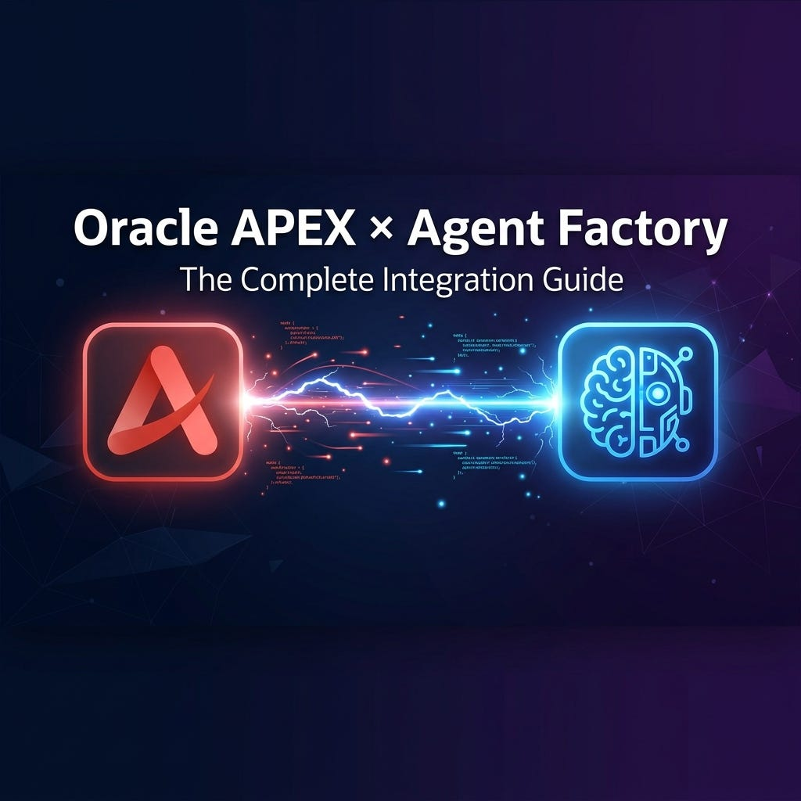

# Connect Oracle Agent Factory to Oracle APEX with API Gateway

## About this Workshop

This workshop turns a step-by-step implementation blog into a guided LiveLabs flow. You will publish an Oracle AI Database Private Agent Factory agent, inspect the integration endpoint, understand the session-cookie requirement, bridge the private backend with OCI API Gateway, and wire Oracle APEX PL/SQL to start and continue agent conversations without manual cookie handling.

Estimated Workshop Time: 1 hour 40 minutes

### Objectives

In this workshop, you will:

- Publish and inspect a working Agent Factory agent.
- Understand the session-cookie and private-network constraints behind the integration.
- Configure OCI API Gateway to proxy login and agent requests.
- Create APEX Web Credentials and initialize a chat room from PL/SQL.
- Send chat messages through the proxy and parse NDJSON responses.
- Confirm your understanding with a scored quiz lab.

### Prerequisites

This workshop assumes you have:

- Access to Oracle AI Database Private Agent Factory with permission to create or publish an agent.
- Access to OCI API Gateway in a network that can reach the private PAF backend.
- Access to an Oracle APEX workspace backed by Autonomous Database.
- An APEX application or test page where you can add hidden items, a button, and PL/SQL processes.

## Workshop Flow

You will work through these labs:

- `Lab 1`: Build and publish the agent, then capture the endpoint you must proxy.
- `Lab 2`: Understand why the browser cookie blocks direct integration and how `loginValidation` solves it.
- `Lab 3`: Create the API Gateway routes that bridge public APEX traffic to the private PAF backend.
- `Lab 4`: Store credentials securely in APEX and initialize a chat session from PL/SQL.
- `Lab 5`: Send messages, auto-refresh the session cookie, and parse NDJSON replies.
- `Lab 6`: Complete a scored knowledge check.

## Learn More

- [Source blog: Connecting Oracle Agent Factory to APEX - Here's Exactly How (Step-by-Step)](https://lavkeshhh.medium.com/connecting-oracle-agent-factory-to-apex-heres-exactly-how-step-by-step-d19f5cef15c5)
- [Oracle APEX Documentation](https://docs.oracle.com/en/database/oracle/apex/)
- [OCI API Gateway Documentation](https://docs.oracle.com/en-us/iaas/Content/APIGateway/home.htm)

## Acknowledgements

* **Author** - Lavkesh Singh, Cloud Solution Engineer, JAPAC Hub
* **Last Updated By/Date** - Lavkesh Singh, April 2026
