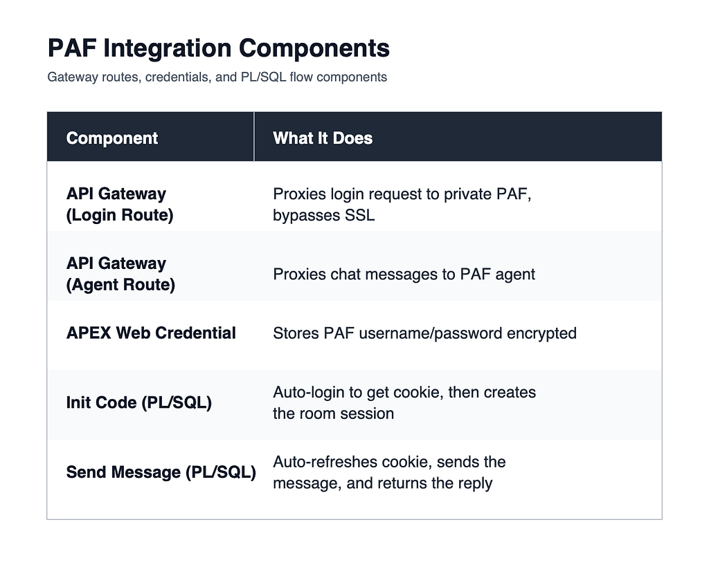

# Lab 5: Send Messages and Parse NDJSON

## Introduction

The last implementation step is the message loop. In this lab, you will add the callback that refreshes the session cookie before every request, forwards the message and room ID to the agent, and returns the parsed reply back to the APEX page.

Estimated Time: 20 minutes

### Objectives

In this lab, you will:

- Add the PL/SQL callback that refreshes the session cookie automatically.
- Post the user message and room ID to the gateway agent route.
- Parse the NDJSON response and return the final message payload to APEX.

## Task 1: Add the Message Callback

1. Create an APEX AJAX callback, on-demand process, or equivalent server-side entry point that runs when the user submits a chat message. Use `apex_application.g_x01` for the message text and `apex_application.g_x02` for the room ID.

2. Add the following PL/SQL block and replace the gateway host placeholder before you run it.

    ```plsql
    DECLARE
        l_login_url  VARCHAR2(4000) := 'https://<your-gateway>/login/loginValidation';
        l_url        VARCHAR2(4000) := 'https://<your-gateway>/agent/factory';
        l_msg        VARCHAR2(32767) := apex_application.g_x01;
        l_room       VARCHAR2(32767) := apex_application.g_x02;
        l_cookie     VARCHAR2(32767);
        l_body       CLOB;
        l_resp       CLOB;
        l_reply      CLOB;
        l_json       JSON_OBJECT_T;
        l_lines      APEX_T_VARCHAR2;
        l_line       VARCHAR2(32767);
    BEGIN
        apex_web_service.g_request_headers.DELETE;

        DECLARE
            l_login_resp CLOB;
        BEGIN
            l_login_resp := apex_web_service.make_rest_request(
                p_url                  => l_login_url,
                p_http_method          => 'GET',
                p_credential_static_id => 'AF_LOGIN',
                p_transfer_timeout     => 15
            );

            FOR i IN 1 .. apex_web_service.g_headers.count LOOP
                IF LOWER(apex_web_service.g_headers(i).name) = 'set-cookie'
                   AND apex_web_service.g_headers(i).value LIKE 'agent_factory_session=%'
                THEN
                    l_cookie := REGEXP_SUBSTR(
                        apex_web_service.g_headers(i).value,
                        'agent_factory_session=([^;]+)', 1, 1, NULL, 1
                    );
                    EXIT;
                END IF;
            END LOOP;
        EXCEPTION
            WHEN OTHERS THEN
                NULL;
        END;

        IF l_cookie IS NULL THEN
            htp.p('{"status":"error","error":"Session expired. Click Initiate."}');
            RETURN;
        END IF;

        SELECT JSON_OBJECT(
                   'message' VALUE l_msg,
                   'roomId'  VALUE l_room
                   RETURNING CLOB
               )
          INTO l_body
          FROM dual;

        apex_web_service.g_request_headers.DELETE;
        apex_web_service.g_request_headers(1).name  := 'Content-Type';
        apex_web_service.g_request_headers(1).value := 'application/json';
        apex_web_service.g_request_headers(2).name  := 'Accept';
        apex_web_service.g_request_headers(2).value := 'application/x-ndjson';
        apex_web_service.g_request_headers(3).name  := 'Cookie';
        apex_web_service.g_request_headers(3).value :=
            'agent_factory_session=' || l_cookie;

        l_resp := apex_web_service.make_rest_request(
                      p_url              => l_url,
                      p_http_method      => 'POST',
                      p_body             => l_body,
                      p_transfer_timeout => 120
                  );

        l_lines := apex_string.split(l_resp, CHR(10));
        FOR i IN 1 .. l_lines.count LOOP
            l_line := TRIM(l_lines(i));
            IF l_line IS NOT NULL THEN
                BEGIN
                    l_json := JSON_OBJECT_T.parse(l_line);
                    IF l_json.get_string('type') = 'message' THEN
                        l_reply := l_json.get_string('content');
                    END IF;
                EXCEPTION
                    WHEN OTHERS THEN
                        NULL;
                END;
            END IF;
        END LOOP;

        l_reply := COALESCE(l_reply, 'No response from agent.');

        htp.p('{"status":"ok","reply":"'
              || apex_escape.json(l_reply) || '"}');

    EXCEPTION
        WHEN OTHERS THEN
            htp.p('{"status":"error","error":"'
                  || apex_escape.json(SQLERRM) || '"}');
    END;
    ```

3. Confirm the callback behavior:

    - it fetches a fresh cookie before every outbound message,
    - it posts `message` and `roomId` as JSON,
    - it parses the NDJSON stream until it finds a `message` event,
    - it returns a compact JSON response that your APEX UI can consume.

## Task 2: Validate the End-to-End Flow

1. Start a session with the **Initiate** action you created in Lab 4.

2. Send a test message through the callback and confirm the page receives a response shaped like:

    ```json
    {"status":"ok","reply":"..."}
    ```

3. If the callback returns an error, check these items first:

    - the Web Credential static ID is `AF_LOGIN`,
    - the gateway URLs use the public API Gateway hostname,
    - the room ID is populated before you send the first message,
    - the gateway route still points to the correct published agent endpoint.

## Task 3: Confirm the Operational Pattern

1. Review the quick reference diagram and compare it to your implementation.

    

2. Keep the operational rule from the source material: refresh the cookie before every message instead of caching and tracking the expiry time.

3. Capture these outcomes for your final notes:

    - the user no longer has to open browser developer tools,
    - the cookie stays server-side inside the APEX integration,
    - the session renewal is invisible to the end user.

## Acknowledgements

* **Author** - Lavkesh Singh, Cloud Solution Engineer, JAPAC Hub
* **Last Updated By/Date** - Lavkesh Singh, April 2026
