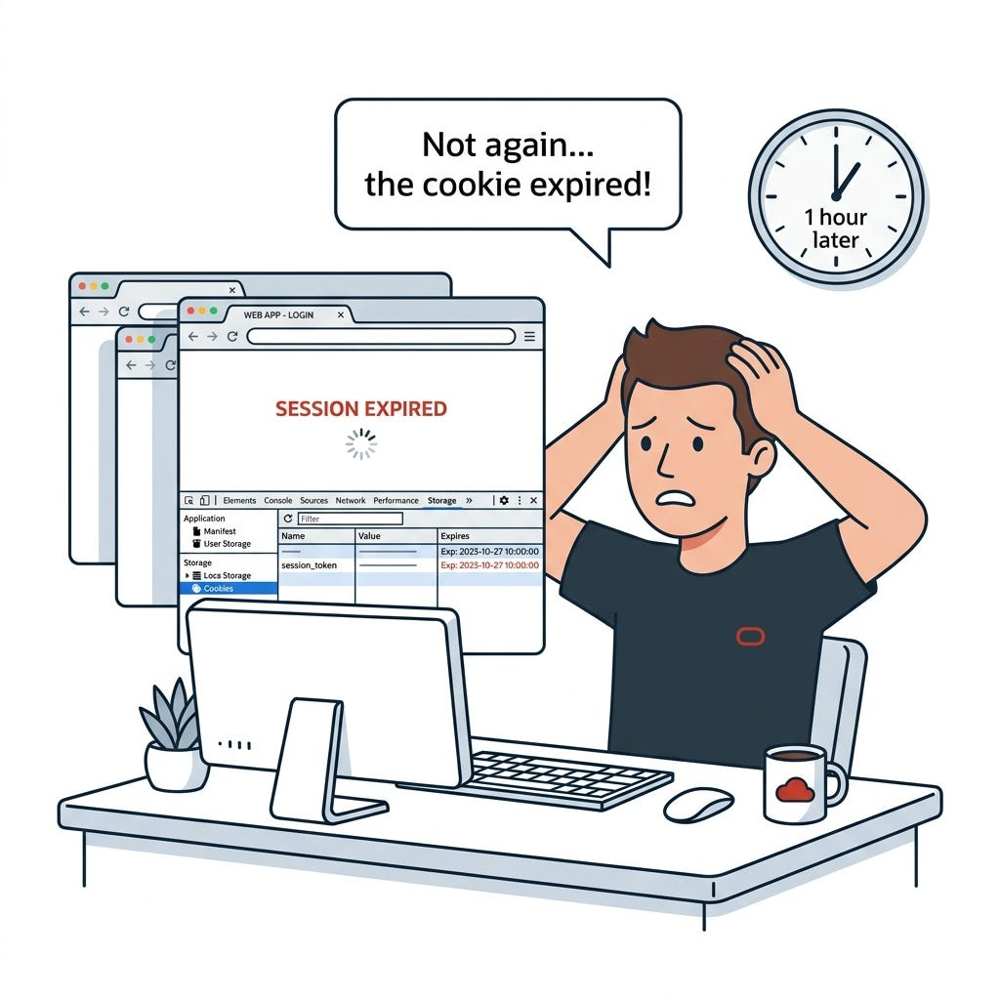
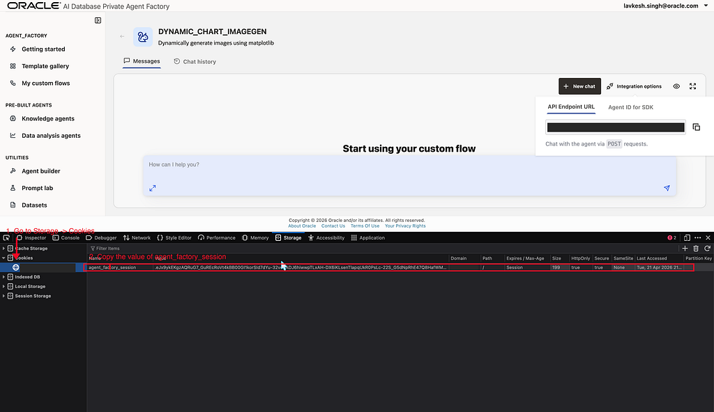
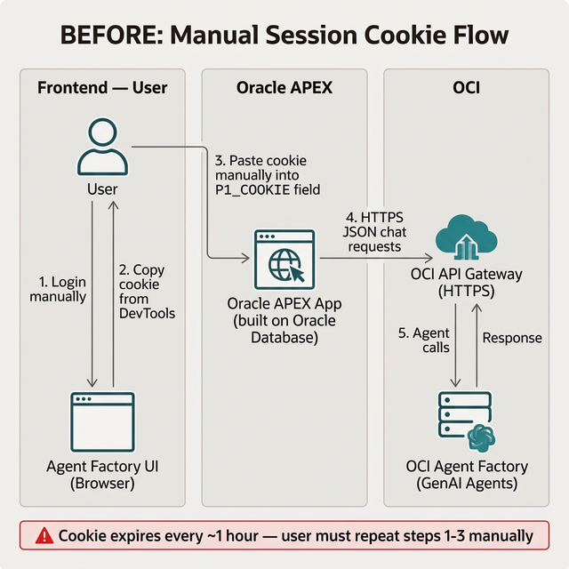

# Lab 2: Understand Authentication and Connectivity

## Introduction

The hard part of this integration is not the chat payload. It is the session model around the private backend. In this lab, you will understand why the browser cookie blocks a direct APEX integration, test the hidden `loginValidation` endpoint, and document the network constraint that makes API Gateway necessary.

Estimated Time: 15 minutes

### Objectives

In this lab, you will:

- Identify the session cookie required by Agent Factory.
- Confirm that `loginValidation` can issue a fresh cookie with Basic Authentication.
- Understand why Autonomous Database cannot call the private backend directly.

## Task 1: Inspect the Session Requirement

1. Review the screenshot that highlights the session lifecycle issue. The integration depends on the session cookie, and the article notes that the cookie expires on a roughly hourly cadence.

    

2. Open the browser developer tools in your own environment and inspect the storage cookies for the Agent Factory UI. The article shows the cookie under the browser storage view.

    

3. Record the cookie name used by your environment. The article observed `agent_factory_session`, while older environments may still expose `ahffi_session`.

## Task 2: Test Programmatic Login Outside APEX

1. Use `curl` to call the login validation endpoint with Basic Authentication.

    ```bash
    curl -s -D - -u "your.email@company.com:your_password" \
      "https://<paf-host>:8080/studio/v1/loginValidation"
    ```

2. Confirm that the response contains a `Set-Cookie` header and a JSON payload that marks the user as valid.

    ```text
    HTTP/1.1 200 OK
    Set-Cookie: agent_factory_session=.eJx9ykEO...; Secure; HttpOnly; Path=/
    {"data": {"VALID_USER": 1, "USER_ID": "your.email@company.com"}}
    ```

3. Compare that result to the manual demo workflow shown below. The goal of the remaining labs is to eliminate this repeated copy-paste pattern from the final APEX experience.

    

## Task 3: Capture the Connectivity Constraint

1. Record the two infrastructure blockers called out in the source material:

    - the PAF backend is reachable on a private address,
    - the backend uses a self-signed certificate.

2. Record the direct failure mode you should expect from APEX PL/SQL when the database tries to call the private backend without a trusted public bridge.

    ```text
    ORA-29273: HTTP request failed
    ```

3. Keep this conclusion in your notes: APEX can call a public OCI API Gateway endpoint with a trusted certificate, but it cannot safely and directly call the private self-signed PAF endpoint in this pattern.

## Acknowledgements

* **Author** - Lavkesh Singh, Cloud Solution Engineer, JAPAC Hub
* **Last Updated By/Date** - Lavkesh Singh, April 2026
