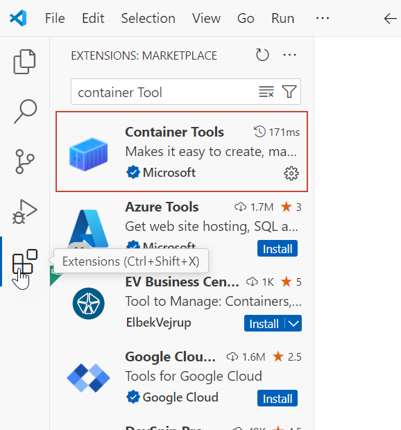
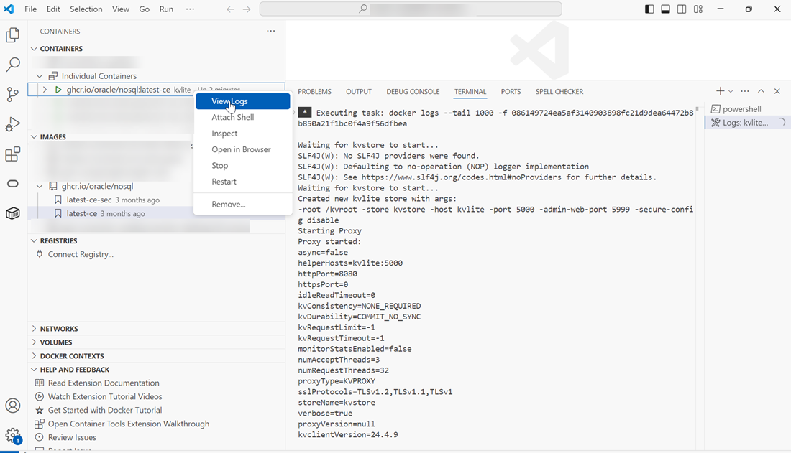

# Get Started

## Introduction

This lab walks you through the steps to download and start a simplified version of Oracle NoSQL Database (KVLite) in a container.

Estimated Time: 10 mins

### Objectives

In this lab, you will:

* Run KVLite in a container
* View the KVLite instance and the logs using the **Containers** extension of Visual Studio Code

### Prerequisites

This lab assumes you have:

* Installed [Microsoft Visual Studio Code](https://code.visualstudio.com/)
* Installed a container runtime

In this workshop, we have made use of Docker as an example. The Docker daemon must be running.

## Task 1: Run the container image of KVLite

1. Open Microsoft Visual Studio Code and open the Terminal. Run the KVLite container image that is available in the GitHub container repository (ghcr.io/oracle/nosql). In this workshop, we will use **latest-ce** which is the non-secure KVLite community edition image.

  To run the KVLite container image, use the following command.

    ```
  <copy>docker run -d --name=kvlite --hostname=kvlite --env KV_PROXY_PORT=8080 -p 8080:8080 ghcr.io/oracle/nosql:latest-ce</copy>
    ```
  KVLite is started in a container with the proxy listening at HTTP port 8080. 


## Task 2: View the KVLite instance using the Container Tools extension

1. Choose **Extensions** and install the **Container Tools** extension.

  

2. You can view the KVLite instance, which you just started, under **Containers**. To see the log details, right-click on the container and choose **View Logs**.

  

You may now **proceed to the next lab**.

## Acknowledgements

* **Author** - Purnima Subramanian, Principal UA Developer, DB Cloud Technical Svcs & User Assistance
* **Last Updated By/Date** - Purnima Subramanian, Principal UA Developer, DB Cloud Technical Svcs & User Assistance, December 2025
