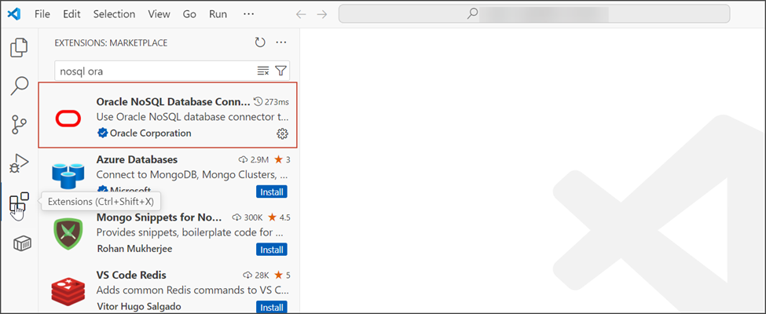
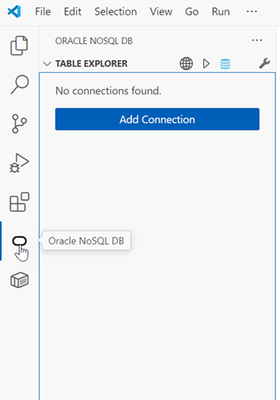
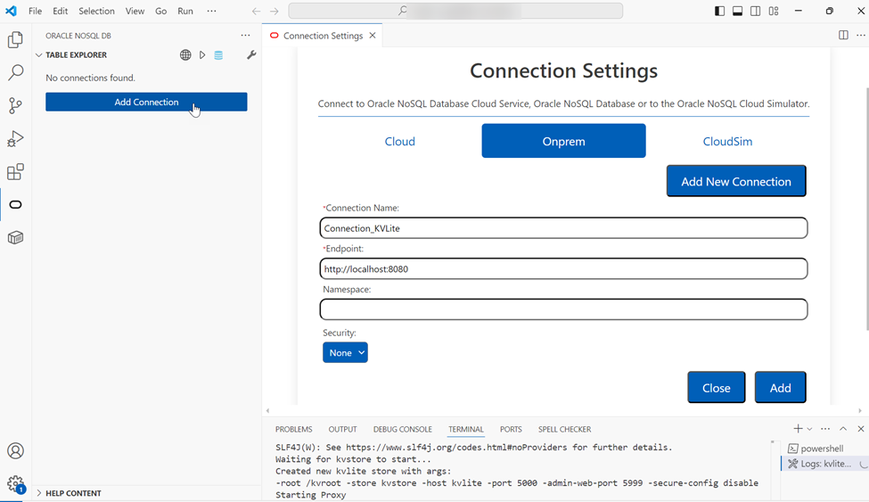
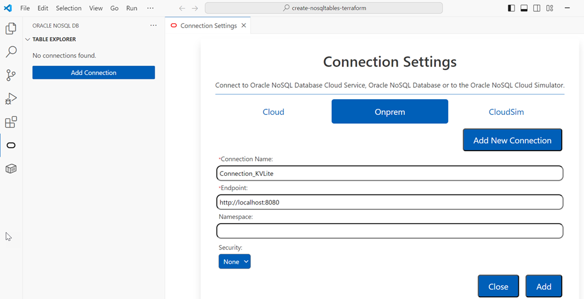
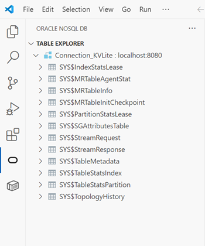
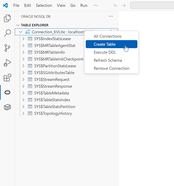
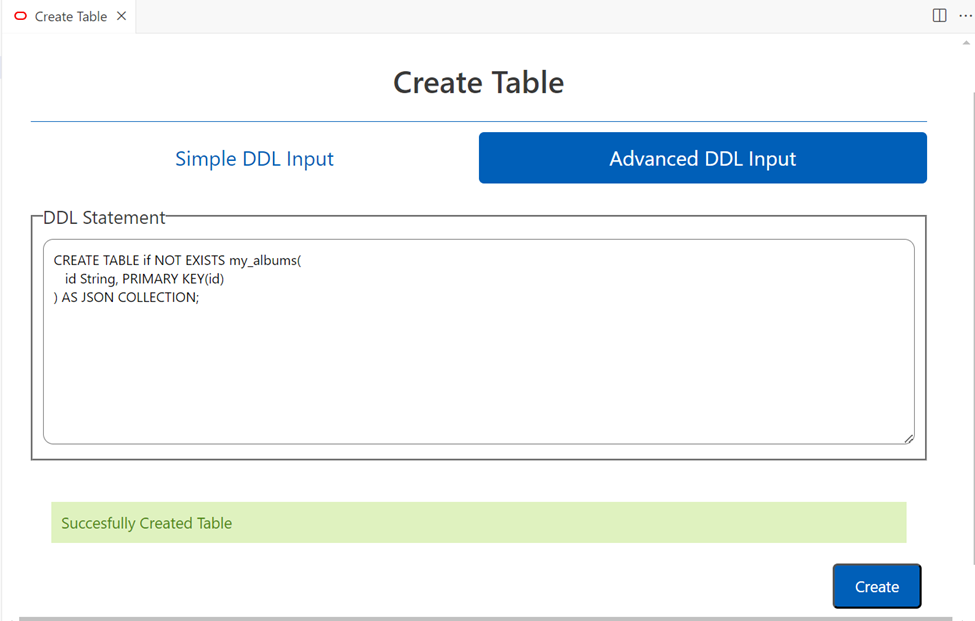
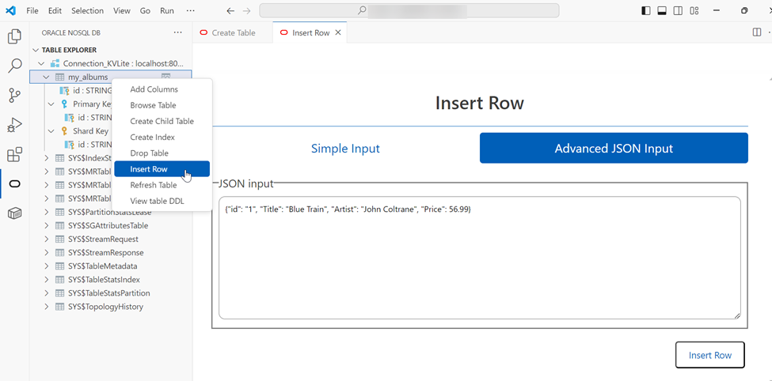
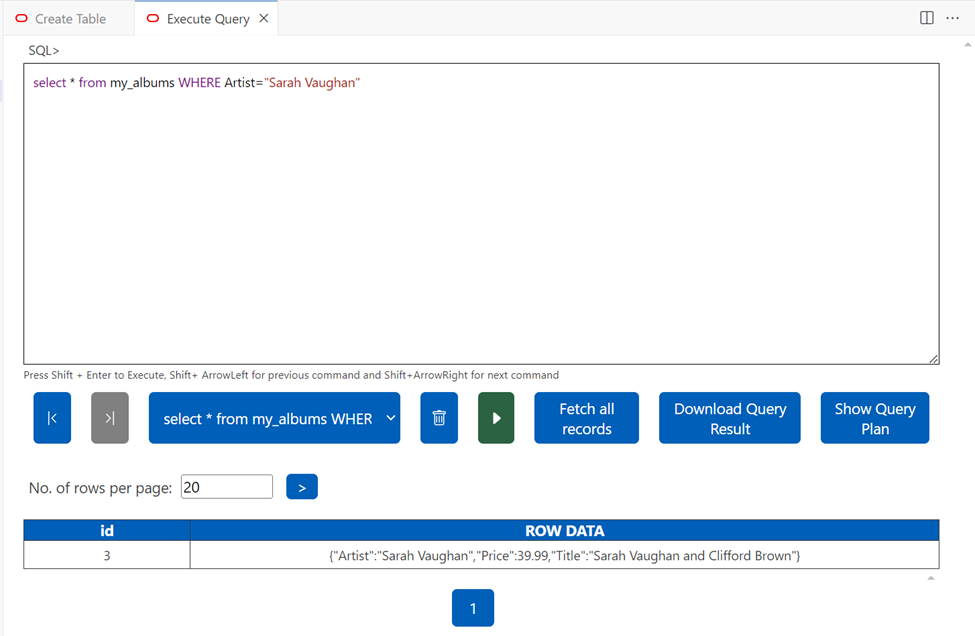

# Use IDE Plugin to Connect to KVLite

## Introduction

This lab walks you through the steps to connect to KVLite using the Oracle NoSQL Database plugin for Microsoft Visual Studio Code IDE.

Estimated Time: 5 mins

### Objectives

In this lab, you will:

* Install the Oracle NoSQL DB extension in Visual Studio Code
* Connect to KVLite
* Create table and insert data
* Run queries on the table

### Prerequisites

This lab assumes you have:

* Basic knowledge of SQL

## Task 1: Install the Oracle NoSQL DB extension and connect to KVLite

1. Open Microsoft Visual Studio Code. Choose **Extensions** and install the **Oracle NoSQL Database Connector**.

  

2. Choose the **Oracle NoSQL DB** extension.

  

3. Add a connection to the KVLite instance you started by choosing **Add Connection > Onprem**

  

4. Enter a **Connection Name**. Enter the **Endpoint** as [http://localhost:8080](http://localhost:8080) (This connects to the KVLite instance that you started. KVLite is running in the localhost with the proxy listening at HTTP port 8080).

  

5. Once the connection is established, you can view the connection under **Table Explorer**.

  

## Task 2: Create table and run queries

1. To create a table in the database, right click on the connection and choose **Create Table**.

  

2. In this example, we will create a JSON collection table named **my_albums** using the **Advanced DDL Input** mode.

  

3. You can now view the table you have created under the **Table Explorer**. Let us add some data to this table. Right-click on the table and choose **Insert Row** to enter the JSON input. Similarly, insert all the rows.

  

4. Right-click on the table, choose **Browse Table** and run the query to view all the rows in the table.

  

5. You can enter a query, execute it, and view the resultant output.

  

You may now **proceed to the next lab**.

## Learn More

* [Microsoft Visual Studio Code Extension](https://docs.oracle.com/en/database/other-databases/nosql-database/25.3/plugins/oracle-nosql-database-visual-studio-code-extension.html#GUID-0B8A46B1-431F-4C18-95C8-746A17038876)
* [IntelliJ Plugin](https://docs.oracle.com/en/database/other-databases/nosql-database/25.3/plugins/intellij-plugin.html#GUID-68518B99-BC30-4AD9-9986-02921AA35688)

## Acknowledgements

* **Author** - Purnima Subramanian, Principal UA Developer, DB Cloud Technical Svcs & User Assistance
* **Last Updated By/Date** - Purnima Subramanian, Principal UA Developer, DB Cloud Technical Svcs & User Assistance, December 2025
