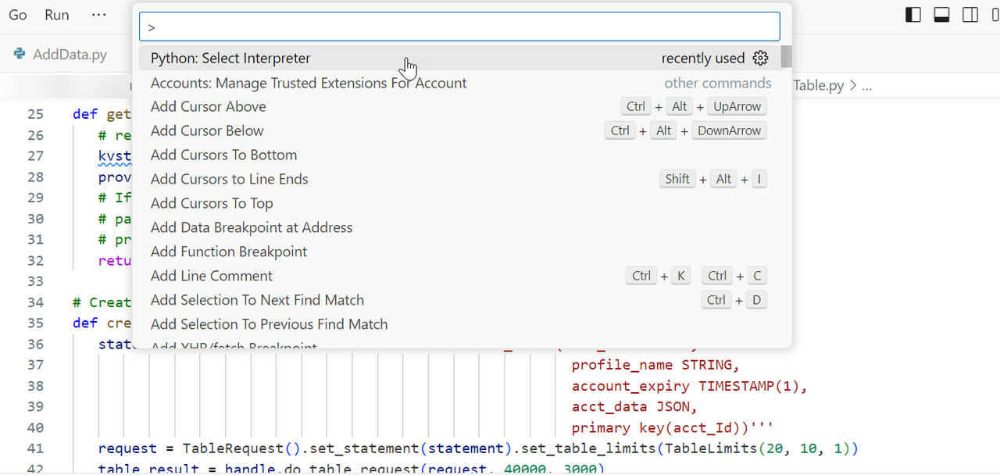
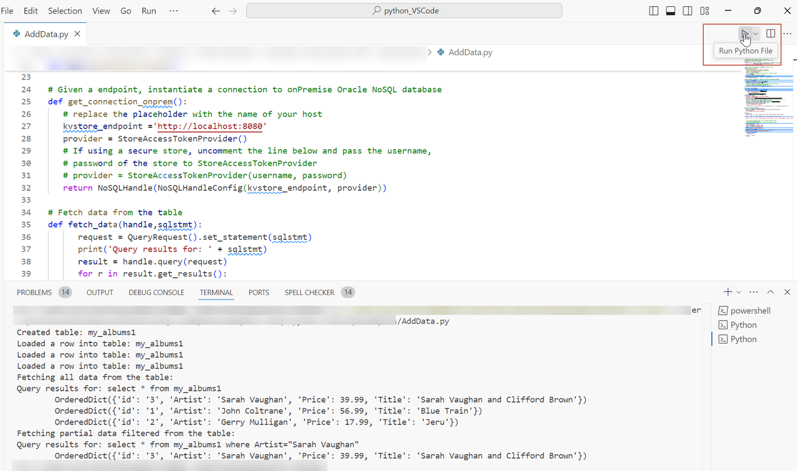
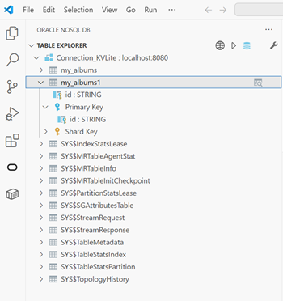

# Use SDK to Connect to KVLite

## Introduction

Oracle NoSQL Database supports many of the most popular [programming languages](https://docs.oracle.com/en/database/other-databases/nosql-database/25.3/nsdev/oracle-nosql-database-sdk-drivers.html) and frameworks with idiomatic language APIs and data structures, giving your application access to data stored in the database. It currently supports the following: Java, Python, Node.js (JavaScript/TypeScript), Golang, C#/.NET, Spring and Rust.

You can refer to the table below for links to the SDKs, API guides, and examples:

| **SDK** | **API Guide** | **Examples** |
| --- | --- | --- |
| [Oracle NoSQL Java SDK](https://github.com/oracle/nosql-java-sdk) | [Java SDK API Guide](https://oracle.github.io/nosql-java-sdk/index.html) | [Java Examples](https://github.com/oracle/nosql-examples/tree/master/examples-nosql-java-sdk)  |
| [Oracle NoSQL Python SDK](https://github.com/oracle/nosql-python-sdk) | [Python SDK API Guide](https://nosql-python-sdk.readthedocs.io/en/latest/api.html) | [Python Examples](https://github.com/oracle/nosql-examples/tree/master/examples-nosql-python-sdk) |
| [Oracle NoSQL Go SDK](https://github.com/oracle/nosql-go-sdk) | [Go SDK API Guide](https://pkg.go.dev/github.com/oracle/nosql-go-sdk/nosqldb) | [Go Examples](https://github.com/oracle/nosql-examples/tree/master/examples-nosql-go-sdk) |
| [Oracle NoSQL Node.js SDK](https://github.com/oracle/nosql-node-sdk) | [Node.js SDK API Guide](https://oracle.github.io/nosql-node-sdk/) | [Node.js Examples](https://github.com/oracle/nosql-examples/tree/master/examples-nosql-node-sdk) |
| [Oracle NoSQL .NET SDK](https://github.com/oracle/nosql-dotnet-sdk) | [.NET SDK API Reference](https://oracle.github.io/nosql-dotnet-sdk/api/Oracle.NoSQL.SDK.html) | [.NET Examples](https://github.com/oracle/nosql-examples/tree/master/examples-nosql-dotnet-sdk) |
| [Oracle NoSQL Rust SDK](https://github.com/oracle/nosql-rust-sdk) | [Rust SDK API Guide](https://docs.rs/oracle-nosql-rust-sdk/latest/oracle_nosql_rust_sdk/) | [Rust Examples](https://github.com/oracle/nosql-rust-sdk/tree/main/examples) |
| [Oracle NoSQL Spring SDK](https://github.com/oracle/nosql-spring-sdk) | [Spring SDK API Guide](https://oracle.github.io/nosql-spring-sdk) | [Spring Examples](https://github.com/oracle/nosql-examples/tree/master/examples-nosql-spring-sdk) |

This lab walks you through the steps to connect to KVLite using Python SDK

Estimated Time: 10 mins  

### Objectives

In this lab, you will:

* Install the Python SDK
* Download and edit the sample code
* Run the sample code
* View the table in the table explorer

### Prerequisites

This lab assumes you have:

* Basic knowledge of Python

## Task 1: Install the Python SDK

1. Open Microsoft Visual Studio Code. Create a virtual environment. Open the command palette to select the Python interpreter. Select the virtual environment that you have created, from the list of interpreters.

  

2. Activate the virtual environment and install the Python SDK within this environment. You can install the SDK using the pip command. If you are using Python 3, use pip3 command:

    ```
    <copy>pip install borneo</copy>
    ```

## Task 2: Download and edit the sample code

1. Download **AddData.py** from [Python Examples](https://github.com/oracle/nosql-examples/tree/master/examples-nosql-python-sdk). Open it in the Visual Studio Code editor and edit it as per your requirements as shown below. Specify the kvstore-endpoint as [http://localhost:8080](https://localhost:8080) (This connects to the KVLite instance that you started. KVLite is running in the localhost with the proxy listening at HTTP port 8080). Code completion, intelligent code navigation, debugging and other advantages that come with using an IDE help in efficient and faster code development.

    ```
    <copy>
      import os
      from borneo import (Regions, NoSQLHandle, NoSQLHandleConfig, PutRequest,QueryRequest,
                          TableRequest, GetRequest, TableLimits, State)
      from borneo.iam import SignatureProvider
      from borneo.kv import StoreAccessTokenProvider


      # Given a endpoint, instantiate a connection to onPremise Oracle NoSQL database

      def get_connection_onprem():
        # replace the placeholder with the name of your host
        kvstore_endpoint ='http://localhost:8080'
        provider = StoreAccessTokenProvider()
        return NoSQLHandle(NoSQLHandleConfig(kvstore_endpoint, provider))

      # Fetch data from the table

      def fetch_data(handle,sqlstmt):
          request = QueryRequest().set_statement(sqlstmt)
          print('Query results for: ' + sqlstmt)
          result = handle.query(request)
          for r in result.get_results():
            print('\t' + str(r))
              
      # Create a table and set the table limits

      def create_table(handle):
        statement = '''CREATE TABLE if NOT EXISTS my_albums1(
        id String, PRIMARY KEY(id)
      ) AS JSON COLLECTION'''

      request = TableRequest().set_statement(statement).set_table_limits(TableLimits(20, 10, 1))
      # Create the table waiting for a total of 40000 milliseconds
      # and polling the service every 3000 milliseconds to see if table is active
      table_result = handle.do_table_request(request, 40000, 3000)
      table_result.wait_for_completion(handle, 40000, 3000)
      if (table_result.get_state() == State.ACTIVE):
          print('Created table: my_albums1')
      else:
        raise NameError('Table my_albums1 is in an unexpected state ' + str(table_result.get_state()))


      # Add a row of data to the table

      def insert_record(handle,table_name,acct_data):
        request = PutRequest().set_table_name(table_name).set_value_from_json(acct_data)
        handle.put(request)
        print('Loaded a row into table: my_albums1')

      def main():
        handle = None
        acct1='''{"id": "1", "Title": "Blue Train", "Artist": "John Coltrane", "Price": 56.99}'''
        acct2='''{"id": "2", "Title": "Jeru", "Artist": "Gerry Mulligan", "Price": 17.99}'''
        acct3='''{"id": "3", "Title": "Sarah Vaughan and Clifford Brown", "Artist": "Sarah Vaughan", "Price": 39.99}'''
        handle = get_connection_onprem()
        create_table(handle)
        insert_record(handle,'my_albums1',acct1)
        insert_record(handle,'my_albums1',acct2)
        insert_record(handle,'my_albums1',acct3)
        sqlstmt = 'select * from my_albums1'
        print('Fetching all data from the table:')
        fetch_data(handle,sqlstmt)
        sqlstmt = 'select * from my_albums1 where Artist="Sarah Vaughan"'
        print('Fetching partial data filtered from the table:')
        fetch_data(handle,sqlstmt)  
        if handle is not None:
            handle.close()

      if __name__ == "__main__":
        main()
    </copy>
    ```

## Task 3: Run the sample code

1. Choose the **Run** button on the right hand top corner of the editor. The sample code is run and you can see the output in the terminal.

  

## Task 4: View the table using the table explorer

1. Go to **Table Explorer** and choose **Refresh Schema**. You can view the **my_albums1** table with the inserted data.

  

You may now **proceed to the next lab**.

## Acknowledgements

* **Author** - Purnima Subramanian, Principal UA Developer, DB Cloud Technical Svcs & User Assistance
* **Last Updated By/Date** - Purnima Subramanian, Principal UA Developer, DB Cloud Technical Svcs & User Assistance, December 2025
