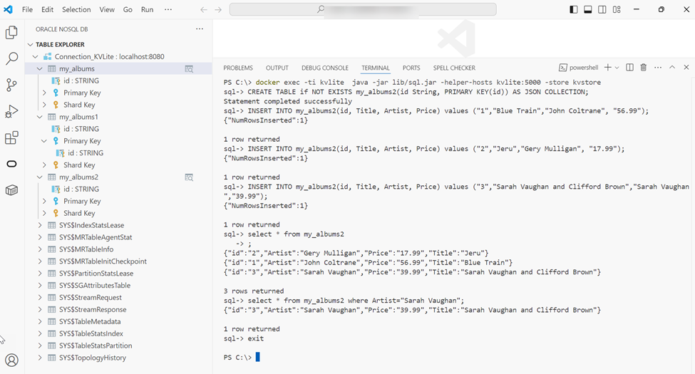

# Use SQL CLI to Connect to KVLite

## Introduction

This lab walks you through the steps to connect to KVLite using SQL Command Line Interface (CLI). The interactive SQL shell enables you to quickly run and test SQL queries.

Estimated Time: 5 mins

### Objectives

In this lab, you will:

* Start the SQL shell
* Create table and insert data using SQL queries
* View the table in the table explorer

### Prerequisites

This lab assumes you have:

* Basic knowledge of SQL

## Task 1: Start the SQL shell

1. Open Microsoft Visual Studio Code and open the Terminal. Start the SQL shell using the following command.

    This command runs within the container in which you started KVLite. It connects to the registry port (5000). This is the default TCP/IP port to connect to the KVLite instance.

    ```
    <copy>docker exec -ti kvlite  java -jar lib/sql.jar -helper-hosts kvlite:5000 -store kvstore</copy>
    ```

2. The SQL prompt is displayed and an interactive shell is opened.

    ```
    <copy>sql-></copy>
    ```

## Task 2: Create table and insert data using SQL queries

1. The SQL query to create a table is shown below:

    ```
    <copy>sql-> CREATE TABLE if NOT EXISTS my_albums2(id String, PRIMARY KEY(id)) AS JSON COLLECTION
    </copy>
    ```

2. The SQL queries to insert the rows into the table are as follows:

    ```
    <copy>
    INSERT INTO my_albums2(id, Title, Artist, Price) values ("1","Blue Train","John Coltrane", "56.99")

    INSERT INTO my_albums2(id, Title, Artist, Price) values ("2","Jeru","Gery Mulligan", "17.99")

    INSERT INTO my_albums2(id, Title, Artist, Price) values ("3","Sarah Vaughan and Clifford Brown","Sarah Vaughan","39.99")
    </copy>
    ```

3. An interactive shell is opened as shown below. You can enter the queries and see the outputs. You can see the **my_albums2** table with the inserted data under the **Table Explorer**.

    

## Learn More

* [Introduction to SQL for Oracle NoSQL Database](https://docs.oracle.com/en/database/other-databases/nosql-database/25.3/sqlfornosql/introduction-sql.html)

## Acknowledgements

* **Author** - Purnima Subramanian, Principal UA Developer, DB Cloud Technical Svcs & User Assistance
* **Last Updated By/Date** - Purnima Subramanian, Principal UA Developer, DB Cloud Technical Svcs & User Assistance, December 2025
