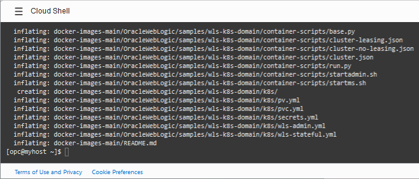
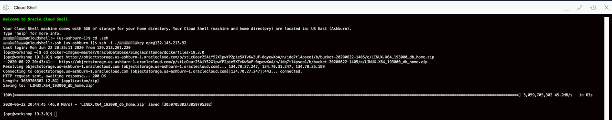
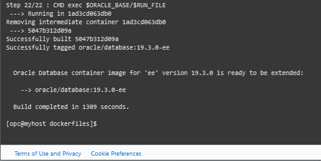

# Build the Oracle Database Docker Image

## Introduction
A Docker image contains all of the necessary code to execute an application for a host kernel. In this lab, you will create a Docker image for Oracle Database 19c.

Estimated Lab Time: 15 minutes

### Objectives
This lab walks you through the steps to build an Oracle Database Docker image on an Oracle Cloud compute instance.


### Prerequisites
* An Oracle Cloud paid account or free trial. To sign up for a trial account with $300 in credits for 30 days, click [here](•	https://signup.cloud.oracle.com)
* SSH keys
* Docker installed on an Oracle Cloud compute instance.

## Task 1: Install Docker build files from GitHub

Oracle has provided a complete set of Docker build files on an Oracle GitHub repository. There are several ways to get the files to the compute instance, but for simplicity, you will use GitHub's download option.

1. If you don't have an open SSH connection to your compute instance, create one:

    ```nohighlight
    ssh -i ~/.ssh/cloudshellkey opc@123.123.123.123
    ```

2. Use the `wget` to download the repository on the compute instance:

    ```
    <copy>wget https://github.com/oracle/docker-images/archive/main.zip</copy>
    ```
3. Unzip the repository on your compute instance:

    ```
    <copy>unzip main.zip</copy>
    ```

    

## Task 2: Upload Oracle Database zip to your compute instance

1. Navigate to the folder where you want to put your image zip file.
    ```
    <copy>cd docker-images-master/OracleDatabase/SingleInstance/dockerfiles/19.3.0</copy>
    ```

  Download the zip file to this folder.
  
    ```
    <copy>wget https://objectstorage.us-ashburn-1.oraclecloud.com/p/3pVf_6xSFIgi7VHOh-wPFYnQVVReNn8q21JhED6cgBJVnZ9hOkQrwwisa1AHRtn6/n/c4u04/b/data-management-library-files/o/LINUX.X64_193000_db_home.zip</copy>
    ```

  

## Task 3: Build the Docker image

1. Change directories to the `dockerfiles` directory:

    ```
    <copy>cd ~/docker-images-main/OracleDatabase/SingleInstance/dockerfiles</copy>
    ```

2. Build the Docker image using the `buildDockerImage` script. This process may take around 30 minutes.
   Be sure to read the [README.md](https://github.com/oracle/docker-images/blob/master/OracleDatabase/SingleInstance/README.md) file which explains the build process in greater detail.

    ```
    <copy>./buildContainerImage.sh -v 19.3.0 -e</copy>
    ```

    

  Note when the script completes, it lists the new Docker image: `oracle/database:19.3.0-ee`.

  You may now *proceed to the next lab*.

## Acknowledgements
* **Author** - Gerald Venzl, Master Product Manager, Database Development
* **Adapted for Cloud by** -  
* **Last Updated By/Date** - Madhusudhan Rao, Apr 2022
