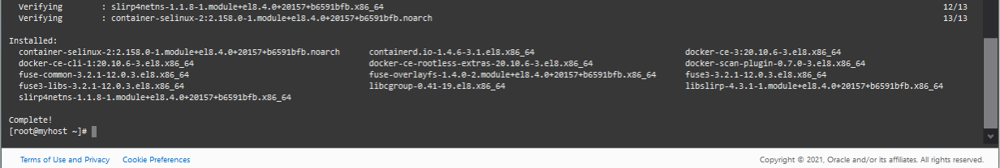
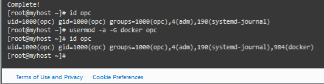
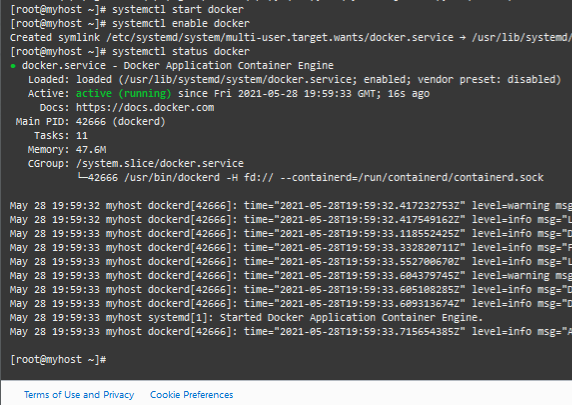
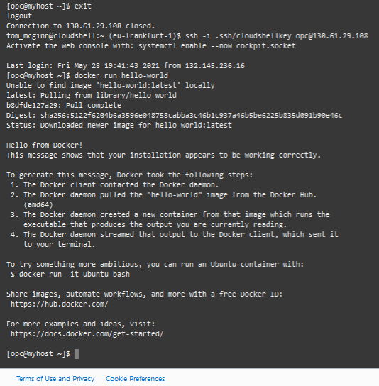

# Set up Docker on an Oracle Cloud Compute Instance

## Introduction
Oracle Cloud Compute makes it easy to create a Linux environment in the cloud, and creates a platform for installing and setting up a Docker container.

Estimated Lab Time: 15 minutes

### Objectives
This lab walks you through the steps to set up Docker on Oracle Linux 7.7 running on an Oracle Cloud compute instance.

### Prerequisites

* An Oracle Cloud paid account or free trial. To sign up for a trial account with $300 in credits for 30 days, click [here](http://oracle.com/cloud/free)
* An Oracle Cloud compute instance's Public IP Address
* SSH keys

## Task 1: Set up the Docker environment

  Docker is shipped as addon with Oracle Linux. On Oracle Cloud compute instances, the `addons yum` repository is now enabled by default, so you only need to install the docker-engine package as root.

1. If you are not already connected to your instance, in Cloud Shell, connect to your compute instance using `ssh`, and the public IP address of your compute instance:

    ```nohighlight
    ssh -i ~/.ssh/cloudshellkey opc@123.123.123.123
    ```

2. Switch to the root user:

    ```
    <copy>sudo su -</copy>
    ```

3. Enable the required repositories:

    ```
    <copy>dnf config-manager --add-repo=https://download.docker.com/linux/centos/docker-ce.repo</copy>
    ```

4. Install docker:

    ```
    # <copy>dnf install -y docker-ce --nobest</copy>
    ```

    

  Docker is now installed on the compute instance!

## Task 2: Enable a non-root user

Enable a non-root user to communicate with the Docker engine. When Docker was installed, a new Unix group docker was created along with it. To allow a non-root user (for example, `opc`) to communicate with the Docker daemon directly, you add the non-root user to the docker group.

1. Determine which groups `opc` belongs to:

    ```
    <copy>id opc</copy>
    ```

2. Add `opc` to the `docker` group:

    ```
    <copy>usermod -a -G docker opc</copy>
    ```

3. Check that `opc` is now part of the `docker` group:

    ```
    <copy>id opc</copy>
    ```

    

## Task 3: Start Docker

1. Start the Docker service.

    ```
    <copy>systemctl start docker</copy>
    ```

2. Enable the Docker service.

    ```
    <copy>systemctl enable docker</copy>
    ```

3. Check the status.

    ```
    <copy>systemctl status docker</copy>
    ```

    

## Task 4: Connect to Docker with the non-root user

1. Exit the existing connection (as root) and open a new connection:

    ```nohighlight
    <copy>exit;exit</copy>
    ssh -i ~/.ssh/cloudshellkey opc@123.123.123.123
    ```
2. Check that Docker is configured to allow non-root access:

    ```
    <copy>docker run hello-world</copy>
    ```

    

  You may now *proceed to the next lab*.

## Acknowledgements
* **Author** - Gerald Venzl, Master Product Manager, Database Development 
* **Contributor** - Arabella Yao, Product Manager Intern, Database Management, June 2020
* **Last Updated By/Date** - Madhusudhan Rao, Apr 2022
