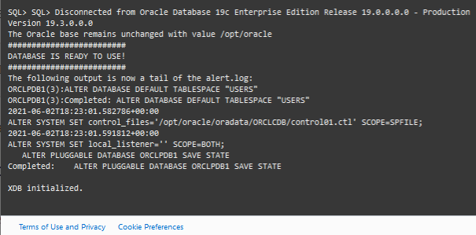
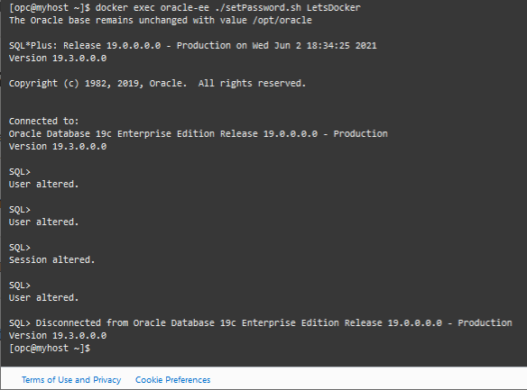

# Start a Docker Container

## Introduction

A Docker container is a running instance of a Docker image. However, unlike in traditional virtualization with a type 1 or type 2 hypervisor, a Docker container runs on the kernel of the host operating system. Within a Docker container, there is no separate operating system.

Estimated Lab Time: 10 minutes

### Objectives
This lab walks you through the steps to start the Docker container and Oracle Database 19c instance.


### Prerequisites

* An Oracle Cloud paid account or free trial. To sign up for a trial account with $300 in credits for 30 days, click [here](http://oracle.com/cloud/free).
* SSH keys
* A Docker image built with Oracle Database 19c

## Task 1: Start the Docker container

Once the Docker image build is complete, you can start and run the Oracle Database inside a Docker container using the `docker run` command. There a few important parameters:
- The **`-p`** parameter maps ports inside the container to the outside world. We need to map port 1521 to enable access to the database.
- The **`-v`** parameter allows data files created by the database to exist outside of the Docker container. This separation means that even if the container is destroyed, the data files will be preserved. You should always use the `-v` parameter and create a named Docker volume.
- The **`--name`** parameter specifies the name of the container. Starting and stopping the container requires the container name as a parameter. If you omit this parameter, a random name is generated.

1. If you don't have an open SSH connection to your compute instance, open a terminal window. Navigate to the folder where you created the SSH keys and connect using the public IP address of your compute instance:

    ```nohighlight
    ssh -i ./cloudshellkey opc@123.123.123.123
    ```
2. Create a docker volume to hold the data files:

    ```
    <copy>docker volume create oradata</copy>
    ```
3. Run the Oracle Database container: (This may take around 30 minutes)

    ```
    <copy>docker run --name oracle-ee -p 1521:1521 -v oradata:/opt/oracle/oradata oracle/database:19.3.0-ee</copy>
    ```
  When you see the DATABASE IS READY FOR USE message, the database is running and ready for connections!

  

  Note the startup script generated a password for the database accounts. In the next step, you can reset the password to one of your choice.

## Task 2: Reset the Database admin accounts password

1. In a new terminal window, open another connection to the compute instance:

    ```nohighlight
    ssh -i ~/.ssh/cloudshellkey opc@123.123.123.123
    ```

2. Use the container provided `setPassword.sh` script to reset the password to `LetsDocker`:

    ```
    <copy>docker exec oracle-ee ./setPassword.sh LetsDocker</copy>
    ```

    

  You may now *proceed to the next lab*.

## Want to Learn More?

* [Docker run command documentation](https://docs.docker.com/engine/reference/run/)

## Acknowledgements
* **Author** - Gerald Venzl, Master Product Manager, Database Development 
* **Contributor** - Arabella Yao, Product Manager Intern, Database Management, June 2020
* **Last Updated By/Date** - Madhusudhan Rao, Apr 2022
