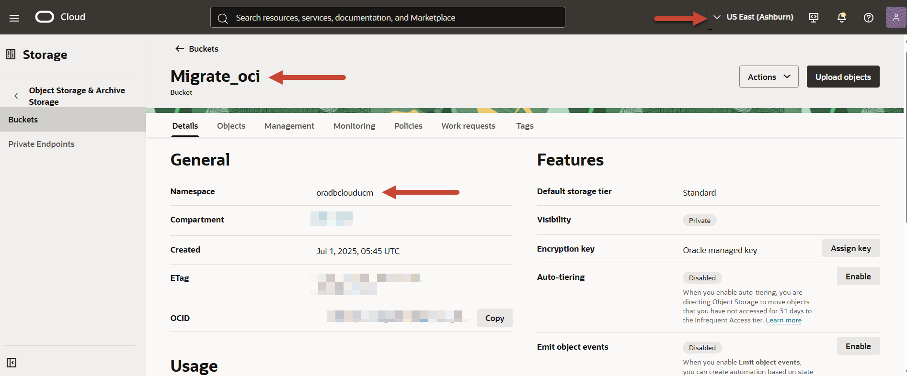

# Create a Migrator Configuration File

## Introduction

A configuration file defines all the parameters required for the migration activity. You pass this configuration file as a single parameter to the **runMigrator** command from the Cloud Shell. 

This lab walks you through the steps to identify important source and sink parameters. You will create an Oracle NoSQL Migrator configuration file in the Cloud Shell to migrate data from an Oracle NoSQL Database Cloud Service table to an OCI Object Storage bucket. 

Estimated Lab Time: 15 minutes

### Objectives

In this lab you will:
* Identify the source and sink for migrating data.
* Create a migrator configuration file.

### Prerequisites

* An Oracle Free Tier, Always Free, Paid or LiveLabs Cloud Account.
* Oracle NoSQL Database Cloud Service table in the subscribed region as the source for data migration.
* OCI Object Storage bucket in the subscribed region as the sink to store the migrated data.
* Privileges to write objects in the Object Storage Bucket. For more details on setting the policies, see **[Let users write objects to Object Storage buckets](https://docs.oracle.com/en-us/iaas/Content/Identity/policiescommon/commonpolicies.htm#write-objects-to-buckets)**.

## Task 1: Identify the Source Parameters

To configure the Migrator utility to copy data from an Oracle NoSQL Database Cloud Service table, you need the following source parameters:  **table, compartment, endpoint**.

1. From your Oracle Cloud console's navigation menu, select **Databases** and then select **Tables** under **Oracle NoSQL Database**. See **Get Started** lab for detailed steps to access the Oracle Cloud Console.

2. Select your compartment from the drop-down menu to view the tables. 

3. Identify the Oracle NoSQL Database Cloud Service table whose data you want to migrate and note down the table name. 

  Here, you will use the **NDCSupload** table with following sample data:

    ```
    <copy>
    {"id":1,"name":"Tracy","email":"Tracy@mymail.com","age":20,"income":1000}
    {"id":2,"name":"Benita","email":"Benita@mymail.com","age":22,"income":22000}
    {"id":3,"name":"John","email":"John@mymail.com","age":24,"income":24000}
    {"id":4,"name":"Adam","email":"Adam@mymail.com","age":26,"income":26000}
    ... 
    </copy>
    ```

4. Select the **NDCSupload** table. On the *Table details* page, hover over the Compartment OCID field and select the copy option. This copies the compartment OCID of your source table to the clipboard. Save the compartment OCID value.

  Note down the endpoint for your source table. You can locate your subscribed region at the upper right corner of the console. For the details on the end points for your subscribed region, see **[Data Regions and Associated Service URLs](https://docs.oracle.com/en/cloud/paas/nosql-cloud/fnsxl/index.html#FNSXL-GUID-D89BB422-A394-404E-8759-1A620C7D8125)**. Copy the **Region Identifier** for your subscribed region to use later in the source configuration template, and save this value. 

      

  At the end of this step, you will have values for the following parameters:

    ```
    <copy>
    endpoint: "<endpoint for your subscribed region>"
    compartment: "<Compartment OCID>"
    table: "NDCSupload"
    </copy>
    ```

  For example, if you are using the **NDCSupload** table from your compartment with OCID **ocid1.compartment.oc1..aa..tnya** in the **Ashburn** region, you will have:

    ```
    <copy>
    endpoint: "us-ashburn-1"
    compartment: "ocid1.compartment.oc1..aa..tnya"
    table: "NDCSupload"
    </copy>
    ```

  Note that the **endpoint** and **compartment** parameter values differ based on your tenancy.

## Task 2: Identify the Sink Parameters

To configure the Migrator utility to copy data into the Object Storage bucket, you need the following sink parameters: **endpoint, prefix, bucket, namespace**.

1. From the Oracle Cloud console navigation menu, select **Storage** and then select **Buckets**. 

2. Select your compartment and then select the bucket. 

  Here, you will use the **Migrate\_oci** bucket. 

  Select the the **Migrate\_oci** bucket. On the bucket details page, copy the **Namespace** name to use later in sink configuration parameters, and save this value.

  

3. Identify the endpoint of the OCI Object Storage bucket. You can locate your subscribed region at the upper right corner of the console. For the details on the OCI Object Storage service endpoints for your subscribed region, see **[Object Storage Endpoints](https://docs.oracle.com/en-us/iaas/api/#/en/objectstorage/20160918/)**. Copy the **API Endpoint** for your subscribed region and save this value.

4. Decide a prefix, which serves as the directory to store the migrated data within the OCI Object Storage bucket. Oracle NoSQL Migrator copies data to the supplied directory in the OCI Object Storage bucket. 

  Here, you will use **Delegation** as the prefix.

  At the end of this step, you will have values for the following parameters:   

    ```
    <copy>
    endpoint: "<endpoint for your subscribed region>"
    bucket: "Migrate_oci"
    prefix: "Delegation"
    namespace: "<namespace name>"
    </copy>
    ```

  For example, if you are using the **Migrate\_oci** bucket in the **or....m** namespace with **Delegation** prefix in the **Ashburn** region, you will have:

    ```
    <copy>
    endpoint: "https://objectstorage.us-ashburn-1.oraclecloud.com"
    bucket: "Migrate_oci"
    prefix: "Delegation"
    namespace: "or....m" 
    </copy>
    ```

  Note that the **endpoint** and **namespace** parameter values differ based on your tenancy.

## Task 3: Create a Configuration File

1. Launch the Cloud Shell from the **Developer tools** menu on your Oracle Cloud console. The web browser opens your home directory. If you already have the previous Cloud Shell session open, click the **Restore** button on the bottom left corner of your OCI console to reopen the Cloud Shell that you minimized earlier. 

2. Navigate to the directory where you extracted the NoSQL Database Migrator utility. See **Lab - Download Migrator Utility and Upload to Cloud Shell**.

    ```
    <copy>cd V1048015-01/nosql-migrator-1.7.0</copy>
    ```

3. Create the configuration file template in a notepad as follows. Update the source and sink parameters with the values that you saved in Task 1 and Task 2 of this lab. 

  *Note: The endpoints, compartment, and namespace values will differ based on your tenancy.*  

    ```
    <copy>
    {
    "source" : {
        "type" : "nosqldb_cloud",
        "endpoint" : "us-ashburn-1",
        "table" : "NDCSupload",
        "compartment" : "ocid1.compartment.oc1.. aa..tnya",
        "useDelegationToken" : true,
        "readUnitsPercent" : 90,
        "includeTTL" : true,
        "requestTimeoutMs" : 5000
      },
    "sink" : {
        "type" : "object_storage_oci",
        "format" : "json",
        "endpoint" : "https://objectstorage.us-ashburn-1.oraclecloud.com",
        "namespace" : "or....m",
        "bucket" : "Migrate_oci",
        "prefix" : "Delegation",
        "chunkSize" : 32,
       "compression" : "",
        "useDelegationToken" : true
      },
    "abortOnError" : true,
    "migratorVersion" : "1.7.0"
    }
    </copy>
    ```
 
  To run the Migrator utility from the Cloud Shell, you must use the delegation token authentication. Therefore, set the **useDelegationToken** parameter to true. For a list of all the supported parameters, see **[Oracle NoSQL Database Cloud Service](https://docs.oracle.com/en/cloud/paas/nosql-cloud/onscl/#GUID-5A70801B-F281-4FA2-91A9-77CCCC3C3098)** source and **[OCI Object Storage bucket](https://docs.oracle.com/en/cloud/paas/nosql-cloud/onscl/#GUID-B79ED267-0F42-40CE-B672-9F7AB65BDA1D)** sink.  

  *Note: The Oracle NoSQL Migrator utility also provides an option to create the configuration file interactively when you run the utility from the Cloud Shell's CLI.*  

4. Use the vi editor to create the **migrator-config.json** configuration file. 

  Copy the configuration file template from the notepad to the configuration file and save it. 

    ```
    <copy>vi migrator-config.json</copy>
    ```

You may proceed to the next lab.

## Learn More

* **[Using Console to Create Tables in Oracle NoSQL Database Cloud Service](https://docs.oracle.com/en/cloud/paas/nosql-cloud/wqqvo/index.html#articletitle)**
* **[Terminology used with Oracle NoSQL Database Migrator](https://docs.oracle.com/en/cloud/paas/nosql-cloud/cjphq/index.html#GUID-3F02818F-0589-4366-9D1E-8230FADFDFE8)**
* **[Source Configuration Templates](https://docs.oracle.com/en/cloud/paas/nosql-cloud/onscl/index.html#ONSCL-GUID-FF56A474-C6EC-40DA-8AAA-9EBA6B616630)**
* **[Sink Configuration Templates](https://docs.oracle.com/en/cloud/paas/nosql-cloud/onscl/index.html#ONSCL-GUID-832FE48D-2A90-4DCA-95A6-40687CA7F39B)**

## Acknowledgements
* **Author** - Ramya Umesh, Principal UA Developer, DB OnPrem Tech Svcs & User Assistance
* **Last Updated By/Date** - Ramya Umesh, Principal UA Developer, DB OnPrem Tech Svcs & User Assistance, December 2025
