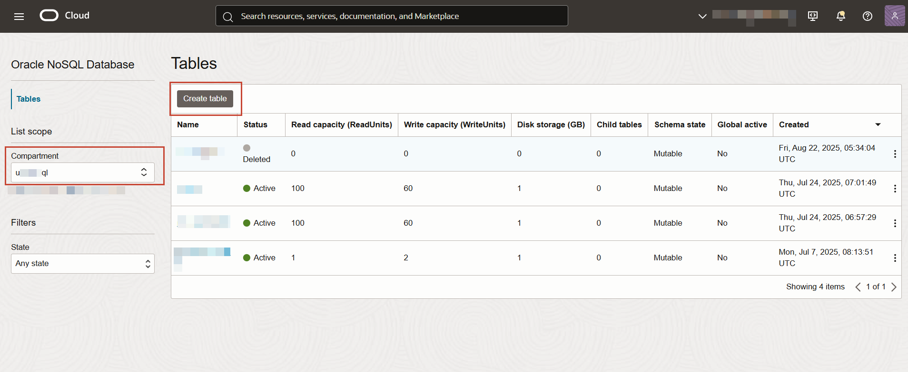
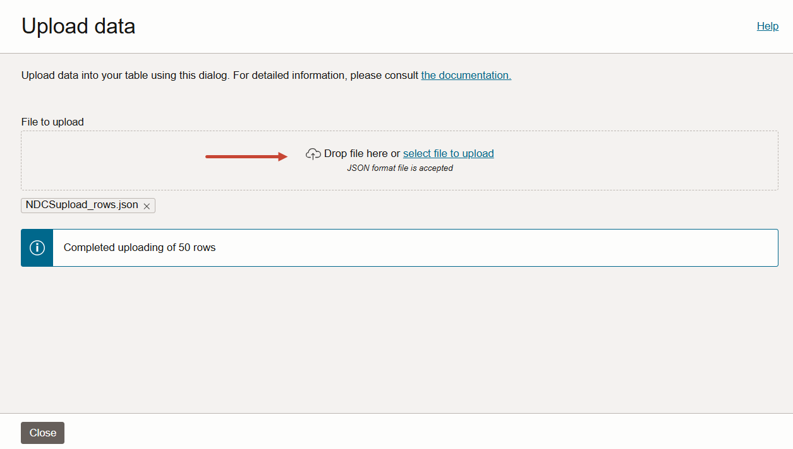
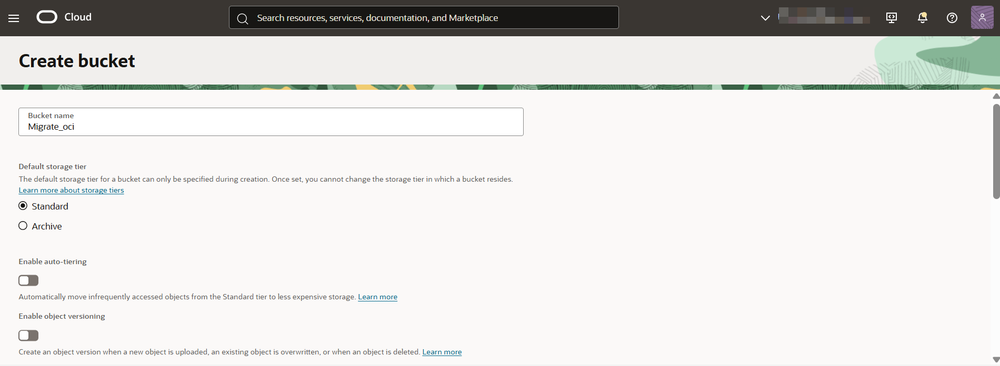

# Create Oracle NoSQL table and OCI Object Storage Bucket

## Introduction

Oracle NoSQL Database Cloud Service is a fully managed database cloud service designed for database operations that require predictable, single digit millisecond latency responses to simple queries.

Object Storage service offers a high-performance storage platform to store data of any content type. You can access the OCI Object Storage buckets through the Object Storage endpoints. 

This lab walks you through the steps to create an Oracle NoSQL Database Cloud Service table and an OCI Object Storage bucket. The Oracle NoSQL Database Cloud Service table serves as the source for data migration, while OCI Object Storage bucket serves as the target for the migrated data. 

Estimated Lab Time: 10 Minutes

### Objectives

In this lab you will:
* Access the Oracle Cloud Console.  
* Create an Oracle NoSQL Database Cloud Service table with 50 rows of user data.
* Create an OCI Object Storage bucket.

### Prerequisites

* An Oracle Free Tier, Always Free, Paid or LiveLabs Cloud Account
* Download the **[NDCSupload_rows.json](https://c4u04.objectstorage.us-ashburn-1.oci.customer-oci.com/p/EcTjWk2IuZPZeNnD_fYMcgUhdNDIDA6rt9gaFj_WZMiL7VvxPBNMY60837hu5hga/n/c4u04/b/livelabsfiles/o/labfiles%2FNDCSupload_rows.json)** file to your system.

## Task 1: Create an Oracle NoSQL Database Cloud Service table and upload data

1. Open the Oracle Cloud Console. See **Get Started** lab for detailed steps to access the Oracle Cloud Console.
2. From the navigation menu, select **Databases** and then select **Tables** under **Oracle NoSQL Database**.

    

3. Select your compartment from the drop-down menu and then select **Create table**. 

    *Note: Oracle NoSQL Database Cloud Service resources are created in a compartment and are scoped to that compartment. It is recommended not to create the Oracle NoSQL Database Cloud Service table in the "root" compartment, but to create them in your own compartment created under "root".*

   

4. In the **Create Table** dialog, select **Simple input** for *Table Creation Mode*. Retain the default capacity mode to **Provisioned Capacity**. Enter the capacity values for the table. In the **Name** field, enter a table name that is unique to your tenancy. In this lab, you will create **NDCSupload** table.

    

5. In the *Primary Key Columns* section, enter primary key details.

    

6. In the *Columns* section, enter non-primary column details and select **Create Table**.

    

    This creates the **NDCSupload** table.

    *Note: You can see the **[Creating Singleton Tables](https://docs.oracle.com/en/cloud/paas/nosql-cloud/wqqvo/#GUID-1E86F6AE-6F02-478D-BB71-6088330FE838)** topic to understand the various other options available while creating an Oracle NoSQL Database Cloud Service table.*

7. To add data to the table, select the **NDCSupload** table. On the *Table details* page, select **Upload data** to bulk upload data from a local file into the table.

    

8. Select the **NDCSupload_rows.json** that you downloaded as a pre-requisite. The upload begins immediately and the progress is displayed on the page. 

    After uploading successfully, the console displays the total number of rows that were inserted. You can close the window.

   

9. To verify, you can scroll down to **Explore data**. The SQL query to fetch all the table rows is displayed by default. 

    Select **Execute** to view the table rows. 

## Task 2: Create an OCI Object Storage bucket

1. Open the Oracle Cloud Console. See **Get Started** lab for detailed steps to access the Oracle Cloud Console.
2. From the navigation menu, select **Storage** and then select **Object Storage & Archive Storage**.

    

3. Select your compartment to create the bucket and then select **Create bucket**.

    *Note: It is recommended not to create the Object Storage bucket in the "root" compartment, but to create them in your own compartment created under "root".*
    
    

4. Supply a descriptive name for the bucket. Here, we will use **Migrate_oci**.
5. Under the Default storage tier, select **Standard**.

    

6. Scroll down and select your desired encryption. Here, we will use the default value **Encrypt using Oracle managed keys**.
7. Select **Create bucket**.

    

    This creates **Migrate_oci** bucket in your subscribed region. 

You may proceed to the next lab.

## Learn More

* [Using Console to Create Tables in Oracle NoSQL Database Cloud Service](https://docs.oracle.com/en/cloud/paas/nosql-cloud/wqqvo/#GUID-1E86F6AE-6F02-478D-BB71-6088330FE838)
* [OCI Object Storage bucket](https://docs.oracle.com/en-us/iaas/Content/Object/Tasks/managingbuckets.htm)

## Acknowledgements
* **Author** - Ramya Umesh, Principal UA Developer, DB OnPrem Tech Svcs & User Assistance
* **Last Updated By/Date** - Ramya Umesh, Principal UA Developer, DB OnPrem Tech Svcs & User Assistance, August 2025
