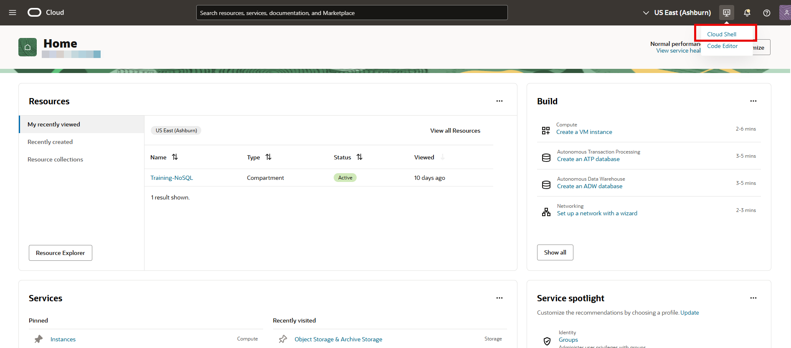

# Download Migrator Utility and Upload to Cloud Shell

## Introduction

This lab walks you through the steps to download Oracle NoSQL Migrator utility, launch a Cloud Shell for an Oracle Cloud user account, and upload the Migrator utility to Cloud Shell.

Estimated Lab Time: 5 minutes

### Objectives

In this lab you will:
* Download Oracle NoSQL Migrator utility.
* Launch the Cloud Shell for an Oracle Cloud user account.
* Upload the Oracle NoSQL Migrator utility to the Cloud Shell.

### Prerequisites

*  An Oracle Free Tier, Always Free, Paid or LiveLabs Cloud Account

## Task 1: Download the Oracle NoSQL Migrator Utility

1. Open the **[Oracle NoSQL Downloads page](https://www.oracle.com/database/technologies/nosql-database-server-downloads.html)** and scroll down to Oracle NoSQL Database Migrator and Analytics Integrator section.

    

2. Click the latest Oracle NoSQL Migrator package. This will navigate to Oracle Software Delivery Cloud page. In this workhop, **nosql-migrator-1.7.0** is used for demonstration purposes.

3. Accept the terms and conditions.

4. Download the latest Oracle NoSQL Migrator zip file to your local machine. In this workshop, **V1048015-01.zip** is used as a sample file for demonstration purposes.

## Task 2: Upload Oracle NoSQL Migrator Utility to the Cloud Shell

1. Launch the Cloud Shell from the **Developer tools** menu on your Oracle Cloud console. The web browser opens your home directory. See **Get Started** lab for detailed steps to access the Oracle Cloud Console.

    

2. Click the menu option on the upper right corner of the Cloud Shell window and select the **upload** option from the drop-down menu.

    

3. In the pop-up window, either drag and drop the Oracle NoSQL Database Migrator package from your local machine, or click the *Select from your computer* option, select the package from your local machine, and click the **Upload** button.

    

4. Extract the contents of the package using the appropriate command. For example,

    ```
    <copy>unzip -q V1048015-01.zip</copy>
    ```

9. The resulting folder contains the Oracle NoSQL Migrator utility. You can minimize the Cloud Shell window for later use by selecting the minimize icon in the upper right corner.

You may proceed to the next lab.

## Learn More

* [Cloud Shell](https://docs.oracle.com/en-us/iaas/Content/API/Concepts/cloudshellintro.htm)

## Acknowledgements
* **Author** - Ramya Umesh, Principal UA Developer, DB OnPrem Tech Svcs & User Assistance
* **Last Updated By/Date** - Ramya Umesh, Principal UA Developer, DB OnPrem Tech Svcs & User Assistance, December 2025
