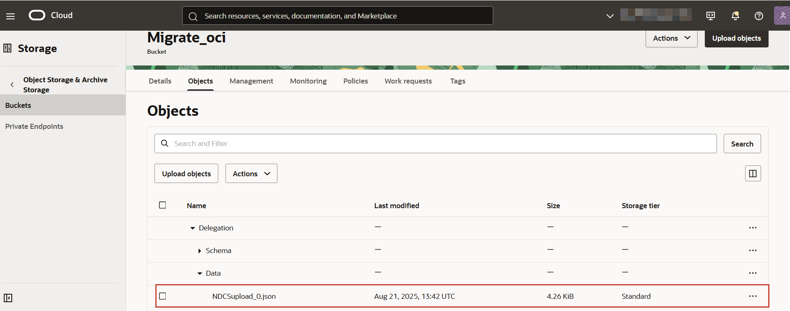
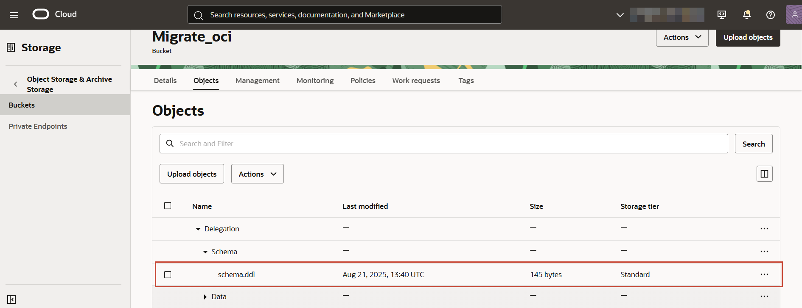

# Run the Oracle NoSQL Database Migrator Utility

## Introduction

The Oracle NoSQL Database Migrator utility acts as a connector between the data source and the sink. This utility exports data from the selected source and imports that data into the sink. You can migrate a single table in a single migration task. 

This lab walks you through the steps to run the Migrator utility and view the copied files. 

Estimated Lab Time: 5 Minutes

### Objectives

In this lab you will:
* Run the Migrator utility. 
* View the migrated data in the OCI Object Storage Bucket.

### Prerequisites

*  An Oracle Free Tier, Always Free, Paid or LiveLabs Cloud Account
*  Migrator configuration file created in **Lab - Create a Configuration File**.

## Task 1: Run the Oracle NoSQL Database Migrator utility

1. From the Cloud Shell, navigate to the directory where you extracted the NoSQL Database Migrator utility. This directory now includes the configuration file created in **Lab - Create a Configuration File**.

    ```
    <copy>cd V1048015-01/nosql-migrator-1.7.0</copy>
    ```

2. Run the runMigrator command by passing the configuration file.

    ```
    <copy>
    ./runMigrator --config ./migrator-config.json
    </copy>    
    ```

    The NoSQL Database Migrator utility proceeds with the data migration activity. It copies the table data as JSON files and the table schema as a DDL file to the OCI Object Storage bucket. The NoSQL Database Migrator utility displays the progress and status of migration activity on the CLI:

     ```
    <copy>
    [INFO] creating source from given configuration:
    [INFO] source creation completed
    [INFO] creating sink from given configuration:
    [INFO] sink creation completed
    [INFO] creating migrator pipeline
    [INFO] migration started
    [INFO] [OCI OS sink] : writing table schema to Delegation/Schema/schema.ddl
    [INFO] [OCI OS sink] : start writing records with prefix Delegation
    [INFO] migration completed.
    Records provided by source=4,Records written to sink=4,Records failed=0.
    Elapsed time: 0min 0sec 486ms
    Migration completed.
    </copy>
    ```

## Task 2: View migrated data in OCI Object Storage Bucket

1. On the Oracle Cloud console's navigation menu, select **Storage > Object Storage & Archive Storage > Buckets**.
2. Select your compartment and then select the **Migrate_oci** bucket.
3. On the **Objects** tab, you can view the exported data in the **Delegation/Data** directory.

  

4. You can view the exported table schema in the **Delegation/Schema** directory.

  
 
Congratulations! You have completed the workshop.

## Acknowledgements
* **Author** - Ramya Umesh, Principal UA Developer, DB OnPrem Tech Svcs & User Assistance
* **Last Updated By/Date** - Ramya Umesh, Principal UA Developer, DB OnPrem Tech Svcs & User Assistance, December 2025
