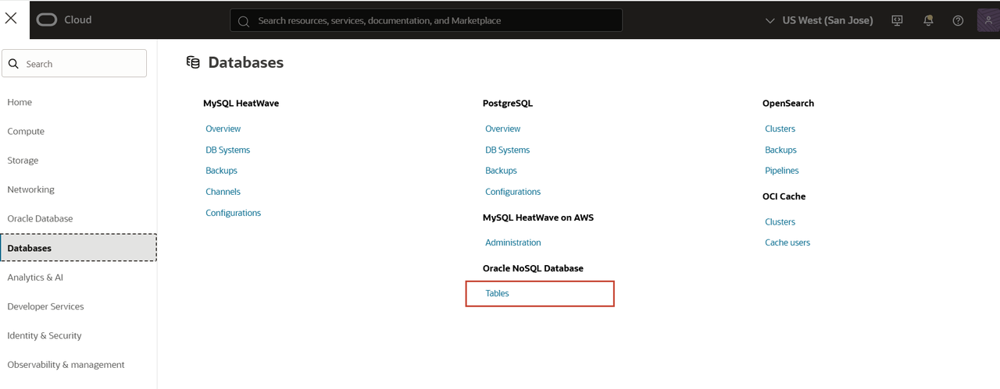
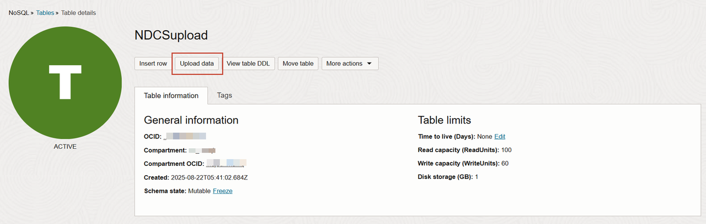

# Upload data to Oracle NoSQL Database Cloud Service table

## Introduction

Oracle NoSQL Database Cloud Service is a fully managed database cloud service designed for database operations that require predictable, single digit millisecond latency responses to simple queries.

This lab walks you through the steps to upload data to Oracle NoSQL Database Cloud Service table. The Oracle NoSQL Database Cloud Service table serves as the source for data migration. 

Estimated Lab Time: 5 Minutes

### Objectives

In this lab you will:
* Access the Oracle Cloud Console.  
* Upload 50 rows of user data to Oracle NoSQL Database Cloud Service table.

### Prerequisites

* An Oracle Free Tier, Always Free, Paid or LiveLabs Cloud Account
* Download the **[NDCSupload_rows.json](https://c4u04.objectstorage.us-ashburn-1.oci.customer-oci.com/p/EcTjWk2IuZPZeNnD_fYMcgUhdNDIDA6rt9gaFj_WZMiL7VvxPBNMY60837hu5hga/n/c4u04/b/livelabsfiles/o/labfiles%2FNDCSupload_rows.json)** file to your system.

## Task 1: Upload data to Oracle NoSQL Database Cloud Service table

1. Open the Oracle Cloud Console. See **Get Started** lab for detailed steps to access the Oracle Cloud Console.
2. From the navigation menu, select **Databases** and then select **Tables** under **Oracle NoSQL Database**.

    

3. Select your compartment from the drop-down menu. The console displays your tables. Here, you will use **NDCSupload** table. 

    *Note: Oracle NoSQL Database Cloud Service resources are created in a compartment and are scoped to that compartment. It is recommended not to create the Oracle NoSQL Database Cloud Service table in the "root" compartment, but to create them in your own compartment created under "root".*

4. To add data to the table, select the **NDCSupload** table. On the *Table details* page, select **Upload data** to bulk upload data from a local file into the table.

    

5. Select the **NDCSupload_rows.json** that you downloaded as a pre-requisite. The upload begins immediately and the progress is displayed on the page. 

    After uploading successfully, the console displays the total number of rows that were inserted. You can close the window.

   

6. To verify, you can scroll down to **Explore data**. The SQL query to fetch all the table rows is displayed by default. 

    Select **Execute** to view the table rows. 

You may proceed to the next lab.

## Learn More

* [Using Console to Create Tables in Oracle NoSQL Database Cloud Service](https://docs.oracle.com/en/cloud/paas/nosql-cloud/wqqvo/#GUID-1E86F6AE-6F02-478D-BB71-6088330FE838)

## Acknowledgements
* **Author** - Ramya Umesh, Principal UA Developer, DB OnPrem Tech Svcs & User Assistance
* **Last Updated By/Date** - Ramya Umesh, Principal UA Developer, DB OnPrem Tech Svcs & User Assistance, December 2025
