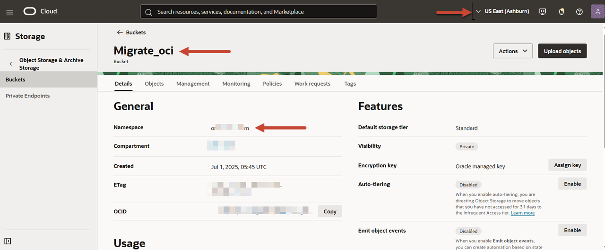

# Create a Migrator Configuration File

## Introduction

A configuration file defines all the parameters required for the migration activity. You pass this configuration file as a single parameter to the **runMigrator** command from the Cloud Shell. 

This lab walks you through the steps to identify important source and sink parameters. You will create an Oracle NoSQL Migrator configuration file in the Cloud Shell to migrate data from a JSON file in the OCI Object Storage bucket to an Oracle NoSQL Database Cloud Service table. 

Estimated Time: X

### Objectives

In this lab you will:

* Identify the source and sink for migrating data.
* Create a migrator configuration file.

### Prerequisites

* An Oracle Free Tier, Always Free, Paid or LiveLabs Cloud Account.
* Data file in the OCI Object Storage bucket of the subscribed region as the source for data migration.

## Task 1: Identify the Source Parameters

To configure the Migrator utility to copy data from a JSON file in the OCI Object Storage bucket, you need the following source configuration parameters: **bucket, namespace, endpoint, prefix**.

1. From the Oracle Cloud console navigation menu, select **Storage** and then select **Buckets**.

2. Select your compartment and then choose the **Migrate\_oci** bucket.
    On the bucket details page, copy the Namespace value and save it for later use.
    

3. Identify the endpoint of the OCI Object Storage bucket. You can locate your subscribed region at the upper right corner of the console. For the details on the OCI Object Storage service endpoints for your subscribed region, see **[Object Storage Endpoints](https://docs.oracle.com/en-us/iaas/api/#/en/objectstorage/20160918/)**. Copy the **API Endpoint** for your subscribed region and save this value.

4. Decide a prefix, which serves as the directory to store the migrated data within the OCI Object Storage bucket. Oracle NoSQL Migrator copies data to the supplied directory in the OCI Object Storage bucket.

    Here, you will use **Delegation** as the prefix.

    *Note: If you are running this lab to restore data that you previously migrated from an Oracle NoSQL Database Cloud Service table, the OCI Object Storage bucket will contain the migrated data and source schema in the **Data and Schema** folders within the specified prefix directory. You must reference this directory path in the **prefix** parameter.*

    At the end of this step, you will have values for the following parameters:

    ```
    <copy>
    endpoint: "<endpoint for your subscribed region>"
    bucket: "Migrate_oci"
    prefix: "Delegation"
    namespace: "<namespace name>"
    </copy>
    ```

    For example, if you are using the **Migrate\_oci** bucket in the **or....m** namespace with **Delegation** prefix in the **Ashburn** region, you will have:

    ```
    <copy>
    endpoint: "https://objectstorage.us-ashburn-1.oraclecloud.com"
    bucket: "Migrate_oci"
    prefix: "Delegation"
    namespace: "or....m" 
    </copy>
    ```

    Note that the values of the **endpoint** and **namespace** parameters will vary based on your tenancy.

## Task 2: Identify the Sink Parameters

To set up the Migrator utility for copying data into an Oracle NoSQL Database Cloud Service table, you need the following sink configuration parameters: **endpoint, compartment, table**.

1. Identify the endpoint of the Oracle NoSQL Database Cloud Service table.
    In this lab, you will use the same region as the OCI Object Storage bucket. You can locate your subscribed region at the upper-right corner of the console. For the details on the end points for your subscribed region, see **[Data Regions and Associated Service URLs](https://docs.oracle.com/en/cloud/paas/nosql-cloud/fnsxl/index.html#FNSXL-GUID-D89BB422-A394-404E-8759-1A620C7D8125)**. Copy the **Region Identifier** for your subscribed region and save this value for later use.

2. Identify the compartment where you will create the Oracle NoSQL Database Cloud Service table.
    Here, you will use the same compartment as the OCI Object Storage bucket. On the bucket details page, click the compartment name. From the compartment **Info** panel, select **copy** next to the OCID and save this value.
    If you want to use a different compartment, go to the OCI Cloud console's navigation menu and select **Identity & Security > Compartments**. Search for your desired compartment. When the compartment details are displayed, copy the OCID and save it.

3. Identify the table name into which you want to migrate the data.
    In this workshop, you will use **NDCSuploadRestr** table.

    At the end of this step, you will have values for the following parameters:

    ```
    <copy>
    endpoint: "<endpoint for your subscribed region>"
    compartment: <Compartment OCID>
    table: NDCSuploadRestr
    </copy>
    ```

    For example, if you are using the **ocid1.compartment.oc1..aaa....4tnya** compartment in the **Ashburn** region, your configuration will have:

    ```
    <copy>
    endpoint: "https://objectstorage.us-ashburn-1.oraclecloud.com"
    compartment: ocid1.compartment.oc1..aaa....4tnya
    table: NDCSuploadRestr
    </copy>
    ```

    Note that the values of the **endpoint** and **compartment** parameters will vary based on your tenancy.

## Task 3: Create a Configuration File

1. Create the configuration file template in a notepad as follows. Update the source and sink parameters with the values that you saved in Task 1 and Task 2 of this lab.

    *Note: The values of endpoints, compartment, and namespace parameters will vary based on your tenancy.*  

    ```
    <copy>
    {
    "source" : {
        "type" : "object_storage_oci",
        "format" : "json",
        "endpoint" : "https://objectstorage.us-ashburn-1.oraclecloud.com",
        "namespace" : "or....m",
        "bucket" : "Migrate_oci",
        "prefix" : "Delegation",
        "useDelegationToken" : true
    },
    "sink" : {
        "type" : "nosqldb_cloud",
        "endpoint" : "us-ashburn-1",
        "table" : "NDCSuploadRestr",
        "compartment" : "ocid1.compartment.oc1..aaa....4tnya",
        "includeTTL" : true,
        "schemaInfo" : {
        "readUnits" : 100,
        "writeUnits" : 60,
        "storageSize" : 1,
        "defaultSchema" : true
        },
        "useDelegationToken" : true,
        "writeUnitsPercent" : 90,
        "overwrite" : true,
        "requestTimeoutMs" : 5000
    },
    "abortOnError" : true,
    "migratorVersion" : "1.8.0"
    }
    </copy>
    ```
    To run the Migrator utility from the Cloud Shell, you must use the delegation token authentication. Therefore, set the **useDelegationToken** parameter to true.

    In this lab, you will use the **defaultSchema** option provided by the Migrator utility to create the Oracle NoSQL Database Cloud Service table. If you are running this lab to restore data that you previously migrated from an Oracle NoSQL Database Cloud Service table, you can use the **useSourceSchema** option to restore your data with the original source schema.

    For more information about available schema options and other supported parameters, see the **[JSON File in OCI Object Storage Bucket](https://docs.oracle.com/en/cloud/paas/nosql-cloud/onscl/#GUID-91D55509-8646-4F37-8DAC-B8AC3A6DB2E7)** source and **[Oracle NoSQL Database Cloud Service](https://docs.oracle.com/en/cloud/paas/nosql-cloud/onscl/#GUID-C0FBD446-B92D-447D-83B7-0DDE1B5AF246)** sink documentation.

    If your table already exists in Oracle NoSQL Database Cloud Service, the Migrator utility overwrites the records that have the same primary key as existing entries in the table. This is because, you have set the **overwrite** to true.  

    *Note: The Oracle NoSQL Migrator utility also provides an option to create the configuration file interactively when you run the utility from the Cloud Shell's CLI.*  

2. Launch the Cloud Shell from the **Developer tools** menu on your Oracle Cloud console. The web browser opens your home directory. If you already have the previous Cloud Shell session open, click the **Restore** button on the bottom left corner of your OCI console to reopen the Cloud Shell.

3. Navigate to the directory where you extracted the NoSQL Database Migrator utility. See **Lab - Download Migrator Utility and Upload to Cloud Shell**.

    ```
    <copy>cd V1053573-01/nosql-migrator-1.8.0</copy>
    ```

4. Use the vi editor to create the **migrator-config.json** configuration file.

    ```
    <copy>vi migrator-config.json</copy>
    ```
  
    Copy the configuration file template from the notepad to the configuration file and save it.

You may proceed to the next lab.

## Learn More

* **[Using Console to Create Tables in Oracle NoSQL Database Cloud Service](https://docs.oracle.com/en/cloud/paas/nosql-cloud/wqqvo/index.html#articletitle)**
* **[Terminology used with Oracle NoSQL Database Migrator](https://docs.oracle.com/en/cloud/paas/nosql-cloud/cjphq/index.html#GUID-3F02818F-0589-4366-9D1E-8230FADFDFE8)**
* **[Source Configuration Templates](https://docs.oracle.com/en/cloud/paas/nosql-cloud/onscl/index.html#ONSCL-GUID-FF56A474-C6EC-40DA-8AAA-9EBA6B616630)**
* **[Sink Configuration Templates](https://docs.oracle.com/en/cloud/paas/nosql-cloud/onscl/index.html#ONSCL-GUID-832FE48D-2A90-4DCA-95A6-40687CA7F39B)**

## Acknowledgements

* **Author** - Ramya Umesh, Principal UA Developer, DB OnPrem Tech Svcs & User Assistance
* **Last Updated By/Date** - Ramya Umesh, Principal UA Developer, DB OnPrem Tech Svcs & User Assistance, April 2026
