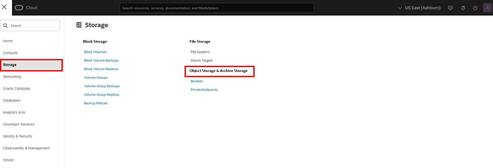
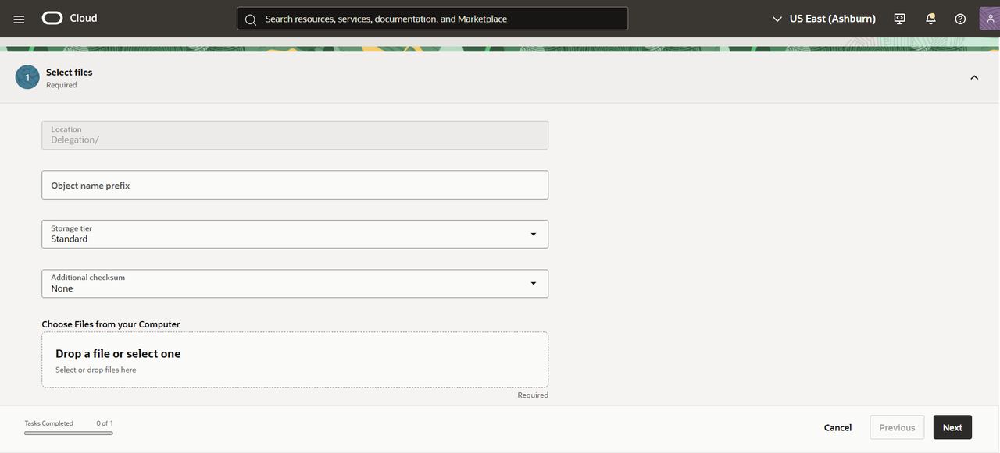
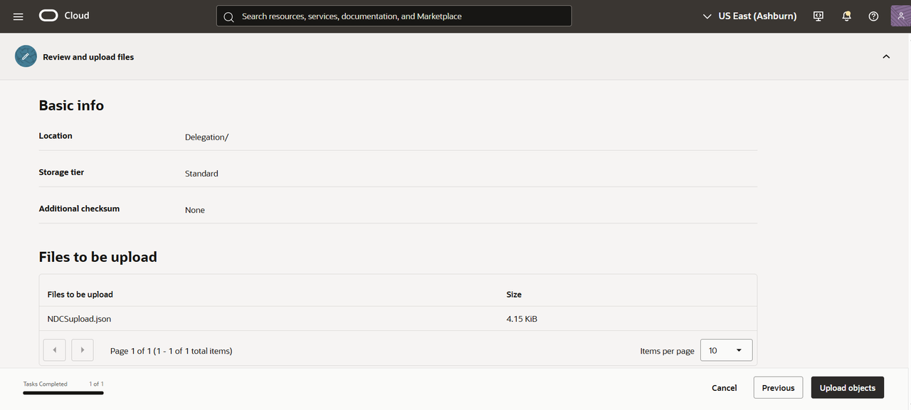

# Upload data to OCI Object Storage Bucket

## Introduction

The Object Storage service offers a high-performance storage platform to store data of any content type. You can access the OCI Object Storage buckets through the **[Object Storage endpoints.](https://docs.oracle.com/iaas/api/#/en/objectstorage/latest/)**

This lab walks you through the steps to upload data to OCI Object Storage bucket. The OCI Object Storage bucket serves as the source for data migration.

Estimated Time: X

### Objectives

In this lab you will:

* Access the Oracle Cloud Console.  
* Upload data into OCI Object Storage bucket.

### Prerequisites

* An Oracle Free Tier, Always Free, Paid or LiveLabs Cloud Account.
* OCI Object Storage bucket in your tenancy with appropriate write privileges. For details, see the Livelabs sprint **[How can I create a bucket in Oracle Cloud? .](https://livelabs.oracle.com/ords/r/dbpm/livelabs/view-workshop?wid=3169&clear=RR,180&session=100208132480736)**
* Download the **[NDCSupload.json]()** file to your machine.

## Task 1: Upload Data to OCI Object Storage Bucket

1. Open the Oracle Cloud Console. See **Get Started** lab for detailed steps to access the Oracle Cloud Console.

2. From the navigation menu, select **Storage** and then select **Object Storage & Archive Storage**.

    

3. On the **Object Storage & Archive Storage** page, select your compartment and then select your bucket.

   Here, you will use the **Migrate\_oci** bucket.

    *Note: OCI resources are created in a compartment and are scoped to that compartment. It is recommended not to create the Object Storage bucket in the "root" compartment, but to create them in your own compartment created under "root".*

4. Select the **Actions** menu and then select **Create new Folder** from the drop-down. Enter the name of   the folder and select **Create folder**. You will later supply this folder name as the prefix parameter in the source configuration template. Here you will give the folder name as **Delegation**.

5. Select the **Delegation** folder and then select **Upload objects**.

   Under **Choose Files from you Computer**, either select or drag-drop the **NDCSupload.json** file that you downloaded as a prerequisite. Select **Next**.

   

6. On the **Review and upload files** screen, verify the details and select the **Upload objects** button.

   

    After the upload bar indicates completion, you can select **Close**.
    You can view the **NDCSupload.json** file in the Delegations folder.

You may proceed to the next lab.

## Learn More

* [OCI Object Storage bucket](https://docs.oracle.com/en-us/iaas/Content/Object/Tasks/managingbuckets.htm)
* [Let users write objects to Object Storage bucket](https://docs.oracle.com/en-us/iaas/Content/Identity/policiescommon/commonpolicies.htm#write-objects-to-buckets)

## Acknowledgements

* **Author** - Ramya Umesh, Principal UA Developer, DB OnPrem Tech Svcs & User Assistance
* **Last Updated By/Date** - Ramya Umesh, Principal UA Developer, DB OnPrem Tech Svcs & User Assistance, April 2026
