# Setting up Dynamic Groups and Policies for Instance Principal Authentication

## Introduction

This lab walks you through the process of enabling authentication to the Oracle NoSQL Cloud Service using the Instance Principal authentication method. By creating a dynamic group and defining an IAM policy, you will allow your compute instance to securely access Oracle NoSQL resources without embedding user credentials.

Instance Principal in Oracle Cloud Infrastructure (OCI) IAM lets a compute instance make calls directly to OCI services, eliminating the need for user credentials or credential rotation on services running on compute instances. Each compute instance is assigned its own identity.

Estimated time: 30 mins

### Objectives

-   Create a dynamic Group
-   Create a policy for the dynamic group

### Prerequisites

-   An Oracle Cloud Account
-   A Compute Instance.
    
    > Note: To create a compute instance, see [Create compute instance](https://docs.oracle.com/en/learn/lab_custom_image/index.html#create-a-compute-instance) 

## Task 1: Create a dynamic group

1.  Log in to the OCI console.

2.  Select the **Navigation Menu**, navigate to **Identity & Security**, and select **Domains**.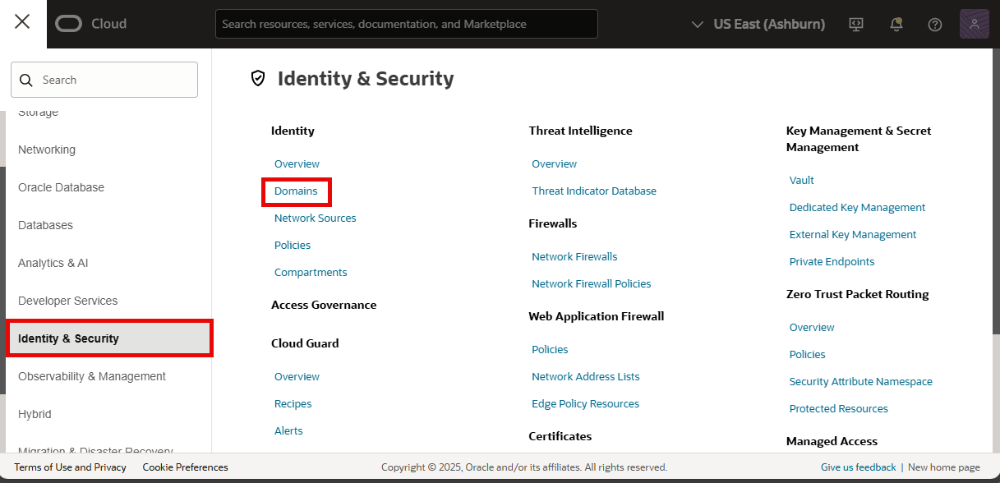

3.  Select the Compartment you want to work in, then select the Domain.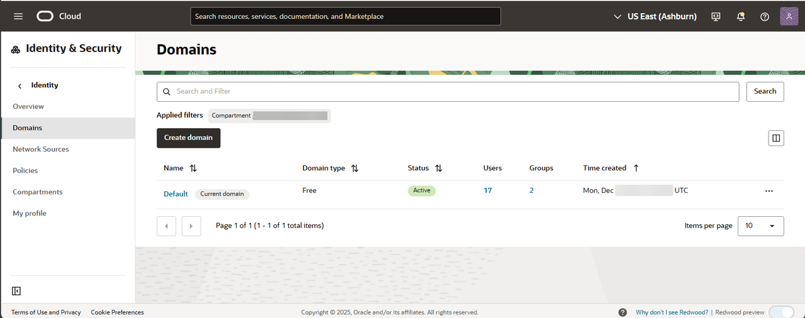

4.  Select the **Dynamic groups** tab from the horizontal bar at the top.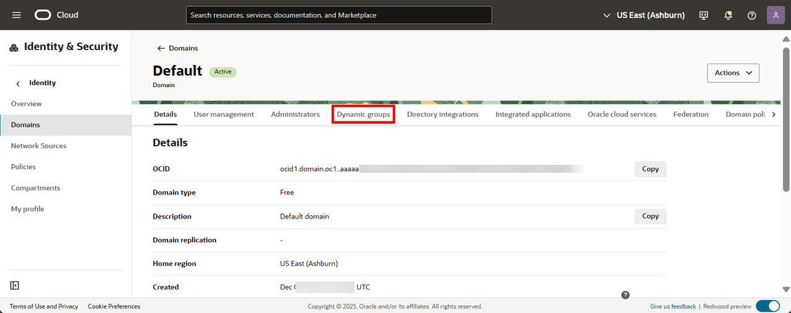

5.  Select the **Create dynamic group** button. 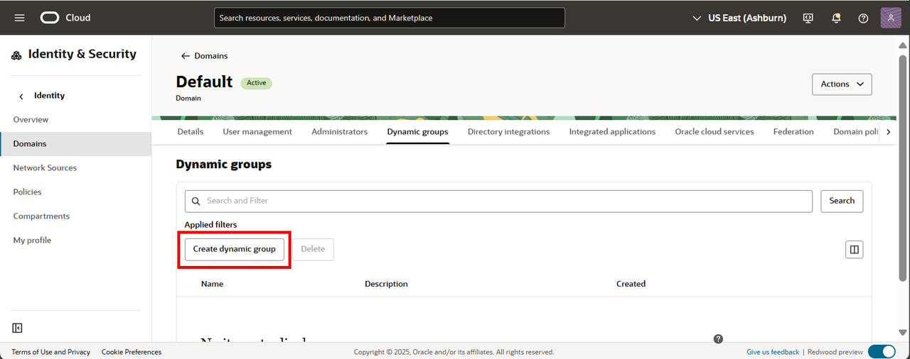

6.  In the Create dynamic group window, enter the following details:
    - **Name**: Enter a unique name for the group. The name must be unique across all groups in your tenancy. For the example, enter *New_Dynamic_Group*.

    - **Description**: Enter a friendly description.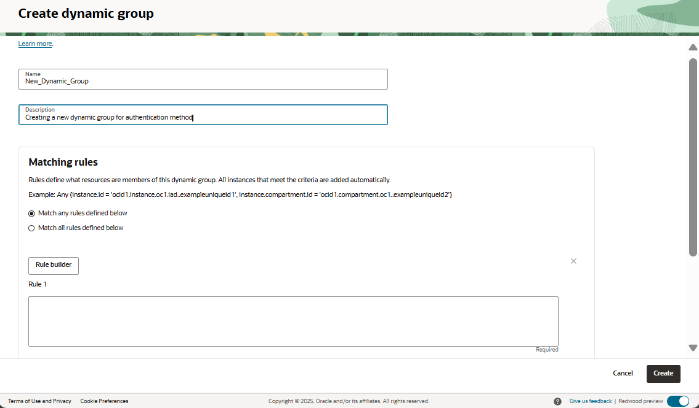

7.  Enter Matching Rules. Resources entered in the rule are the members of the group. When unsure about defining a rule, select the **Rule Builder** option.

    In the **Create matching rule** window, select the following from dropdown list
    -  For **Include instances that match**, select **Any of the following**.
    -  For **Match instances with**, select **Instance OCID**.
    -  In the **Value** text box, enter the OCID of the instance. Select the **+ Additional line** button to add more resources.
    -  Select the **Add rule** button.
   
   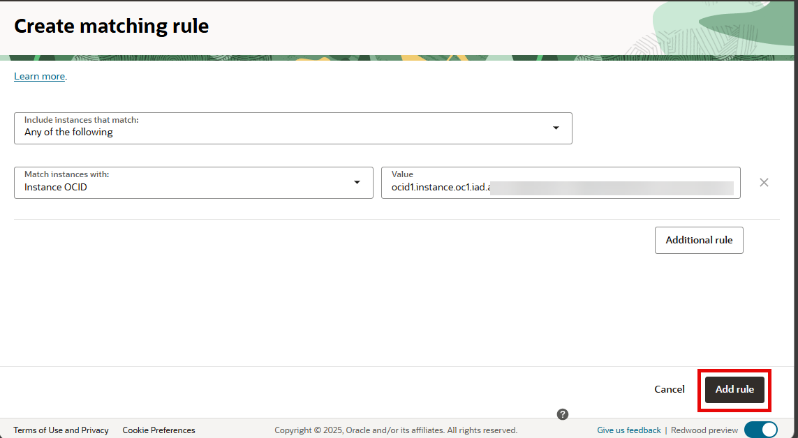

8.  Select **Create**.
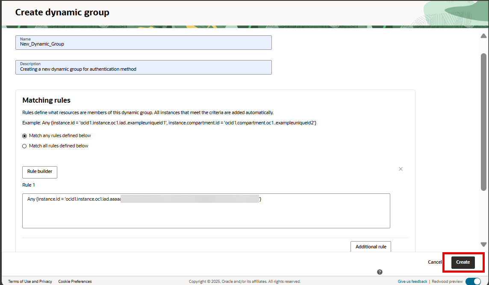

## Task 2: Create a policy for the dynamic group

1.  Log in to the OCI console.

2.  Select the **Navigation Menu**, navigate to **Identity & Security**, and select **Policies**.
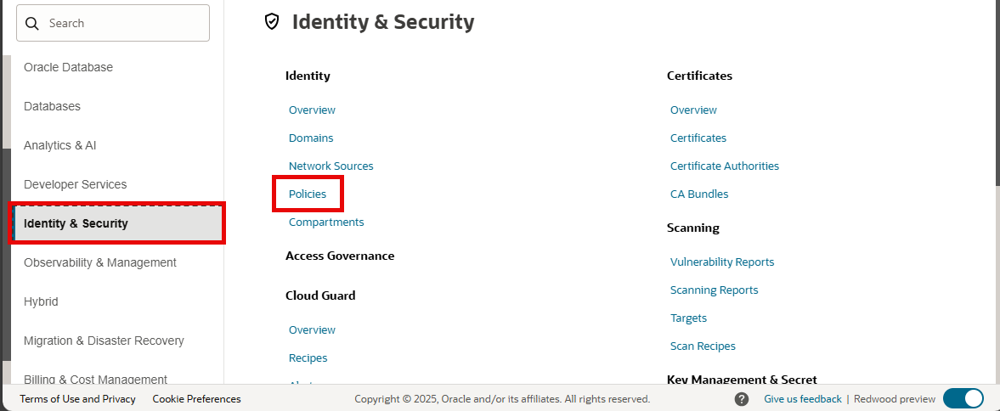

3.  Select the Compartment you want to work in and select **Create Policy**.
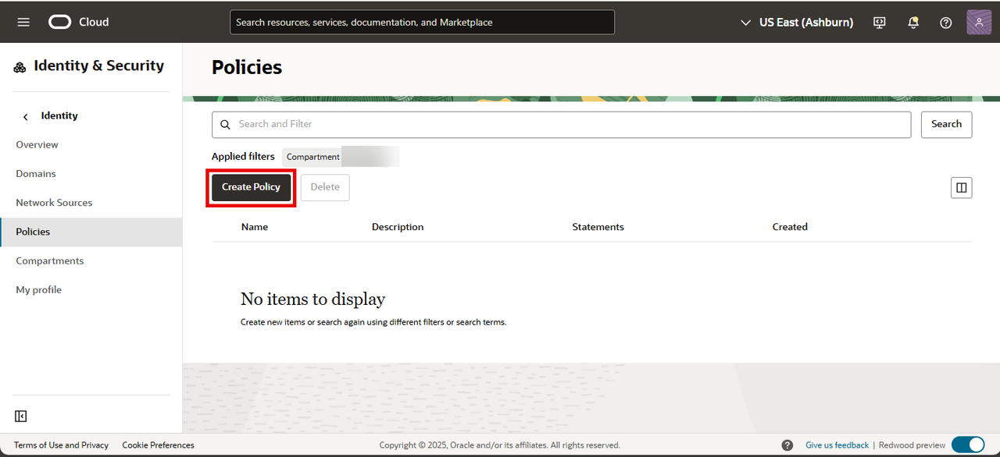

4.  In the Create Policy window, enter the following details:
    
    - **Name**: Enter a non-changeable name for the policy. The name must be unique across all policies in the compartment where you create it. For this example, enter *NewPolicy*.
    - **Description**: Enter a friendly description.
    - **Compartment**: This displays the compartment to which you want to attach the policy. To change the compartment, select from the dropdown list.
    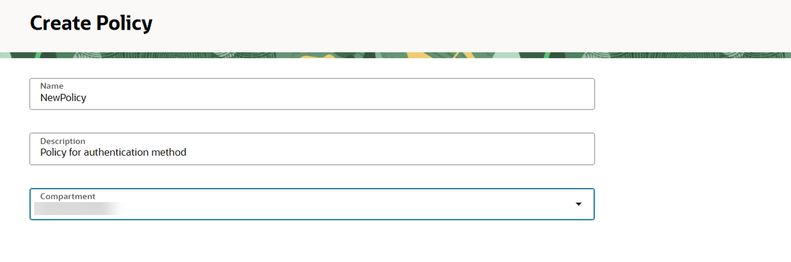

5.  Enter policy statements using the [Policy Builder](https://docs.oracle.com/en-us/iaas/Content/Identity/policymgmt/managingpolicies_topic-Using_the_Policy_Builder.htm).
    
    - Select a use case from **Policy use cases** dropdown to filter the policy templates list. For this example, select **All** to browse all the templates.

    - Select a template from **Common policy templates** dropdown. For this example, select **Let compartment admins manage the compartment**.
    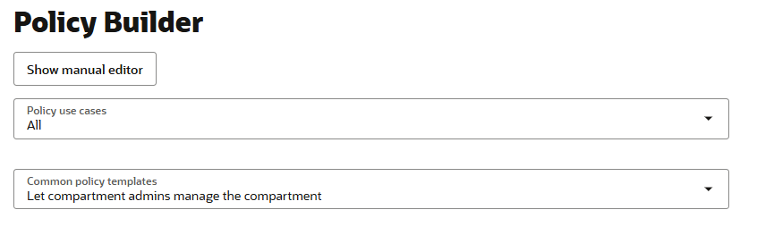

    - OCI creates the Policy Statements. For this example, select an **Identity Domain**, the **Dynamic group** created in the earlier task. You must also choose the **Location**. This is the compartment that the policy will grants access to.
    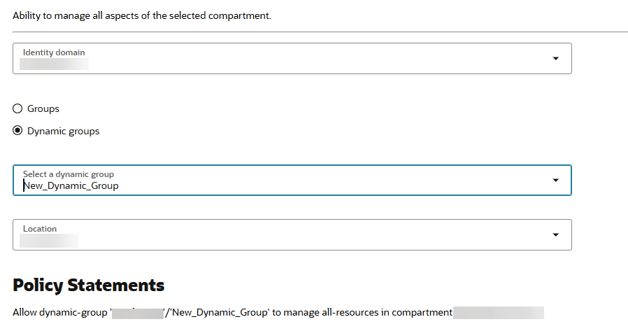

6.  Select the **Create** button.
    
    >  Note: To edit or add more policy statements after the creation, select the policy you have created. Select **Edit Policy **and select **Save Changes**.

    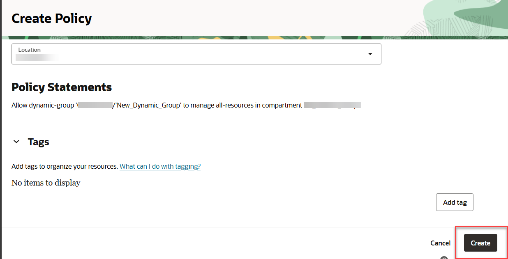

The policy is now created.

You may now proceed to the next lab.

## Learn More

* [Authentication to connect to Oracle NoSQL Database](https://docs.oracle.com/en/cloud/paas/nosql-cloud/dtddt/index.html#DTDDT-GUID-B09F1A47-98E4-4F02-AB23-5D4284F481F4)

## Acknowledgements

-   **Author** - Aayushi Arora, Database User Assistance Development 
-   **Contributors** - Suresh Rajan, Michael Brey, Ramya Umesh
-   **Last Updated By/Date** - Aayushi Arora, January 2026