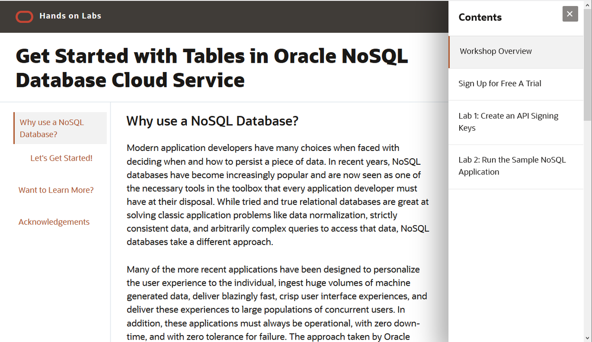

# Get Started with Tables in Oracle NoSQL Database Cloud Service

## Why use a NoSQL Database?

Modern application developers have many choices when faced with deciding when and how to persist a piece of data.   In recent years, NoSQL databases have become increasingly popular and are now seen as one of the necessary tools in the toolbox that every application developer must have at their disposal.  While tried and true relational databases are great at solving classic application problems like data normalization, strictly consistent data, and arbitrarily complex queries to access that data, NoSQL databases take a different approach.

Many of the more recent applications have been designed to personalize the user experience to the individual, ingest huge volumes of machine generated data, deliver blazingly fast, crisp user interface experiences, and deliver these experiences to large populations of concurrent users.  In addition, these applications must always be operational, with zero down-time, and with zero tolerance for failure. The approach taken by Oracle NoSQL Database is to provide extreme availability and exceptionally predictable, single digit millisecond response times to simple queries at scale. The Oracle NoSQL Database Cloud Service is designed from the ground up for high availability, predictably fast responses, resiliency to failure, all while operating at extreme scale. Largely, this is due to Oracle NoSQL Database’s shared nothing, replicated, horizontal scale-out architecture and by using the Oracle NoSQL Database Cloud Service, Oracle manages the scale out, monitoring, tuning, and hardware/software maintenance, all while providing your application with predictable behavior.

### Let's Get Started!
The Oracle NoSQL Database Cloud Service is a server-less, fully managed data store that delivers predictable single digit response times and allows application to scale on demand via provisioning API calls.  There are four simple steps to getting started with the Oracle NoSQL Database Cloud Service.

* Download the Oracle NoSQL Database driver
* Connect to the Oracle NoSQL Database Cloud Service
* Create a table with provisioned reads/sec, writes/sec, and GB storage
* Write data to the table and read data from the table

Furthermore, you can use your free cloud credits to do all of this and not pay a single penny.

### Access the Labs Using Our Web Interface
**Click the image to use our easy to navigate HTML format:**

