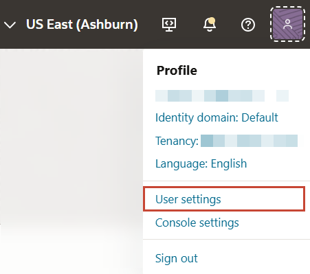
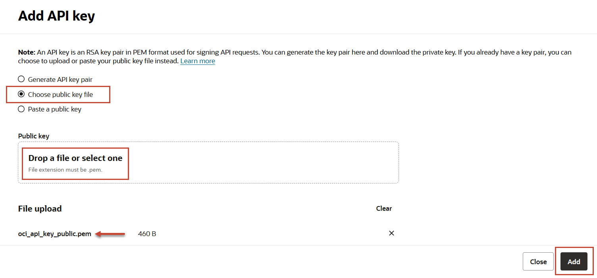

# Create an API Signing Key and SDK CLI Configuration File

## Introduction

This lab walks you through the steps to create a API signing key for an Oracle Cloud user account and create a configuration file required to connect a client to Oracle Cloud.

Estimated Lab Time: 10 minutes

### Objectives

Any software client you use to connect to Oracle Cloud Infrastructure must be configured with the following information:
* An API Signing Key
* The fingerprint of the public key
* Your tenancy's Oracle Cloud Identifier (OCID)
* The OCID of your user account

### Prerequisites

*  An Oracle Free Tier, Always Free, Paid or LiveLabs Cloud Account
* [Git Bash Shell](https://gitforwindows.org/) (Windows)
* Download an Oracle NoSQL Database SDK

## Task 1: Record your tenancy and user OCID

1. Create a note file on your local system to record the following information:

    - Tenancy OCID
    - User OCID
    - API Key Fingerprint
    - API Key Passphrase

2. Click the **Navigation Menu** in the upper left, navigate to **Governance & Administration**, and select **Tenancy Details**.

	

3. The Tenancy Details page shows information about your cloud account. Copy the Tenancy OCID by clicking on the **Copy** link next to it. Save the value in your note file.

  

4. In the top-right corner of the Console, open the Profile menu (User menu icon) and then click **User Settings** to view the details.

  

5. Click Copy beside the (User) OCID save it to your note file.

  

## Task 2: Generate an API Signing Key

To create a user API key, you will use `openssl` on your local system. If you are using Windows, we recommend the Git Bash Shell.

  *Note: To paste in Git Bash Shell right click in the window and click paste(Ctrl + V does not work in the shell).*

1. Create a `~/.oci` directory:

    *Note: if you already have a .oci directory, you can skip this step.*

    ```
    <copy>mkdir ~/.oci</copy>
    ```

    

2. Generate a private key with the following command. On Windows, you will not see a prompt for a passphrase, but you should use one that you can remember. Be sure to make a note of the passphrase you enter, as you will need it later.

    ```
    <copy>openssl genrsa -out ~/.oci/oci_api_key_private.pem -aes128 -passout stdin 2048</copy>
    ```

    

3. Confirm that the private key file has been created in the directory you specified using the following command.

    ```
    <copy>ls -l ~/.oci</copy>
    ```

    

4. Change permissions on the file to ensure that only you can read it.

    ```
    <copy>chmod go-rwx ~/.oci/oci_api_key_private.pem</copy>
    ```

    

5. Generate a public key in the same location as the private key file using the following command. Enter the same passphrase you previously used to encrypt the private key file. *Note: there is no prompt on Windows.*

    ```
    <copy>openssl rsa -pubout -in ~/.oci/oci_api_key_private.pem -out ~/.oci/oci_api_key_public.pem -passin stdin</copy>
    ```

    

6. Confirm that the public key file has been created in the directory you specified.

    ```
    <copy>ls -l ~/.oci</copy>
    ```

7. Having created the API key pair, upload the public key value to Oracle Cloud Infrastructure. In the top-right corner of the Console, open the Profile menu again and then click **User Settings** to view the details.

  

8. On the API Keys page, click **Add Public Key**.

  

9. Click **select one** and navigate to your `~/.oci` directory, and select the `oci_api_key_public.pem` file. Click **Add**.

  

10. Save the fingerprint value to your note file, as you will use the fingerprint later.

  

You may proceed to the next lab.

## Learn More

* [Acquiring Credentials](https://docs.oracle.com/en/cloud/paas/nosql-cloud/csnsd/acquiring-credentials.html)

## Acknowledgements
* **Author** - Dave Rubin, Senior Director, NoSQL and Embedded Database Development and Michael Brey, Director, NoSQL Product Development
* **Contributors** - Jaden McElvey, Technical Lead - Oracle LiveLabs Intern
* **Last Updated By/Date** - Anoosha Pilli, Database Product Management, September 2020
