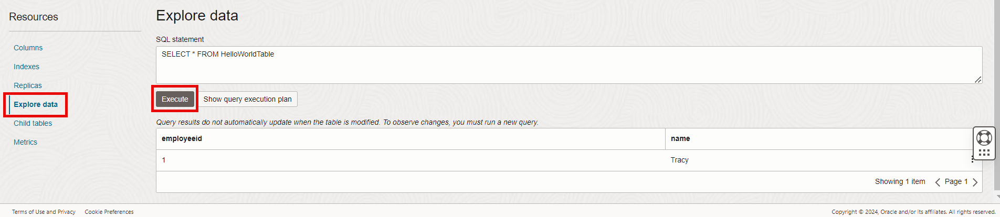

# Run the Sample NoSQL Application

## Introduction

This lab walks you through the steps to create a sample HelloWorld application to connect to an Oracle NoSQL Database Cloud Service and perform basic table level operations.

Estimated Lab Time: 10 Minutes

### About Oracle NoSQL Database Cloud Service

Oracle NoSQL Database Cloud Service is a fully managed database cloud service that handles large amounts of data at high velocity. Developers can start using this service in minutes by following the simple steps outlined in this tutorial. To get started with the service, you create a table. Oracle NoSQL Database supports Java, Python, Node.js, Go, and C#.

### Prerequisites

*  An Oracle Free Tier, Always Free, Paid or LiveLabs Cloud Account
*  Successful completion of Lab 1 : Create an API Signing Key and SDK CLI Configuration File

This workshop contains different language implementation in the form of different tabs. Click the tab corresponding to the language you are interested in.

## **Step 1:** Download the appropriate Oracle NoSQL SDK
<if type="Java">

1. Make sure that a recent version of the java jdk is installed locally on your computer.
2. Make sure you have `maven` installed. See [Installing Maven](https://maven.apache.org/install.html) for details.
3. Create a `test` directory. Download [pom.xml](https://c4u04.objectstorage.us-ashburn-1.oci.customer-oci.com/p/EcTjWk2IuZPZeNnD_fYMcgUhdNDIDA6rt9gaFj_WZMiL7VvxPBNMY60837hu5hga/n/c4u04/b/livelabsfiles/o/data-management-library-files/pom.xml) to configure Oracle NoSQL SDK. This grabs the SDK runtime from Maven Central.

    ```
    <copy>
    <project xmlns="http://maven.apache.org/POM/4.0.0" xmlns:xsi="http://www.w3.org/2001/XMLSchema-instance"
      xsi:schemaLocation="http://maven.apache.org/POM/4.0.0 http://maven.apache.org/maven-v4_0_0.xsd">
      <modelVersion>4.0.0</modelVersion>
      <groupId>com.oracle.nosql.example</groupId>
      <artifactId>HelloWorld</artifactId>
      <version>1.0-SNAPSHOT</version>
      <name>HelloWorld</name>
      <url>http://maven.apache.org</url>
    
      <dependencies>
        <dependency>
          <groupId>com.oracle.nosql.sdk</groupId>
          <artifactId>nosqldriver</artifactId>
          <version><NOSQL_JAVASDK_VERSION></version>
        </dependency>
      </dependencies>
    
      <build>
        <plugins>
          <plugin>
            <artifactId>maven-clean-plugin</artifactId>
            <version>3.1.0</version>
          </plugin>
          <plugin>
            <artifactId>maven-compiler-plugin</artifactId>
            <version>3.8.0</version>
            <configuration>
              <!--<verbose>true</verbose>-->
              <fork>true</fork>
            </configuration>
          </plugin>
        </plugins>
      </build>
    
    </project>
    </copy>
    ```
**Note:** The latest SDK can be found here [Oracle NoSQL Database SDK For Java](https://mvnrepository.com/artifact/com.oracle.nosql.sdk/nosqldriver). Please make sure to replace the placeholder for the version of the Oracle NoSQL Java SDK in the `pom.xml` file with the exact SDK version number.
</if>

<if type="Python">

1. Make sure that python is installed in your system.
2. You can install the Python SDK through the Python Package Index with the command given below.

    ```
    <copy> pip3 install borneo </copy>
    ```
3. If you are using the Oracle NoSQL Database cloud service you will also need to install the oci package:

    ```
    <copy> pip3 install oci </copy>
    ```
</if>

<if type="Go">
  1. Open the [Go Downloads](https://golang.org/doc/install) page in a browser and click the download tab corresponding to your operating system. Save the file to your home folder.
  2. Install Go in your operating system.
    - On Windows systems, Open the MSI file you downloaded and follow the prompts to install Go.

      *Note: By default, the installer will install Go to Program Files or Program Files (x86). You can change the location as needed. After installing, you will need to close and reopen any open command prompts so that changes to the environment made by the installer are reflected at the command prompt.*
    - On Linux systems, Extract the archive you downloaded into /usr/local, creating a Go tree in /usr/local/go. Add /usr/local/go/bin to the PATH environment variable.

        ```
        <copy>tar -C /usr/local -xzf go1.16.5.linux-amd64.tar.gz
        export PATH=$PATH:/usr/local/go/bin
        </copy>
        ```
  3. Verify that you've installed Go. In the Command Prompt window that appears, type the following command:

      ```
      <copy>
      $ go version
      </copy>
      ```
  Confirm that the command prints the installed version of Go.
  </if>
 <if type="Node.js">
 The Node SDK supports both JavaScript and TypeScript applications.

  1. This lab includes code samples for JavaScript and TypeScript applications. Decide the language that you want to use.  

  2. Open the [Node.js Download](https://nodejs.org/en/) link and download Node.js. Follow the prompts to install the Node.js package. The Node Package Manager (npm) is automatically installed.

   With this Node.js package, you can run both JavaScript and TypeScript applications.

  3. Install the Node SDK for Oracle NoSQL Database.

      ```
      <copy>
      npm install oracle-nosqldb
      </copy>
      ```

   With the above command, npm creates the `node_modules` directory in the current directory.

   Another option is to install the SDK globally:

      ```
      <copy>
      npm install -g oracle-nosqldb
      </copy>
      ```
   You can choose one of the above options depending on the permissions you have.
</if>
  <if type="C-sharp">

You can add the SDK NuGet Package as a reference to your project by using .Net CLI:
1. Make sure you have [.NET](https://dotnet.microsoft.com/en-us/download) installed in your system. You can add the SDK NuGet Package as a reference to your project by using .Net CLI:
2. Run the following command to create your project directory.

    ```
    <copy>
    dotnet new console -o HelloWorld
    </copy>
    ```
2. Go to your project directory. Add the SDK package to your project.

    ```
    <copy>
    dotnet add package Oracle.NoSQL.SDK
    </copy>
    ```
  </if>

## **Step 2:** Download, build, and run the sample application

<if type="Java">
1. Download the provided [HelloWorld.java](https://c4u04.objectstorage.us-ashburn-1.oci.customer-oci.com/p/EcTjWk2IuZPZeNnD_fYMcgUhdNDIDA6rt9gaFj_WZMiL7VvxPBNMY60837hu5hga/n/c4u04/b/livelabsfiles/o/data-management-library-files/HelloWorld.java) file and move it to the `test/src/main/java` directory.

2. Review the sample application. You can access the [JavaAPI Reference Guide](https://docs.oracle.com/en/cloud/paas/nosql-cloud/csnjv/index.html) to reference Java classes, methods, and interfaces included in this sample application.

  Oracle NoSQL Database Cloud Service tables are created in a compartment and are scoped to that compartment. It is recommended not to create tables in the "root" compartment, but to create them in your own compartment created under "root". Edit the code [HelloWorld.java](https://objectstorage.us-ashburn-1.oraclecloud.com/p/qCpBRv5juyWwIF4dv9h98YWCDD50574Y6OwsIHhEMgI/n/c4u03/b/data-management-library-files/o/HelloWorld.java), replace the placeholder of the compartment  in the function ```setDefaultCompartment``` with the OCID of your compartment. Replace the placeholder for region with the name of your region. Save the file and close it.

3. From your home directory, navigate to ".oci" directory.

    ```
    <copy>
    cd ~
    cd .oci
    </copy>
    ```

  Use `vi` or `nano` or any text editor to create a file named `config` in the `.oci` directory. Copy the following content to the `config` file.

    ```
    <copy>
    [DEFAULT]
    user=USER-OCID
    fingerprint=FINGERPRINT-VALUE
    tenancy=TENANCY-OCID
    key_file=<Location of the private key oci_api_key_private.pem>
    pass_phrase=PASSPHRASE
    </copy>
    ```
  Replace [USER-OCID] (https://docs.oracle.com/en-us/iaas/Content/API/Concepts/apisigningkey.htm#five) with the value you copied on your notepad, FINGERPRINT-VALUE with your API key fingerprint, TENANCY-OCID with your [tenancy OCID](https://docs.oracle.com/en-us/iaas/Content/API/Concepts/apisigningkey.htm#five). The [key_file] (https://docs.oracle.com/en-us/iaas/Content/API/Concepts/apisigningkey.htm#How) is the private key that you generated. Replace the PASSPHRASE with the passphrase that you entered. You should have noted these values in a text file as you've been working through this workshop.  Use the values recorded from Lab 1.
  
  When `SignatureProvider` is constructed without any parameters, the default [Configuration File](https://docs.cloud.oracle.com/iaas/Content/API/Concepts/sdkconfig.htm) is located in the `~/.oci/config` directory.

4. Compile your java code using the command `mvn compile`.
5. Build your maven project using the following command.

    ```
    <copy>
    $ mvn exec:java -Dexec.mainClass=HelloWorld
    </copy>
    ```

*Note: In the main method of `HelloWorld.java`, the `dropTable(handle)` is commented out to allow you to see the result of creating the tables in the Oracle Cloud Console.*
</if>

<if type="Python">

1. Download the provided [HelloWorld.py](https://c4u04.objectstorage.us-ashburn-1.oci.customer-oci.com/p/EcTjWk2IuZPZeNnD_fYMcgUhdNDIDA6rt9gaFj_WZMiL7VvxPBNMY60837hu5hga/n/c4u04/b/livelabsfiles/o/data-management-library-files/HelloWorld.py) file and move it to your home directory.

2. Review the sample application. You can access the [Python API Reference Guide](https://nosql-python-sdk.readthedocs.io/en/latest/api.html) to reference Python classes and methods included in this sample application.

   Oracle NoSQL Database Cloud Service tables are created in a compartment and are scoped to that compartment. It is recommended not to create tables in the "root" compartment, but to create them in your own compartment created under "root". Edit the code [HelloWorld.py](https://c4u04.objectstorage.us-ashburn-1.oci.customer-oci.com/p/EcTjWk2IuZPZeNnD_fYMcgUhdNDIDA6rt9gaFj_WZMiL7VvxPBNMY60837hu5hga/n/c4u04/b/livelabsfiles/o/data-management-library-files/HelloWorld.py), replace the placeholder of the compartment in the function ```set_default_compartment``` with the OCID of your compartment. Replace the placeholder for region with the name of your region. Save the file and close it.

3. From your home directory, navigate to ".oci" directory. Create a file named `config` in the `.oci` directory. Copy the following content to the `config` file.

    ```
    <copy>
    [DEFAULT]
    user=USER-OCID
    fingerprint=FINGERPRINT-VALUE
    tenancy=TENANCY-OCID
    key_file=<Location of the private key oci_api_key_private.pem>
    pass_phrase=PASSPHRASE
    </copy>
    ```   
  Replace [USER-OCID] (https://docs.oracle.com/en-us/iaas/Content/API/Concepts/apisigningkey.htm#five) with the value you copied on your notepad, FINGERPRINT-VALUE with your API key fingerprint, TENANCY-OCID with your [tenancy OCID](https://docs.oracle.com/en-us/iaas/Content/API/Concepts/apisigningkey.htm#five). The [key_file] (https://docs.oracle.com/en-us/iaas/Content/API/Concepts/apisigningkey.htm#How) is the private key that you generated. Replace the PASSPHRASE with the passphrase that you entered. You should have noted these values in a text file as you've been working through this workshop.  Use the values recorded from Lab 1.
  

4. Execute the sample application:
   Open the Command Prompt, and navigate to the directory where you saved the `HelloWorld.py` program.
   Execute the HelloWorld program.

    ```
    <copy>
    python3 HelloWorld.py
    </copy>
    ```
    You get the following output:

    ```
    <copy>
    Connecting to the Oracle NoSQL Cloud Service
    Creating table: create table if not exists HelloWorldTable (employeeid integer, name string,  primary key(employeeid))
    Wrote record:
          {'employeeid': 1, 'name': 'Tracy'}
    Read record:
          {'employeeid': 1, 'name': 'Tracy'}
    </copy>
    ```

*Note: In the main method of `HelloWorld.py`, the `drop_table` method is commented out to allow you to see the result of creating the tables in the Oracle Cloud Console.*  
</if>
<if type="Go">

1. Download the provided [HelloWorld.go](https://c4u04.objectstorage.us-ashburn-1.oci.customer-oci.com/p/EcTjWk2IuZPZeNnD_fYMcgUhdNDIDA6rt9gaFj_WZMiL7VvxPBNMY60837hu5hga/n/c4u04/b/livelabsfiles/o/data-management-library-files/HelloWorld.go) file and move it to your home directory.

2. Review the sample application. You can access the [Go API docs](https://pkg.go.dev/github.com/oracle/nosql-go-sdk/nosqldb?utm_source=godoc) to reference Go classes and methods included in this sample application.

   Oracle NoSQL Database Cloud Service tables are created in a compartment and are scoped to that compartment. It is recommended not to create tables in the "root" compartment, but to create them in your own compartment created under "root". Edit the code [HelloWorld.go](https://c4u04.objectstorage.us-ashburn-1.oci.customer-oci.com/p/EcTjWk2IuZPZeNnD_fYMcgUhdNDIDA6rt9gaFj_WZMiL7VvxPBNMY60837hu5hga/n/c4u04/b/livelabsfiles/o/data-management-library-files/HelloWorld.go) , replace the placeholder of the compartment in the constructor of ```NewSignatureProviderFromFile``` with the OCID of your compartment. Replace the placeholder for region with the name of your region. Save the file and close it.

3. From your home directory, navigate to ".oci" directory. Create a file named `config` in the `.oci` directory. Copy the following content to the `config` file.

    ```
    <copy>
    [DEFAULT]
    user=USER-OCID
    fingerprint=FINGERPRINT-VALUE
    tenancy=TENANCY-OCID
    key_file=<Location of the private key oci_api_key_private.pem>
    pass_phrase=PASSPHRASE
    </copy>
    ```
  Replace [USER-OCID] (https://docs.oracle.com/en-us/iaas/Content/API/Concepts/apisigningkey.htm#five) with the value you copied on your notepad, FINGERPRINT-VALUE with your API key fingerprint, TENANCY-OCID with your [tenancy OCID](https://docs.oracle.com/en-us/iaas/Content/API/Concepts/apisigningkey.htm#five). The [key_file] (https://docs.oracle.com/en-us/iaas/Content/API/Concepts/apisigningkey.htm#How) is the private key that you generated. Replace the PASSPHRASE with the passphrase that you entered. You should have noted these values in a text file as you've been working through this workshop.  Use the values recorded from Lab 1.
  

4.  Execute the sample application:
    Initialize a new module for the example program.

      ```
      <copy>
      go mod init example.com/HelloWorld
      </copy>
      ```
    You see the following output:

      ```
      <copy>
      go: creating new go.mod: module example.com/HelloWorld
      go: to add module requirements and sums:
      go mod tidy
      </copy>
      ```
    Run go mod tidy and the various modules are added to the project

    ```
    <copy>
    go mod tidy
    go: finding module for package github.com/oracle/nosql-go-sdk/nosqldb/auth/iam
    go: finding module for package github.com/oracle/nosql-go-sdk/nosqldb
    go: finding module for package github.com/oracle/nosql-go-sdk/nosqldb/common
    go: found github.com/oracle/nosql-go-sdk/nosqldb in github.com/oracle/nosql-go-sdk v1.4.0
    go: found github.com/oracle/nosql-go-sdk/nosqldb/auth/iam in github.com/oracle/nosql-go-sdk v1.4.0
    go: found github.com/oracle/nosql-go-sdk/nosqldb/common in github.com/oracle/nosql-go-sdk v1.4.0
    </copy>
    ```

  Build the HelloWorld application.

       ```
       <copy>
       go build -o HelloWorld
       </copy>
       ```
  Run the HelloWorld application.

       ```
       <copy>
       ./HelloWorld
       </copy>
       ```

*Note: In the main method of `HelloWorld.go`, the code for dropping the table is commented out to allow you to see the result of creating the tables in the Oracle Cloud Console.*    
</if>
<if type="Node.js">
The given code sample in JavaScript and TypeScript use the [ES6 modules](https://docs.oracle.com/pls/topic/lookup?ctx=en/database/other-databases/nosql-database/24.1/nsdev&id=node_ecma_mod).

1. For JavaScript applications, download the [HelloWorld.js](https://objectstorage.us-ashburn-1.oraclecloud.com/p/hP3lO4cVou3C1XqL-oxJi4F3IC3fsqwO6jsoq4b4-j6uhJ3DjFffEJwf6O5M0ABf/n/c4u04/b/livelabsfiles/o/HelloWorld.js) file and move it to your home directory. For TypeScript applications, download the [HelloWorld.ts] (https://objectstorage.us-ashburn-1.oraclecloud.com/p/-_rOKBbY7zRRg6fyYdm3vvRIatks_zGuJ3ZX4QhRDm8UfgAqsotpcDo4phLRuQAL/n/c4u04/b/livelabsfiles/o/HelloWorld.ts) file and move it to your home directory.

2. Review the sample application. You can access the [Node.js API  Reference Guide](https://oracle.github.io/nosql-node-sdk/index.html) to reference Node.js classes and methods included in this sample application.

   Oracle NoSQL Database Cloud Service tables are created in a compartment and are scoped to that compartment. It is recommended not to create tables in the "root" compartment, but to create them in your own compartment created under "root". Depending on your application, edit either the JavaScript code  [HelloWorld.js](https://objectstorage.us-ashburn-1.oraclecloud.com/p/hP3lO4cVou3C1XqL-oxJi4F3IC3fsqwO6jsoq4b4-j6uhJ3DjFffEJwf6O5M0ABf/n/c4u04/b/livelabsfiles/o/HelloWorld.js) or the TypeScript code [HelloWorld.ts](https://objectstorage.us-ashburn-1.oraclecloud.com/p/-_rOKBbY7zRRg6fyYdm3vvRIatks_zGuJ3ZX4QhRDm8UfgAqsotpcDo4phLRuQAL/n/c4u04/b/livelabsfiles/o/HelloWorld.ts), replace the placeholder of the compartment in the ```NoSQLClient``` constructor with the OCID of your compartment. Replace the placeholder for region with the name of your region. Save the file and close it. 

3. From your home directory, navigate to ".oci" directory. Create a file named `config` in the `.oci` directory. Copy the following content to the `config` file. 

    ```
    <copy>  
    [DEFAULT]
    user=USER-OCID
    fingerprint=FINGERPRINT-VALUE
    tenancy=TENANCY-OCID
    key_file=<Location of the private key oci_api_key_private.pem>
    pass_phrase=PASSPHRASE
    </copy>
    ```
   Replace [USER-OCID] (https://docs.oracle.com/en-us/iaas/Content/API/Concepts/apisigningkey.htm#five) with the value you copied on your notepad, FINGERPRINT-VALUE with your API key fingerprint, TENANCY-OCID with your [tenancy OCID](https://docs.oracle.com/en-us/iaas/Content/API/Concepts/apisigningkey.htm#five). The [key_file] (https://docs.oracle.com/en-us/iaas/Content/API/Concepts/apisigningkey.htm#How) is the private key that you generated. Replace the PASSPHRASE with the passphrase that you entered. You should have noted these values in a text file as you've been working through this workshop. Use the values recorded from Lab 1.
   

4. Execute the Sample Application

  For JavaScript Application:
    Open the Command Prompt, and navigate to the directory where you saved the `HelloWorld.js` program.
   Execute the HelloWorld program.

    ```
    <copy>
    node HelloWorld.js
    </copy>
    ```
  For TypeScript Application:
    Open the Command Prompt, and navigate to the directory where you saved the `HelloWorld.ts` program.
   Execute the HelloWorld program.

    ```
    <copy>
    npx tsx HelloWorld.ts
    </copy>
    ``` 
*Note: In the main method of `HelloWorld.js` and `HelloWorld.ts`, the `dropTable(handle)` is commented out to allow you to see the result of creating the tables in the Oracle Cloud Console.*    
</if>
<if type="C-sharp">
1. Download the provided [HelloWorld.cs](https://c4u04.objectstorage.us-ashburn-1.oci.customer-oci.com/p/EcTjWk2IuZPZeNnD_fYMcgUhdNDIDA6rt9gaFj_WZMiL7VvxPBNMY60837hu5hga/n/c4u04/b/livelabsfiles/o/data-management-library-files/HelloWorld.cs) file and move it to your home directory.
2. Review the sample application. You can access the [.NET API  Reference Guide](https://oracle.github.io/nosql-dotnet-sdk/index.html) to reference .NET classes and methods included in this sample application.

   Oracle NoSQL Database Cloud Service tables are created in a compartment and are scoped to that compartment. It is recommended not to create tables in the "root" compartment, but to create them in your own compartment created under "root". Edit the code [HelloWorld.cs](https://c4u04.objectstorage.us-ashburn-1.oci.customer-oci.com/p/EcTjWk2IuZPZeNnD_fYMcgUhdNDIDA6rt9gaFj_WZMiL7VvxPBNMY60837hu5hga/n/c4u04/b/livelabsfiles/o/data-management-library-files/HelloWorld.cs), replace the placeholder of the compartment in the ```NoSQLClient``` constructor with the OCID of your compartment. Replace the placeholder for region with the name of your region. Save the file and close it.

3. From your home directory, navigate to ".oci" directory. Create a file named `config` in the `.oci` directory. Copy the following content to the `config` file.

    ```
    <copy>
    [DEFAULT]
    user=USER-OCID
    fingerprint=FINGERPRINT-VALUE
    tenancy=TENANCY-OCID
    key_file=<Location of the private key oci_api_key_private.pem>
    pass_phrase=PASSPHRASE
    </copy>
    ```
  Replace [USER-OCID] (https://docs.oracle.com/en-us/iaas/Content/API/Concepts/apisigningkey.htm#five) with the value you copied on your notepad, FINGERPRINT-VALUE with your API key fingerprint, TENANCY-OCID with your [tenancy OCID](https://docs.oracle.com/en-us/iaas/Content/API/Concepts/apisigningkey.htm#five). The [key_file] (https://docs.oracle.com/en-us/iaas/Content/API/Concepts/apisigningkey.htm#How) is the private key that you generated. Replace the PASSPHRASE with the passphrase that you entered. You should have noted these values in a text file as you've been working through this workshop.  Use the values recorded from Lab 1.
  

4. Go to your project directory. You will see the example source code ```Program.cs```. Remove this file.

    ```
    <copy>
    rm Program.cs
    </copy>
    ```
  Build and run your project as shown below.

  *Note: You have multiple dotnet target frameworks which are supported. Currently the supported frameworks are .NET 7.0 and higher.*

    ```
    <copy>
    dotnet run
    </copy>
    ```
*Note: In the RunBasicExample method of `HelloWorld.cs`, the section to drop table is commented out to allow you to see the result of creating the tables in the Oracle Cloud Console.*    
</if>
## **Step 3:** Explore tables using the Oracle Cloud Infrastructure Console

1. On the left hand menu, click **Databases**. In the **Databases** window, click **Tables** under **Oracle NoSQL Database**.

  

2. Click **HelloWorldTable** to open the details page.

  *If you do not see HelloWorldTable select your correct compartment (that you mentioned in your code) on the left dropdown.*

  

3. Click **Columns** under Resources to view the table columns.

  

4. Click **Explore data** under Resources and click **Execute** to execute the select statement and display the record inserted into the table.

  

Congratulations! You have completed the workshop.

This application accesses Oracle NoSQL Database Cloud Service, but most likely you would want to deploy by running your application inside your own tenancy co-located in the same Oracle Cloud Infrastructure region as your NoSQL table and use the Oracle Cloud Infrastructure Service Gateway to connect to the NoSQL Cloud Service.

## Learn More

* [About Oracle NoSQL Database Cloud Service](https://docs.oracle.com/en/cloud/paas/nosql-cloud/dtddt/index.html)
* [Oracle NoSQL Database Cloud Service page](https://cloud.oracle.com/en_US/nosql)
<if type="Java">
* [Java API Reference Guide](https://docs.oracle.com/en/cloud/paas/nosql-cloud/csnjv/index.html)
</if>
<if type="Python">
* [Python API Reference Guide](https://nosql-python-sdk.readthedocs.io/en/latest/api.html)
</if>
<if type="Go">
* [Go Reference Guide](https://pkg.go.dev/github.com/oracle/nosql-go-sdk/nosqldb?utm_source=godoc)
</if>
<if type="Node.js">
* [Node.js API Reference Guide](https://oracle.github.io/nosql-node-sdk/index.html)
</if>

## Acknowledgements
* **Author** - Dave Rubin, Senior Director, NoSQL and Embedded Database Development and Michael Brey, Director, NoSQL Product Development
* **Contributors** - Jaden McElvey, Technical Lead - Oracle LiveLabs Intern
* **Last Updated By/Date** -Ramya Umesh, Database User Assistance, October 2024
