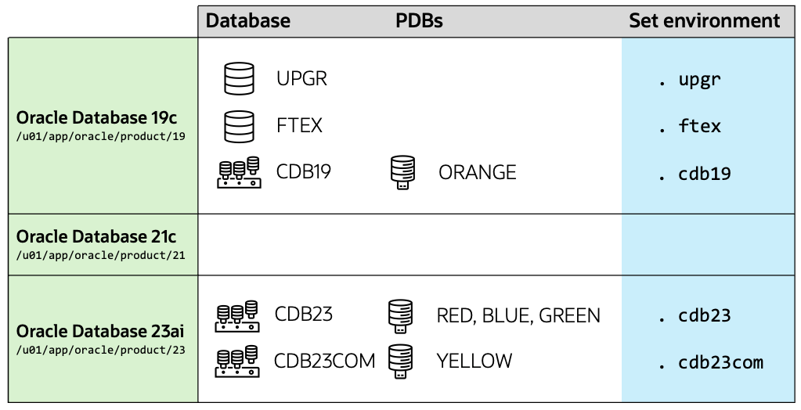

# Introduction

## About this Workshop

Oracle Data Pump technology enables very high-speed movement of data and metadata from one database to another. 

In this lab, you will use Data Pump in a number of ways that demonstrates its power and flexibility. 

Estimated Workshop Time: 2 hours

### Objectives

In this workshop, you will:

* Learn about Data Pump architecture and best practices
* Customize data exports and imports
* Use some of the options in Data Pump
* Tweak Data Pump to boost performance
* Monitor, troubleshoot and trace Data Pump processes

## About the workshop contents

This workshop comes with pre-installed Oracle homes and pre-created databases.
You can switch between environments using the shortcuts shown in the last column of the diagram below.

## Data Pump export and import modes

### Full 

In a full database export, the entire database is unloaded. This includes all tablespace definitions and schemas plus SQL Plan Baselines, SQL Profiles and other system related data.

### Schema

A schema export is the default export mode. It exports one or more schemas including all data and metadata owned by those schemas, but excludes system-related data that you only get in a full export. 

### Tablespace 

In tablespace mode, only the tables contained in a specified set of tablespaces are unloaded. If a table is unloaded, then its dependent objects are also unloaded. Both object metadata and data are unloaded. 

### Table

In table mode, only a specified set of tables, partitions, and their dependent objects are unloaded. Any object required to create the table, such as the owning schema or types for columns, must already exist.

### Transportable

In transportable tablespace mode, only the metadata for the tables (and their dependent objects) within a specified set of tablespaces is exported. The tablespace data files are copied in a separate operation. Then, a transportable tablespace import is performed to import the dump file containing the metadata and to specify the data files to use.

You may now *proceed to the next lab*.

## Learn More

* [Webinar, Data Pump Extreme – Deep Dive with Development](https://dohdatabase.com/webinars/)
* [Webinar, Data Pump Best Practices and Real World Scenarios](https://dohdatabase.com/webinars/)
* [YouTube channel](https://www.youtube.com/@upgradenow/)

## Acknowledgments
* **Author** - Daniel Overby Hansen
* **Contributors** - William Beauregard, Rodrigo Jorge, Mike Dietrich, Klaus Gronau, Alex Zaballa
* **Last Updated By/Date** - Daniel Overby Hansen, May 2025
