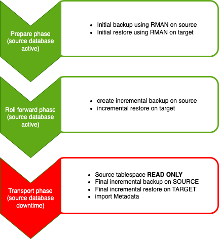
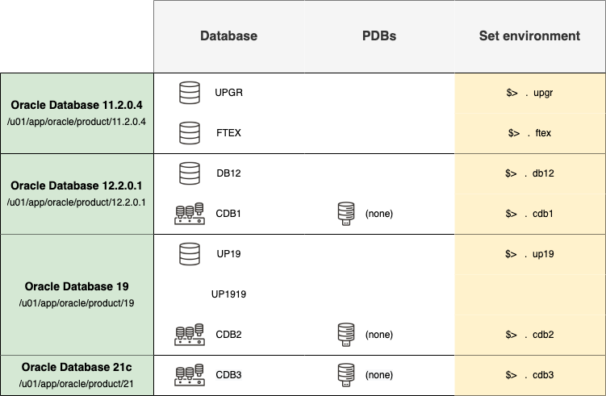

# Introduction

## About this Workshop

In this lab you will migrate an 11.2.0.4 database directly into a 21c PDB using the __Cross Platform Transportable Tablespace (XTTS)__ script. This script automatically handles cross platform migrations including conversions from little to big endianness (or vice versa). You can also use it to migrate directly into a PDB running on the same platform and host. 
The prerequisites are outlined in [MOS note #2471245.1: V4 Reduce Transportable Tablespace Downtime using Cross Platform Incremental Backup](https://support.oracle.com/epmos/faces/DocumentDisplay?id=2471245.1&displayIndex=1). Another helpful document is [MOS note #1454872.1: Transportable Tablespace (TTS) Restrictions and Limitations: Details, Reference, and Version Where Applicable ](https://support.oracle.com/epmos/faces/DocumentDisplay?id=1454872.1&displayIndex=1).

The diagram below shows you the different phases of the XTTS including the steps being executed in a particular phase by the XTTS scripts and if the source database is up and available for normal use:

Estimated Workshop Time: 90 minutes

### Objectives

In this workshop, you will:

* Setup a target PDB
* Prepare the source database
* Create the XTTS properties file
* Run the initial backup and recovery
* Run incremental backup and restore
* Run final incremental backup and restore
* Export and Import Metadata

### Prerequisites

* n/a

## About the workshop content

This workshop is preloaded with four different Oracle Homes and six databases.
You can switch between environments with the shortcuts shown in the last column of the below diagram.

The four different Oracle Homes are:

- Oracle 11.2.0.4 – /u01/app/oracle/product/11.2.0.4
- Oracle 12.2.0.1 – /u01/app/oracle/product/12.2.0.1
- Oracle 19c      – /u01/app/oracle/product/19
- Oracle 21c      – /u01/app/oracle/product/21

The workshop also contains 6 different databases for running various upgrade and migration scenarios. This lab will use the UPGR 11.2.0.4 database as source and create a PDB3 in the 21c CDB3.

- UPGR – 11.2.0.4 database (non-CDB)
- FTEX – 11.2.0.4 database (non-CDB)
- DB12 – 12.2.0.1 database (non-CDB)
- CDB1 – 12.2.0.1 database (CDB)
- CDB2 – 19c database (CDB)
- CDB3 – 21c database (CDB)

## Transportable Tablespaces using XTTS Scripts Workshop

You can use the transportable tablespace method to upgrade a database from an Oracle Database 11g Release 2 (11.2.0.3) or later to Oracle Database 23c.
Although the XTTS scripts are able to migrate __cross-platform and cross-endianness__ this lab will use a single Linux machine as source and target platform. The source database (11.2.0.4) will be migrated directly into a 21c PDB.
 

You may now *proceed to the next lab*.

## Learn More

* ["Databases Are Fun" Blog](https://dohdatabase.com/xtts/)
* [YouTube channel](https://www.youtube.com/«upgradenow/)
* [V4 Reduce Transportable Tablespace Downtime using Cross Platform Incremental Backup](https://support.oracle.com/epmos/faces/DocumentDisplay?id=2471245.1&displayIndex=1)
* [Transportable Tablespace (TTS) Restrictions and Limitations: Details, Reference, and Version Where Applicable ](https://support.oracle.com/epmos/faces/DocumentDisplay?id=1454872.1&displayIndex=1)

## Acknowledgements
* **Author** - Klaus Gronau
* **Contributors** Mike Dietrich, Daniel Overby Hansen  
* **Last Updated By/Date** - Klaus Gronau, June 2023
