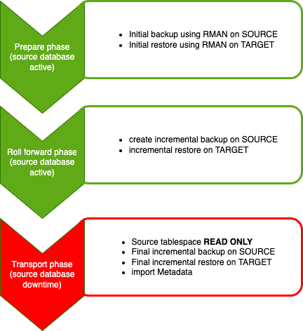
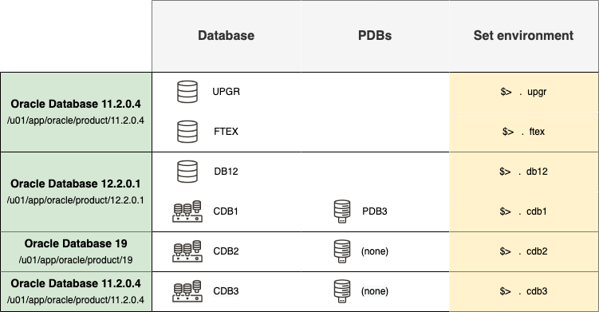

# Introduction

## About this Workshop

In this lab you will migrate an 11.2.0.4 database directly into a 21c PDB using version 4 of the Cross Platform Transportable Tablespace (XTTS) Perl script. This script handles cross platform migrations, conversions from little to big endianness (or vice versa) or like in our case migrations on the same host. 
The prerequisites are outlined in [MOS note #2471245.1: V4 Reduce Transportable Tablespace Downtime using Cross Platform Incremental Backup](https://support.oracle.com/epmos/faces/DocumentDisplay?id=2471245.1&displayIndex=1). Another helpful document is [MOS note #1454872.1: Transportable Tablespace (TTS) Restrictions and Limitations: Details, Reference, and Version Where Applicable ](https://support.oracle.com/epmos/faces/DocumentDisplay?id=1454872.1&displayIndex=1).

Outlined below are the steps you will execute assisted by the XTTS V4 Perl script:

Estimated Workshop Time: 90 minutes

???? DO WE WANT TO ADD A WORKSHOP VIDEO???

### Objectives

In this workshop, you will:

* Setup a target PDB 
* Create the XTTS properties file
* Run the initial backup and recovery
* Run incremental backup and restore
* Start the workload again
* Run an AWR Diff Report
* Use SQL Performance Analyzer
* Ensure plan stability with SQL Plan Management
* Tune with SQL Tuning Advisor
* Plugin your upgraded database into Multitenant
* Unplug/plug/upgrade a PDBs
* Migrate another database with Full Transportable Export/import

### Prerequisites

* 

  ## About the workshop contents

This workshop is preloaded with 4 different Oracle Homes and 5 databases.
You can switch between environments with the shortcuts shown in the last column of the below diagram.

The 4 different Oracle Homes are:

- Oracle 11.2.0.4 – /u01/app/oracle/product/11.2.0.4
- Oracle 12.2.0.1 – /u01/app/oracle/product/12.2.0.1
- Oracle 19c      – /u01/app/oracle/product/19
- Oracle 21c      – /u01/app/oracle/product/21

The workshop also contains 5 different databases for running the various upgrade and migration scenarios in each lab.

- UPGR – 11.2.0.4 database (non-CDB)
- FTEX – 11.2.0.4 database (non-CDB)
- DB12 – 12.2.0.1 database (non-CDB)
- CDB1 – 12.2.0.1 database (CDB)
- CDB2 – 19.11.0 database (CDB)

These are the tasks you can complete in the lab.

## Upgrade and data migration methods and processes

### Transportable Tablespaces using Perl V4 scripts

It is important to mention that this feature works cross-platform and cross-endianness!

- You can use the full transporatble tablespace method to upgrade a database from an Oracle Database 11g Release 2 (11.2.0.3) or later to Oracle Database 23c.

### Migrating data using Oracle Data Pump

- ???

You may now *proceed to the next lab*.

## Learn More

* [Database Upgrade Guide Documentation - 19c](https://docs.oracle.com/en/database/oracle/oracle-database/19/upgrd/intro-to-upgrading-oracle-database.html#GUID-FA024F34-A61A-4C4B-AA60-C123A9191A16)
* [Database Upgrade Blog](https://MikeDietrichDE.coms)
* [Oracle Databases Release and Support Coverage](https://support.oracle.com/epmos/faces/DocumentDisplay?id=742060.1&displayIndex=1)
* [V4 Reduce Transportable Tablespace Downtime using Cross Platform Incremental Backup](https://support.oracle.com/epmos/faces/DocumentDisplay?id=2471245.1&displayIndex=1)
* [Transportable Tablespace (TTS) Restrictions and Limitations: Details, Reference, and Version Where Applicable ](https://support.oracle.com/epmos/faces/DocumentDisplay?id=1454872.1&displayIndex=1)

## Acknowledgements
* **Author** - Klaus Gronau
* **Contributors** -  
* **Last Updated By/Date** - Klaus Gronau, June 2023
