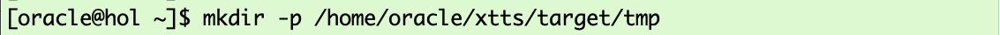
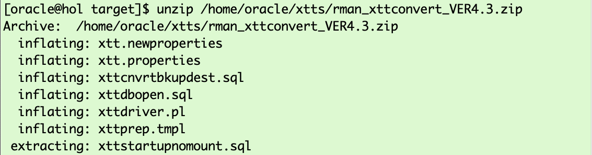
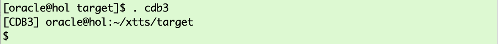
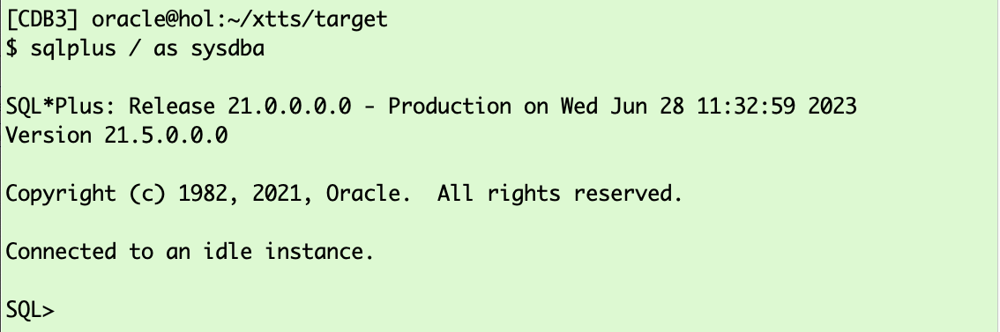
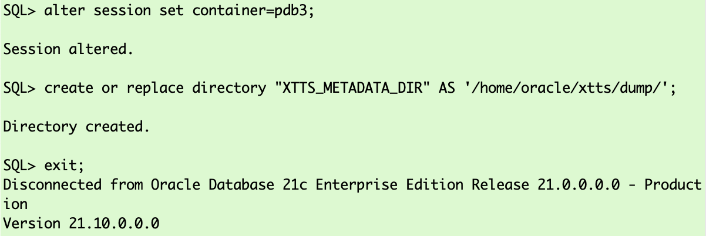
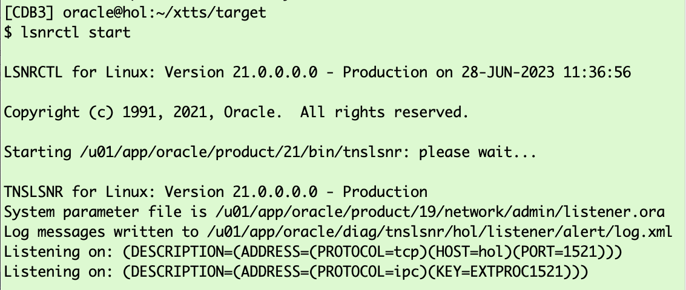

# Prepare Target

## Introduction

In this lab, you will create the target PDB and a few additional objects.

Estimated Time: 15 minutes

### Objectives

- Initialize a new target PDB.

### Prerequisites

This lab assumes you have:

- Connected to the Hands On Lab

## Task 1: Open Terminal Window, Create OS Target Directory and Unzip XTTS ZIP File (TARGET)

### Open Terminal Window 
Open a terminal windows by clicking on the "Terminal" icon. <br>
Use this terminal window to execute all commands related to the __TARGET__ database.


All following screenshots related to the __TARGET__ will have a light green_ background color.


### Create OS Directory (TARGET)
Activate the target terminal window and create a directory for the XTTS TARGET files.

  ```
    <copy>
    mkdir -p /home/oracle/XTTS/TARGET/tmp
    </copy>
  ```



### change into XTTS working directory (TARGET)


  ```
    <copy>
    cd /home/oracle/XTTS/TARGET/
    </copy>
  ```


### Unzip XTTS ZIP file (TARGET)
  ```
    <copy>
    unzip /home/oracle/XTTS/rman_xttconvert_VER4.3.zip
    </copy>
  ```



## Task 2: Set Target Environment and Start SQL*Plus (TARGET)


  ```
    <copy>
    . cdb3
    </copy>
  ```

  ```
    <copy>
    sqlplus / as sysdba 
    </copy>
  ```




## Task 3: In SQL*Plus Start the Container Database CDB3 and Create the Pluggable Database PDB3 (TARGET)
When creating a PDB the admin user needs to exist. You can delete it later on if desired. Once the PDB3 is created you need to start it up and save its state.

  ```
    <copy>
    startup
    create pluggable database PDB3 admin user adm identified by adm file_name_convert=('pdbseed', 'pdb3');
    alter pluggable database pdb3 open;
    alter pluggable database PDB3 save state;
    </copy>
    
    Hit ENTER/RETURN to execute ALL commands.
  ```


## Task 4: In SQL*Plus Create the Database Directory Used by Data Pump (TARGET)
 and create some additional objects for the migration.

  ```
    <copy>
    alter session set container=PDB3;
    CREATE OR REPLACE DIRECTORY "XTTS_METADATA_DIR" AS '/home/oracle/XTTS/DUMP/';
    exit;
    </copy>

Hit ENTER/RETURN to execute ALL commands.
  ```




## Task 5: Start Oracle Listener (TARGET)
  ```
    <copy>
    lsnrctl start
    </copy>
  ```



<details>
 <summary>*click here to see the xtt.properties file content*</summary>


  ``` text
[CDB3] oracle@hol:~/XTTS/TARGET
$ lsnrctl start

LSNRCTL for Linux: Version 21.0.0.0.0 - Production on 01-JUN-2023 15:47:58

Copyright (c) 1991, 2021, Oracle.  All rights reserved.

Starting /u01/app/oracle/product/21/bin/tnslsnr: please wait...

TNSLSNR for Linux: Version 21.0.0.0.0 - Production
System parameter file is /u01/app/oracle/product/19/network/admin/listener.ora
Log messages written to /u01/app/oracle/diag/tnslsnr/hol/listener/alert/log.xml
Listening on: (DESCRIPTION=(ADDRESS=(PROTOCOL=tcp)(HOST=hol)(PORT=1521)))
Listening on: (DESCRIPTION=(ADDRESS=(PROTOCOL=ipc)(KEY=EXTPROC1521)))

Connecting to (DESCRIPTION=(ADDRESS=(PROTOCOL=TCP)(HOST=hol)(PORT=1521)))
STATUS of the LISTENER
------------------------
Alias                     LISTENER
Version                   TNSLSNR for Linux: Version 21.0.0.0.0 - Production
Start Date                01-JUN-2023 15:48:00
Uptime                    0 days 0 hr. 0 min. 0 sec
Trace Level               off
Security                  ON: Local OS Authentication
SNMP                      OFF
Listener Parameter File   /u01/app/oracle/product/19/network/admin/listener.ora
Listener Log File         /u01/app/oracle/diag/tnslsnr/hol/listener/alert/log.xml
Listening Endpoints Summary...
  (DESCRIPTION=(ADDRESS=(PROTOCOL=tcp)(HOST=hol)(PORT=1521)))
  (DESCRIPTION=(ADDRESS=(PROTOCOL=ipc)(KEY=EXTPROC1521)))
Services Summary...
Service "CDB1" has 1 instance(s).
  Instance "CDB1", status UNKNOWN, has 1 handler(s) for this service...
Service "CDB2" has 1 instance(s).
  Instance "CDB2", status UNKNOWN, has 1 handler(s) for this service...
Service "CDB3" has 1 instance(s).
  Instance "CDB3", status UNKNOWN, has 1 handler(s) for this service...
Service "DB12" has 1 instance(s).
  Instance "DB12", status UNKNOWN, has 1 handler(s) for this service...
Service "FTEX" has 1 instance(s).
  Instance "FTEX", status UNKNOWN, has 1 handler(s) for this service...
Service "UP19" has 1 instance(s).
  Instance "UP19", status UNKNOWN, has 1 handler(s) for this service...
Service "UPGR" has 1 instance(s).
  Instance "UPGR", status UNKNOWN, has 1 handler(s) for this service...
The command completed successfully

  ```
</details>


You may now *proceed to the next lab*.


## Acknowledgements
* **Author** - Klaus Gronau
* **Contributors** -  
* **Last Updated By/Date** - Klaus Gronau, June 2023
