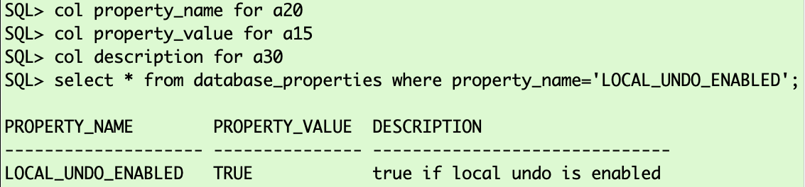

# Prepare the Target

## Introduction

In this lab, you will create the target PDB and a few additional objects.

Estimated Time: 15 minutes

### Objectives

- Initialize a new target PDB.

### Prerequisites

This lab assumes you have:

- Connected to the lab

## Task 1: Open Terminal Window, Create OS Target Directory and Unzip XTTS ZIP File (TARGET)

### Open Terminal Window 
__Double-click__ the "xtts" icon 


which will open a terminal session with two tabs; you can use the __light green__ tab to execute all the __target__ related commands 

and the __light blue__ one for all the __source__ related activities:


The screenshots in this lab will use the same coloring.


1. Create OS Directory (TARGET)
Activate the terminal target tab window and create a directory for the XTTS target files.

    ```
    <copy>
    mkdir -p /home/oracle/xtts/target/tmp
    </copy>
    ```

    

2. Change into XTTS Working Directory (TARGET)

    ```
    <copy>
    cd /home/oracle/xtts/target/
    </copy>
    ```

    

3. Unzip XTTS ZIP file (TARGET)

    ```
    <copy>
    unzip /home/oracle/xtts/rman_xttconvert_VER4.3.zip
    </copy>
    ```

    


## Task 2: Set Target Environment and Start SQL*Plus (TARGET)

1. Set Environment

    ```
    <copy>
    . cdb3
    </copy>
    ```

    

    The command line prompt changes and you have now set common environment variables.

2. Open SQL*Plus

    ```
    <copy>
    sqlplus / as sysdba 
    </copy>   
    ```

    


## Task 3: In SQL*Plus Enable Archive Logging and Enable Flashback (TARGET)

In the "transport phase" you will create a guaranteed restore point which you can use to flash back the __target__ database just in case something goes wrong during the TTS import.

1. Start Container Database and Enable Archive Logging

    ```
    <copy>
    startup mount
    alter database archivelog;
    alter database open;
    </copy>
        
    Hit ENTER/RETURN to execute ALL commands.
    ```

    

2. Check for Local Undo </br>
    With local undo, each PDB will have its own undo tablespace.

    ```
    <copy>
    col property_name for a20
    col property_value for a15
    col description for a30
    select * from database_properties where property_name='LOCAL_UNDO_ENABLED';
    </copy>
        
    Hit ENTER/RETURN to execute ALL commands.
    ```
    

    The container database is already configured with local_undo. No further action needed here.


3. Enable Flashback </br>
    Creating the recovery OS directory and enabling flashback:

    ```
    <copy>
    host mkdir /u02/fast_recovery_area/CDB3
    alter system set db_recovery_file_dest_size=1024G scope=both;
    alter system set db_recovery_file_dest= '/u02/fast_recovery_area/CDB3' scope=both;
    alter database flashback on;
    </copy>
      
    Hit ENTER/RETURN to execute ALL commands.
    ```

    

## Task 4: Create the Pluggable Database PDB3 (TARGET)

When creating a PDB, the database must create the admin user as well. You can delete it later on if desired. Once you have created PDB3, you need to start it up and save its state.

  ```
  <copy>
  create pluggable database pdb3 admin user adm identified by adm file_name_convert=('pdbseed', 'pdb3');
  alter pluggable database pdb3 open;
  alter pluggable database pdb3 save state;
  </copy>
  
  Hit ENTER/RETURN to execute ALL commands.
  ```

  


## Task 5: Create the Database Directory Used by Data Pump (TARGET)
Create some additional objects for the migration.

  ```
    <copy>
    alter session set container=pdb3;
    create or replace directory "XTTS_METADATA_DIR" AS '/home/oracle/xtts/dump/';
    exit;
    </copy>

Hit ENTER/RETURN to execute ALL commands.
  ```


<if type="KgR">
COMMENT: TYPE IS NOT DEFINED; SO THIS SECTION DOES NOT APPEAR
IT IS TO HIDE THE LISTENER START JUST IN CASE I NEED IT AGAIN

## Task 6: Start the Oracle Listener (TARGET)
  ```
    <copy>
    lsnrctl start
    </copy>
  ```


<details>
 <summary>*click here to see the full listener startup output*</summary>


  ``` text
[CDB3] oracle@hol:~/xtts/target
$ lsnrctl start

LSNRCTL for Linux: Version 21.0.0.0.0 - Production on 28-JUN-2023 11:36:56

Copyright (c) 1991, 2021, Oracle.  All rights reserved.

Starting /u01/app/oracle/product/21/bin/tnslsnr: please wait...

TNSLSNR for Linux: Version 21.0.0.0.0 - Production
System parameter file is /u01/app/oracle/product/19/network/admin/listener.ora
Log messages written to /u01/app/oracle/diag/tnslsnr/hol/listener/alert/log.xml
Listening on: (DESCRIPTION=(ADDRESS=(PROTOCOL=tcp)(HOST=hol)(PORT=1521)))
Listening on: (DESCRIPTION=(ADDRESS=(PROTOCOL=ipc)(KEY=EXTPROC1521)))

Connecting to (DESCRIPTION=(ADDRESS=(PROTOCOL=TCP)(HOST=hol)(PORT=1521)))
STATUS of the LISTENER
------------------------
Alias                     LISTENER
Version                   TNSLSNR for Linux: Version 21.0.0.0.0 - Production
Start Date                28-JUN-2023 11:36:56
Uptime                    0 days 0 hr. 0 min. 0 sec
Trace Level               off
Security                  ON: Local OS Authentication
SNMP                      OFF
Listener Parameter File   /u01/app/oracle/product/19/network/admin/listener.ora
Listener Log File         /u01/app/oracle/diag/tnslsnr/hol/listener/alert/log.xml
Listening Endpoints Summary...
  (DESCRIPTION=(ADDRESS=(PROTOCOL=tcp)(HOST=hol)(PORT=1521)))
  (DESCRIPTION=(ADDRESS=(PROTOCOL=ipc)(KEY=EXTPROC1521)))
Services Summary...
Service "CDB1" has 1 instance(s).
  Instance "CDB1", status UNKNOWN, has 1 handler(s) for this service...
Service "CDB2" has 1 instance(s).
  Instance "CDB2", status UNKNOWN, has 1 handler(s) for this service...
Service "CDB3" has 1 instance(s).
  Instance "CDB3", status UNKNOWN, has 1 handler(s) for this service...
Service "DB12" has 1 instance(s).
  Instance "DB12", status UNKNOWN, has 1 handler(s) for this service...
Service "FTEX" has 1 instance(s).
  Instance "FTEX", status UNKNOWN, has 1 handler(s) for this service...
Service "UP19" has 1 instance(s).
  Instance "UP19", status UNKNOWN, has 1 handler(s) for this service...
Service "UPGR" has 1 instance(s).
  Instance "UPGR", status UNKNOWN, has 1 handler(s) for this service...
The command completed successfully
[CDB3] oracle@hol:~/xtts/target
$
  ```
</details>

</if>

You may now *proceed to the next lab*.


## Acknowledgements
* **Author** - Klaus Gronau
* **Contributors** - Daniel Overby Hansen
* **Last Updated By/Date** - Klaus Gronau, June 2023
