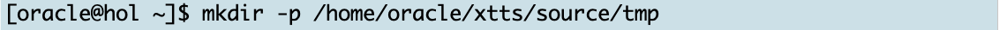

# Prepare the Source 

## Introduction

In this lab, you will enable archive logging on the source database and create the database directory for Data Pump export.

Estimated Time: 5 minutes

### Objectives

- Prepare the source database

### Prerequisites

This lab assumes you have:

- Connected to the lab

## Task 1: Create OS Source Directory and Unzip XTTS ZIP File (SOURCE)

1. Create OS Directories (SOURCE) </br>
Activate the source terminal window and create three directories; one for the Data Pump metadata dump file, another as XTTS source, and a third directory for RMAN files.

    ```
    <copy>
    mkdir -p /home/oracle/xtts/source/tmp 
    </copy>
    ```

    

    ```
    <copy>
    mkdir -p /home/oracle/xtts/dump
    </copy>
    ```

    

    ```
    <copy>
    mkdir -p /home/oracle/xtts/rman
    </copy>
    ```

    


2. XTTS ZIP File (SOURCE) </br>
Switch to the source directory

    ```
    <copy>
    cd /home/oracle/xtts/source/
    </copy>
    ```

    

    and unzip 'rman_xttconvert_VER4.3.zip' 

    ```
    <copy>
    unzip /home/oracle/xtts/rman_xttconvert_VER4.3.zip
    </copy>
    ```

    

## Task 2: Configure Source Database (SOURCE)
1. Set Source Environment (SOURCE) </br>
Activate the source terminal window, set the source environment, and start SQL*Plus:

    ```
    <copy>
    . upgr
    </copy>
    ```

    

2. Start SQL*Plus (SOURCE)

    ```
    <copy>
    sqlplus / as sysdba
    </copy>
    ```

    


3. Database Changes (SOURCE) </br> Enable source database archive logging and create the database directory for Data Pump export. Also, alter the TPCC user's password:

    ```
    <copy>
    startup mount
    archive log list
    alter database archivelog;
    alter database enable block change tracking;
    alter database open;
    create or replace directory "XTTS_METADATA_DIR" as '/home/oracle/xtts/dump';
    alter user tpcc identified by oracle;
    exit
    </copy>

    Hit ENTER/RETURN to execute ALL commands.
    ```

    


## Task 4: Configuring Default RMAN Settings (SOURCE)
The next parameters you will set for RMAN work well in the lab. For your environment, you might have to adopt them by increasing parallelism, the backup destination, etc.

1. Open RMAN Console (SOURCE) </br>
On the source, start the RMAN console connecting to the source database: 

    ```
    <copy>
    rman target /
    </copy>
    ```

    Please be aware:
    In RMAN terminology, the target database identifies the database which you will back up - so in the migration terminology, the source database. 

2. Update Default RMAN Settings

    ```
    <copy>
    configure default device type to disk;
    configure  device type disk parallelism 8;
    exit;
    </copy>

    Hit ENTER/RETURN to execute ALL commands.
    ```

    


You may now *proceed to the next lab*.


## Acknowledgments
* **Author** - Klaus Gronau
* **Contributors** Mike Dietrich, Daniel Overby Hansen  
* **Last Updated By/Date** - Klaus Gronau, June 2023
