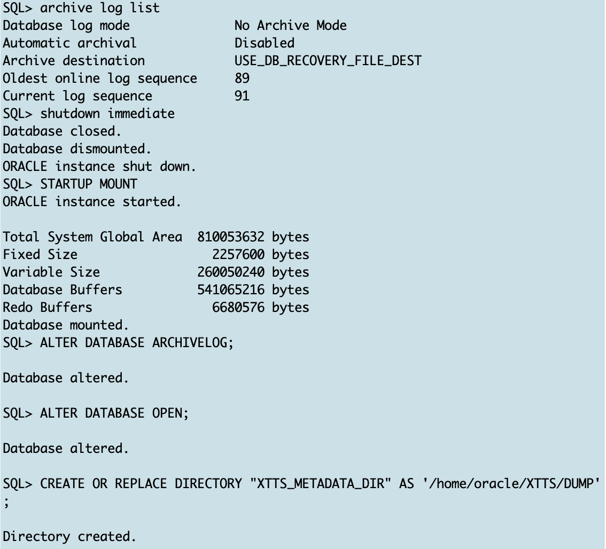

# Prepare Source 

## Introduction

In this lab, you will create the target PDB and a few additional objects.

Estimated Time: 15 minutes

### Objectives

- Initialize a new target PDB.

### Prerequisites

This lab assumes you have:

- Connected to the Hands On Lab

## Task 1: Set the source database environment

Click on the Terminal icon to open a second session


First set the source environment and start SQL*Plus

  ```
    <copy>
    . upgr
    sqlplus / as sysdba
    </copy>
 ```


## Task 2: enable Source database archive logging and create the database directory for Data Pump export


  ```
    <copy>
    archive log list
		shutdown immediate
		STARTUP MOUNT
		ALTER DATABASE ARCHIVELOG;
		ALTER DATABASE OPEN;
    CREATE OR REPLACE DIRECTORY "XTTS_METADATA_DIR" AS '/home/oracle/XTTS/DUMP';
    </copy>
  ```





## Acknowledgements
* **Author** - Klaus Gronau
* **Contributors** -  
* **Last Updated By/Date** - Klaus Gronau, June 2023
