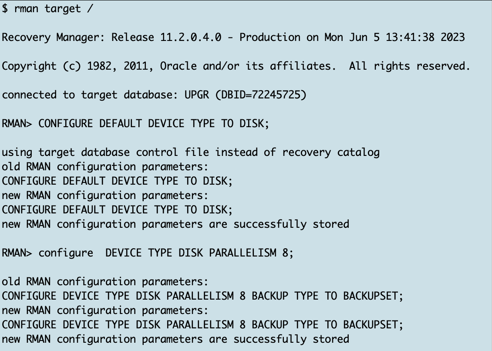

# XTTS PreChecks on Source Database

## Introduction

In this lab, you will unzip the XTTS V4 files on source/target and create the XTTS properties file required by the tool.

Estimated Time: 15 minutes

### Objectives

- Mandatory checks for XTTS.


### Prerequisites

This lab assumes you have:

- Connected to the Hands On Lab
- A terminal window open on source.
- Another terminal window open on target
- Prepared the source
- Prepared the target

## Task 0: Transportable Tablespace Method Supported by Source and Target OS Platforms
Before you begin check on source database if the OS you want to migrate your database to is supported by TTS:
  ```
    <copy>
    col platform_name format A20
    set line 200
    set pages 999
    select * from v$transportable_platform order by platform_id;
    </copy>
  ```


## Task 1: DBTIMEZONE
Although it is not necessary in our hands on lab (we do not have tables with timezone columns having local timezone datatypes (Time Zone with Local Time Zone = __TZLTZ__) in our lab) you should always check if that's also true in your database environment. So check if you have user tables with timezone data stored in your database and then make sure the SOURCE and TARGET database are located in the same timezone. 
Open on source and target SQL*Plus and execute:
  ```
    <copy>
    SELECT   DBTIMEZONE FROM   dual;
    </copy>
  ```


  ```
    <copy>
    set line 200
    col owner format A20
    select t.owner, count(*)
    FROM
      dba_tab_cols t
      INNER JOIN dba_objects o ON o.owner = t.owner AND t.table_name = o.object_name
      WHERE
        t.data_type LIKE '%WITH LOCAL TIME ZONE' 
        AND o.object_type = 'TABLE' 
--        AND o.owner in (select username from dba_users where oracle_maintained='N')
      group by t.owner;
    </copy>
  ```


## Task 2: Source and Target character sets 
The source and target database must use compatible database character sets.

  ```
    <copy>
     col parameter format a35
     col VALUE format a35
     set pages 999
     set line 200
     select * from v$nls_parameters;
    </copy>
  ```
* [General Limitations on Transporting Data](https://docs.oracle.com/en/database/oracle/oracle-database/19/spucd/general-limitations-on-transporting-data.html#GUID-28800719-6CB9-4A71-95DD-4B61AA603173)


## Task 3: XTTS tablespace violations on Source  
For transportable tablespaces another mandatory requirement is that all tablespaced you're going to transport are self contained.
In this hands on lab you're going to transport the two tablespaces "TPCCTAB" and "USERS". So let's check if they are self contained:

  ```
    <copy>
     EXEC SYS.DBMS_TTS.TRANSPORT_SET_CHECK ('TPCCTAB,USERS',True,True);
     SELECT * FROM transport_set_violations;
    </copy>
  ```


## Task 4: User data in SYSTEM/SYSAUX tablespace on Source
As SYSTEM and SYSAUX tablespaces are not copied from source to target, it's good practice to check if they might accidentally contain user data:

  ```
    <copy>
     set line 200
     col owner format A20
     col table_name format A50
     select owner, table_name, temporary from dba_tables where 
     owner not in ('WMSYS','XDB','SYSTEM','SYS','LBACSYS','OUTLN','DBSNMP','APPQOSSYS')
     -- (select username from dba_users 
     -- where oracle_maintained='Y') 
     and tablespace_name in ( 'SYSTEM', 'SYSAUX');
    </copy>
  ```


## Task 5: User indexes in SYSTEM/SYSAUX tablespace on Source
Same check as in the previous task but this time for user indexes

  ```
    <copy>
     set line 200
     col owner format A20
     col table_name format A50
     col index_name format A50
     select  owner, table_name,index_name from dba_indexes
     where owner not in ('WMSYS','XDB','SYSTEM','SYS','LBACSYS','OUTLN','DBSNMP','APPQOSSYS')
     -- owner not in (select username from dba_users where oracle_maintained='Y') 
     and tablespace_name in ( 'SYSTEM', 'SYSAUX') order by 1,2;
    </copy>
  ```


## Task 6: IOT Tables
IOT tables might get corrupted during XTTS copy and you should copy them again during the downtime. So check if you have IOT tables you have to handle  manually:
  ```
    <copy>
     set line 200
     set pages 999
     col owner format a20
     col table_name format a35
     select owner,table_name,iot_type from dba_tables where iot_type like '%IOT%' 
     and table_name not like 'DR$%' 
     -- and owner not in (select username from dba_users where oracle_maintained='Y')
     ;
    </copy>
  ```


## Task 7: Binary XMLTYPE Columns
In versions prior 12.2 metadata imports failed when having tables with XMLTYPE columns. You need to exclude them from the metadata export and handle the content manually during  the downtime. A check if you have XML types stored in your database is:

  ```
    <copy>
    select distinct p.tablespace_name from dba_tablespaces p, dba_xml_tables x, dba_users u, all_all_tables t where t.table_name=x.table_name and t.tablespace_name=p.tablespace_name and x.owner=u.username;
    select distinct p.tablespace_name from dba_tablespaces p, dba_xml_tab_cols x, dba_users u, all_all_tables t where t.table_name=x.table_name and t.tablespace_name=p.tablespace_name and x.owner=u.username;
    </copy>
  ```

## Task 8: Configuring default RMAN settings on Source
The next parameters you're going to set for RMAN work well in the hands on lab. For your environment you might have to adopt them by increasing parallelism, the backup destination etc.

On source start the rman console: 

  ```
    <copy>
     rman target /
    </copy>
  ```

Please be aware:
in RMAN terminology the target database identifies the database which you're going to back up - so in the migration terminology the source database

  ```
    <copy>
     CONFIGURE DEFAULT DEVICE TYPE TO DISK;
     configure  DEVICE TYPE DISK PARALLELISM 8;
     exit;
    </copy>
  ```



## Acknowledgements
* **Author** - Klaus Gronau
* **Contributors** -  
* **Last Updated By/Date** - Klaus Gronau, June 2023
