# XTTS PreChecks on source Database

## Introduction

In this lab, you will execute common XTTS pre-checks in SQL*Plus. Each task will also contain the information, if you have to execute this step on source, target or both.

Estimated Time: 15 minutes

### Objectives

- Recommended checks for XTTS.


### Prerequisites

This lab assumes you have:

- Connected to the lab
- A terminal window open on source.
- Another terminal window open on target
- Prepared the source
- Prepared the target

## Task 1: Start SQL*Plus (SOURCE and TARGET)

### Step 1: Source
  ```
    <copy>
    sqlplus / as sysdba
    </copy>
 ```

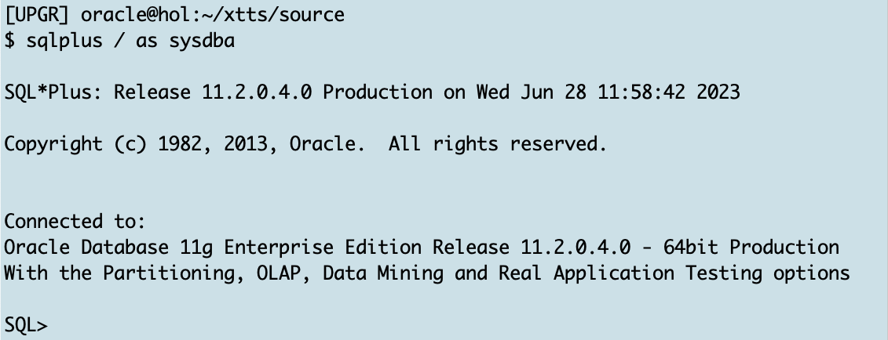

### Step 2: Target
  ```
    <copy>
    sqlplus / as sysdba
    </copy>
 ```
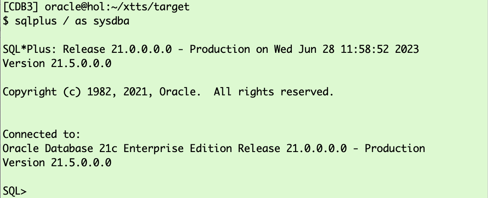

## Task 2: Transportable Tablespace Method Supported by Source and Target OS Platforms (SOURCE and TARGET)
Before you begin check on source, if the OS you want to migrate your database to, is supporting datafile conversion. <br>
Also check on target if the OS you want to migrate from is supporting datafile conversion.

### Step 1: Check SOURCE
The platform_id for the target Linux platform is 13:
  ```
    <copy>
    @/home/oracle/scripts/task2
    </copy>
  ```

<details>
 <summary>*click here to see the SQL Statement*</summary>

  ``` text
    select * from v$transportable_platform 
    where platform_name like 'Linux%' 
    order by platform_id;

  ```
</details>

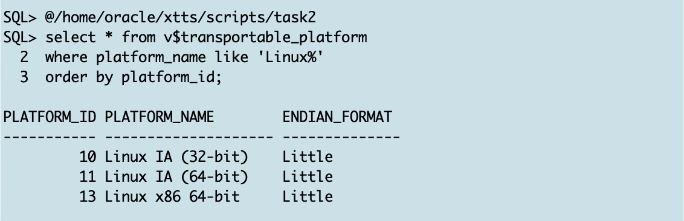

### Step 2: Check TARGET
In this lab you migrate from Linux to Linux, so we can execute the same check on target:
  ```
    <copy>
    @/home/oracle/scripts/task2
    </copy>
  ```

<details>
 <summary>*click here to see the SQL Statement*</summary>

  ``` text
    select * from v$transportable_platform 
    where platform_name like 'Linux%' 
    order by platform_id;

  ```
</details>

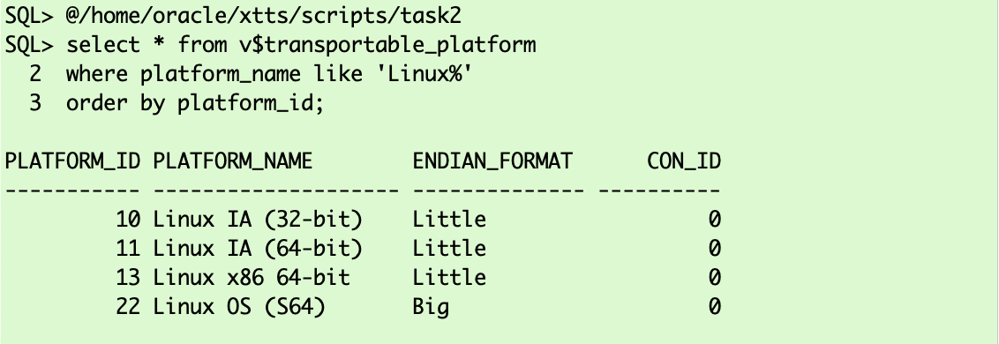

## Task 3: Database Timezone (SOURCE and TARGET)
You should always check that your source and target database are using in the same database timezone (dbtimezone). 
Execute on __source__ and __target__:
  ```
    <copy>
    @/home/oracle/scripts/task3a
    </copy>
  ```
<details>
 <summary>*click here to see the SQL statement*</summary>

  ``` text
select dbtimezone from dual;
  ```
</details>

The __source__ output:

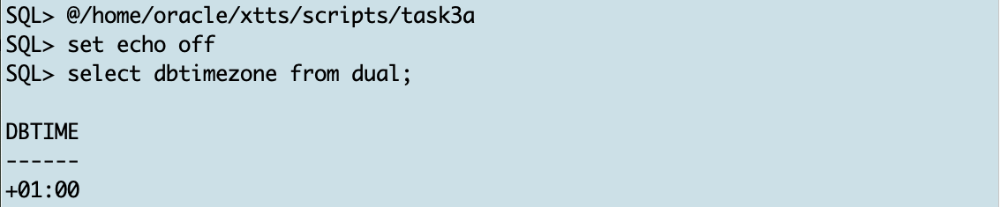

The __target__ output:

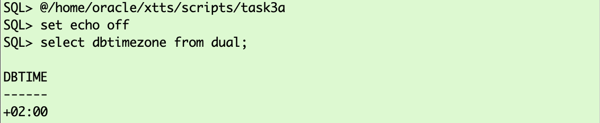

In this lab there are no tables with "__TimeStamp with Local Time Zone__ (TSLTZ)" columns. No further action needed. Had there been such columns, you must change one of the databases or move the offending tables using a regular Data Pump export/import. 


### CHECK for TimeStamp with Local Time Zone (TSLTZ) Data Type (SOURCE)
So check now if your source database has tables having columns with "__TimeStamp with Local Time Zone__ (TSLTZ)": 

  ```
    <copy>
    @/home/oracle/scripts/task3b
    </copy>
  ```

<details>
 <summary>*click here to see the SQL statement*</summary>


  ``` text
    select t.owner, count(*)
    from
      dba_tab_cols t
      inner join dba_objects o on o.owner = t.owner and t.table_name = o.object_name
      where
        t.data_type like '%WITH LOCAL TIME ZONE' 
        and o.object_type = 'TABLE' 
      group by t.owner;

  ```
</details>


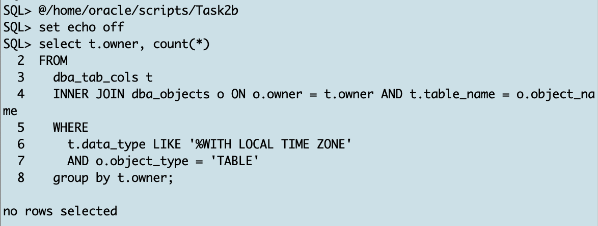
In the lab there are no TSLTZ data types used. So no need to sync both DBTIMEZONEs or to handle data manually with expdp/impdp.

## Task 4: Character Sets (SOURCE and TARGET)
The source and target database must use compatible database character sets.

  ```
    <copy>
     @/home/oracle/scripts/task4
    </copy>
  ```

<details>
 <summary>*click here to see the SQL statement*</summary>


  ``` text
select parameter,value from v$nls_parameters
where parameter like '%CHARACTERSET';
  ```
</details>

The __source__ output:

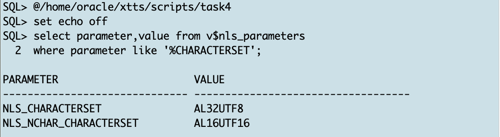

The __target__ output:

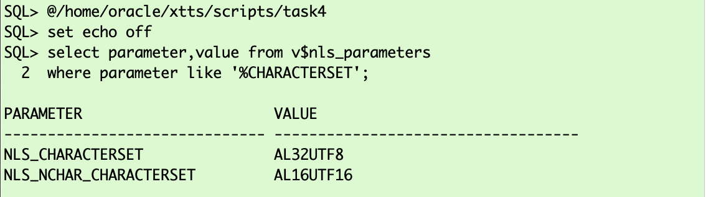

Both character sets in our lab match. 

* Details about "[General Limitations on Transporting Data](https://docs.oracle.com/en/database/oracle/oracle-database/19/spucd/general-limitations-on-transporting-data.html#GUID-28800719-6CB9-4A71-95DD-4B61AA603173)" are mentioned in the manual


## Task 5: XTTS Tablespace Violations (SOURCE) 
For transportable tablespaces another requirement is that all tablespaces you're going to transport are self contained.
In this lab you're going to transport the two tablespaces "TPCCTAB" and "USERS". So let's check if they are self contained:

  ```
    <copy>
    @/home/oracle/scripts/task5
    </copy>
  ```

<details>
 <summary>*click here to see the SQL statement*</summary>


  ``` text
     exec sys.dbms_tts.transport_set_check ('TPCCTAB,USERS',True,True);
     select * from transport_set_violations;

  ```
</details>

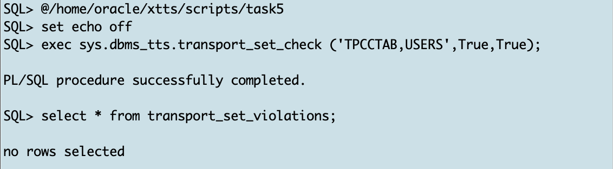

## Task 6: User Data in SYSTEM/SYSAUX Tablespace (SOURCE)
It's good practice to check if SYSTEM and SYSAUX tablespaces might accidentally contain user data:

  ```
    <copy>
     @/home/oracle/scripts/task6
    </copy>
  ```

<details>
 <summary>*click here to see the SQL statement*</summary>


  ``` text
     select owner, table_name, temporary from dba_tables where 
     owner not in ('WMSYS','XDB','SYSTEM','SYS','LBACSYS','OUTLN','DBSNMP','APPQOSSYS')
     -- (select username from dba_users 
     -- where oracle_maintained='Y') 
     and tablespace_name in ( 'SYSTEM', 'SYSAUX');
  ```
</details>

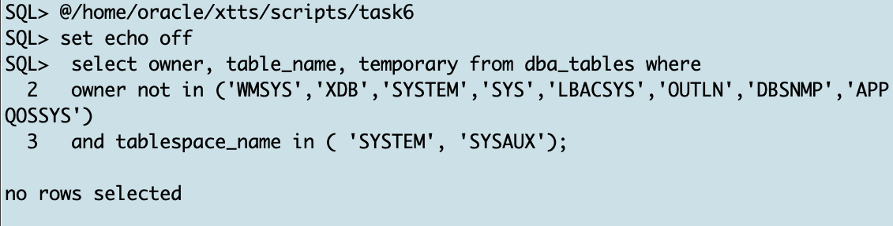


## Task 7: User Indexes in SYSTEM/SYSAUX Tablespace (SOURCE)
Same check as in the previous task but this time for user indexes

  ```
    <copy>
     @/home/oracle/scripts/task7
    </copy>
  ```

<details>
 <summary>*click here to see the SQL statement*</summary>


  ``` text
     select  owner, table_name,index_name from dba_indexes
     where owner not in ('WMSYS','XDB','SYSTEM','SYS','LBACSYS','OUTLN','DBSNMP','APPQOSSYS')
     -- owner not in (select username from dba_users where oracle_maintained='Y') 
     and tablespace_name in ( 'SYSTEM', 'SYSAUX') order by 1,2;

  ```
</details>


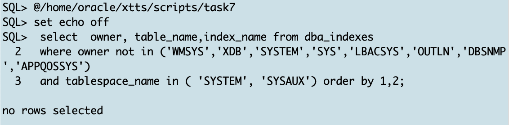

## Task 7: IOT Tables (SOURCE)
IOT tables might get corrupted during XTTS copy when copying to HP platforms. 
* [Corrupt IOT when using Transportable Tablespace to HP from different OS (Doc ID 1334152.1) ](https://support.oracle.com/epmos/faces/DocumentDisplay?id=1334152.1&displayIndex=1)

  ```
    <copy>
     @/home/oracle/scripts/task8
    </copy>
  ```


<details>
 <summary>*click here to see the SQL statement*</summary>


  ``` text
     select owner,table_name,iot_type from dba_tables where iot_type like '%IOT%' 
     and table_name not like 'DR$%' 
     -- and owner not in (select username from dba_users where oracle_maintained='Y')
     and owner not in ('WMSYS','XDB','SYSTEM','SYS','LBACSYS','OUTLN','DBSNMP','APPQOSSYS');

  ```
</details>


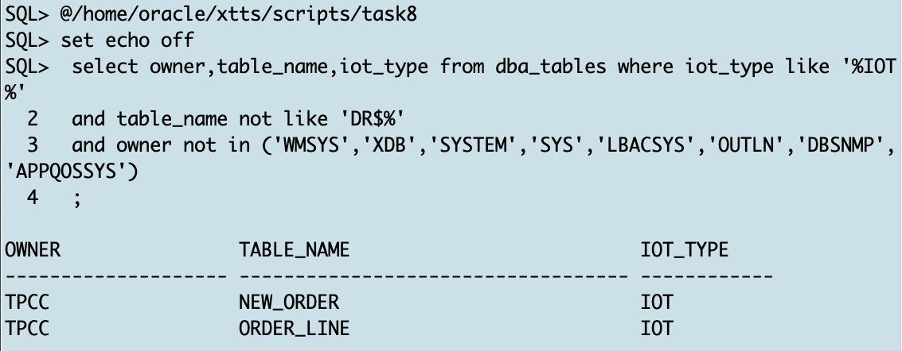

You can ignore this output because you're not moving to HP platform.

## Task 9: Binary XMLTYPE Columns (SOURCE)
In Oracle Database 12.1 and earlier you can't move tables with XMLTYPEs using transportable tablespaces. Ensure there are no such tables: 

  ```
    <copy>
     @/home/oracle/scripts/task9
    </copy>
  ```


<details>
 <summary>*click here to see the SQL statement*</summary>


  ``` text
    select distinct p.tablespace_name from dba_tablespaces p, dba_xml_tables x, dba_users u, all_all_tables t where t.table_name=x.table_name and t.tablespace_name=p.tablespace_name and x.owner=u.username;

    select distinct p.tablespace_name from dba_tablespaces p, dba_xml_tab_cols x, dba_users u, all_all_tables t where t.table_name=x.table_name and t.tablespace_name=p.tablespace_name and x.owner=u.username;

  ```
</details>

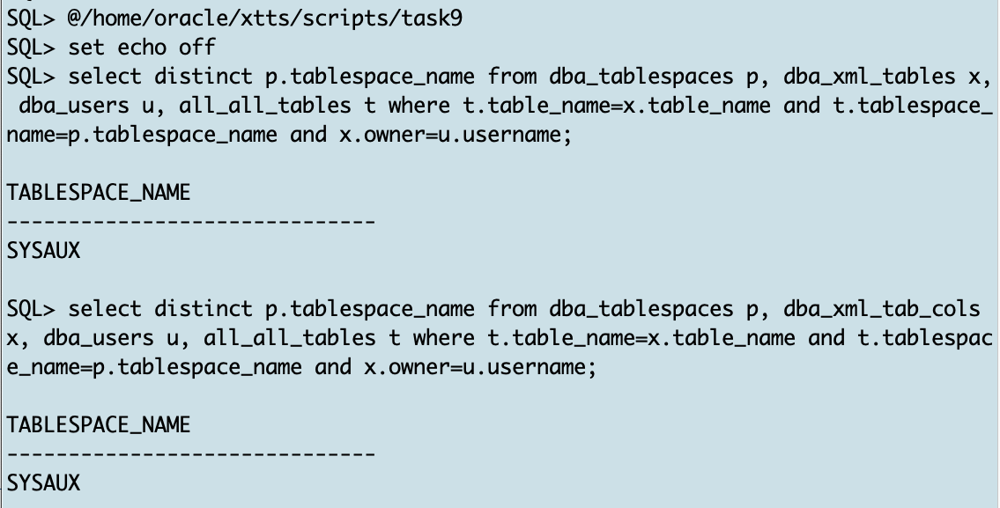

Only XML data in SYSAUX tablespace which you're not going to migrate. So ignore them. Had there been such tables, you must move them using Data Pump export/import.

* [Is it supported to do a Transport Tablespace (TTS) Import with Data Pump on a tablespace with binary XML objects ? (Doc ID 1908140.1) ](https://support.oracle.com/epmos/faces/DocumentDisplay?id=1908140.1&displayIndex=1)


## Task 10: Global Temporary Tables (SOURCE)
Global temporary tables do not belong to any tablespace, so they are not transported to the target database. Let's see if we have some global temporary tables and who might own them:


  ```
    <copy>
     @/home/oracle/scripts/task10
    </copy>
  ```

<details>
 <summary>*click here to see the SQL statement*</summary>


  ``` text
     select table_name FROM dba_tables WHERE temporary= 'Y'
     and owner not in ('WMSYS','XDB','SYSTEM','SYS','LBACSYS','OUTLN','DBSNMP','APPQOSSYS')
     -- owner not in (select username from dba_users where oracle_maintained='Y') 
     ;

  ```
</details>

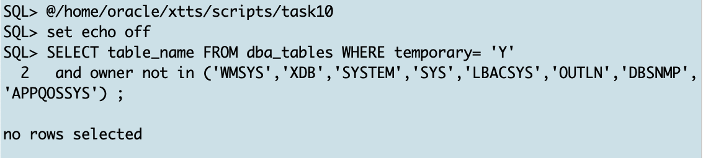

There are no global temporary tables in our lab. When you have them in your database, you can migrate them using Data Pump export/import or generate the metadata from these tables and created them in the target database.

## Task 11: Exit SQL*Plus (SOURCE and TARGET)

### Step 1: Exit SQL*Plus on Source 
  ```
    <copy>
     exit;
    </copy>
  ```


### Step 1: Exit SQL*Plus on Target 
### target
  ```
    <copy>
     exit;
    </copy>
  ```


You may now *proceed to the next lab*.


## Acknowledgements
* **Author** - Klaus Gronau
* **Contributors** -  
* **Last Updated By/Date** - Klaus Gronau, June 2023
