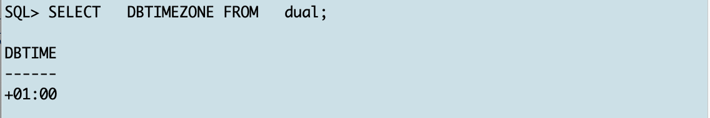

# Prepare XTTS on Source and Target  

## Introduction

In this lab, you will unzip the XTTS V4 files on source/target and create the XTTS properties file required by the tool.

Estimated Time: 15 minutes

### Objectives

- Setup XTTS V4.


### Prerequisites

This lab assumes you have:

- Connected to the Hands On Lab
- A terminal window open on source.
- Another terminal window open on target
- Prepared the source
- Prepared the target

## Task 1: DBTIMEZONE
When having timezone data stored in your database make sure the SOURCE and TARGET database are located in the same timezone. 
Open on source and target SQL*Plus and execute:
  ```
    <copy>
    SELECT   DBTIMEZONE FROM   dual;
    </copy>
  ```


## Task 2: Source and Target character sets 
The source and target database must use compatible database character sets.

  ```
    <copy>
     col parameter format a35
     col VALUE format a35
     set pages 999
     set line 200
     select * from v$nls_parameters;
    </copy>
  ```
* [General Limitations on Transporting Data](https://docs.oracle.com/en/database/oracle/oracle-database/19/spucd/general-limitations-on-transporting-data.html#GUID-28800719-6CB9-4A71-95DD-4B61AA603173)


## Task 3: XTTS tablespace violations on Source  
For transportable tablespaces another mandatory requirement is that all tablespaced you're going to transport are self contained.
In this hands on lab you're going to transport the two tablespaces "TPCCTAB" and "USERS". So let's check if they are self contained:

  ```
    <copy>
     EXEC SYS.DBMS_TTS.TRANSPORT_SET_CHECK ('TPCCTAB,USERS',True,True);
     SELECT * FROM transport_set_violations;
    </copy>
  ```


## Task 4: User data in SYSTEM/SYSAUX tablespace on Source
As SYSTEM and SYSAUX tablespaces are not copied from source to target, it's good practice to check if they might accidentally contain user data:

  ```
    <copy>
     set line 200
     col owner format A20
     col table_name format A50
     select owner, table_name, temporary from dba_tables where 
     owner not in ('WMSYS','XDB','SYSTEM','SYS','LBACSYS','OUTLN','DBSNMP','APPQOSSYS')
     -- (select username from dba_users 
     -- where oracle_maintained='Y') 
     and tablespace_name in ( 'SYSTEM', 'SYSAUX');
    </copy>
  ```


## Task 5: User indexes in SYSTEM/SYSAUX tablespace on Source
Same check as in the previous task but this time for user indexes

  ```
    <copy>
     set line 200
     col owner format A20
     col table_name format A50
     col index_name format A50
     select  owner, table_name,index_name from dba_indexes
     where owner not in ('WMSYS','XDB','SYSTEM','SYS','LBACSYS','OUTLN','DBSNMP','APPQOSSYS')
     -- owner not in (select username from dba_users where oracle_maintained='Y') 
     and tablespace_name in ( 'SYSTEM', 'SYSAUX') order by 1,2;
    </copy>
  ```


## Task 6: Configuring default RMAN settings on Source
The next parameters you're going to set for RMAN work well in the hands on lab. For your environment you might have to adopt them by increasing parallelism, the backup destination etc.

On source start the rman console: 

  ```
    <copy>
     rman target /
    </copy>
  ```

Please be aware:
in RMAN terminology the target database identifies the database which you're going to back up - so in the migration terminology the source database

  ```
    <copy>
     CONFIGURE DEFAULT DEVICE TYPE TO DISK;
     configure  DEVICE TYPE DISK PARALLELISM 8;
     exit;
    </copy>
  ```


## Acknowledgements
* **Author** - Klaus Gronau
* **Contributors** -  
* **Last Updated By/Date** - Klaus Gronau, June 2023
