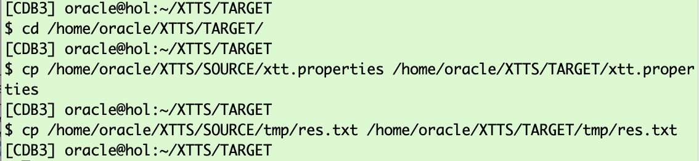

# Prepare Phase  

## Introduction

In this lab, you will prepare the XTTS properties file used by the XTTS Perl V4 scripts and execute the initial backup and restore.
During this exercise the source database remains active and anyone can update it.

Estimated Time: 15 minutes

### Objectives

- Create XTTS V4 properties file.
- Execute initial backup and restore.


### Prerequisites

This lab assumes you have:

- Connected to the Hands On Lab
- A terminal window open on source.
- Another terminal window open on target
- Prepared the source
- Prepared the target

## Task 1: XTTS properties file
On source change into the XTTS Source directory and create the xtt.properties file using vi. Here the steps:

  ```
    <copy>
     cd /home/oracle/XTTS/SOURCE
     vi xtt.properties
    </copy>
  ```

The vi editor is now open in your console. 


Now copy the content of the xtt.properties file from below:

  ```
    <copy>
## xtt.properties
## (Doc ID 2471245.1)
##
## Properties file for xttdriver.pl
##
## Properties to set are the following:
##   tablespaces
##   platformid
##   dest_datafile_location
##   dest_scratch_location
##   cnvinst_home
##   cnvinst_sid
##   asm_home
##   asm_sid
##   parallel
##   rollparallel
##   getfileparallel
##   metatransfer
##   destuser
##   desthost
##   desttmpdir
##   srcconnstr
##   destconnstr
##   allowstandby
##   usermantransport
##
## See documentation below and My Oracle Support Note 2471245.1 for details on V4.
##
##
##
## Next parameters are needed ONLY when using dbms_file_transfer package
## source database directory pointing to the SOURCE datafile location
##
## srcdir=XTTS_SOURCE_DIR1
##
## target database directory pointing to the TARGET datafile location
##
## dstdir=XTTS_TARGET_DIR
## srclink=XTTS_SOURCE_LNK
## Tablespaces to transport
## ========================
##
## tablespaces
## -----------
## Comma separated list of tablespaces to transport from source database to destination databa
## Do NOT use quotes
## Specify tablespace names in CAPITAL letters.
## Be sure there are NO space between the names
## TABLESPACES w/o sys, system, sysaux, temp and undo - list is comma separated without spaces!
tablespaces=TPCCTAB,USERS
## Source database platform ID
## ===========================
##
## platformid
## ----------
## Source database platform id, obtained from V$DATABASE.PLATFORM_ID
platformid=13
## SOURCE system file locations
## ============================
##
## src_scratch_location
## ------------
## Location where datafile copies and incremental backups are created on the source system.
##
## This location may be an NFS-mounted filesystem that is shared with the
## destination system, in which case it should reference the same NFS location
## as the dest_scratch_location property for the destination system.
src_scratch_location=/home/oracle/XTTS/DUMP
## DESTINATION system file locations
## =================================
##
## dest_datafile_location
## -------------
##
## This is the FINAL location of the datafiles to be used by the destination database.
## Be sure there are NO TRAILING space
## Location where the converted datafile copies will be written in the destination.
## If using ASM, this should be set to the disk group name:
## dest_datafile_location=+DATAMCH
dest_datafile_location=/u02/oradata/CDB3/pdb3/
## dest_scratch_location
## -----------
## This is the location where datafile copies and backups are placed on the destination system
## transferred manually from the souce system.  This location must have
## sufficient free space to hold copies of all datafiles and backups being transported.
##
## This location may be a DBFS-mounted filesystem.
##
## This location may be an NFS-mounted filesystem that is shared with the
## source system in which case it should reference the same NFS location
## as the src_scratch_location for the source system.
## dest_scratch_location=/dest_backups/
dest_scratch_location=/home/oracle/XTTS/DUMP
## asm_home, asm_sid
## -----------------
## Grid home and SID for the ASM instance that runs on the destination
## system when the destination datafiles will reside on ASM.
##
#asm_home=/u01/app/11.2.0.4/grid
#asm_sid=+ASM1
#asm_home=/u01/app/12.1.0.2/grid
#asm_sid=+ASM1
## Parallel parameters
## ===================
##
## parallel
## --------
## Parallel defines the channel parallelism used in copying (prepare phase),
## converting.
##
## Note: Incremental backup creation parallelism is defined by RMAN
## configuration for DEVICE TYPE DISK PARALLELISM.
##
## If undefined, default value is 8.
parallel=8
## rollparallel
## ------------
## Defines the level of parallelism for the -r roll forward operation.
##
## If undefined, default value is 0 (serial roll forward).
rollparallel=2
## getfileparallel
## ---------------
## Defines the level of parallelism for the -G operation
##
## If undefined, default value is 1. Max value supported is 8.
## This will be enhanced in the future to support more than 8
## depending on the destination system resources.
#getfileparallel=4
## metatransfer
## ---------------
## If passwordless ssh is enabled between the source and the destination, the
## script can automatically transfer the temporary files and the backups from
## source to destination. Other parameters like desthost, desttmpdir needs to
## be defined for this to work. destuser is optional
## metatransfer=1
#metatransfer=1
## destuser
## ---------
## The username that will be used for copying the files from source to dest
## using scp. This is optional
## dest_user=username
# dest_user=DESTUSERDUMP
## desthost
## --------
## This will be the name of the destination host.
## dest_host=machinename
#dest_host=hol.localdomain
## desttmpdir
## ---------------
## This should be defined to same directory as TMPDIR for getting the
## temporary files. The incremental backups will be copied to directory pointed
## by stageondest parameter.
## desttmpdir=/ogg/oraacs/XTTS
#desttmpdir=DUMPTARGET/XTTS/ogg/oraacs/XTTS
## dumpdir
## ---------
## The directory in which the dump file be restored to. If this is not specified
## then TMPDIR is used.
## dumpdir=/ogg/oraacs/XTTS
## using scp. This is optional
## dumpdir=
## srcconnstr
## ---------
## Only needs to be set in CDB environment. Specifies connect string of the
## source pluggable database
#srcconnstr=sys/knl_test7@cdb1_pdb1
## destconnstr
## ---------
## Only needs to be set in CDB environment. Specifies connect string of the
## destination pluggable database
destconnstr=sys/oracle@cdb3
## allowstandby
## ---------
## This will allow the script to be run from standby database.
## allowstandby=1
## usermantransport
## -----------------
## This should be set if using 12c.
#usermantransport=1
## usermantransport=1
    </copy>
  ```

Switch to the source shell still having the vi editor open.
Press now the letter "i" to switch the vi editor into the insert mode. The last line in vi changes from  "xtt.properties [New file]" to "-- Insert --"


Paste the xtt.properties content into vi:


Press the "Escape" key (the last line in vi changes again):


and type ":wq!"


## Task 2: Initial Backup 
While the source database remains active, you're now going to back it up:


  ```
    <copy>
     cd /home/oracle/XTTS/SOURCE
     export XTTDEBUG=0
     export TMPDIR=${PWD}/tmp
     $ORACLE_HOME/perl/bin/perl xttdriver.pl --backup -L
    </copy>
  ```


The full output looks like:
    
  ```text
    [UPGR] oracle@hol:~/XTTS/SOURCE
    $ $ORACLE_HOME/perl/bin/perl xttdriver.pl --backup -L
    ============================================================
    trace file is /home/oracle/XTTS/SOURCE/tmp/backup_Jun5_Mon_14_46_08_289//Jun5_Mon_14_46_08_289_.log
    =============================================================
    
    --------------------------------------------------------------------
    Parsing properties
    --------------------------------------------------------------------
    
    
    --------------------------------------------------------------------
    Done parsing properties
    --------------------------------------------------------------------
    
    
    --------------------------------------------------------------------
    Checking properties
    --------------------------------------------------------------------
    
    
    --------------------------------------------------------------------
    Done checking properties
    --------------------------------------------------------------------
    
    
    --------------------------------------------------------------------
    Starting prepare phase
    --------------------------------------------------------------------
    
    scalar(or2
    XXX: adding here for 2, 0, TPCCTAB,USERS
    
    --------------------------------------------------------------------
    Find list of datafiles in system
    --------------------------------------------------------------------
    
    sqlplus -L -s  / as sysdba  @/home/oracle/XTTS/SOURCE/tmp/backup_Jun5_Mon_14_46_08_289//diff.sql /u02/oradata/CDB3/pdb3/
    
    --------------------------------------------------------------------
    Done finding list of datafiles in system
    --------------------------------------------------------------------
    
    Prepare source for Tablespaces:
                      'TPCCTAB'  /home/oracle/XTTS/DUMP
    xttpreparesrc.sql for 'TPCCTAB' started at Mon Jun  5 14:46:08 2023
    xttpreparesrc.sql for  ended at Mon Jun  5 14:46:08 2023
    Prepare source for Tablespaces:
                      'USERS'  /home/oracle/XTTS/DUMP
    xttpreparesrc.sql for 'USERS' started at Mon Jun  5 14:46:27 2023
    xttpreparesrc.sql for  ended at Mon Jun  5 14:46:27 2023
    Prepare source for Tablespaces:
                      ''''  /home/oracle/XTTS/DUMP
    xttpreparesrc.sql for '''' started at Mon Jun  5 14:46:32 2023
    xttpreparesrc.sql for  ended at Mon Jun  5 14:46:32 2023
    Prepare source for Tablespaces:
                      ''''  /home/oracle/XTTS/DUMP
    xttpreparesrc.sql for '''' started at Mon Jun  5 14:46:33 2023
    xttpreparesrc.sql for  ended at Mon Jun  5 14:46:33 2023
    Prepare source for Tablespaces:
                      ''''  /home/oracle/XTTS/DUMP
    xttpreparesrc.sql for '''' started at Mon Jun  5 14:46:34 2023
    xttpreparesrc.sql for  ended at Mon Jun  5 14:46:34 2023
    
    --------------------------------------------------------------------
    Done with prepare phase
    --------------------------------------------------------------------
    
    Prepare newscn for Tablespaces: 'TPCCTAB'
    Prepare newscn for Tablespaces: 'USERS'
    Prepare newscn for Tablespaces: ''''''''''''
    New /home/oracle/XTTS/SOURCE/tmp/xttplan.txt with FROM SCN's generated
    scalar(or2
    XXX: adding here for 2, 0, TPCCTAB,USERS
    Added fname here 1:/home/oracle/XTTS/DUMP/USERS_4.tf
    Added fname here 1:/home/oracle/XTTS/DUMP/TPCCTAB_5.tf
    ============================================================
    No new datafiles added
    =============================================================
    [UPGR] oracle@hol:~/XTTS/SOURCE
  ```


## Task 3: Initial Restore  
The initial restore on Target requires the "xtt.properties" and "res.txt" file from source. In this hands on lab exercise the source and target machine are the same, so you can simply use the copy command:


  ```
    <copy>
     cd /home/oracle/XTTS/TARGET/
     cp /home/oracle/XTTS/SOURCE/xtt.properties /home/oracle/XTTS/TARGET/xtt.properties 
     cp /home/oracle/XTTS/SOURCE/tmp/res.txt /home/oracle/XTTS/TARGET/tmp/res.txt
    </copy>
  ```


Starting restore:
  ```
    <copy>
     export XTTDEBUG=0
     export TMPDIR=${PWD}/tmp
     $ORACLE_HOME/perl/bin/perl xttdriver.pl --restore -L
    </copy>
  ```


And the complete output:
  ```
  [CDB3] oracle@hol:~/XTTS/TARGET
$ $ORACLE_HOME/perl/bin/perl xttdriver.pl --restore -L
============================================================
trace file is /home/oracle/XTTS/TARGET/tmp/restore_Jun5_Mon_15_23_48_597//Jun5_Mon_15_23_48_597_.log
=============================================================

--------------------------------------------------------------------
Parsing properties
--------------------------------------------------------------------


--------------------------------------------------------------------
Done parsing properties
--------------------------------------------------------------------


--------------------------------------------------------------------
Checking properties
--------------------------------------------------------------------


--------------------------------------------------------------------
Done checking properties
--------------------------------------------------------------------


--------------------------------------------------------------------
Performing convert for file 4
--------------------------------------------------------------------


--------------------------------------------------------------------
Performing convert for file 5
--------------------------------------------------------------------

[CDB3] oracle@hol:~/XTTS/TARGET
  ```


## Acknowledgements
* **Author** - Klaus Gronau
* **Contributors** -  
* **Last Updated By/Date** - Klaus Gronau, June 2023
