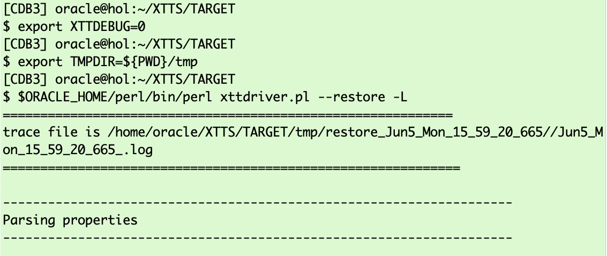

# Roll Forward Phase  

## Introduction

In the roll forward phase the source database remains active. You can take as many incremental backups and restores as you like. 
A good practice is to start the migration some time before the cutover. Then run these initial backup and restore operations a few times during the day and on the cutover day minimize the delta by for example running these initial backup/restore commands every hour.

Estimated Time: 15 minutes

### Objectives

- Execute incremental backup and restore.


### Prerequisites

This lab assumes you have:

- Connected to the Hands On Lab
- A terminal window open on source.
- Another terminal window open on target
- Prepared the source
- Successfully executed initial backup
- Successfully executed initial restore

## Task 1: Incremental Backup on Source
On source change into the XTTS Source directory and execute the incremental backup:

  ```
    <copy>
     $ORACLE_HOME/perl/bin/perl xttdriver.pl --backup -L
    </copy>
  ```


The full output looks like:

  ```
    [UPGR] oracle@hol:~/XTTS/SOURCE
    $ $ORACLE_HOME/perl/bin/perl xttdriver.pl --backup -L
    ============================================================
    trace file is /home/oracle/XTTS/SOURCE/tmp/backup_Jun5_Mon_15_40_20_162//Jun5_Mon_15_40_20_162_.log
    =============================================================
    
    --------------------------------------------------------------------
    Parsing properties
    --------------------------------------------------------------------
    
    
    --------------------------------------------------------------------
    Done parsing properties
    --------------------------------------------------------------------
    
    
    --------------------------------------------------------------------
    Checking properties
    --------------------------------------------------------------------
    
    
    --------------------------------------------------------------------
    Done checking properties
    --------------------------------------------------------------------
    
    
    --------------------------------------------------------------------
    Backup incremental
    --------------------------------------------------------------------
    
    scalar(or2
    XXX: adding here for 2, 0, TPCCTAB,USERS
    Added fname here 1:/home/oracle/XTTS/DUMP/USERS_4.tf
    Added fname here 1:/home/oracle/XTTS/DUMP/TPCCTAB_5.tf
    ============================================================
    No new datafiles added
    =============================================================
    Prepare newscn for Tablespaces: 'TPCCTAB'
    Prepare newscn for Tablespaces: 'USERS'
    Prepare newscn for Tablespaces: ''''
    Prepare newscn for Tablespaces: ''''
    Prepare newscn for Tablespaces: ''''
    
    --------------------------------------------------------------------
    Starting incremental backup
    --------------------------------------------------------------------
    
    
    --------------------------------------------------------------------
    Done backing up incrementals
    --------------------------------------------------------------------
    
    Prepare newscn for Tablespaces: 'TPCCTAB'
    Prepare newscn for Tablespaces: 'USERS'
    Prepare newscn for Tablespaces: ''''''''''''
    New /home/oracle/XTTS/SOURCE/tmp/xttplan.txt with FROM SCN's generated
    [UPGR] oracle@hol:~/XTTS/SOURCE
  ```

## Task 2: Incremental Restore on Target

Open the Target console.
The incremental restore needs the "res.txt" and "incrbackups.txt" files from source. So copy them:

  ```
    <copy>
     cp /home/oracle/XTTS/SOURCE/tmp/res.txt /home/oracle/XTTS/TARGET/tmp/res.txt
     cp /home/oracle/XTTS/SOURCE/tmp/incrbackups.txt /home/oracle/XTTS/TARGET/tmp/incrbackups.txt
    </copy>
  ```

 

And start the restore:
  ```
    <copy>
     export XTTDEBUG=0
     export TMPDIR=${PWD}/tmp
     $ORACLE_HOME/perl/bin/perl xttdriver.pl --restore -L
    </copy>
  ```



The full output looks like:
    
  ```text
$ $ORACLE_HOME/perl/bin/perl xttdriver.pl --restore -L
============================================================
trace file is /home/oracle/XTTS/TARGET/tmp/restore_Jun5_Mon_15_59_20_665//Jun5_Mon_15_59_20_665_.log
=============================================================

--------------------------------------------------------------------
Parsing properties
--------------------------------------------------------------------


--------------------------------------------------------------------
Done parsing properties
--------------------------------------------------------------------


--------------------------------------------------------------------
Checking properties
--------------------------------------------------------------------


--------------------------------------------------------------------
Done checking properties
--------------------------------------------------------------------


--------------------------------------------------------------------
Start rollforward
--------------------------------------------------------------------


--------------------------------------------------------------------
End of rollforward phase
--------------------------------------------------------------------

[CDB3] oracle@hol:~/XTTS/TARGET 
  ```


You can execute these two tasks whenever you want. As they will minimize your downtime window you should run them on the cutover day more frequently to minimize the delta.


## Acknowledgements
* **Author** - Klaus Gronau
* **Contributors** -  
* **Last Updated By/Date** - Klaus Gronau, June 2023
