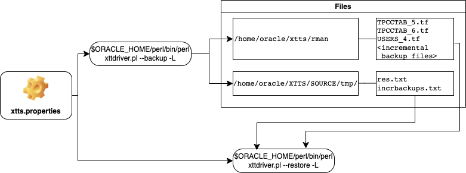

# Roll Forward Phase  

## Introduction

In the roll forward phase the source database remains active. You can take as many incremental backups and restores as you like. 
A good practice is to start the migration some time before the cutover. Run an initial backup and restore and run these incremental backup and restore operations a few times during the day. On the cutover day minimize the delta by for example running these incremental backup/restore commands every hour.

Estimated Time: 15 minutes

### Objectives

- Execute incremental backup and restore.


### Prerequisites

This lab assumes you have:

- Connected to the lab
- A terminal window open on source
- Another terminal window open on target
- Prepared the source
- Successfully executed initial backup
- Successfully executed initial restore

## Task 1: Adding Table and Data File to Source Database (SOURCE)
In this (and the previous) phase the database is up and there is no downtime yet. Users make changes in the source database. Let's simulate that by creating a table and adding a data file.

### Step 1: Start SQL*Plus (SOURCE)
Connect with SQL*Plus as TPCC user to the source database:
  ```
    <copy>
     sqlplus  TPCC/oracle
    </copy>
  ```


### Step 2: Add a New Table (SOURCE)

  ```
    <copy>
     create table object_copy as select * from user_objects;
    </copy>
  ```


### Step 3: Connect a sysdba (SOURCE)
This time connect as sysdba to the source database:
  ```
    <copy>
     connect / as sysdba 
    </copy>
  ```


### Step 4: Add a New Data File (SOURCE)
and execute:
  ```
    <copy>
     alter tablespace TPCCTAB add datafile '/u02/oradata/UPGR/tpcctab02.dbf' size 1M;
     exit;
    </copy>

     Hit ENTER/RETURN to execute ALL commands.
  ```


## Task 2: Incremental Backup (SOURCE)
On source change into the XTTS Source directory and execute the incremental backup:

### Step 1: Setting Environment for Incremental Backup (SOURCE)
  ```
    <copy>
     cd /home/oracle/xtts/source
     export XTTDEBUG=0
     export TMPDIR=${PWD}/tmp
    </copy>

    Hit ENTER/RETURN to execute ALL commands.
  ```


### Step 2: Starting Incremental Backup (SOURCE)

  ```
    <copy>
     $ORACLE_HOME/perl/bin/perl xttdriver.pl --backup -L
    </copy>
  ```


<details>
 <summary>*click here to see the full incremental backup log file*</summary>

  ``` text
    [UPGR] oracle@hol:~/xtts/source
    $ $ORACLE_HOME/perl/bin/perl xttdriver.pl --backup -L
    ============================================================
    trace file is /home/oracle/xtts/source/tmp/backup_Jun5_Mon_15_40_20_162//Jun5_Mon_15_40_20_162_.log
    =============================================================
    
    --------------------------------------------------------------------
    Parsing properties
    --------------------------------------------------------------------
    
    
    --------------------------------------------------------------------
    Done parsing properties
    --------------------------------------------------------------------
    
    
    --------------------------------------------------------------------
    Checking properties
    --------------------------------------------------------------------
    
    
    --------------------------------------------------------------------
    Done checking properties
    --------------------------------------------------------------------
    
    
    --------------------------------------------------------------------
    Backup incremental
    --------------------------------------------------------------------
    
    scalar(or2
    XXX: adding here for 2, 0, TPCCTAB,USERS
    Added fname here 1:/home/oracle/xtts/rman/USERS_4.tf
    Added fname here 1:/home/oracle/xtts/rman/TPCCTAB_5.tf
    Added fname here 2:/home/oracle/xtts/rman/TPCCTAB_6.tf , fname is /u02/oradata/CDB3/pdb3/TPCCTAB_6.dbf
    ============================================================
    1 new datafiles added
    =============================================================
    TPCCTAB,/home/oracle/xtts/rman/TPCCTAB_6.tf
    ============================================================
    Running prepare cmd for new filesx TPCCTAB_6.tf
    =============================================================
    Adding file to transfer:TPCCTAB_6.tf
    Prepare newscn for Tablespaces: 'TPCCTAB'
    Prepare newscn for Tablespaces: 'USERS'
    Prepare newscn for Tablespaces: ''''
    Prepare newscn for Tablespaces: ''''
    Prepare newscn for Tablespaces: ''''
    
    --------------------------------------------------------------------
    Starting incremental backup
    --------------------------------------------------------------------
    
    
    --------------------------------------------------------------------
    Done backing up incrementals
    --------------------------------------------------------------------
    
    Prepare newscn for Tablespaces: 'TPCCTAB'
    Prepare newscn for Tablespaces: 'USERS'
    Prepare newscn for Tablespaces: ''''''''''''
    New /home/oracle/xtts/source/tmp/xttplan.txt with FROM SCN's generated
    [UPGR] oracle@hol:~/xtts/source
  ```
</details>

When you take a closer look at the log file, you see, the XTTS script managed everything for you. It recognized a new data file was added to the tablespace and it took  care of it.

## Task 3: Incremental Restore (TARGET)

The incremental restore needs the "res.txt" and "incrbackups.txt" files from source. Both are the driving files for the XTTS process.
You just performed your first incremental backup so there's no previous version of "incrbackups.txt" file. <br>
But the initial load already created the res.txt and you probably remember that you copied it already from source to target in the previous LAB. So let's compare both before starting the restore....

### Comparing Source and Target res.txt
So before overwriting __res.txt__ on target, let's check out the content of this file on source and target:

Source:
  ```
    <copy>
     cat /home/oracle/xtts/source/tmp/res.txt 
    </copy>
  ```
 

Target:
  ```
    <copy>
     cat /home/oracle/xtts/target/tmp/res.txt
    </copy>
  ```
 

Take a closer look at both output files posted next to each other below. Both contain the details from your initial backup. <br>
The difference between source and target res.txt is the incremental backup entry you just executed on source plus the initial load of the newly added datafile:


### Step 1: Copy "res.txt" (TARGET)
So let's continue with the process and copy both files from the source to the target directory:

  ```
    <copy>
     cp /home/oracle/xtts/source/tmp/res.txt /home/oracle/xtts/target/tmp/res.txt
    </copy>
  ```
### Step 2: Copy "incrbackups.txt" (TARGET)
  ```
    <copy>
     cp /home/oracle/xtts/source/tmp/incrbackups.txt /home/oracle/xtts/target/tmp/incrbackups.txt
    </copy>
  ```

 

### Step 3: Start Incremental Restore (TARGET)
And start the restore:
  ```
    <copy>
     cd /home/oracle/xtts/target
     export XTTDEBUG=0
     export TMPDIR=${PWD}/tmp
    </copy>

     Hit ENTER/RETURN to execute ALL commands.
  ```


  ```
    <copy>
     $ORACLE_HOME/perl/bin/perl xttdriver.pl --restore -L
    </copy>
  ```


<details>
 <summary>*click here to see the full incremental restore log file*</summary>

  ``` text
$ $ORACLE_HOME/perl/bin/perl xttdriver.pl --restore -L
============================================================
trace file is /home/oracle/xtts/target/tmp/restore_Jun5_Mon_15_59_20_665//Jun5_Mon_15_59_20_665_.log
=============================================================

--------------------------------------------------------------------
Parsing properties
--------------------------------------------------------------------


--------------------------------------------------------------------
Done parsing properties
--------------------------------------------------------------------


--------------------------------------------------------------------
Checking properties
--------------------------------------------------------------------


--------------------------------------------------------------------
Done checking properties
--------------------------------------------------------------------


--------------------------------------------------------------------
Performing convert for file 6
--------------------------------------------------------------------


--------------------------------------------------------------------
Start rollforward
--------------------------------------------------------------------


--------------------------------------------------------------------
End of rollforward phase
--------------------------------------------------------------------

[CDB3] oracle@hol:~/xtts/target 
  ```
</details>


You can execute the incremental backup and restore whenever you want. As they will minimize your downtime window you can run them on the cutover day more frequently to minimize the delta.

## Summary of this Lab
In this lab you executed an incremental backup and restore. You can repeat this process as often as you want and probably more frequently on the cutover day. </br>
The only requirement for each incremental restore is the current res.txt and incrbackup.txt from the backup.



### Backup (SOURCE)
You used on source the xtt.properties file created in the previous lab:

  ```
    <copy>
    ls -al /home/oracle/xtts/source/xtt.properties
    </copy>
  ```


Listing the directory content created in the RMAN backup location containing the backup of the datafiles and the incremental backup(s):

  ```
    <copy>
    ls -al /home/oracle/xtts/rman
    </copy>
  ```


and the other two mandatory driving files for the restore - the res.txt and incrbackup.txt file - plus all log files of the backup are located in:
  ```
    <copy>
    ls -al /home/oracle/xtts/source/tmp/
    </copy>
  ```


#### Restore (TARGET)
You copied the xtt.properties and the res.txt file from source to target. RMAN read the same files the backup process created - so these files match between source and target. An interesting directory created by the restore process is the target XTTS/tmp directory containing the log files:
  ```
    <copy>
    ls -al /home/oracle/xtts/target/tmp
    </copy>
  ```


You may now *proceed to the next lab*.


## Acknowledgements
* **Author** - Klaus Gronau
* **Contributors** -  
* **Last Updated By/Date** - Klaus Gronau, June 2023
