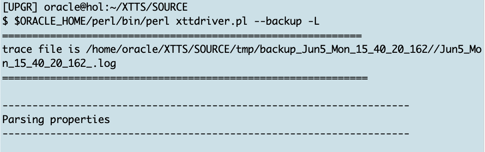

# Roll Forward Phase  

## Introduction

In the roll forward phase you take as many incremental backups and restores as you like. 
A good practice is to start the migration some time before the cutover. Then run these initial backup and restore operations a few times during the day and on the cutover day minimize the delta by for example running these initial backup/restore commands every hour.

Estimated Time: 15 minutes

### Objectives

- Execute incremental backup and restore.


### Prerequisites

This lab assumes you have:

- Connected to the Hands On Lab
- A terminal window open on source.
- Another terminal window open on target
- Prepared the source
- Successfully executed initial backup
- Successfully executed initial restore

## Task 1: Incremental Backup on Source
On source change into the XTTS Source directory and execute the incremental backup:

  ```
    <copy>
     $ORACLE_HOME/perl/bin/perl xttdriver.pl --backup -L
    </copy>
  ```



The full output looks like:

  ```
    [UPGR] oracle@hol:~/XTTS/SOURCE
    $ $ORACLE_HOME/perl/bin/perl xttdriver.pl --backup -L
    ============================================================
    trace file is /home/oracle/XTTS/SOURCE/tmp/backup_Jun5_Mon_15_40_20_162//Jun5_Mon_15_40_20_162_.log
    =============================================================
    
    --------------------------------------------------------------------
    Parsing properties
    --------------------------------------------------------------------
    
    
    --------------------------------------------------------------------
    Done parsing properties
    --------------------------------------------------------------------
    
    
    --------------------------------------------------------------------
    Checking properties
    --------------------------------------------------------------------
    
    
    --------------------------------------------------------------------
    Done checking properties
    --------------------------------------------------------------------
    
    
    --------------------------------------------------------------------
    Backup incremental
    --------------------------------------------------------------------
    
    scalar(or2
    XXX: adding here for 2, 0, TPCCTAB,USERS
    Added fname here 1:/home/oracle/XTTS/DUMP/USERS_4.tf
    Added fname here 1:/home/oracle/XTTS/DUMP/TPCCTAB_5.tf
    ============================================================
    No new datafiles added
    =============================================================
    Prepare newscn for Tablespaces: 'TPCCTAB'
    Prepare newscn for Tablespaces: 'USERS'
    Prepare newscn for Tablespaces: ''''
    Prepare newscn for Tablespaces: ''''
    Prepare newscn for Tablespaces: ''''
    
    --------------------------------------------------------------------
    Starting incremental backup
    --------------------------------------------------------------------
    
    
    --------------------------------------------------------------------
    Done backing up incrementals
    --------------------------------------------------------------------
    
    Prepare newscn for Tablespaces: 'TPCCTAB'
    Prepare newscn for Tablespaces: 'USERS'
    Prepare newscn for Tablespaces: ''''''''''''
    New /home/oracle/XTTS/SOURCE/tmp/xttplan.txt with FROM SCN's generated
    [UPGR] oracle@hol:~/XTTS/SOURCE
    
  ```

## Task 2: Incremental Restore on Target

Switch to the source shell still having the vi editor open.
Press now the letter "i" to switch the vi editor into the insert mode. The last line in vi changes from  "xtt.properties [New file]" to "-- Insert --"


Paste the xtt.properties content into vi:


Press the "Escape" key (the last line in vi changes again):


and type ":wq!"


## Task 2: Initial Backup 
While the source database remains active, you're now going to back it up:


  ```
    <copy>
     cd /home/oracle/XTTS/SOURCE
     export XTTDEBUG=0
     export TMPDIR=${PWD}/tmp
     $ORACLE_HOME/perl/bin/perl xttdriver.pl --backup -L
    </copy>
  ```


The full output looks like:
    
  ```text
    [UPGR] oracle@hol:~/XTTS/SOURCE
    $ $ORACLE_HOME/perl/bin/perl xttdriver.pl --backup -L
    ============================================================
    trace file is /home/oracle/XTTS/SOURCE/tmp/backup_Jun5_Mon_14_46_08_289//Jun5_Mon_14_46_08_289_.log
    =============================================================
    
    --------------------------------------------------------------------
    Parsing properties
    --------------------------------------------------------------------
    
    
    --------------------------------------------------------------------
    Done parsing properties
    --------------------------------------------------------------------
    
    
    --------------------------------------------------------------------
    Checking properties
    --------------------------------------------------------------------
    
    
    --------------------------------------------------------------------
    Done checking properties
    --------------------------------------------------------------------
    
    
    --------------------------------------------------------------------
    Starting prepare phase
    --------------------------------------------------------------------
    
    scalar(or2
    XXX: adding here for 2, 0, TPCCTAB,USERS
    
    --------------------------------------------------------------------
    Find list of datafiles in system
    --------------------------------------------------------------------
    
    sqlplus -L -s  / as sysdba  @/home/oracle/XTTS/SOURCE/tmp/backup_Jun5_Mon_14_46_08_289//diff.sql /u02/oradata/CDB3/pdb3/
    
    --------------------------------------------------------------------
    Done finding list of datafiles in system
    --------------------------------------------------------------------
    
    Prepare source for Tablespaces:
                      'TPCCTAB'  /home/oracle/XTTS/DUMP
    xttpreparesrc.sql for 'TPCCTAB' started at Mon Jun  5 14:46:08 2023
    xttpreparesrc.sql for  ended at Mon Jun  5 14:46:08 2023
    Prepare source for Tablespaces:
                      'USERS'  /home/oracle/XTTS/DUMP
    xttpreparesrc.sql for 'USERS' started at Mon Jun  5 14:46:27 2023
    xttpreparesrc.sql for  ended at Mon Jun  5 14:46:27 2023
    Prepare source for Tablespaces:
                      ''''  /home/oracle/XTTS/DUMP
    xttpreparesrc.sql for '''' started at Mon Jun  5 14:46:32 2023
    xttpreparesrc.sql for  ended at Mon Jun  5 14:46:32 2023
    Prepare source for Tablespaces:
                      ''''  /home/oracle/XTTS/DUMP
    xttpreparesrc.sql for '''' started at Mon Jun  5 14:46:33 2023
    xttpreparesrc.sql for  ended at Mon Jun  5 14:46:33 2023
    Prepare source for Tablespaces:
                      ''''  /home/oracle/XTTS/DUMP
    xttpreparesrc.sql for '''' started at Mon Jun  5 14:46:34 2023
    xttpreparesrc.sql for  ended at Mon Jun  5 14:46:34 2023
    
    --------------------------------------------------------------------
    Done with prepare phase
    --------------------------------------------------------------------
    
    Prepare newscn for Tablespaces: 'TPCCTAB'
    Prepare newscn for Tablespaces: 'USERS'
    Prepare newscn for Tablespaces: ''''''''''''
    New /home/oracle/XTTS/SOURCE/tmp/xttplan.txt with FROM SCN's generated
    scalar(or2
    XXX: adding here for 2, 0, TPCCTAB,USERS
    Added fname here 1:/home/oracle/XTTS/DUMP/USERS_4.tf
    Added fname here 1:/home/oracle/XTTS/DUMP/TPCCTAB_5.tf
    ============================================================
    No new datafiles added
    =============================================================
    [UPGR] oracle@hol:~/XTTS/SOURCE
  ```


## Task 3: Initial Restore  
The initial restore on Target requires the "xtt.properties" and "res.txt" file from source. In this hands on lab exercise the source and target machine are the same, so you can simply use the copy command:


  ```
    <copy>
     cd /home/oracle/XTTS/TARGET/
     cp /home/oracle/XTTS/SOURCE/xtt.properties /home/oracle/XTTS/TARGET/xtt.properties 
     cp /home/oracle/XTTS/SOURCE/tmp/res.txt /home/oracle/XTTS/TARGET/tmp/res.txt
    </copy>
  ```


Starting restore:
  ```
    <copy>
     export XTTDEBUG=0
     export TMPDIR=${PWD}/tmp
     $ORACLE_HOME/perl/bin/perl xttdriver.pl --restore -L
    </copy>
  ```


And the complete output:
  ```
  [CDB3] oracle@hol:~/XTTS/TARGET
$ $ORACLE_HOME/perl/bin/perl xttdriver.pl --restore -L
============================================================
trace file is /home/oracle/XTTS/TARGET/tmp/restore_Jun5_Mon_15_23_48_597//Jun5_Mon_15_23_48_597_.log
=============================================================

--------------------------------------------------------------------
Parsing properties
--------------------------------------------------------------------


--------------------------------------------------------------------
Done parsing properties
--------------------------------------------------------------------


--------------------------------------------------------------------
Checking properties
--------------------------------------------------------------------


--------------------------------------------------------------------
Done checking properties
--------------------------------------------------------------------


--------------------------------------------------------------------
Performing convert for file 4
--------------------------------------------------------------------


--------------------------------------------------------------------
Performing convert for file 5
--------------------------------------------------------------------

[CDB3] oracle@hol:~/XTTS/TARGET
  ```


## Acknowledgements
* **Author** - Klaus Gronau
* **Contributors** -  
* **Last Updated By/Date** - Klaus Gronau, June 2023
