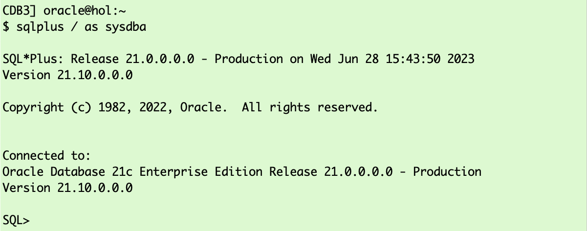
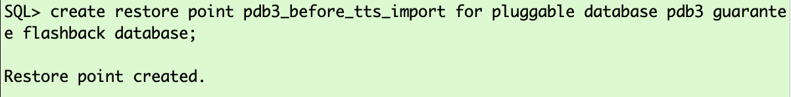
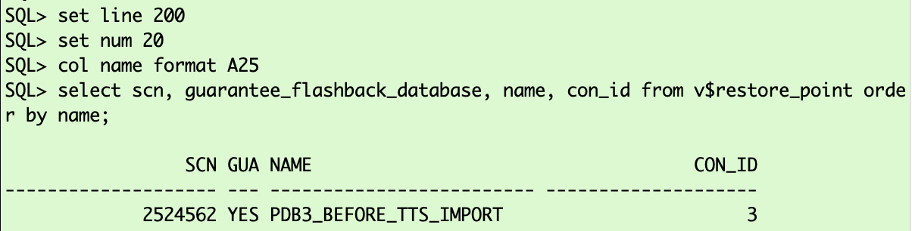
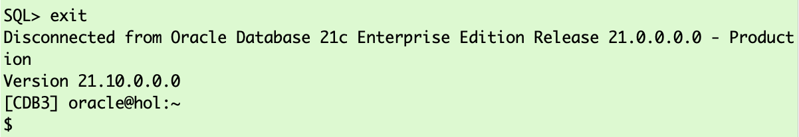

# Transport Phase  

## Introduction

This last phase, the transport phase, requires downtime. Before you start the final incremental backup, you must set the tablespaces you copy to read only. </br>
__ATTENTION__: Make sure no active sessions/open transcations use objects in the tablespaces.

Estimated Time: 15 minutes

### Objectives

- Execute final incremental backup and restore.
- TTS export using Data Pump
- TTS import using Data Pump


### Prerequisites

This lab assumes you have:

- Connected to the lab
- A terminal window open on the source
- Another terminal window open on the target
- Prepared the source
- Successfully executed initial backup (prepare phase)
- Successfully executed initial restore (prepare phase)
- Successfully executed incremental backup(s) (roll forward phase)
- Successfully executed incremental restore(s) (roll forward phase)


## Task 1: Setting Tablespaces to "read only" (SOURCE)

1. Open SQL\*Plus (SOURCE) </br>
Connect with "/ as sysdba" using SQL*Plus to the source database:

    ```
    <copy>
    sqlplus  / as sysdba 
    </copy>
    ```

    

2. Set Tablespaces Read Only (SOURCE) </br>
and execute:

    ```
    <copy>
    ALTER TABLESPACE TPCCTAB read only;
    ALTER TABLESPACE USERS read only;
    select tablespace_name, STATUS from dba_tablespaces 
    where status='READ ONLY' order by 2,1;
    exit;
    </copy>

    Hit ENTER/RETURN to execute ALL commands.
    ```


    

## Task 2: Final Incremental Backup (SOURCE)
On source change into the XTTS Source directory and execute the final incremental backup:

1. Setting Environment for Final Backup (SOURCE)

    ```
    <copy>
    cd /home/oracle/xtts/source
    export XTTDEBUG=0
    export TMPDIR=${PWD}/tmp
    </copy>

    Hit ENTER/RETURN to execute ALL commands.
    ```

    

2. Starting Final Backup (SOURCE)

    ```
    <copy>
    $ORACLE_HOME/perl/bin/perl xttdriver.pl --backup -L
    </copy>
    ```

    

    <details>
    <summary>*click here to see the full final backup log file*</summary>

      ``` text
    [UPGR] oracle@hol:~/xtts/source
    $ $ORACLE_HOME/perl/bin/perl xttdriver.pl --backup -L
    ============================================================
    trace file is /home/oracle/xtts/source/tmp/backup_Jun28_Wed_15_40_27_444//Jun28_Wed_15_40_27_444_.log
    =============================================================

    --------------------------------------------------------------------
    Parsing properties
    --------------------------------------------------------------------


    --------------------------------------------------------------------
    Done parsing properties
    --------------------------------------------------------------------


    --------------------------------------------------------------------
    Checking properties
    --------------------------------------------------------------------


    --------------------------------------------------------------------
    Done checking properties
    --------------------------------------------------------------------


    --------------------------------------------------------------------
    Backup incremental
    --------------------------------------------------------------------

    scalar(or2
    XXX: adding here for 2, 0, TPCCTAB,USERS
    Added fname here 1:/home/oracle/xtts/rman/USERS_4.tf
    Added fname here 1:/home/oracle/xtts/rman/TPCCTAB_5.tf
    Added fname here 1:/home/oracle/xtts/rman/TPCCTAB_6.tf
    ============================================================
    No new datafiles added
    =============================================================
    Prepare newscn for Tablespaces: 'TPCCTAB'
    Prepare newscn for Tablespaces: 'USERS'
    Prepare newscn for Tablespaces: ''''
    Prepare newscn for Tablespaces: ''''
    Prepare newscn for Tablespaces: ''''

    --------------------------------------------------------------------
    Starting incremental backup
    --------------------------------------------------------------------


    --------------------------------------------------------------------
    Done backing up incrementals
    --------------------------------------------------------------------

    Prepare newscn for Tablespaces: 'TPCCTAB'
    DECLARE*
    ERROR at line 1:
    ORA-20001: TABLESPACE(S) IS READONLY OR,
    OFFLINE JUST CONVERT, COPY
    ORA-06512: at line 284

    ####################################################################
    Warning:
    ------
    Warnings found in executing /home/oracle/xtts/source/tmp/backup_Jun28_Wed_15_40_27_444//xttpreparenextiter.sql
    ####################################################################
    Prepare newscn for Tablespaces: 'USERS'
    DECLARE*
    ERROR at line 1:
    ORA-20001: TABLESPACE(S) IS READONLY OR,
    OFFLINE JUST CONVERT, COPY
    ORA-06512: at line 284

    ####################################################################
    Warning:
    ------
    Warnings found in executing /home/oracle/xtts/source/tmp/backup_Jun28_Wed_15_40_27_444//xttpreparenextiter.sql
    ####################################################################
    Prepare newscn for Tablespaces: ''''''''''''
    New /home/oracle/xtts/source/tmp/xttplan.txt with FROM SCN's generated
    [UPGR] oracle@hol:~/xtts/source
    $
      ```
    </details>

    The process finishes with a few warnings similar to:<br>
    __DECLARE*__<br>
    __ERROR at line 1:<br>
    ORA-20001: TABLESPACE(S) IS READONLY OR,<br>
    OFFLINE JUST CONVERT, COPY<br>
    ORA-06512: at line 284__<br>

    You can safely ignore those warnings as they only tell you that you will back up a "read only" tablespace.


## Task 3: Final Incremental Restore (TARGET)

Open the target console.
The final incremental restore also needs the "res.txt" and "incrbackups.txt" files from the source. 

1. Copy "res.txt" (TARGET)

    ```
    <copy>
    cp /home/oracle/xtts/source/tmp/res.txt /home/oracle/xtts/target/tmp/res.txt
    </copy>
    ```

    

2. Copy "incrbackups.txt" (TARGET)

    ```
    <copy>
    cp /home/oracle/xtts/source/tmp/incrbackups.txt /home/oracle/xtts/target/tmp/incrbackups.txt
    </copy>
    ```

    

3. Setting Environment for Final Restore (TARGET)

    ```
    <copy>
    cd /home/oracle/xtts/target
    export XTTDEBUG=0
    export TMPDIR=${PWD}/tmp
    </copy>

    Hit ENTER/RETURN to execute ALL commands.
    ```

    

4. Starting Final Restore (TARGET) </br>
And start the restore, which recovers the target data files until exactly the same SCN as the source database data files:

    ```
    <copy>
    $ORACLE_HOME/perl/bin/perl xttdriver.pl --restore -L
    </copy>
    ```

    


    <details>
    <summary>*click here to see the full final restore log file*</summary>

      ``` text
    [CDB3] oracle@hol:~/xtts/target
    $ $ORACLE_HOME/perl/bin/perl xttdriver.pl --restore -L
    ============================================================
    trace file is /home/oracle/xtts/target/tmp/restore_Jun28_Wed_15_42_12_423//Jun28_Wed_15_42_12_423_.log
    =============================================================

    --------------------------------------------------------------------
    Parsing properties
    --------------------------------------------------------------------


    --------------------------------------------------------------------
    Done parsing properties
    --------------------------------------------------------------------


    --------------------------------------------------------------------
    Checking properties
    --------------------------------------------------------------------


    --------------------------------------------------------------------
    Done checking properties
    --------------------------------------------------------------------


    --------------------------------------------------------------------
    Start rollforward
    --------------------------------------------------------------------


    --------------------------------------------------------------------
    End of rollforward phase
    --------------------------------------------------------------------

    [CDB3] oracle@hol:~/xtts/target
    $
      ```
    </details>

## Task 4: TTS Export (SOURCE)
Between this source and target database version (11.2.0.4 and 21), you can't use __Data Pump network\_link__ (will fail with ORA-39169). Instead, you must use dump files for the metadata.
The Data Pump export parameter file "exp_metadata.par" was already created for you and is located in "/home/oracle/xtts/"

1. Prepared Export Data Pump Parameter File (SOURCE)

    ```
    <copy>
    cat /home/oracle/xtts/exp_metadata.par
    </copy>
    ```

    

    <details>
    <summary>*click here if you want to see the Data Pump export parameter file and a short description*</summary>


    | Parameter | Comment |
    | :-------- | :-----|
    | directory=xtts\_metadata\_dir | Specifies the default location to which Export can write the dump file set and the log file |
    | dumpfile=exp\_metadata.dmp | Is the name of the dump file |
    | logfile=xtts\_export\_metadata.log | This parameter specifies the name for the log file of the export job. |
    | full=y | FULL specifies that you want to perform a full database mode export  |
    | transportable=always | In a full mode export (full=y), using the transportable option results in a full transportable export which exports all objects and data necessary to create a complete copy of the database.  |
    | version=12 | Specifies the version of database objects that you want to export. Only database objects and attributes that are compatible with the specified release are exported.  |
    {: title="Data Pump Metadata Export Parameter File"}

    </details>

2. Execute Export Data Pump (SOURCE) </br>
Execute expdp using this copied par file:

    ```
    <copy>
    expdp system/oracle@UPGR parfile=/home/oracle/xtts/exp_metadata.par
    </copy>
    ```

    


    <details>
    <summary>*click here to see the full metadata EXPDP log file*</summary>

      ``` text
    [UPGR] oracle@hol:~/xtts/source
    $ expdp system/oracle@UPGR parfile=/home/oracle/xtts/exp_metadata.par

    Export: Release 11.2.0.4.0 - Production on Wed Jun 28 15:43:50 2023

    Copyright (c) 1982, 2011, Oracle and/or its affiliates.  All rights reserved.

    Connected to: Oracle Database 11g Enterprise Edition Release 11.2.0.4.0 - 64bit Production
    With the Partitioning, OLAP, Data Mining and Real Application Testing options
    Starting "SYSTEM"."SYS_EXPORT_FULL_01":  system/********@UPGR parfile=/home/oracle/xtts/exp_metadata.par
    Estimate in progress using BLOCKS method...
    Processing object type DATABASE_EXPORT/PLUGTS_FULL/FULL/PLUGTS_TABLESPACE
    Processing object type DATABASE_EXPORT/PLUGTS_FULL/PLUGTS_BLK
    Processing object type DATABASE_EXPORT/EARLY_OPTIONS/VIEWS_AS_TABLES/TABLE_DATA
    Processing object type DATABASE_EXPORT/NORMAL_OPTIONS/TABLE_DATA
    Processing object type DATABASE_EXPORT/NORMAL_OPTIONS/VIEWS_AS_TABLES/TABLE_DATA
    Processing object type DATABASE_EXPORT/SCHEMA/TABLE/TABLE_DATA
    Total estimation using BLOCKS method: 1.375 MB
    Processing object type DATABASE_EXPORT/PRE_SYSTEM_IMPCALLOUT/MARKER
    Processing object type DATABASE_EXPORT/PRE_INSTANCE_IMPCALLOUT/MARKER
    Processing object type DATABASE_EXPORT/TABLESPACE
    Processing object type DATABASE_EXPORT/PROFILE
    Processing object type DATABASE_EXPORT/SYS_USER/USER
    Processing object type DATABASE_EXPORT/SCHEMA/USER
    Processing object type DATABASE_EXPORT/ROLE
    Processing object type DATABASE_EXPORT/GRANT/SYSTEM_GRANT/PROC_SYSTEM_GRANT
    Processing object type DATABASE_EXPORT/SCHEMA/GRANT/SYSTEM_GRANT
    Processing object type DATABASE_EXPORT/SCHEMA/ROLE_GRANT
    Processing object type DATABASE_EXPORT/SCHEMA/DEFAULT_ROLE
    Processing object type DATABASE_EXPORT/SCHEMA/TABLESPACE_QUOTA
    Processing object type DATABASE_EXPORT/RESOURCE_COST
    Processing object type DATABASE_EXPORT/TRUSTED_DB_LINK
    Processing object type DATABASE_EXPORT/SCHEMA/SEQUENCE/SEQUENCE
    Processing object type DATABASE_EXPORT/DIRECTORY/DIRECTORY
    Processing object type DATABASE_EXPORT/DIRECTORY/GRANT/OWNER_GRANT/OBJECT_GRANT
    Processing object type DATABASE_EXPORT/CONTEXT
    Processing object type DATABASE_EXPORT/SCHEMA/PUBLIC_SYNONYM/SYNONYM
    Processing object type DATABASE_EXPORT/SCHEMA/SYNONYM
    Processing object type DATABASE_EXPORT/SCHEMA/TYPE/TYPE_SPEC
    Processing object type DATABASE_EXPORT/SYSTEM_PROCOBJACT/PRE_SYSTEM_ACTIONS/PROCACT_SYSTEM
    Processing object type DATABASE_EXPORT/SYSTEM_PROCOBJACT/PROCOBJ
    Processing object type DATABASE_EXPORT/SYSTEM_PROCOBJACT/POST_SYSTEM_ACTIONS/PROCACT_SYSTEM
    Processing object type DATABASE_EXPORT/SCHEMA/PROCACT_SCHEMA
    Processing object type DATABASE_EXPORT/EARLY_OPTIONS/VIEWS_AS_TABLES/TABLE
    Processing object type DATABASE_EXPORT/EARLY_POST_INSTANCE_IMPCALLOUT/MARKER
    Processing object type DATABASE_EXPORT/NORMAL_OPTIONS/OPTION_TYPE/TYPE_SPEC
    Processing object type DATABASE_EXPORT/NORMAL_OPTIONS/OPTION_TYPE/TYPE_BODY
    Processing object type DATABASE_EXPORT/NORMAL_OPTIONS/TABLE
    Processing object type DATABASE_EXPORT/NORMAL_OPTIONS/VIEWS_AS_TABLES/TABLE
    Processing object type DATABASE_EXPORT/NORMAL_POST_INSTANCE_IMPCALLOU/MARKER
    Processing object type DATABASE_EXPORT/SCHEMA/TABLE/TABLE
    Processing object type DATABASE_EXPORT/SCHEMA/TABLE/PRE_TABLE_ACTION
    Processing object type DATABASE_EXPORT/SCHEMA/TABLE/GRANT/OWNER_GRANT/OBJECT_GRANT
    Processing object type DATABASE_EXPORT/SCHEMA/TABLE/COMMENT
    Processing object type DATABASE_EXPORT/SCHEMA/PACKAGE/PACKAGE_SPEC
    Processing object type DATABASE_EXPORT/SCHEMA/FUNCTION/FUNCTION
    Processing object type DATABASE_EXPORT/SCHEMA/PROCEDURE/PROCEDURE
    Processing object type DATABASE_EXPORT/SCHEMA/PACKAGE/COMPILE_PACKAGE/PACKAGE_SPEC/ALTER_PACKAGE_SPEC
    Processing object type DATABASE_EXPORT/SCHEMA/FUNCTION/ALTER_FUNCTION
    Processing object type DATABASE_EXPORT/SCHEMA/PROCEDURE/ALTER_PROCEDURE
    Processing object type DATABASE_EXPORT/SCHEMA/TABLE/INDEX/INDEX
    Processing object type DATABASE_EXPORT/SCHEMA/TABLE/CONSTRAINT/CONSTRAINT
    Processing object type DATABASE_EXPORT/SCHEMA/TABLE/INDEX/STATISTICS/INDEX_STATISTICS
    Processing object type DATABASE_EXPORT/SCHEMA/VIEW/VIEW
    Processing object type DATABASE_EXPORT/SCHEMA/VIEW/GRANT/OWNER_GRANT/OBJECT_GRANT
    Processing object type DATABASE_EXPORT/SCHEMA/VIEW/COMMENT
    Processing object type DATABASE_EXPORT/SCHEMA/PACKAGE_BODIES/PACKAGE/PACKAGE_BODY
    Processing object type DATABASE_EXPORT/SCHEMA/TABLE/CONSTRAINT/REF_CONSTRAINT
    Processing object type DATABASE_EXPORT/SCHEMA/TABLE/STATISTICS/TABLE_STATISTICS
    Processing object type DATABASE_EXPORT/SCHEMA/TABLE/POST_TABLE_ACTION
    Processing object type DATABASE_EXPORT/SCHEMA/TABLE/TRIGGER
    Processing object type DATABASE_EXPORT/END_PLUGTS_BLK
    Processing object type DATABASE_EXPORT/FINAL_POST_INSTANCE_IMPCALLOUT/MARKER
    Processing object type DATABASE_EXPORT/SCHEMA/POST_SCHEMA/PROCACT_SCHEMA
    Processing object type DATABASE_EXPORT/AUDIT
    Processing object type DATABASE_EXPORT/POST_SYSTEM_IMPCALLOUT/MARKER
    . . exported "SYS"."KU$_USER_MAPPING_VIEW"               5.593 KB      13 rows
    . . exported "LBACSYS"."LBAC$INSTALLATIONS"              6.820 KB       2 rows
    . . exported "LBACSYS"."LBAC$PROPS"                      6.039 KB       3 rows
    . . exported "LBACSYS"."SA$DIP_EVENTS"                   5.468 KB       2 rows
    . . exported "SYS"."DAM_CONFIG_PARAM$"                   6.367 KB      10 rows
    . . exported "WMSYS"."WM$ENV_VARS"                       5.921 KB       3 rows
    . . exported "WMSYS"."WM$EVENTS_INFO"                     5.75 KB      12 rows
    . . exported "WMSYS"."WM$HINT_TABLE"                      9.25 KB      72 rows
    . . exported "WMSYS"."WM$NEXTVER_TABLE"                  6.265 KB       1 rows
    . . exported "WMSYS"."WM$VERSION_HIERARCHY_TABLE"        5.875 KB       1 rows
    . . exported "WMSYS"."WM$WORKSPACES_TABLE"               14.51 KB       1 rows
    . . exported "WMSYS"."WM$WORKSPACE_PRIV_TABLE"           6.851 KB       8 rows
    . . exported "LBACSYS"."LBAC$AUDIT"                          0 KB       0 rows
    . . exported "LBACSYS"."LBAC$LAB"                            0 KB       0 rows
    . . exported "LBACSYS"."LBAC$POL"                            0 KB       0 rows
    . . exported "LBACSYS"."LBAC$POLICY_ADMIN"                   0 KB       0 rows
    . . exported "LBACSYS"."LBAC$POLS"                           0 KB       0 rows
    . . exported "LBACSYS"."LBAC$POLT"                           0 KB       0 rows
    . . exported "LBACSYS"."LBAC$PROG"                           0 KB       0 rows
    . . exported "LBACSYS"."LBAC$USER"                           0 KB       0 rows
    . . exported "LBACSYS"."SA$COMPARTMENTS"                     0 KB       0 rows
    . . exported "LBACSYS"."SA$DIP_DEBUG"                        0 KB       0 rows
    . . exported "LBACSYS"."SA$GROUPS"                           0 KB       0 rows
    . . exported "LBACSYS"."SA$LEVELS"                           0 KB       0 rows
    . . exported "LBACSYS"."SA$PROFILES"                         0 KB       0 rows
    . . exported "LBACSYS"."SA$USER_COMPARTMENTS"                0 KB       0 rows
    . . exported "LBACSYS"."SA$USER_GROUPS"                      0 KB       0 rows
    . . exported "LBACSYS"."SA$USER_LEVELS"                      0 KB       0 rows
    . . exported "SYS"."DAM_CLEANUP_EVENTS$"                     0 KB       0 rows
    . . exported "SYS"."DAM_CLEANUP_JOBS$"                       0 KB       0 rows
    . . exported "SYS"."NET$_ACL"                                0 KB       0 rows
    . . exported "SYS"."WALLET$_ACL"                             0 KB       0 rows
    . . exported "SYSTEM"."AUD$"                                 0 KB       0 rows
    . . exported "WMSYS"."WM$BATCH_COMPRESSIBLE_TABLES"          0 KB       0 rows
    . . exported "WMSYS"."WM$CONSTRAINTS_TABLE"                  0 KB       0 rows
    . . exported "WMSYS"."WM$CONS_COLUMNS"                       0 KB       0 rows
    . . exported "WMSYS"."WM$INSTEADOF_TRIGS_TABLE"              0 KB       0 rows
    . . exported "WMSYS"."WM$LOCKROWS_INFO"                      0 KB       0 rows
    . . exported "WMSYS"."WM$MODIFIED_TABLES"                    0 KB       0 rows
    . . exported "WMSYS"."WM$MP_GRAPH_WORKSPACES_TABLE"          0 KB       0 rows
    . . exported "WMSYS"."WM$MP_PARENT_WORKSPACES_TABLE"         0 KB       0 rows
    . . exported "WMSYS"."WM$NESTED_COLUMNS_TABLE"               0 KB       0 rows
    . . exported "WMSYS"."WM$REMOVED_WORKSPACES_TABLE"           0 KB       0 rows
    . . exported "WMSYS"."WM$RESOLVE_WORKSPACES_TABLE"           0 KB       0 rows
    . . exported "WMSYS"."WM$RIC_LOCKING_TABLE"                  0 KB       0 rows
    . . exported "WMSYS"."WM$RIC_TABLE"                          0 KB       0 rows
    . . exported "WMSYS"."WM$RIC_TRIGGERS_TABLE"                 0 KB       0 rows
    . . exported "WMSYS"."WM$UDTRIG_DISPATCH_PROCS"              0 KB       0 rows
    . . exported "WMSYS"."WM$UDTRIG_INFO"                        0 KB       0 rows
    . . exported "WMSYS"."WM$VERSION_TABLE"                      0 KB       0 rows
    . . exported "WMSYS"."WM$VT_ERRORS_TABLE"                    0 KB       0 rows
    . . exported "WMSYS"."WM$WORKSPACE_SAVEPOINTS_TABLE"         0 KB       0 rows
    . . exported "SYSTEM"."SCHEDULER_PROGRAM_ARGS"           21.37 KB     154 rows
    . . exported "SYS"."AUDTAB$TBS$FOR_EXPORT"               5.859 KB       2 rows
    . . exported "SYS"."FGA_LOG$FOR_EXPORT"                      0 KB       0 rows
    . . exported "SYSTEM"."SCHEDULER_JOB_ARGS"                   0 KB       0 rows
    . . exported "WMSYS"."WM$EXP_MAP"                            0 KB       0 rows
    . . exported "SYSTEM"."REPCAT$_AUDIT_ATTRIBUTE"          6.328 KB       2 rows
    . . exported "SYSTEM"."REPCAT$_OBJECT_TYPES"             6.882 KB      28 rows
    . . exported "SYSTEM"."REPCAT$_RESOLUTION_METHOD"        5.835 KB      19 rows
    . . exported "SYSTEM"."REPCAT$_TEMPLATE_STATUS"          5.484 KB       3 rows
    . . exported "SYSTEM"."REPCAT$_TEMPLATE_TYPES"           6.289 KB       2 rows
    . . exported "TPCC"."USR_TABLE_IN_SYSAUX"                5.429 KB       1 rows
    . . exported "TPCC"."USR_TABLE_IN_SYSTEM"                5.429 KB       1 rows
    . . exported "OUTLN"."OL$"                                   0 KB       0 rows
    . . exported "OUTLN"."OL$HINTS"                              0 KB       0 rows
    . . exported "OUTLN"."OL$NODES"                              0 KB       0 rows
    . . exported "SYSTEM"."DEF$_AQCALL"                          0 KB       0 rows
    . . exported "SYSTEM"."DEF$_AQERROR"                         0 KB       0 rows
    . . exported "SYSTEM"."DEF$_CALLDEST"                        0 KB       0 rows
    . . exported "SYSTEM"."DEF$_DEFAULTDEST"                     0 KB       0 rows
    . . exported "SYSTEM"."DEF$_DESTINATION"                     0 KB       0 rows
    . . exported "SYSTEM"."DEF$_ERROR"                           0 KB       0 rows
    . . exported "SYSTEM"."DEF$_LOB"                             0 KB       0 rows
    . . exported "SYSTEM"."DEF$_ORIGIN"                          0 KB       0 rows
    . . exported "SYSTEM"."DEF$_PROPAGATOR"                      0 KB       0 rows
    . . exported "SYSTEM"."DEF$_PUSHED_TRANSACTIONS"             0 KB       0 rows
    . . exported "SYSTEM"."REPCAT$_AUDIT_COLUMN"                 0 KB       0 rows
    . . exported "SYSTEM"."REPCAT$_COLUMN_GROUP"                 0 KB       0 rows
    . . exported "SYSTEM"."REPCAT$_CONFLICT"                     0 KB       0 rows
    . . exported "SYSTEM"."REPCAT$_DDL"                          0 KB       0 rows
    . . exported "SYSTEM"."REPCAT$_EXCEPTIONS"                   0 KB       0 rows
    . . exported "SYSTEM"."REPCAT$_EXTENSION"                    0 KB       0 rows
    . . exported "SYSTEM"."REPCAT$_FLAVORS"                      0 KB       0 rows
    . . exported "SYSTEM"."REPCAT$_FLAVOR_OBJECTS"               0 KB       0 rows
    . . exported "SYSTEM"."REPCAT$_GENERATED"                    0 KB       0 rows
    . . exported "SYSTEM"."REPCAT$_GROUPED_COLUMN"               0 KB       0 rows
    . . exported "SYSTEM"."REPCAT$_INSTANTIATION_DDL"            0 KB       0 rows
    . . exported "SYSTEM"."REPCAT$_KEY_COLUMNS"                  0 KB       0 rows
    . . exported "SYSTEM"."REPCAT$_OBJECT_PARMS"                 0 KB       0 rows
    . . exported "SYSTEM"."REPCAT$_PARAMETER_COLUMN"             0 KB       0 rows
    . . exported "SYSTEM"."REPCAT$_PRIORITY"                     0 KB       0 rows
    . . exported "SYSTEM"."REPCAT$_PRIORITY_GROUP"               0 KB       0 rows
    . . exported "SYSTEM"."REPCAT$_REFRESH_TEMPLATES"            0 KB       0 rows
    . . exported "SYSTEM"."REPCAT$_REPCAT"                       0 KB       0 rows
    . . exported "SYSTEM"."REPCAT$_REPCATLOG"                    0 KB       0 rows
    . . exported "SYSTEM"."REPCAT$_REPCOLUMN"                    0 KB       0 rows
    . . exported "SYSTEM"."REPCAT$_REPGROUP_PRIVS"               0 KB       0 rows
    . . exported "SYSTEM"."REPCAT$_REPOBJECT"                    0 KB       0 rows
    . . exported "SYSTEM"."REPCAT$_REPPROP"                      0 KB       0 rows
    . . exported "SYSTEM"."REPCAT$_REPSCHEMA"                    0 KB       0 rows
    . . exported "SYSTEM"."REPCAT$_RESOLUTION"                   0 KB       0 rows
    . . exported "SYSTEM"."REPCAT$_RESOLUTION_STATISTICS"        0 KB       0 rows
    . . exported "SYSTEM"."REPCAT$_RESOL_STATS_CONTROL"          0 KB       0 rows
    . . exported "SYSTEM"."REPCAT$_RUNTIME_PARMS"                0 KB       0 rows
    . . exported "SYSTEM"."REPCAT$_SITES_NEW"                    0 KB       0 rows
    . . exported "SYSTEM"."REPCAT$_SITE_OBJECTS"                 0 KB       0 rows
    . . exported "SYSTEM"."REPCAT$_SNAPGROUP"                    0 KB       0 rows
    . . exported "SYSTEM"."REPCAT$_TEMPLATE_OBJECTS"             0 KB       0 rows
    . . exported "SYSTEM"."REPCAT$_TEMPLATE_PARMS"               0 KB       0 rows
    . . exported "SYSTEM"."REPCAT$_TEMPLATE_REFGROUPS"           0 KB       0 rows
    . . exported "SYSTEM"."REPCAT$_TEMPLATE_SITES"               0 KB       0 rows
    . . exported "SYSTEM"."REPCAT$_TEMPLATE_TARGETS"             0 KB       0 rows
    . . exported "SYSTEM"."REPCAT$_USER_AUTHORIZATIONS"          0 KB       0 rows
    . . exported "SYSTEM"."REPCAT$_USER_PARM_VALUES"             0 KB       0 rows
    . . exported "SYSTEM"."SQLPLUS_PRODUCT_PROFILE"              0 KB       0 rows
    Master table "SYSTEM"."SYS_EXPORT_FULL_01" successfully loaded/unloaded
    ******************************************************************************
    Dump file set for SYSTEM.SYS_EXPORT_FULL_01 is:
      /home/oracle/xtts/dump/exp_metadata.dmp
    ******************************************************************************
    Datafiles required for transportable tablespace TPCCTAB:
      /u02/oradata/UPGR/tpcctab02.dbf
      /u02/oradata/UPGR/tpcctab01.dbf
    Datafiles required for transportable tablespace USERS:
      /u02/oradata/UPGR/users01.dbf
    Job "SYSTEM"."SYS_EXPORT_FULL_01" successfully completed at Wed Jun 28 15:45:31 2023 elapsed 0 00:01:39

    [UPGR] oracle@hol:~/xtts/source
    $
      ```
    </details>

## Task 5: Create Guaranteed Flashback Restore Point (TARGET)
It's now a good time to create a guaranteed flashback restore point allowing you to flash back the target database just in case something goes wrong with the import.

1. Open SQL\*Plus (TARGET)

    ```
    <copy>
    sqlplus / as sysdba
    </copy>
    ```

    

2. Create Guaranteed Restore Point (TARGET)

    ```
    <copy>
    create restore point pdb3_before_tts_import for pluggable database pdb3 guarantee flashback database;
    </copy>
    ```

    

3. Output from V$RESTORE_POINT (TARGET)

    ```
    <copy>
    set line 200
    set num 20
    col name format A25
    select scn, guarantee_flashback_database, name, con_id from v$restore_point order by name;
    </copy>

    Hit ENTER/RETURN to execute ALL commands.
    ```

    

4. Exit SQL\*Plus

    ```
    <copy>
    exit
    </copy>
    ```

    
## Task 6: TTS Import (TARGET)
Also, you can use the pre-created metadata import parameter file.

1. Prepared Import Data Pump Parameter File (TARGET)

    ```
    <copy>
    cat /home/oracle/xtts/imp_metadata.par
    </copy>
    ```

    

    <details>
    <summary>*click here if you want to see the Data Pump import parameter file and a short description*</summary>


    | Parameter | Comment |
    | :-------- | :-----|
    | directory=xtts\_metadata\_dir | Is the default location from which Import can read the dump file set and create the log file |
    | dumpfile=exp\_metadata.dmp | Is the name of the dump file the import is going to read|
    | logfile=xtts\_import\_metadata.log | This parameter specifies the name for the log file of the import job |
    | metrics=y | This setting indicates you want additional information about the job reported to the Data Pump log file  |
    | logtime=all | Adds timestamp information to import opertaions  |
    | full=y | Specifies that you want to perform a full database mode export   |
    | transport\_datafiles=< list of files > | list of data files that are imported into the target database  |
    {: title="Data Pump Metadata Import Parameter File"}

    </details>


2. Execute TTS Import Data Pump (TARGET) </br>
__ATTENTION__: Only proceed once the export on SOURCE has been completed. </br>
And import the metadata into the PDB3 using this Imp_Metadata.par parameter file:

    ```
    <copy>
    impdp system/oracle@pdb3 parfile=/home/oracle/xtts/imp_metadata.par
    <copy>
    ```

    

    <details>
    <summary>*click here to see the full metadata IMPDP log file*</summary>

      ``` text
    [CDB3] oracle@hol:~/xtts/target
    $ impdp system/oracle@pdb3 parfile=/home/oracle/xtts/imp_metadata.par

    Import: Release 21.0.0.0.0 - Production on Wed Jun 28 15:56:27 2023
    Version 21.5.0.0.0

    Copyright (c) 1982, 2021, Oracle and/or its affiliates.  All rights reserved.


    Connected to: Oracle Database 21c Enterprise Edition Release 21.0.0.0.0 - Production
    28-JUN-23 15:56:37.853: W-1 Startup on instance 1 took 1 seconds
    28-JUN-23 15:56:40.881: W-1 Master table "SYSTEM"."SYS_IMPORT_FULL_01" successfully loaded/unloaded
    28-JUN-23 15:56:43.055: W-1 Source time zone is +01:00 and target time zone is +02:00.
    28-JUN-23 15:56:43.061: Starting "SYSTEM"."SYS_IMPORT_FULL_01":  system/********@pdb3 parfile=/home/oracle/xtts/imp_metadata.par
    28-JUN-23 15:56:43.129: W-1 Processing object type DATABASE_EXPORT/PRE_SYSTEM_IMPCALLOUT/MARKER
    28-JUN-23 15:56:45.715: W-1      Completed 1 MARKER objects in 0 seconds
    28-JUN-23 15:56:45.715: W-1 Processing object type DATABASE_EXPORT/PRE_INSTANCE_IMPCALLOUT/MARKER
    28-JUN-23 15:56:53.269: W-1      Completed 1 MARKER objects in 0 seconds
    28-JUN-23 15:56:53.269: W-1 Processing object type DATABASE_EXPORT/PLUGTS_FULL/PLUGTS_BLK
    28-JUN-23 15:56:54.054: W-1      Completed 1 PLUGTS_BLK objects in 0 seconds
    28-JUN-23 15:56:54.054: W-1 Processing object type DATABASE_EXPORT/TABLESPACE
    28-JUN-23 15:56:54.197: ORA-31684: Object type TABLESPACE:"UNDOTBS1" already exists

    28-JUN-23 15:56:54.197: ORA-31684: Object type TABLESPACE:"TEMP" already exists

    28-JUN-23 15:56:54.263: W-1      Completed 2 TABLESPACE objects in 0 seconds
    28-JUN-23 15:56:54.263: W-1 Processing object type DATABASE_EXPORT/PROFILE
    28-JUN-23 15:56:54.386: W-1      Completed 1 PROFILE objects in 0 seconds
    28-JUN-23 15:56:54.386: W-1 Processing object type DATABASE_EXPORT/SYS_USER/USER
    28-JUN-23 15:56:54.466: ORA-31685: Object type USER:"SYS" failed due to insufficient privileges. Failing sql is:
    ALTER USER "SYS" IDENTIFIED BY VALUES 'S:D4E4EF48C9F01918AAB47EA83C40CB9746D0BAC20FF932BE464E0AC25A29;8A8F025737A9097A' TEMPORARY TABLESPACE "TEMP"

    28-JUN-23 15:56:54.504: W-1      Completed 1 USER objects in 0 seconds
    28-JUN-23 15:56:54.504: W-1 Processing object type DATABASE_EXPORT/SCHEMA/USER
    28-JUN-23 15:56:54.620: ORA-31684: Object type USER:"OUTLN" already exists

    28-JUN-23 15:56:54.658: W-1      Completed 3 USER objects in 0 seconds
    28-JUN-23 15:56:54.658: W-1 Processing object type DATABASE_EXPORT/ROLE
    28-JUN-23 15:56:54.857: ORA-31684: Object type ROLE:"SELECT_CATALOG_ROLE" already exists

    28-JUN-23 15:56:54.857: ORA-31684: Object type ROLE:"EXECUTE_CATALOG_ROLE" already exists

    28-JUN-23 15:56:54.857: ORA-31684: Object type ROLE:"DBFS_ROLE" already exists

    28-JUN-23 15:56:54.857: ORA-31684: Object type ROLE:"AQ_ADMINISTRATOR_ROLE" already exists

    28-JUN-23 15:56:54.857: ORA-31684: Object type ROLE:"AQ_USER_ROLE" already exists

    28-JUN-23 15:56:54.857: ORA-31684: Object type ROLE:"ADM_PARALLEL_EXECUTE_TASK" already exists

    28-JUN-23 15:56:54.857: ORA-31684: Object type ROLE:"GATHER_SYSTEM_STATISTICS" already exists

    28-JUN-23 15:56:54.857: ORA-31684: Object type ROLE:"RECOVERY_CATALOG_OWNER" already exists

    28-JUN-23 15:56:54.857: ORA-31684: Object type ROLE:"SCHEDULER_ADMIN" already exists

    28-JUN-23 15:56:54.857: ORA-31684: Object type ROLE:"HS_ADMIN_SELECT_ROLE" already exists

    28-JUN-23 15:56:54.857: ORA-31684: Object type ROLE:"HS_ADMIN_EXECUTE_ROLE" already exists

    28-JUN-23 15:56:54.857: ORA-31684: Object type ROLE:"HS_ADMIN_ROLE" already exists

    28-JUN-23 15:56:54.857: ORA-31684: Object type ROLE:"GLOBAL_AQ_USER_ROLE" already exists

    28-JUN-23 15:56:54.857: ORA-31684: Object type ROLE:"OEM_ADVISOR" already exists

    28-JUN-23 15:56:54.857: ORA-31684: Object type ROLE:"OEM_MONITOR" already exists

    28-JUN-23 15:56:54.857: ORA-31684: Object type ROLE:"WM_ADMIN_ROLE" already exists

    28-JUN-23 15:56:54.857: ORA-31684: Object type ROLE:"XDBADMIN" already exists

    28-JUN-23 15:56:54.857: ORA-31684: Object type ROLE:"XDB_SET_INVOKER" already exists

    28-JUN-23 15:56:54.857: ORA-31684: Object type ROLE:"AUTHENTICATEDUSER" already exists

    28-JUN-23 15:56:54.857: ORA-31684: Object type ROLE:"XDB_WEBSERVICES" already exists

    28-JUN-23 15:56:54.857: ORA-31684: Object type ROLE:"XDB_WEBSERVICES_WITH_PUBLIC" already exists

    28-JUN-23 15:56:54.857: ORA-31684: Object type ROLE:"XDB_WEBSERVICES_OVER_HTTP" already exists

    28-JUN-23 15:56:54.894: W-1      Completed 23 ROLE objects in 0 seconds
    28-JUN-23 15:56:54.894: W-1 Processing object type DATABASE_EXPORT/GRANT/SYSTEM_GRANT/PROC_SYSTEM_GRANT
    28-JUN-23 15:56:55.029: W-1      Completed 4 PROC_SYSTEM_GRANT objects in 0 seconds
    28-JUN-23 15:56:55.029: W-1 Processing object type DATABASE_EXPORT/SCHEMA/GRANT/SYSTEM_GRANT
    28-JUN-23 15:56:55.277: W-1      Completed 35 SYSTEM_GRANT objects in 0 seconds
    28-JUN-23 15:56:55.277: W-1 Processing object type DATABASE_EXPORT/SCHEMA/ROLE_GRANT
    28-JUN-23 15:56:55.759: W-1      Completed 54 ROLE_GRANT objects in 0 seconds
    28-JUN-23 15:56:55.759: W-1 Processing object type DATABASE_EXPORT/SCHEMA/DEFAULT_ROLE
    28-JUN-23 15:56:55.873: W-1      Completed 3 DEFAULT_ROLE objects in 0 seconds
    28-JUN-23 15:56:55.873: W-1 Processing object type DATABASE_EXPORT/SCHEMA/TABLESPACE_QUOTA
    28-JUN-23 15:56:55.981: W-1      Completed 1 TABLESPACE_QUOTA objects in 0 seconds
    28-JUN-23 15:56:55.981: W-1 Processing object type DATABASE_EXPORT/RESOURCE_COST
    28-JUN-23 15:56:56.084: W-1      Completed 1 RESOURCE_COST objects in 0 seconds
    28-JUN-23 15:56:56.084: W-1 Processing object type DATABASE_EXPORT/TRUSTED_DB_LINK
    28-JUN-23 15:56:56.191: W-1      Completed 1 TRUSTED_DB_LINK objects in 0 seconds
    28-JUN-23 15:56:56.191: W-1 Processing object type DATABASE_EXPORT/SCHEMA/SEQUENCE/SEQUENCE
    28-JUN-23 15:56:56.342: W-1      Completed 15 SEQUENCE objects in 0 seconds
    28-JUN-23 15:56:56.342: W-1 Processing object type DATABASE_EXPORT/DIRECTORY/DIRECTORY
    28-JUN-23 15:56:56.438: ORA-31684: Object type DIRECTORY:"DATA_PUMP_DIR" already exists

    28-JUN-23 15:56:56.438: ORA-31684: Object type DIRECTORY:"XMLDIR" already exists

    28-JUN-23 15:56:56.438: ORA-31684: Object type DIRECTORY:"XTTS_METADATA_DIR" already exists

    28-JUN-23 15:56:56.475: W-1      Completed 5 DIRECTORY objects in 0 seconds
    28-JUN-23 15:56:56.475: W-1 Processing object type DATABASE_EXPORT/DIRECTORY/GRANT/OWNER_GRANT/OBJECT_GRANT
    28-JUN-23 15:56:56.610: W-1      Completed 6 OBJECT_GRANT objects in 0 seconds
    28-JUN-23 15:56:56.610: W-1 Processing object type DATABASE_EXPORT/CONTEXT
    28-JUN-23 15:56:56.698: ORA-31684: Object type CONTEXT:"GLOBAL_AQCLNTDB_CTX" already exists

    28-JUN-23 15:56:56.698: ORA-31684: Object type CONTEXT:"DBFS_CONTEXT" already exists

    28-JUN-23 15:56:56.698: ORA-31684: Object type CONTEXT:"REGISTRY$CTX" already exists

    28-JUN-23 15:56:56.698: ORA-31684: Object type CONTEXT:"LT_CTX" already exists

    28-JUN-23 15:56:56.735: W-1      Completed 6 CONTEXT objects in 0 seconds
    28-JUN-23 15:56:56.735: W-1 Processing object type DATABASE_EXPORT/SCHEMA/TYPE/TYPE_SPEC
    28-JUN-23 15:56:57.172: W-1      Completed 1 TYPE objects in 0 seconds
    28-JUN-23 15:56:57.172: W-1 Processing object type DATABASE_EXPORT/SYSTEM_PROCOBJACT/PRE_SYSTEM_ACTIONS/PROCACT_SYSTEM
    28-JUN-23 15:56:57.737: W-1      Completed 3 PROCACT_SYSTEM objects in 0 seconds
    28-JUN-23 15:56:57.737: W-1 Processing object type DATABASE_EXPORT/SYSTEM_PROCOBJACT/PROCOBJ
    28-JUN-23 15:56:58.306: W-1      Completed 17 PROCOBJ objects in 0 seconds
    28-JUN-23 15:56:58.306: W-1 Processing object type DATABASE_EXPORT/SYSTEM_PROCOBJACT/POST_SYSTEM_ACTIONS/PROCACT_SYSTEM
    28-JUN-23 15:57:24.301: ORA-39083: Object type PROCACT_SYSTEM failed to create with error:
    ORA-04042: procedure, function, package, or package body does not exist

    Failing sql is:
    BEGIN
    SYS.DBMS_UTILITY.EXEC_DDL_STATEMENT('GRANT EXECUTE ON DBMS_DEFER_SYS TO "DBA"');COMMIT; END;

    28-JUN-23 15:57:24.344: W-1      Completed 4 PROCACT_SYSTEM objects in 0 seconds
    28-JUN-23 15:57:24.344: W-1 Processing object type DATABASE_EXPORT/SCHEMA/PROCACT_SCHEMA
    28-JUN-23 15:57:24.551: W-1      Completed 5 PROCACT_SCHEMA objects in 0 seconds
    28-JUN-23 15:57:24.551: W-1 Processing object type DATABASE_EXPORT/EARLY_OPTIONS/VIEWS_AS_TABLES/TABLE
    28-JUN-23 15:57:26.645: W-1      Completed 1 TABLE objects in 0 seconds
    28-JUN-23 15:57:26.683: W-1 Processing object type DATABASE_EXPORT/EARLY_OPTIONS/VIEWS_AS_TABLES/TABLE_DATA
    28-JUN-23 15:57:28.877: W-1 . . imported "SYS"."KU$_EXPORT_USER_MAP"                 5.593 KB      13 rows in 2 seconds using direct_path
    28-JUN-23 15:57:28.910: W-1 Processing object type DATABASE_EXPORT/EARLY_POST_INSTANCE_IMPCALLOUT/MARKER
    28-JUN-23 15:57:29.053: W-1      Completed 1 MARKER objects in 0 seconds
    28-JUN-23 15:57:29.053: W-1 Processing object type DATABASE_EXPORT/NORMAL_OPTIONS/OPTION_TYPE/TYPE_SPEC
    28-JUN-23 15:57:29.228: ORA-39083: Object type TYPE:"LBACSYS"."LBAC_BIN_LABEL" failed to create with error:
    ORA-01435: user does not exist

    Failing sql is:
    CREATE TYPE "LBACSYS"."LBAC_BIN_LABEL"   OID '6619848A7F9C2205E034000077904948'
    AS OPAQUE VARYING(*)
    USING LIBRARY LBACSYS.lbac$type_libt
    (
    --  The LBAC_BIN_LABEL type contains the binary label, as well as a label
    --  size and an identifier for the associated policy.  The interpretation
    --  of the label is made by each policy package.  As for the LBAC_LABEL
    --  type, the RAW binary value is used for standard comparisons.
    --
    --  The type methods include functions to extract portions of the label,
    --  functions to manipulate the bits within the label, and functions to
    --  test the bit settings.

    -- Constructor
      STATIC FUNCTION new_lbac_bin_label (policy_id IN PLS_INTEGER,
                                          bin_size IN PLS_INTEGER)
      RETURN LBAC_BIN_LABEL,
      PRAGMA RESTRICT_REFERENCES(new_lbac_bin_label, RNDS, WNDS, RNPS, WNPS),

    -- Equality tests for lookup in lbac$lab
      MEMBER FUNCTION eq_sql (SELF IN lbac_bin_label,
                              comp_label IN lbac_bin_label)
      RETURN PLS_INTEGER DETERMINISTIC,
      PRAGMA RESTRICT_REFERENCES(eq_sql, RNDS, WNDS, RNPS, WNPS),

      MEMBER FUNCTION eq (SELF IN lbac_bin_label,
                          comp_label IN lbac_bin_label)
      RETURN BOOLEAN DETERMINISTIC,
      PRAGMA RESTRICT_REFERENCES(eq, RNDS, WNDS, RNPS, WNPS),

    -- Size of binary_label portion
      MEMBER FUNCTION bin_size (SELF IN lbac_bin_label)
      RETURN PLS_INTEGER,
      PRAGMA RESTRICT_REFERENCES(bin_size, RNDS, WNDS, RNPS, WNPS),

    -- Procedures and Functions to store values into

    28-JUN-23 15:57:29.228: ORA-39083: Object type TYPE:"LBACSYS"."LBAC_PRIVS" failed to create with error:
    ORA-01435: user does not exist

    Failing sql is:
    CREATE TYPE "LBACSYS"."LBAC_PRIVS"   OID '6619848A7FDF2205E034000077904948'
    AS OPAQUE FIXED(9)
    USING LIBRARY LBACSYS.lbac$privs_libt
    (
    -- The LBAC_PRIVS type contains the bit string representation of policy
    -- package privileges (32 bits).  The functions provide setting, clearing,
    -- and testing of specific privileges based on their numeric value.
    -- Union and diff functions are also provided to operate on two sets
    -- of privileges.

    -- Constructor
      STATIC FUNCTION new_lbac_privs(policy_id IN PLS_INTEGER)
      RETURN lbac_privs,
      PRAGMA RESTRICT_REFERENCES(new_lbac_privs, RNDS, WNDS, RNPS, WNPS),

    -- Procedures to set contents
      MEMBER PROCEDURE clear_priv(SELF IN OUT NOCOPY lbac_privs,
                                  priv_number IN PLS_INTEGER),
      PRAGMA RESTRICT_REFERENCES(clear_priv, RNDS, WNDS, RNPS, WNPS),

      MEMBER PROCEDURE set_priv(SELF IN OUT NOCOPY lbac_privs,
                                priv_number IN PLS_INTEGER),
      PRAGMA RESTRICT_REFERENCES(set_priv, RNDS, WNDS, RNPS, WNPS),

      MEMBER PROCEDURE union_privs(SELF IN OUT NOCOPY lbac_privs,
                                    other_privs IN lbac_privs),
      PRAGMA RESTRICT_REFERENCES(union_privs, RNDS, WNDS, RNPS, WNPS),

      MEMBER PROCEDURE diff_privs(SELF IN OUT NOCOPY lbac_privs,
                                    other_privs IN lbac_privs),
      PRAGMA RESTRICT_REFERENCES(diff_privs, RNDS, WNDS, RNPS, WNPS),
    -- Functions to test contents
      MEMBER FUNCTION test_priv(SELF IN lbac_privs,


    28-JUN-23 15:57:29.228: ORA-39083: Object type TYPE:"LBACSYS"."LBAC_LABEL" failed to create with error:
    ORA-01435: user does not exist

    Failing sql is:
    CREATE TYPE "LBACSYS"."LBAC_LABEL"   OID '6619848A7F882205E034000077904948'
    AS OPAQUE VARYING(3889)
    USING LIBRARY LBACSYS.lbac$label_libt
    (
    --  The LBAC_LABEL type contains a 4 byte numeric representation of a binary
    --  label.  It provides an index into the LBAC$LAB table to locate the
    --  corresponding binary label.
    --
    --  The MAP member function returns the binary label in RAW form for
    --  standard Oracle comparisons.

    -- BUG 1718582 requires the lbac_label size to be less than 3890 on
    -- 64 bit platforms.
    -- Due to other overheads in opaque type lbac_label size of 3890
    -- works out to be 3897 on Solaris 32 bit platform
    -- The code in kkbo.c is checking if the size > slal4d(3900) and this
    -- results in a different behavior on 64 bit platforms. With 8 byte
    -- alignment slal4d(3900) works out to 3896 resulting in column being
    -- stored in a LOB thus causing this bug. Using 3889 works on HP 64 bit
    -- platform

    -- Constructor
      STATIC FUNCTION new_lbac_label(num IN PLS_INTEGER)
      RETURN lbac_label,
      PRAGMA RESTRICT_REFERENCES(new_lbac_label, RNDS, WNDS, RNPS, WNPS),

    -- Map method
      MAP MEMBER FUNCTION lbac_label_map
      RETURN PLS_INTEGER DETERMINISTIC,

    -- For lookup in lbac$lab
      MEMBER FUNCTION eq_sql (SELF IN lbac_label,
                              comp_label IN lbac_label)
      RETURN PLS_INTEGER,
      PRAGMA RESTRICT_REFERENCES(eq_sql, RNDS, WNDS, RNPS, WNPS),

      MEMBER FUNCTION eq (SELF IN lbac_label,
                          comp_label IN lbac_label)
      RETURN BOOLEAN

    28-JUN-23 15:57:29.228: ORA-39083: Object type TYPE:"LBACSYS"."LBAC_LABEL_LIST" failed to create with error:
    ORA-01435: user does not exist

    Failing sql is:
    CREATE TYPE "LBACSYS"."LBAC_LABEL_LIST"   OID '6619848A801E2205E034000077904948'

    AS OPAQUE FIXED(39)
    USING LIBRARY LBACSYS.lbac$lablt_libt

    -- The lbac_label_list type contains up to six lbac_labels.  It is
    -- used to store the labels associated with a database, a user,
    -- a program unit, or a session.

    (
    -- Constructor
      STATIC FUNCTION new_lbac_label_list(policy_id IN PLS_INTEGER)
      RETURN lbac_label_list,
      PRAGMA RESTRICT_REFERENCES(new_lbac_label_list, RNDS, WNDS, RNPS, WNPS),

    -- Store a label
      MEMBER PROCEDURE put(SELF IN OUT lbac_label_list,
                                label IN lbac_label, pos IN PLS_INTEGER),
      PRAGMA RESTRICT_REFERENCES(put, RNDS, WNDS, RNPS, WNPS),

    -- Functions to retrieve the contents of the list

      MEMBER FUNCTION get(SELF IN lbac_label_list, pos IN PLS_INTEGER)
      RETURN lbac_label,
      PRAGMA RESTRICT_REFERENCES(get, RNDS, WNDS, RNPS, WNPS),

      MEMBER FUNCTION count(SELF IN lbac_label_list)
      RETURN PLS_INTEGER,
      PRAGMA RESTRICT_REFERENCES(count, RNDS, WNDS, RNPS, WNPS),

      MEMBER FUNCTION policy_id(SELF IN lbac_label_list)
      RETURN PLS_INTEGER,
      PRAGMA RESTRICT_REFERENCES(policy_id, RNDS, WNDS, RNPS, WNPS)

    );

    28-JUN-23 15:57:29.289: W-1      Completed 4 TYPE objects in 0 seconds
    28-JUN-23 15:57:29.289: W-1 Processing object type DATABASE_EXPORT/NORMAL_OPTIONS/OPTION_TYPE/TYPE_BODY
    28-JUN-23 15:57:29.453: ORA-39083: Object type TYPE_BODY:"LBACSYS"."LBAC_LABEL" failed to create with error:
    ORA-01435: user does not exist

    Failing sql is:
    CREATE TYPE BODY "LBACSYS"."LBAC_LABEL" AS

      STATIC FUNCTION new_lbac_label(num IN PLS_INTEGER)
      RETURN lbac_label
          IS LANGUAGE C
          NAME "zllanlab"
          LIBRARY LBACSYS.lbac$label_libt
          WITH CONTEXT
          PARAMETERS(CONTEXT,
                    num UB4,
                    num INDICATOR SB2,
                    RETURN INDICATOR SB2,
                    RETURN DURATION OCIDuration,
                    RETURN);

    --  MAP MEMBER FUNCTION lbac_label_map
    --  RETURN RAW IS
    --  bin_label lbac_bin_label;
    --  BEGIN
    --     bin_label := lbac_compare.to_bin_label(SELF);
    --     RETURN bin_to_raw(bin_label);
    --  END;

      MEMBER FUNCTION to_tag (SELF IN lbac_label)
      RETURN PLS_INTEGER
          IS LANGUAGE C
          NAME "zllaltt"
          LIBRARY LBACSYS.lbac$label_libt
          WITH CONTEXT
          PARAMETERS(CONTEXT,
                    SELF,
                    SELF INDICATOR SB2,
                    RETURN UB4);

      MAP MEMBER FUNCTION lbac_label_map
      RETURN PLS_INTEGER IS
      BEGIN
        RETURN lbac_label.to_tag(SELF);
      END;

      MEMBER FUNCTION eq_sql (SELF IN lbac_label,
                              comp_label IN lbac_label)
      RETURN PLS_INTEGER
          IS LANGUAGE C
          NAME "zllaleqs"
          LIBRARY LBACSYS.lbac$label_libt
          WITH CONTEXT
          PARAMETERS(CONTEXT,
                    SELF,
                    SELF INDICATOR SB2,
                    comp_label,
                    comp_label INDICATOR SB2,
                    RETURN SB4);

      MEMBER FUNCTION eq (SELF IN lbac_label,
                          comp_label IN lbac_l

    28-JUN-23 15:57:29.453: ORA-39083: Object type TYPE_BODY:"LBACSYS"."LBAC_BIN_LABEL" failed to create with error:
    ORA-01435: user does not exist

    Failing sql is:
    CREATE TYPE BODY "LBACSYS"."LBAC_BIN_LABEL" AS

      STATIC FUNCTION new_lbac_bin_label ( policy_id  IN PLS_INTEGER,
                                bin_size  IN PLS_INTEGER)
      RETURN LBAC_BIN_LABEL
          IS LANGUAGE C
          NAME "zllabnbl"
          LIBRARY LBACSYS.lbac$type_libt
          WITH CONTEXT
          PARAMETERS(CONTEXT,
                    policy_id SIZE_T,
                    bin_size SIZE_T,
                    RETURN INDICATOR SB2,
                    RETURN DURATION OCIDuration,
                    RETURN);


      MEMBER FUNCTION bin_size (SELF IN lbac_bin_label)
      RETURN PLS_INTEGER
          IS LANGUAGE C
          NAME "zllabsz"
          LIBRARY LBACSYS.lbac$type_libt
          WITH CONTEXT
          PARAMETERS(CONTEXT,
                    SELF,
                    SELF INDICATOR SB2,
                    RETURN SIZE_T);


      MEMBER FUNCTION set_raw (SELF IN OUT NOCOPY lbac_bin_label,
                                position  IN PLS_INTEGER,
                                byte_len  IN PLS_INTEGER,
                                raw_label IN RAW)
      RETURN PLS_INTEGER
          IS LANGUAGE C
          NAME "zllabsr"
          LIBRARY LBACSYS.lbac$type_libt
          WITH CONTEXT
          PARAMETERS(CONTEXT,
                    SELF,
                    SELF INDICATOR SB2,
                    position SIZE_T,
                    byte_len SIZE_T,
                    raw_label RAW,
                    raw_label LENGTH SIZE_T,
                    RETURN SIZE_T);


      MEMBER FUNCTION set_int (SELF IN OUT NOCOPY lbac_bin_label,
                                position  IN PLS_INTEGER

    28-JUN-23 15:57:29.453: ORA-39083: Object type TYPE_BODY:"LBACSYS"."LBAC_PRIVS" failed to create with error:
    ORA-01435: user does not exist

    Failing sql is:
    CREATE TYPE BODY "LBACSYS"."LBAC_PRIVS" AS

      STATIC FUNCTION new_lbac_privs(policy_id IN PLS_INTEGER)
      RETURN lbac_privs
          IS LANGUAGE C
          NAME "zllanprv"
          LIBRARY LBACSYS.lbac$privs_libt
          WITH CONTEXT
          PARAMETERS(CONTEXT,
                    policy_id UB4,
                    RETURN INDICATOR SB2,
                    RETURN DURATION OCIDuration,
                    RETURN);

      MEMBER PROCEDURE clear_priv(SELF IN OUT NOCOPY lbac_privs,
                                  priv_number IN PLS_INTEGER)
          IS LANGUAGE C
          NAME "zllapclr"
          LIBRARY LBACSYS.lbac$privs_libt
          WITH CONTEXT
          PARAMETERS(CONTEXT,
                    SELF,
                    SELF INDICATOR SB2,
                    priv_number UB4);


      MEMBER PROCEDURE set_priv(SELF IN OUT NOCOPY lbac_privs,
                                priv_number IN PLS_INTEGER)
          IS LANGUAGE C
          NAME "zllapset"
          LIBRARY LBACSYS.lbac$privs_libt
          WITH CONTEXT
          PARAMETERS(CONTEXT,
                    SELF,
                    SELF INDICATOR SB2,
                    priv_number UB4);

      MEMBER FUNCTION test_priv(SELF IN lbac_privs,
                                priv_number IN PLS_INTEGER)
      RETURN BOOLEAN
          IS LANGUAGE C
          NAME "zllaptst"
          LIBRARY LBACSYS.lbac$privs_libt
          WITH CONTEXT
          PARAMETERS(CONTEXT,
                    SELF,
                    SELF INDICATOR SB2,
                    priv_number UB4,
                    RETURN INT);

      MEMBER FUNCTION none(SELF IN lbac_privs)
      RETURN

    28-JUN-23 15:57:29.453: ORA-39083: Object type TYPE_BODY:"LBACSYS"."LBAC_LABEL_LIST" failed to create with error:
    ORA-01435: user does not exist

    Failing sql is:
    CREATE TYPE BODY "LBACSYS"."LBAC_LABEL_LIST" AS

      STATIC FUNCTION new_lbac_label_list(policy_id IN PLS_INTEGER)
        RETURN lbac_label_list
        IS LANGUAGE C
        NAME "zllalinit"
        LIBRARY LBACSYS.lbac$lablt_libt
        WITH CONTEXT
        PARAMETERS(CONTEXT,
                    policy_id UB4,
                    RETURN INDICATOR SB2,
                    RETURN DURATION OCIDuration,
                    RETURN);

      MEMBER PROCEDURE put (SELF  IN OUT lbac_label_list,
                            label IN lbac_label,
                            pos   IN PLS_INTEGER)
        IS LANGUAGE C
        NAME "zllalpuel"
        LIBRARY LBACSYS.lbac$lablt_libt
        WITH CONTEXT
        PARAMETERS(CONTEXT,
                    SELF, SELF INDICATOR SB2,
                    label,
                    label INDICATOR SB2,
                    pos UB4);

      MEMBER FUNCTION get (SELF IN lbac_label_list,
                            pos IN PLS_INTEGER)
        RETURN lbac_label
        IS LANGUAGE C
        NAME "zllalgeel"
        LIBRARY LBACSYS.lbac$lablt_libt
        WITH CONTEXT
        PARAMETERS(CONTEXT,
                    SELF, SELF INDICATOR SB2,
                    pos UB4,
                    RETURN INDICATOR SB2,
                    RETURN DURATION OCIDuration,
                    RETURN);

      MEMBER FUNCTION count (SELF IN lbac_label_list)
        RETURN PLS_INTEGER
        IS LANGUAGE C
        NAME "zllalcnt"
        LIBRARY LBACSYS.lbac$lablt_libt
        WITH CONTEXT
        PARAMETERS(CONTEXT,
                    SELF, SELF INDICATOR SB2,
                    RETURN INT );

      MEMBER FUNCTION

    28-JUN-23 15:57:29.499: W-1      Completed 4 TYPE_BODY objects in 0 seconds
    28-JUN-23 15:57:29.499: W-1 Processing object type DATABASE_EXPORT/NORMAL_OPTIONS/TABLE
    28-JUN-23 15:57:32.302: ORA-39342: Internal error - failed to import internal objects tagged with LABEL_SECURITY due to ORA-01918: user 'LBACSYS' does not exist
    .

    28-JUN-23 15:57:33.785: ORA-39083: Object type TABLE:"LBACSYS"."LBAC$POLS" failed to create with error:

    Failing sql is:
    CREATE TABLE "LBACSYS"."LBAC$POLS" ("POL#" NUMBER NOT NULL ENABLE, "OWNER" VARCHAR2(30 BYTE) NOT NULL ENABLE, "OPTIONS" NUMBER, "FLAGS" NUMBER) SEGMENT CREATION DEFERRED PCTFREE 10 PCTUSED 40 INITRANS 1 MAXTRANS 255  NOCOMPRESS LOGGING TABLESPACE "SYSTEM"

    28-JUN-23 15:57:33.785: ORA-39083: Object type TABLE:"LBACSYS"."LBAC$POLT" failed to create with error:
    ORA-01918: user 'LBACSYS' does not exist

    Failing sql is:
    CREATE TABLE "LBACSYS"."LBAC$POLT" ("POL#" NUMBER NOT NULL ENABLE, "TBL_NAME" VARCHAR2(30 BYTE) NOT NULL ENABLE, "OWNER" VARCHAR2(30 BYTE) NOT NULL ENABLE, "PREDICATE" VARCHAR2(256 BYTE), "FUNCTION" VARCHAR2(1024 BYTE), "OPTIONS" NUMBER, "FLAGS" NUMBER) SEGMENT CREATION DEFERRED PCTFREE 10 PCTUSED 40 INITRANS 1 MAXTRANS 255  NOCOMPRESS LOGGING TABLESPACE "SYSTEM"

    28-JUN-23 15:57:33.785: ORA-39083: Object type TABLE:"LBACSYS"."LBAC$AUDIT" failed to create with error:
    ORA-01918: user 'LBACSYS' does not exist

    Failing sql is:
    CREATE TABLE "LBACSYS"."LBAC$AUDIT" ("POL#" NUMBER NOT NULL ENABLE, "USR_NAME" VARCHAR2(30 BYTE) NOT NULL ENABLE, "OPTION#" NUMBER, "SUCCESS" NUMBER, "FAILURE" NUMBER, "SUC_TYPE" NUMBER, "FAIL_TYPE" NUMBER, "OPTION_PRIV#" NUMBER, "SUCCESS_PRIV" NUMBER, "FAILURE_PRIV" NUMBER, "SUC_PRIV_TYPE" NUMBER, "FAIL_PRIV_TYPE" NUMBER) SEGMENT CREATION DEFERRED PCTFREE 10 PCTUSED 40 INITRANS 1 MAXTRANS 255  NOCOMPRESS LOGGING TABLESPACE "SYSTEM"

    28-JUN-23 15:57:33.785: ORA-39083: Object type TABLE:"LBACSYS"."LBAC$POLICY_ADMIN" failed to create with error:
    ORA-01918: user 'LBACSYS' does not exist

    Failing sql is:
    CREATE TABLE "LBACSYS"."LBAC$POLICY_ADMIN" ("ADMIN_DN" VARCHAR2(1024 BYTE) NOT NULL ENABLE, "POLICY_NAME" VARCHAR2(30 BYTE) NOT NULL ENABLE) SEGMENT CREATION DEFERRED PCTFREE 10 PCTUSED 40 INITRANS 1 MAXTRANS 255  NOCOMPRESS LOGGING TABLESPACE "SYSTEM"

    28-JUN-23 15:57:33.785: ORA-39083: Object type TABLE:"LBACSYS"."LBAC$INSTALLATIONS" failed to create with error:
    ORA-01918: user 'LBACSYS' does not exist

    Failing sql is:
    CREATE TABLE "LBACSYS"."LBAC$INSTALLATIONS" ("COMPONENT" VARCHAR2(30 BYTE), "DESCRIPTION" VARCHAR2(500 BYTE), "VERSION" VARCHAR2(64 BYTE), "BANNER" VARCHAR2(80 BYTE), "INSTALLED" DATE) SEGMENT CREATION IMMEDIATE PCTFREE 10 PCTUSED 40 INITRANS 1 MAXTRANS 255  NOCOMPRESS LOGGING STORAGE(INITIAL 65536 NEXT 1048576 MINEXTENTS 1 MAXEXTENTS 2147483645 PCTINCREASE 0 FREELISTS 1 FREELIST GROUPS 1 BUFFER_POOL DEFAULT FLASH_CACHE DEFAULT CELL_FLASH_CACHE DEFAULT) TABLESPACE "SYSTEM"

    28-JUN-23 15:57:33.785: ORA-39083: Object type TABLE:"LBACSYS"."LBAC$PROPS" failed to create with error:
    ORA-01918: user 'LBACSYS' does not exist

    Failing sql is:
    CREATE TABLE "LBACSYS"."LBAC$PROPS" ("NAME" VARCHAR2(30 BYTE), "VALUE$" VARCHAR2(4000 BYTE), "COMMENT$" VARCHAR2(4000 BYTE)) SEGMENT CREATION IMMEDIATE PCTFREE 10 PCTUSED 40 INITRANS 1 MAXTRANS 255  NOCOMPRESS LOGGING STORAGE(INITIAL 65536 NEXT 1048576 MINEXTENTS 1 MAXEXTENTS 2147483645 PCTINCREASE 0 FREELISTS 1 FREELIST GROUPS 1 BUFFER_POOL DEFAULT FLASH_CACHE DEFAULT CELL_FLASH_CACHE DEFAULT) TABLESPACE "SYSTEM"

    28-JUN-23 15:57:33.785: ORA-39083: Object type TABLE:"LBACSYS"."SA$LEVELS" failed to create with error:
    ORA-01918: user 'LBACSYS' does not exist

    Failing sql is:
    CREATE TABLE "LBACSYS"."SA$LEVELS" ("POL#" NUMBER NOT NULL ENABLE, "LEVEL#" NUMBER(4,0) NOT NULL ENABLE, "CODE" VARCHAR2(30 BYTE) NOT NULL ENABLE, "NAME" VARCHAR2(80 BYTE) NOT NULL ENABLE) SEGMENT CREATION DEFERRED PCTFREE 10 PCTUSED 40 INITRANS 1 MAXTRANS 255  NOCOMPRESS LOGGING TABLESPACE "SYSTEM"

    28-JUN-23 15:57:33.785: ORA-39083: Object type TABLE:"LBACSYS"."SA$COMPARTMENTS" failed to create with error:
    ORA-01918: user 'LBACSYS' does not exist

    Failing sql is:
    CREATE TABLE "LBACSYS"."SA$COMPARTMENTS" ("POL#" NUMBER NOT NULL ENABLE, "COMP#" NUMBER(4,0) NOT NULL ENABLE, "CODE" VARCHAR2(30 BYTE) NOT NULL ENABLE, "NAME" VARCHAR2(80 BYTE) NOT NULL ENABLE) SEGMENT CREATION DEFERRED PCTFREE 10 PCTUSED 40 INITRANS 1 MAXTRANS 255  NOCOMPRESS LOGGING TABLESPACE "SYSTEM"

    28-JUN-23 15:57:33.785: ORA-39083: Object type TABLE:"LBACSYS"."SA$GROUPS" failed to create with error:
    ORA-01918: user 'LBACSYS' does not exist

    Failing sql is:
    CREATE TABLE "LBACSYS"."SA$GROUPS" ("POL#" NUMBER NOT NULL ENABLE, "GROUP#" NUMBER(4,0) NOT NULL ENABLE, "CODE" VARCHAR2(30 BYTE) NOT NULL ENABLE, "NAME" VARCHAR2(80 BYTE) NOT NULL ENABLE, "PARENT#" NUMBER(4,0)) SEGMENT CREATION DEFERRED PCTFREE 10 PCTUSED 40 INITRANS 1 MAXTRANS 255  NOCOMPRESS LOGGING TABLESPACE "SYSTEM"

    28-JUN-23 15:57:33.785: ORA-39083: Object type TABLE:"LBACSYS"."SA$USER_LEVELS" failed to create with error:
    ORA-01918: user 'LBACSYS' does not exist

    Failing sql is:
    CREATE TABLE "LBACSYS"."SA$USER_LEVELS" ("POL#" NUMBER NOT NULL ENABLE, "USR_NAME" VARCHAR2(1024 BYTE) NOT NULL ENABLE, "MAX_LEVEL" NUMBER(4,0), "MIN_LEVEL" NUMBER(4,0), "DEF_LEVEL" NUMBER(4,0), "ROW_LEVEL" NUMBER(4,0)) SEGMENT CREATION DEFERRED PCTFREE 10 PCTUSED 40 INITRANS 1 MAXTRANS 255  NOCOMPRESS LOGGING TABLESPACE "SYSTEM"

    28-JUN-23 15:57:33.785: ORA-39083: Object type TABLE:"LBACSYS"."SA$USER_COMPARTMENTS" failed to create with error:
    ORA-01918: user 'LBACSYS' does not exist

    Failing sql is:
    CREATE TABLE "LBACSYS"."SA$USER_COMPARTMENTS" ("POL#" NUMBER NOT NULL ENABLE, "USR_NAME" VARCHAR2(1024 BYTE) NOT NULL ENABLE, "COMP#" NUMBER(4,0) NOT NULL ENABLE, "RW_ACCESS" NUMBER(2,0) NOT NULL ENABLE, "DEF_COMP" VARCHAR2(1 BYTE) DEFAULT 'Y' NOT NULL ENABLE, "ROW_COMP" VARCHAR2(1 BYTE) DEFAULT 'Y' NOT NULL ENABLE) SEGMENT CREATION DEFERRED PCTFREE 10 PCTUSED 40 INITRANS 1 MAXTRANS 255  NOCOMPRESS LOGGING TABLESPACE "SYSTEM"

    28-JUN-23 15:57:33.785: ORA-39083: Object type TABLE:"LBACSYS"."SA$USER_GROUPS" failed to create with error:
    ORA-01918: user 'LBACSYS' does not exist

    Failing sql is:
    CREATE TABLE "LBACSYS"."SA$USER_GROUPS" ("POL#" NUMBER NOT NULL ENABLE, "USR_NAME" VARCHAR2(1024 BYTE) NOT NULL ENABLE, "GROUP#" NUMBER(4,0) NOT NULL ENABLE, "RW_ACCESS" NUMBER(2,0) NOT NULL ENABLE, "DEF_GROUP" VARCHAR2(1 BYTE) DEFAULT 'Y' NOT NULL ENABLE, "ROW_GROUP" VARCHAR2(1 BYTE) DEFAULT 'Y' NOT NULL ENABLE) SEGMENT CREATION DEFERRED PCTFREE 10 PCTUSED 40 INITRANS 1 MAXTRANS 255  NOCOMPRESS LOGGING TABLESPACE "SYSTEM"

    28-JUN-23 15:57:33.785: ORA-39083: Object type TABLE:"LBACSYS"."SA$PROFILES" failed to create with error:
    ORA-01918: user 'LBACSYS' does not exist

    Failing sql is:
    CREATE TABLE "LBACSYS"."SA$PROFILES" ("POLICY_NAME" VARCHAR2(30 BYTE) NOT NULL ENABLE, "PROFILE_NAME" VARCHAR2(30 BYTE) NOT NULL ENABLE, "MAX_READ_LABEL" VARCHAR2(4000 BYTE), "MAX_WRITE_LABEL" VARCHAR2(4000 BYTE), "MIN_WRITE_LABEL" VARCHAR2(4000 BYTE), "DEF_READ_LABEL" VARCHAR2(4000 BYTE), "DEF_ROW_LABEL" VARCHAR2(4000 BYTE), "PRIVS" VARCHAR2(256 BYTE)) SEGMENT CREATION DEFERRED PCTFREE 10 PCTUSED 40 INITRANS 1 MAXTRANS 255  NOCOMPRESS LOGGING TABLESPACE "SYSTEM"

    28-JUN-23 15:57:33.785: ORA-39083: Object type TABLE:"LBACSYS"."SA$DIP_DEBUG" failed to create with error:
    ORA-01918: user 'LBACSYS' does not exist

    Failing sql is:
    CREATE TABLE "LBACSYS"."SA$DIP_DEBUG" ("EVENT_ID" VARCHAR2(32 BYTE) NOT NULL ENABLE, "OBJECTDN" VARCHAR2(1024 BYTE) NOT NULL ENABLE, "OLS_OPERATION" VARCHAR2(50 BYTE)) SEGMENT CREATION DEFERRED PCTFREE 10 PCTUSED 40 INITRANS 1 MAXTRANS 255  NOCOMPRESS LOGGING TABLESPACE "SYSTEM"

    28-JUN-23 15:57:33.785: ORA-39083: Object type TABLE:"LBACSYS"."SA$DIP_EVENTS" failed to create with error:
    ORA-01918: user 'LBACSYS' does not exist

    Failing sql is:
    CREATE TABLE "LBACSYS"."SA$DIP_EVENTS" ("EVENT_ID" VARCHAR2(32 BYTE) NOT NULL ENABLE, "PURPOSE" VARCHAR2(40 BYTE) NOT NULL ENABLE) SEGMENT CREATION IMMEDIATE PCTFREE 10 PCTUSED 40 INITRANS 1 MAXTRANS 255  NOCOMPRESS LOGGING STORAGE(INITIAL 65536 NEXT 1048576 MINEXTENTS 1 MAXEXTENTS 2147483645 PCTINCREASE 0 FREELISTS 1 FREELIST GROUPS 1 BUFFER_POOL DEFAULT FLASH_CACHE DEFAULT CELL_FLASH_CACHE DEFAULT) TABLESPACE "SYSTEM"

    28-JUN-23 15:57:33.785: ORA-39083: Object type TABLE failed to create with error:
    ORA-31625: Schema LBACSYS is needed to import this object, but is unaccessible
    ORA-01435: user does not exist

    Failing sql is:
    CREATE TABLE "LBACSYS"."LBAC$POL" ("POL#" NUMBER, "POL_NAME" VARCHAR2(30 BYTE) NOT NULL ENABLE, "COLUMN_NAME" VARCHAR2(30 BYTE) NOT NULL ENABLE, "PACKAGE" VARCHAR2(30 BYTE) NOT NULL ENABLE, "POL_ROLE" VARCHAR2(30 BYTE) NOT NULL ENABLE, "BIN_SIZE" NUMBER NOT NULL ENABLE, "DEFAULT_FORMAT" VARCHAR2(30 BYTE), "DB_LABELS" "LBACSYS"."LBAC_LABEL_LIST" , "POLICY_FORMAT" VARCHAR2(30 BYTE), "OPTIONS" NUMBER, "FLAGS" NUMBER NOT NULL ENABLE) SEGMENT CREATION IMMEDIATE PCTFREE 10 PCTUSED 40 INITRANS 1 MAXTRANS 255  NOCOMPRESS LOGGING STORAGE(INITIAL 65536 NEXT 1048576 MINEXTENTS 1 MAXEXTENTS 2147483645 PCTINCREASE 0 FREELISTS 1 FREELIST GROUPS 1 BUFFER_POOL DEFAULT FLASH_CACHE DEFAULT CELL_FLASH_CACHE DEFAULT) TABLESPACE "SYSTEM"

    28-JUN-23 15:57:33.785: ORA-39083: Object type TABLE failed to create with error:
    ORA-31625: Schema LBACSYS is needed to import this object, but is unaccessible
    ORA-01435: user does not exist

    Failing sql is:
    CREATE TABLE "LBACSYS"."LBAC$USER" ("POL#" NUMBER NOT NULL ENABLE, "USR_NAME" VARCHAR2(1024 BYTE) NOT NULL ENABLE, "LABELS" "LBACSYS"."LBAC_LABEL_LIST" , "PRIVS" "LBACSYS"."LBAC_PRIVS" , "SAVED_LABELS" "LBACSYS"."LBAC_LABEL_LIST" , "SAVED_PRIVS" "LBACSYS"."LBAC_PRIVS" ) SEGMENT CREATION IMMEDIATE PCTFREE 10 PCTUSED 40 INITRANS 1 MAXTRANS 255  NOCOMPRESS LOGGING STORAGE(INITIAL 65536 NEXT 1048576 MINEXTENTS 1 MAXEXTENTS 2147483645 PCTINCREASE 0 FREELISTS 1 FREELIST GROUPS 1 BUFFER_POOL DEFAULT FLASH_CACHE DEFAULT CELL_FLASH_CACHE DEFAULT) TABLESPACE "SYSTEM"

    28-JUN-23 15:57:33.785: ORA-39083: Object type TABLE failed to create with error:
    ORA-31625: Schema LBACSYS is needed to import this object, but is unaccessible
    ORA-01435: user does not exist

    Failing sql is:
    CREATE TABLE "LBACSYS"."LBAC$PROG" ("POL#" NUMBER NOT NULL ENABLE, "PGM_NAME" VARCHAR2(30 BYTE) NOT NULL ENABLE, "OWNER" VARCHAR2(30 BYTE) NOT NULL ENABLE, "LABELS" "LBACSYS"."LBAC_LABEL_LIST" , "PRIVS" "LBACSYS"."LBAC_PRIVS" ) SEGMENT CREATION IMMEDIATE PCTFREE 10 PCTUSED 40 INITRANS 1 MAXTRANS 255  NOCOMPRESS LOGGING STORAGE(INITIAL 65536 NEXT 1048576 MINEXTENTS 1 MAXEXTENTS 2147483645 PCTINCREASE 0 FREELISTS 1 FREELIST GROUPS 1 BUFFER_POOL DEFAULT FLASH_CACHE DEFAULT CELL_FLASH_CACHE DEFAULT) TABLESPACE "SYSTEM"

    28-JUN-23 15:57:33.785: ORA-39083: Object type TABLE failed to create with error:
    ORA-31625: Schema LBACSYS is needed to import this object, but is unaccessible
    ORA-01435: user does not exist

    Failing sql is:
    CREATE TABLE "LBACSYS"."LBAC$LAB" ("TAG#" NUMBER(10,0), "LAB#" "LBACSYS"."LBAC_LABEL"  NOT NULL ENABLE, "POL#" NUMBER NOT NULL ENABLE, "NLABEL" NUMBER(10,0) NOT NULL ENABLE, "BLABEL" "LBACSYS"."LBAC_BIN_LABEL" , "SLABEL" VARCHAR2(4000 BYTE), "ILABEL" VARCHAR2(4000 BYTE), "FLAGS" NUMBER) SEGMENT CREATION IMMEDIATE PCTFREE 10 PCTUSED 40 INITRANS 1 MAXTRANS 255  NOCOMPRESS LOGGING STORAGE(INITIAL 65536 NEXT 1048576 MINEXTENTS 1 MAXEXTENTS 2147483645 PCTINCREASE 0 FREELISTS 1 FREELIST GROUPS 1 BUFFER_POOL DEFAULT FLASH_CACHE DEFAULT CELL_FLASH_CACHE DEFAULT) TABLESPACE "SYSTEM"  OPAQUE TYPE ("BLABEL") STORE AS BASICFILE LOB (ENABLE STORAGE IN ROW CHUNK 8192 CACHE  STORAGE(INITIAL 65536 NEXT 1048576 MINEXTENTS 1 MAXEXTENTS 2147483645 PCTINCREASE 0 FREELISTS 1 FREELIST GROUPS 1 BUFFER_POOL DEFAULT FLASH_CACHE DEFAULT CELL_FLASH_CACHE DEFAULT))

    28-JUN-23 15:57:33.829: W-1      Completed 51 TABLE objects in 0 seconds
    28-JUN-23 15:57:33.856: W-1 Processing object type DATABASE_EXPORT/NORMAL_OPTIONS/TABLE_DATA
    28-JUN-23 15:57:33.981: W-1 . . imported "SYS"."AMGT$DP$DAM_CONFIG_PARAM$"           6.367 KB      10 rows in 0 seconds using direct_path
    28-JUN-23 15:57:34.050: W-1 . . imported "WMSYS"."E$ENV_VARS"                        5.921 KB       3 rows in 1 seconds using direct_path
    28-JUN-23 15:57:34.126: W-1 . . imported "WMSYS"."E$EVENTS_INFO"                      5.75 KB      12 rows in 0 seconds using direct_path
    28-JUN-23 15:57:34.193: W-1 . . imported "WMSYS"."E$HINT_TABLE"                       9.25 KB      72 rows in 0 seconds using direct_path
    28-JUN-23 15:57:34.259: W-1 . . imported "WMSYS"."E$NEXTVER_TABLE"                   6.265 KB       1 rows in 0 seconds using direct_path
    28-JUN-23 15:57:34.327: W-1 . . imported "WMSYS"."E$VERSION_HIERARCHY_TABLE"         5.875 KB       1 rows in 0 seconds using direct_path
    28-JUN-23 15:57:34.396: W-1 . . imported "WMSYS"."E$WORKSPACES_TABLE"                14.51 KB       1 rows in 0 seconds using direct_path
    28-JUN-23 15:57:34.474: W-1 . . imported "WMSYS"."E$WORKSPACE_PRIV_TABLE"            6.851 KB       8 rows in 0 seconds using direct_path
    28-JUN-23 15:57:34.483: W-1 . . imported "SYS"."AMGT$DP$DAM_CLEANUP_EVENTS$"             0 KB       0 rows in 0 seconds using direct_path
    28-JUN-23 15:57:34.491: W-1 . . imported "SYS"."AMGT$DP$DAM_CLEANUP_JOBS$"               0 KB       0 rows in 0 seconds using direct_path
    28-JUN-23 15:57:34.500: W-1 . . imported "SYS"."NET$_ACL"                                0 KB       0 rows in 0 seconds using direct_path
    28-JUN-23 15:57:34.508: W-1 . . imported "SYS"."WALLET$_ACL"                             0 KB       0 rows in 0 seconds using direct_path
    28-JUN-23 15:57:34.517: W-1 . . imported "SYSTEM"."AMGT$DP$AUD$"                         0 KB       0 rows in 0 seconds using direct_path
    28-JUN-23 15:57:34.525: W-1 . . imported "WMSYS"."E$BATCH_COMPRESSIBLE_TABLES"           0 KB       0 rows in 0 seconds using direct_path
    28-JUN-23 15:57:34.533: W-1 . . imported "WMSYS"."E$CONSTRAINTS_TABLE"                   0 KB       0 rows in 0 seconds using direct_path
    28-JUN-23 15:57:34.542: W-1 . . imported "WMSYS"."E$CONS_COLUMNS"                        0 KB       0 rows in 0 seconds using direct_path
    28-JUN-23 15:57:34.550: W-1 . . imported "WMSYS"."E$INSTEADOF_TRIGS_TABLE"               0 KB       0 rows in 0 seconds using direct_path
    28-JUN-23 15:57:34.559: W-1 . . imported "WMSYS"."E$LOCKROWS_INFO"                       0 KB       0 rows in 0 seconds using direct_path
    28-JUN-23 15:57:34.566: W-1 . . imported "WMSYS"."E$MODIFIED_TABLES"                     0 KB       0 rows in 0 seconds using direct_path
    28-JUN-23 15:57:34.572: W-1 . . imported "WMSYS"."E$MP_GRAPH_WORKSPACES_TABLE"           0 KB       0 rows in 0 seconds using direct_path
    28-JUN-23 15:57:34.578: W-1 . . imported "WMSYS"."E$MP_PARENT_WORKSPACES_TABLE"          0 KB       0 rows in 0 seconds using direct_path
    28-JUN-23 15:57:34.584: W-1 . . imported "WMSYS"."E$NESTED_COLUMNS_TABLE"                0 KB       0 rows in 0 seconds using direct_path
    28-JUN-23 15:57:34.590: W-1 . . imported "WMSYS"."E$REMOVED_WORKSPACES_TABLE"            0 KB       0 rows in 0 seconds using direct_path
    28-JUN-23 15:57:34.596: W-1 . . imported "WMSYS"."E$RESOLVE_WORKSPACES_TABLE"            0 KB       0 rows in 0 seconds using direct_path
    28-JUN-23 15:57:34.602: W-1 . . imported "WMSYS"."E$RIC_LOCKING_TABLE"                   0 KB       0 rows in 0 seconds using direct_path
    28-JUN-23 15:57:34.609: W-1 . . imported "WMSYS"."E$RIC_TABLE"                           0 KB       0 rows in 0 seconds using direct_path
    28-JUN-23 15:57:34.616: W-1 . . imported "WMSYS"."E$RIC_TRIGGERS_TABLE"                  0 KB       0 rows in 0 seconds using direct_path
    28-JUN-23 15:57:34.623: W-1 . . imported "WMSYS"."E$UDTRIG_DISPATCH_PROCS"               0 KB       0 rows in 0 seconds using direct_path
    28-JUN-23 15:57:34.630: W-1 . . imported "WMSYS"."E$UDTRIG_INFO"                         0 KB       0 rows in 0 seconds using direct_path
    28-JUN-23 15:57:34.637: W-1 . . imported "WMSYS"."E$VERSION_TABLE"                       0 KB       0 rows in 0 seconds using direct_path
    28-JUN-23 15:57:34.644: W-1 . . imported "WMSYS"."E$VT_ERRORS_TABLE"                     0 KB       0 rows in 0 seconds using direct_path
    28-JUN-23 15:57:34.658: W-1 . . imported "WMSYS"."E$WORKSPACE_SAVEPOINTS_TABLE"          0 KB       0 rows in 0 seconds using direct_path
    28-JUN-23 15:57:34.691: W-1 Processing object type DATABASE_EXPORT/NORMAL_OPTIONS/VIEWS_AS_TABLES/TABLE
    28-JUN-23 15:57:35.754: W-1      Completed 5 TABLE objects in 0 seconds
    28-JUN-23 15:57:35.786: W-1 Processing object type DATABASE_EXPORT/NORMAL_OPTIONS/VIEWS_AS_TABLES/TABLE_DATA
    28-JUN-23 15:58:06.060: ORA-31693: Table data object "SYSTEM"."SCHEDULER_PROGRAM_ARGS_TMP" failed to load/unload and is being skipped due to error:
    ORA-29913: error in executing ODCIEXTTABLEFETCH callout
    ORA-22303: type "SYS"."JDM_ATTR_NAMES" not found
    ORA-21700: object does not exist or is marked for delete

    28-JUN-23 15:58:07.075: W-1 . . imported "SYS"."AMGT$DP$AUDTAB$TBS$FOR_EXPORT"       5.859 KB       2 rows in 1 seconds using direct_path
    28-JUN-23 15:58:07.090: W-1 . . imported "SYS"."AMGT$DP$FGA_LOG$FOR_EXPORT"              0 KB       0 rows in 0 seconds using direct_path
    28-JUN-23 15:58:07.097: W-1 . . imported "SYSTEM"."SCHEDULER_JOB_ARGS_TMP"               0 KB       0 rows in 0 seconds using direct_path
    28-JUN-23 15:58:07.105: W-1 . . imported "WMSYS"."E$EXP_MAP"                             0 KB       0 rows in 0 seconds using direct_path
    28-JUN-23 15:58:07.166: W-1 Processing object type DATABASE_EXPORT/NORMAL_POST_INSTANCE_IMPCALLOU/MARKER
    28-JUN-23 15:58:08.871: W-1      Completed 1 MARKER objects in 0 seconds
    28-JUN-23 15:58:08.871: W-1 Processing object type DATABASE_EXPORT/SCHEMA/TABLE/TABLE
    28-JUN-23 15:58:15.250: W-1      Completed 67 TABLE objects in 0 seconds
    28-JUN-23 15:58:15.250: W-1 Processing object type DATABASE_EXPORT/SCHEMA/TABLE/PRE_TABLE_ACTION
    28-JUN-23 15:58:15.364: W-1      Completed 6 PRE_TABLE_ACTION objects in 0 seconds
    28-JUN-23 15:58:15.395: W-1 Processing object type DATABASE_EXPORT/SCHEMA/TABLE/TABLE_DATA
    28-JUN-23 15:58:15.525: W-1 . . imported "SYSTEM"."REPCAT$_AUDIT_ATTRIBUTE"          6.328 KB       2 rows in 0 seconds using direct_path
    28-JUN-23 15:58:15.597: W-1 . . imported "SYSTEM"."REPCAT$_OBJECT_TYPES"             6.882 KB      28 rows in 0 seconds using direct_path
    28-JUN-23 15:58:15.664: W-1 . . imported "SYSTEM"."REPCAT$_RESOLUTION_METHOD"        5.835 KB      19 rows in 0 seconds using direct_path
    28-JUN-23 15:58:15.731: W-1 . . imported "SYSTEM"."REPCAT$_TEMPLATE_STATUS"          5.484 KB       3 rows in 0 seconds using direct_path
    28-JUN-23 15:58:15.799: W-1 . . imported "SYSTEM"."REPCAT$_TEMPLATE_TYPES"           6.289 KB       2 rows in 0 seconds using direct_path
    28-JUN-23 15:58:15.864: W-1 . . imported "TPCC"."USR_TABLE_IN_SYSAUX"                5.429 KB       1 rows in 0 seconds using direct_path
    28-JUN-23 15:58:15.930: W-1 . . imported "TPCC"."USR_TABLE_IN_SYSTEM"                5.429 KB       1 rows in 0 seconds using direct_path
    28-JUN-23 15:58:15.937: W-1 . . imported "OUTLN"."OL$"                                   0 KB       0 rows in 0 seconds using direct_path
    28-JUN-23 15:58:15.945: W-1 . . imported "OUTLN"."OL$HINTS"                              0 KB       0 rows in 0 seconds using direct_path
    28-JUN-23 15:58:15.953: W-1 . . imported "OUTLN"."OL$NODES"                              0 KB       0 rows in 0 seconds using direct_path
    28-JUN-23 15:58:15.960: W-1 . . imported "SYSTEM"."DEF$_AQCALL"                          0 KB       0 rows in 0 seconds using direct_path
    28-JUN-23 15:58:15.993: W-1 . . imported "SYSTEM"."DEF$_AQERROR"                         0 KB       0 rows in 0 seconds using direct_path
    28-JUN-23 15:58:16.002: W-1 . . imported "SYSTEM"."DEF$_CALLDEST"                        0 KB       0 rows in 0 seconds using direct_path
    28-JUN-23 15:58:16.010: W-1 . . imported "SYSTEM"."DEF$_DEFAULTDEST"                     0 KB       0 rows in 0 seconds using direct_path
    28-JUN-23 15:58:16.030: W-1 . . imported "SYSTEM"."DEF$_DESTINATION"                     0 KB       0 rows in 0 seconds using direct_path
    28-JUN-23 15:58:16.040: W-1 . . imported "SYSTEM"."DEF$_ERROR"                           0 KB       0 rows in 0 seconds using direct_path
    28-JUN-23 15:58:16.048: W-1 . . imported "SYSTEM"."DEF$_LOB"                             0 KB       0 rows in 0 seconds using direct_path
    28-JUN-23 15:58:16.056: W-1 . . imported "SYSTEM"."DEF$_ORIGIN"                          0 KB       0 rows in 0 seconds using direct_path
    28-JUN-23 15:58:16.065: W-1 . . imported "SYSTEM"."DEF$_PROPAGATOR"                      0 KB       0 rows in 0 seconds using direct_path
    28-JUN-23 15:58:16.075: W-1 . . imported "SYSTEM"."DEF$_PUSHED_TRANSACTIONS"             0 KB       0 rows in 0 seconds using direct_path
    28-JUN-23 15:58:16.083: W-1 . . imported "SYSTEM"."REPCAT$_AUDIT_COLUMN"                 0 KB       0 rows in 0 seconds using direct_path
    28-JUN-23 15:58:16.094: W-1 . . imported "SYSTEM"."REPCAT$_COLUMN_GROUP"                 0 KB       0 rows in 0 seconds using direct_path
    28-JUN-23 15:58:16.104: W-1 . . imported "SYSTEM"."REPCAT$_CONFLICT"                     0 KB       0 rows in 0 seconds using direct_path
    28-JUN-23 15:58:16.111: W-1 . . imported "SYSTEM"."REPCAT$_DDL"                          0 KB       0 rows in 0 seconds using direct_path
    28-JUN-23 15:58:16.131: W-1 . . imported "SYSTEM"."REPCAT$_EXCEPTIONS"                   0 KB       0 rows in 0 seconds using direct_path
    28-JUN-23 15:58:16.137: W-1 . . imported "SYSTEM"."REPCAT$_EXTENSION"                    0 KB       0 rows in 0 seconds using direct_path
    28-JUN-23 15:58:16.144: W-1 . . imported "SYSTEM"."REPCAT$_FLAVORS"                      0 KB       0 rows in 0 seconds using direct_path
    28-JUN-23 15:58:16.149: W-1 . . imported "SYSTEM"."REPCAT$_FLAVOR_OBJECTS"               0 KB       0 rows in 0 seconds using direct_path
    28-JUN-23 15:58:16.157: W-1 . . imported "SYSTEM"."REPCAT$_GENERATED"                    0 KB       0 rows in 0 seconds using direct_path
    28-JUN-23 15:58:16.171: W-1 . . imported "SYSTEM"."REPCAT$_GROUPED_COLUMN"               0 KB       0 rows in 0 seconds using direct_path
    28-JUN-23 15:58:16.178: W-1 . . imported "SYSTEM"."REPCAT$_INSTANTIATION_DDL"            0 KB       0 rows in 0 seconds using direct_path
    28-JUN-23 15:58:16.185: W-1 . . imported "SYSTEM"."REPCAT$_KEY_COLUMNS"                  0 KB       0 rows in 0 seconds using direct_path
    28-JUN-23 15:58:16.192: W-1 . . imported "SYSTEM"."REPCAT$_OBJECT_PARMS"                 0 KB       0 rows in 0 seconds using direct_path
    28-JUN-23 15:58:16.199: W-1 . . imported "SYSTEM"."REPCAT$_PARAMETER_COLUMN"             0 KB       0 rows in 0 seconds using direct_path
    28-JUN-23 15:58:16.206: W-1 . . imported "SYSTEM"."REPCAT$_PRIORITY"                     0 KB       0 rows in 0 seconds using direct_path
    28-JUN-23 15:58:16.213: W-1 . . imported "SYSTEM"."REPCAT$_PRIORITY_GROUP"               0 KB       0 rows in 0 seconds using direct_path
    28-JUN-23 15:58:16.220: W-1 . . imported "SYSTEM"."REPCAT$_REFRESH_TEMPLATES"            0 KB       0 rows in 0 seconds using direct_path
    28-JUN-23 15:58:16.228: W-1 . . imported "SYSTEM"."REPCAT$_REPCAT"                       0 KB       0 rows in 0 seconds using direct_path
    28-JUN-23 15:58:16.234: W-1 . . imported "SYSTEM"."REPCAT$_REPCATLOG"                    0 KB       0 rows in 0 seconds using direct_path
    28-JUN-23 15:58:16.242: W-1 . . imported "SYSTEM"."REPCAT$_REPCOLUMN"                    0 KB       0 rows in 0 seconds using direct_path
    28-JUN-23 15:58:16.249: W-1 . . imported "SYSTEM"."REPCAT$_REPGROUP_PRIVS"               0 KB       0 rows in 0 seconds using direct_path
    28-JUN-23 15:58:16.257: W-1 . . imported "SYSTEM"."REPCAT$_REPOBJECT"                    0 KB       0 rows in 0 seconds using direct_path
    28-JUN-23 15:58:16.264: W-1 . . imported "SYSTEM"."REPCAT$_REPPROP"                      0 KB       0 rows in 0 seconds using direct_path
    28-JUN-23 15:58:16.272: W-1 . . imported "SYSTEM"."REPCAT$_REPSCHEMA"                    0 KB       0 rows in 0 seconds using direct_path
    28-JUN-23 15:58:16.279: W-1 . . imported "SYSTEM"."REPCAT$_RESOLUTION"                   0 KB       0 rows in 0 seconds using direct_path
    28-JUN-23 15:58:16.285: W-1 . . imported "SYSTEM"."REPCAT$_RESOLUTION_STATISTICS"        0 KB       0 rows in 0 seconds using direct_path
    28-JUN-23 15:58:16.292: W-1 . . imported "SYSTEM"."REPCAT$_RESOL_STATS_CONTROL"          0 KB       0 rows in 0 seconds using direct_path
    28-JUN-23 15:58:16.301: W-1 . . imported "SYSTEM"."REPCAT$_RUNTIME_PARMS"                0 KB       0 rows in 0 seconds using direct_path
    28-JUN-23 15:58:16.309: W-1 . . imported "SYSTEM"."REPCAT$_SITES_NEW"                    0 KB       0 rows in 0 seconds using direct_path
    28-JUN-23 15:58:16.317: W-1 . . imported "SYSTEM"."REPCAT$_SITE_OBJECTS"                 0 KB       0 rows in 0 seconds using direct_path
    28-JUN-23 15:58:16.323: W-1 . . imported "SYSTEM"."REPCAT$_SNAPGROUP"                    0 KB       0 rows in 0 seconds using direct_path
    28-JUN-23 15:58:16.330: W-1 . . imported "SYSTEM"."REPCAT$_TEMPLATE_OBJECTS"             0 KB       0 rows in 0 seconds using direct_path
    28-JUN-23 15:58:16.338: W-1 . . imported "SYSTEM"."REPCAT$_TEMPLATE_PARMS"               0 KB       0 rows in 0 seconds using direct_path
    28-JUN-23 15:58:16.356: W-1 . . imported "SYSTEM"."REPCAT$_TEMPLATE_REFGROUPS"           0 KB       0 rows in 0 seconds using direct_path
    28-JUN-23 15:58:16.363: W-1 . . imported "SYSTEM"."REPCAT$_TEMPLATE_SITES"               0 KB       0 rows in 0 seconds using direct_path
    28-JUN-23 15:58:16.405: W-1 . . imported "SYSTEM"."REPCAT$_TEMPLATE_TARGETS"             0 KB       0 rows in 0 seconds using direct_path
    28-JUN-23 15:58:16.412: W-1 . . imported "SYSTEM"."REPCAT$_USER_AUTHORIZATIONS"          0 KB       0 rows in 0 seconds using direct_path
    28-JUN-23 15:58:16.419: W-1 . . imported "SYSTEM"."REPCAT$_USER_PARM_VALUES"             0 KB       0 rows in 0 seconds using direct_path
    28-JUN-23 15:58:16.448: W-1 Processing object type DATABASE_EXPORT/SCHEMA/TABLE/GRANT/OWNER_GRANT/OBJECT_GRANT
    28-JUN-23 15:58:16.571: W-1      Completed 6 OBJECT_GRANT objects in 0 seconds
    28-JUN-23 15:58:16.571: W-1 Processing object type DATABASE_EXPORT/SCHEMA/TABLE/COMMENT
    28-JUN-23 15:58:17.490: W-1      Completed 424 COMMENT objects in 0 seconds
    28-JUN-23 15:58:17.490: W-1 Processing object type DATABASE_EXPORT/SCHEMA/PACKAGE/PACKAGE_SPEC
    28-JUN-23 15:58:17.695: W-1      Completed 1 PACKAGE objects in 0 seconds
    28-JUN-23 15:58:17.695: W-1 Processing object type DATABASE_EXPORT/SCHEMA/PROCEDURE/PROCEDURE
    28-JUN-23 15:58:17.929: W-1      Completed 6 PROCEDURE objects in 0 seconds
    28-JUN-23 15:58:17.929: W-1 Processing object type DATABASE_EXPORT/SCHEMA/PACKAGE/COMPILE_PACKAGE/PACKAGE_SPEC/ALTER_PACKAGE_SPEC
    28-JUN-23 15:58:18.153: W-1      Completed 1 ALTER_PACKAGE_SPEC objects in 0 seconds
    28-JUN-23 15:58:18.153: W-1 Processing object type DATABASE_EXPORT/SCHEMA/PROCEDURE/ALTER_PROCEDURE
    28-JUN-23 15:58:18.457: W-1      Completed 6 ALTER_PROCEDURE objects in 0 seconds
    28-JUN-23 15:58:18.550: W-1 Processing object type DATABASE_EXPORT/SCHEMA/TABLE/INDEX/INDEX
    28-JUN-23 15:58:20.488: W-1      Completed 106 INDEX objects in 0 seconds
    28-JUN-23 15:58:20.488: W-1 Processing object type DATABASE_EXPORT/SCHEMA/TABLE/CONSTRAINT/CONSTRAINT
    28-JUN-23 15:58:22.193: W-1      Completed 85 CONSTRAINT objects in 0 seconds
    28-JUN-23 15:58:22.193: W-1 Processing object type DATABASE_EXPORT/SCHEMA/TABLE/INDEX/STATISTICS/INDEX_STATISTICS
    28-JUN-23 15:58:25.640: W-1      Completed 108 INDEX_STATISTICS objects in 0 seconds
    28-JUN-23 15:58:25.640: W-1 Processing object type DATABASE_EXPORT/SCHEMA/VIEW/VIEW
    28-JUN-23 15:58:25.970: W-1      Completed 2 VIEW objects in 0 seconds
    28-JUN-23 15:58:25.970: W-1 Processing object type DATABASE_EXPORT/SCHEMA/PACKAGE_BODIES/PACKAGE/PACKAGE_BODY
    28-JUN-23 15:58:26.157: W-1      Completed 1 PACKAGE_BODY objects in 0 seconds
    28-JUN-23 15:58:26.157: W-1 Processing object type DATABASE_EXPORT/SCHEMA/TABLE/CONSTRAINT/REF_CONSTRAINT
    28-JUN-23 15:58:26.706: W-1      Completed 36 REF_CONSTRAINT objects in 0 seconds
    28-JUN-23 15:58:26.706: W-1 Processing object type DATABASE_EXPORT/SCHEMA/TABLE/STATISTICS/TABLE_STATISTICS
    28-JUN-23 15:58:32.157: W-1      Completed 62 TABLE_STATISTICS objects in 0 seconds
    28-JUN-23 15:58:32.157: W-1 Processing object type DATABASE_EXPORT/SCHEMA/TABLE/POST_TABLE_ACTION
    28-JUN-23 15:58:33.075: W-1      Completed 3 POST_TABLE_ACTION objects in 0 seconds
    28-JUN-23 15:58:33.075: W-1 Processing object type DATABASE_EXPORT/SCHEMA/TABLE/TRIGGER
    28-JUN-23 15:58:33.311: W-1      Completed 2 TRIGGER objects in 0 seconds
    28-JUN-23 15:58:33.311: W-1 Processing object type DATABASE_EXPORT/END_PLUGTS_BLK
    28-JUN-23 15:58:33.507: W-1      Completed 1 PLUGTS_BLK objects in 0 seconds
    28-JUN-23 15:58:33.507: W-1 Processing object type DATABASE_EXPORT/FINAL_POST_INSTANCE_IMPCALLOUT/MARKER
    28-JUN-23 15:58:49.167: W-1      Completed 1 MARKER objects in 0 seconds
    28-JUN-23 15:58:49.167: W-1 Processing object type DATABASE_EXPORT/SCHEMA/POST_SCHEMA/PROCACT_SCHEMA
    28-JUN-23 15:58:49.573: W-1      Completed 6 PROCACT_SCHEMA objects in 0 seconds
    28-JUN-23 15:58:49.573: W-1 Processing object type DATABASE_EXPORT/AUDIT
    28-JUN-23 15:58:49.778: W-1      Completed 29 AUDIT objects in 0 seconds
    28-JUN-23 15:58:49.778: W-1 Processing object type DATABASE_EXPORT/POST_SYSTEM_IMPCALLOUT/MARKER
    28-JUN-23 15:58:51.998: W-1      Completed 1 MARKER objects in 0 seconds
    28-JUN-23 15:58:52.125: W-1      Completed 1 DATABASE_EXPORT/EARLY_OPTIONS/VIEWS_AS_TABLES/TABLE_DATA objects in 2 seconds
    28-JUN-23 15:58:52.132: W-1      Completed 51 DATABASE_EXPORT/NORMAL_OPTIONS/TABLE_DATA objects in 726 seconds
    28-JUN-23 15:58:52.150: W-1      Completed 4 DATABASE_EXPORT/NORMAL_OPTIONS/VIEWS_AS_TABLES/TABLE_DATA objects in 32 seconds
    28-JUN-23 15:58:52.159: W-1      Completed 59 DATABASE_EXPORT/SCHEMA/TABLE/TABLE_DATA objects in 767 seconds
    28-JUN-23 15:58:52.300: Job "SYSTEM"."SYS_IMPORT_FULL_01" completed with 63 error(s) at Wed Jun 28 15:58:52 2023 elapsed 0 00:02:18

    [CDB3] oracle@hol:~/xtts/target
    $
      ```
    </details>

You should examine the Data Pump log files. You should investigate any errors to determine whether they are significant for the import. Full transportable export/import often produces error on internal objects which you can safely ignore in most cases.


You may now *proceed to the next lab*.


## Acknowledgments
* **Author** - Klaus Gronau
* **Contributors** Mike Dietrich, Daniel Overby Hansen  
* **Last Updated By/Date** - Klaus Gronau, June 2023
