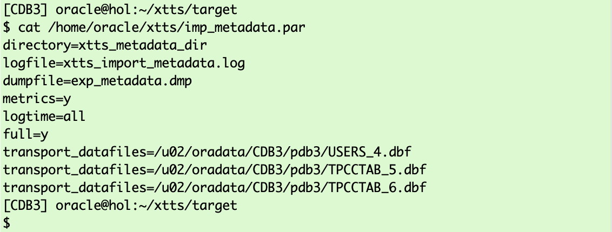

# Transport Phase  

## Introduction

This last phase, the transport phase, requires a downtime. Before you start the last incremental backup it is mandatory to set the tablespaces you copied to read only. </br>
__ATTENTION__: Make sure there are no active sessions/open transcations using objects in the copied tablespaces.

Estimated Time: 15 minutes

### Objectives

- Execute final incremental backup and restore.
- Export metadata using Data Pump
- Import metadata using Data Pump


### Prerequisites

This lab assumes you have:

- Connected to the lab
- A terminal window open on source
- Another terminal window open on target
- Prepared the source
- Successfully executed initial backup
- Successfully executed initial restore
- Successfully executed incremental backup(s)
- Successfully executed incremental restore(s)

## Task 1: Setting Tablespaces to "read only" (SOURCE)

Connect with "/ as sysdba" using SQL*Plus to the source database:
  ```
    <copy>
     sqlplus  / as sysdba 
    </copy>
  ```


and execute:

  ```
    <copy>
     ALTER TABLESPACE TPCCTAB read only;
     ALTER TABLESPACE USERS read only;
     select tablespace_name, STATUS from dba_tablespaces 
     where status='READ ONLY' order by 2,1;
     exit;
    </copy>

     Hit ENTER/RETURN to execute ALL commands.
  ```


## Task 1: Final Incremental Backup (SOURCE)
On source change into the XTTS Source directory and execute the final incremental backup:

  ```
    <copy>
     cd /home/oracle/XTTS/SOURCE
     export XTTDEBUG=0
     export TMPDIR=${PWD}/tmp
    </copy>

     Hit ENTER/RETURN to execute ALL commands.
  ```


  ```
    <copy>
     $ORACLE_HOME/perl/bin/perl xttdriver.pl --backup -L
    </copy>
  ```


<details>
 <summary>*click here to see the full final backup log file*</summary>

  ``` text
    $ $ORACLE_HOME/perl/bin/perl xttdriver.pl --backup -L
    ============================================================
    trace file is /home/oracle/XTTS/SOURCE/tmp/backup_Jun5_Mon_16_30_17_571//Jun5_Mon_16_30_17_571_.log
    =============================================================
    
    --------------------------------------------------------------------
    Parsing properties
    --------------------------------------------------------------------
    
    
    --------------------------------------------------------------------
    Done parsing properties
    --------------------------------------------------------------------
    
    
    --------------------------------------------------------------------
    Checking properties
    --------------------------------------------------------------------
    
    
    --------------------------------------------------------------------
    Done checking properties
    --------------------------------------------------------------------
    
    
    --------------------------------------------------------------------
    Backup incremental
    --------------------------------------------------------------------
    
    scalar(or2
    XXX: adding here for 2, 0, TPCCTAB,USERS
    Added fname here 1:/home/oracle/XTTS/RMAN/USERS_4.tf
    Added fname here 1:/home/oracle/XTTS/RMAN/TPCCTAB_5.tf
    Added fname here 1:/home/oracle/XTTS/RMAN/TPCCTAB_6.tf
    ============================================================
    No new datafiles added
    =============================================================
    Prepare newscn for Tablespaces: 'TPCCTAB'
    Prepare newscn for Tablespaces: 'USERS'
    Prepare newscn for Tablespaces: ''''
    Prepare newscn for Tablespaces: ''''
    Prepare newscn for Tablespaces: ''''
    
    --------------------------------------------------------------------
    Starting incremental backup
    --------------------------------------------------------------------
    

    --------------------------------------------------------------------
    Done backing up incrementals
    --------------------------------------------------------------------
    
    Prepare newscn for Tablespaces: 'TPCCTAB'
    DECLARE*
    ERROR at line 1:
    ORA-20001: TABLESPACE(S) IS READONLY OR,
    OFFLINE JUST CONVERT, COPY
    ORA-06512: at line 284
    
    ####################################################################
    Warning:
    ------
    Warnings found in executing /home/oracle/XTTS/SOURCE/tmp/backup_Jun5_Mon_16_30_17_571//xttpreparenextiter.sql
    ####################################################################
    Prepare newscn for Tablespaces: 'USERS'
    DECLARE*
    ERROR at line 1:
    ORA-20001: TABLESPACE(S) IS READONLY OR,
    OFFLINE JUST CONVERT, COPY
    ORA-06512: at line 284
    
    ####################################################################
    Warning:
    ------
    Warnings found in executing /home/oracle/XTTS/SOURCE/tmp/backup_Jun5_Mon_16_30_17_571//xttpreparenextiter.sql
    ####################################################################
    Prepare newscn for Tablespaces: ''''''''''''
    New /home/oracle/XTTS/SOURCE/tmp/xttplan.txt with FROM SCN's generated
    [UPGR] oracle@hol:~/XTTS/SOURCE
  ```
</details>

The process finishes with a few warnings similar to:<br>
__DECLARE*__<br>
__ERROR at line 1:<br>
ORA-20001: TABLESPACE(S) IS READONLY OR,<br>
OFFLINE JUST CONVERT, COPY<br>
ORA-06512: at line 284__<br>

You can safely ignore those warnings as they only tell you that you're going to back up a "read only" tablespace.


## Task 2: Final Incremental Restore (TARGET)

Open the target console.
The final incremental restore also needs the "res.txt" and "incrbackups.txt" files from source. So copy them:

  ```
    <copy>
     cp /home/oracle/XTTS/SOURCE/tmp/res.txt /home/oracle/XTTS/TARGET/tmp/res.txt
    </copy>
  ```


  ```
    <copy>
     cp /home/oracle/XTTS/SOURCE/tmp/incrbackups.txt /home/oracle/XTTS/TARGET/tmp/incrbackups.txt
    </copy>
  ```


And start the restore which recovers the target data files until exact the same SCN as the source database data files:
  ```
    <copy>
     cd /home/oracle/XTTS/TARGET
     export XTTDEBUG=0
     export TMPDIR=${PWD}/tmp
    </copy>

     Hit ENTER/RETURN to execute ALL commands.
  ```


  ```
    <copy>
     $ORACLE_HOME/perl/bin/perl xttdriver.pl --restore -L
    </copy>
  ```


The full output looks like:
<details>
 <summary>*click here to see the full final restore log file*</summary>

  ``` text
[CDB3] oracle@hol:~/XTTS/TARGET
$ $ORACLE_HOME/perl/bin/perl xttdriver.pl --restore -L
============================================================
trace file is /home/oracle/XTTS/TARGET/tmp/restore_Jun5_Mon_16_54_14_139//Jun5_Mon_16_54_14_139_.log
=============================================================

--------------------------------------------------------------------
Parsing properties
--------------------------------------------------------------------


--------------------------------------------------------------------
Done parsing properties
--------------------------------------------------------------------


--------------------------------------------------------------------
Checking properties
--------------------------------------------------------------------


--------------------------------------------------------------------
Done checking properties
--------------------------------------------------------------------


--------------------------------------------------------------------
Start rollforward
--------------------------------------------------------------------


--------------------------------------------------------------------
End of rollforward phase
--------------------------------------------------------------------

[CDB3] oracle@hol:~/XTTS/TARGET
  ```
</details>

## Task 3: Metadata Export (SOURCE)
Between this source and target database version, you can't use __Data Pump network_link__ (will fail with ORA-39169) and you have to export and import the metadata information instead.
The Data Pump export parameter file "Exp_Metadata.par" was already created for you and is located in "/home/oracle/XTTS/"

  ```
    <copy>
     cat /home/oracle/XTTS/Exp_Metadata.par
    </copy>
  ```


<details>
 <summary>*click here if you want to see the Data Pump export parameter file and a short description*</summary>


| Parameter | Comment |
| :-------- | :-----|
| DIRECTORY=XTTS\_METADATA\_DIR | Specifies the default location to which Export can write the dump file set and the log file |
| DUMPFILE=exp\_Metadata.dmp | Is the name of the dump file |
| logfile=XTTS\_export\_metadata.log | This parameter specifies the name for the log file of the export job. |
| FULL=Y | FULL specifies that you want to perform a full database mode export  |
| TRANSPORTABLE=ALWAYS | In a full mode export (full=y), using the transportable option results in a full transportable export which exports all objects and data necessary to create a complete copy of the database.  |
| VERSION=12 | Specifies the version of database objects that you want to export. Only database objects and attributes that are compatible with the specified release are exported.  |
| PARALLEL=4 | Although not used in this lab it might be helpful in a real migration scenario  |
{: title="Data Pump Metadata Export Parameter File"}

</details>


and execute expdp using this par file

  ```
    <copy>
     expdp system/oracle@UPGR parfile=/home/oracle/XTTS/Exp_Metadata.par
    </copy>
  ```


<details>
 <summary>*click here to see the full metadata EXPDP log file*</summary>

  ``` text
    $ expdp system/oracle@UPGR parfile=Exp_Metadata.par
    
    Export: Release 11.2.0.4.0 - Production on Mon Jun 5 17:08:28 2023
    
    Copyright (c) 1982, 2011, Oracle and/or its affiliates.  All rights reserved.
    
    Connected to: Oracle Database 11g Enterprise Edition Release 11.2.0.4.0 - 64bit Production
    With the Partitioning, OLAP, Data Mining and Real Application Testing options
    Starting "SYSTEM"."SYS_EXPORT_FULL_01":  system/********@UPGR parfile=Exp_Metadata.par
    Estimate in progress using BLOCKS method...
    Processing object type DATABASE_EXPORT/PLUGTS_FULL/FULL/PLUGTS_TABLESPACE
    Processing object type DATABASE_EXPORT/PLUGTS_FULL/PLUGTS_BLK
    Processing object type DATABASE_EXPORT/EARLY_OPTIONS/VIEWS_AS_TABLES/TABLE_DATA
    Processing object type DATABASE_EXPORT/NORMAL_OPTIONS/TABLE_DATA
    Processing object type DATABASE_EXPORT/NORMAL_OPTIONS/VIEWS_AS_TABLES/TABLE_DATA
    Processing object type DATABASE_EXPORT/SCHEMA/TABLE/TABLE_DATA
    Total estimation using BLOCKS method: 1.25 MB
    Processing object type DATABASE_EXPORT/PRE_SYSTEM_IMPCALLOUT/MARKER
    Processing object type DATABASE_EXPORT/PRE_INSTANCE_IMPCALLOUT/MARKER
    Processing object type DATABASE_EXPORT/TABLESPACE
    Processing object type DATABASE_EXPORT/PROFILE
    Processing object type DATABASE_EXPORT/SYS_USER/USER
    Processing object type DATABASE_EXPORT/SCHEMA/USER
    Processing object type DATABASE_EXPORT/ROLE
    Processing object type DATABASE_EXPORT/GRANT/SYSTEM_GRANT/PROC_SYSTEM_GRANT
    Processing object type DATABASE_EXPORT/SCHEMA/GRANT/SYSTEM_GRANT
    Processing object type DATABASE_EXPORT/SCHEMA/ROLE_GRANT
    Processing object type DATABASE_EXPORT/SCHEMA/DEFAULT_ROLE
    Processing object type DATABASE_EXPORT/SCHEMA/TABLESPACE_QUOTA
    Processing object type DATABASE_EXPORT/RESOURCE_COST
    Processing object type DATABASE_EXPORT/TRUSTED_DB_LINK
    Processing object type DATABASE_EXPORT/SCHEMA/SEQUENCE/SEQUENCE
    Processing object type DATABASE_EXPORT/DIRECTORY/DIRECTORY
    Processing object type DATABASE_EXPORT/DIRECTORY/GRANT/OWNER_GRANT/OBJECT_GRANT
    Processing object type DATABASE_EXPORT/CONTEXT
    Processing object type DATABASE_EXPORT/SCHEMA/PUBLIC_SYNONYM/SYNONYM
    Processing object type DATABASE_EXPORT/SCHEMA/SYNONYM
    Processing object type DATABASE_EXPORT/SCHEMA/TYPE/TYPE_SPEC
    Processing object type DATABASE_EXPORT/SYSTEM_PROCOBJACT/PRE_SYSTEM_ACTIONS/PROCACT_SYSTEM
    Processing object type DATABASE_EXPORT/SYSTEM_PROCOBJACT/PROCOBJ
    Processing object type DATABASE_EXPORT/SYSTEM_PROCOBJACT/POST_SYSTEM_ACTIONS/PROCACT_SYSTEM
    Processing object type DATABASE_EXPORT/SCHEMA/PROCACT_SCHEMA
    Processing object type DATABASE_EXPORT/EARLY_OPTIONS/VIEWS_AS_TABLES/TABLE
    Processing object type DATABASE_EXPORT/EARLY_POST_INSTANCE_IMPCALLOUT/MARKER
    Processing object type DATABASE_EXPORT/NORMAL_OPTIONS/OPTION_TYPE/TYPE_SPEC
    Processing object type DATABASE_EXPORT/NORMAL_OPTIONS/OPTION_TYPE/TYPE_BODY
    Processing object type DATABASE_EXPORT/NORMAL_OPTIONS/TABLE
    Processing object type DATABASE_EXPORT/NORMAL_OPTIONS/VIEWS_AS_TABLES/TABLE
    Processing object type DATABASE_EXPORT/NORMAL_POST_INSTANCE_IMPCALLOU/MARKER
    Processing object type DATABASE_EXPORT/SCHEMA/TABLE/TABLE
    Processing object type DATABASE_EXPORT/SCHEMA/TABLE/PRE_TABLE_ACTION
    Processing object type DATABASE_EXPORT/SCHEMA/TABLE/GRANT/OWNER_GRANT/OBJECT_GRANT
    Processing object type DATABASE_EXPORT/SCHEMA/TABLE/COMMENT
    Processing object type DATABASE_EXPORT/SCHEMA/PACKAGE/PACKAGE_SPEC
    Processing object type DATABASE_EXPORT/SCHEMA/FUNCTION/FUNCTION
    Processing object type DATABASE_EXPORT/SCHEMA/PROCEDURE/PROCEDURE
    Processing object type DATABASE_EXPORT/SCHEMA/PACKAGE/COMPILE_PACKAGE/PACKAGE_SPEC/ALTER_PACKAGE_SPEC
    Processing object type DATABASE_EXPORT/SCHEMA/FUNCTION/ALTER_FUNCTION
    Processing object type DATABASE_EXPORT/SCHEMA/PROCEDURE/ALTER_PROCEDURE
    Processing object type DATABASE_EXPORT/SCHEMA/TABLE/INDEX/INDEX
    Processing object type DATABASE_EXPORT/SCHEMA/TABLE/CONSTRAINT/CONSTRAINT
    Processing object type DATABASE_EXPORT/SCHEMA/TABLE/INDEX/STATISTICS/INDEX_STATISTICS
    Processing object type DATABASE_EXPORT/SCHEMA/VIEW/VIEW
    Processing object type DATABASE_EXPORT/SCHEMA/VIEW/GRANT/OWNER_GRANT/OBJECT_GRANT
    Processing object type DATABASE_EXPORT/SCHEMA/VIEW/COMMENT
    Processing object type DATABASE_EXPORT/SCHEMA/PACKAGE_BODIES/PACKAGE/PACKAGE_BODY
    Processing object type DATABASE_EXPORT/SCHEMA/TABLE/CONSTRAINT/REF_CONSTRAINT
    Processing object type DATABASE_EXPORT/SCHEMA/TABLE/STATISTICS/TABLE_STATISTICS
    Processing object type DATABASE_EXPORT/SCHEMA/TABLE/POST_TABLE_ACTION
    Processing object type DATABASE_EXPORT/SCHEMA/TABLE/TRIGGER
    Processing object type DATABASE_EXPORT/END_PLUGTS_BLK
    Processing object type DATABASE_EXPORT/FINAL_POST_INSTANCE_IMPCALLOUT/MARKER
    Processing object type DATABASE_EXPORT/SCHEMA/POST_SCHEMA/PROCACT_SCHEMA
    Processing object type DATABASE_EXPORT/AUDIT
    Processing object type DATABASE_EXPORT/POST_SYSTEM_IMPCALLOUT/MARKER
    . . exported "SYS"."KU$_USER_MAPPING_VIEW"               5.593 KB      13 rows
    . . exported "LBACSYS"."LBAC$INSTALLATIONS"              6.820 KB       2 rows
    . . exported "LBACSYS"."LBAC$PROPS"                      6.039 KB       3 rows
    . . exported "LBACSYS"."SA$DIP_EVENTS"                   5.468 KB       2 rows
    . . exported "SYS"."DAM_CONFIG_PARAM$"                   6.367 KB      10 rows
    . . exported "WMSYS"."WM$ENV_VARS"                       5.921 KB       3 rows
    . . exported "WMSYS"."WM$EVENTS_INFO"                     5.75 KB      12 rows
    . . exported "WMSYS"."WM$HINT_TABLE"                      9.25 KB      72 rows
    . . exported "WMSYS"."WM$NEXTVER_TABLE"                  6.265 KB       1 rows
    . . exported "WMSYS"."WM$VERSION_HIERARCHY_TABLE"        5.875 KB       1 rows
    . . exported "WMSYS"."WM$WORKSPACES_TABLE"               14.51 KB       1 rows
    . . exported "WMSYS"."WM$WORKSPACE_PRIV_TABLE"           6.851 KB       8 rows
    . . exported "LBACSYS"."LBAC$AUDIT"                          0 KB       0 rows
    . . exported "LBACSYS"."LBAC$LAB"                            0 KB       0 rows
    . . exported "LBACSYS"."LBAC$POL"                            0 KB       0 rows
    . . exported "LBACSYS"."LBAC$POLICY_ADMIN"                   0 KB       0 rows
    . . exported "LBACSYS"."LBAC$POLS"                           0 KB       0 rows
    . . exported "LBACSYS"."LBAC$POLT"                           0 KB       0 rows
    . . exported "LBACSYS"."LBAC$PROG"                           0 KB       0 rows
    . . exported "LBACSYS"."LBAC$USER"                           0 KB       0 rows
    . . exported "LBACSYS"."SA$COMPARTMENTS"                     0 KB       0 rows
    . . exported "LBACSYS"."SA$DIP_DEBUG"                        0 KB       0 rows
    . . exported "LBACSYS"."SA$GROUPS"                           0 KB       0 rows
    . . exported "LBACSYS"."SA$LEVELS"                           0 KB       0 rows
    . . exported "LBACSYS"."SA$PROFILES"                         0 KB       0 rows
    . . exported "LBACSYS"."SA$USER_COMPARTMENTS"                0 KB       0 rows
    . . exported "LBACSYS"."SA$USER_GROUPS"                      0 KB       0 rows
    . . exported "LBACSYS"."SA$USER_LEVELS"                      0 KB       0 rows
    . . exported "SYS"."DAM_CLEANUP_EVENTS$"                     0 KB       0 rows
    . . exported "SYS"."DAM_CLEANUP_JOBS$"                       0 KB       0 rows
    . . exported "SYS"."NET$_ACL"                                0 KB       0 rows
    . . exported "SYS"."WALLET$_ACL"                             0 KB       0 rows
    . . exported "SYSTEM"."AUD$"                                 0 KB       0 rows
    . . exported "WMSYS"."WM$BATCH_COMPRESSIBLE_TABLES"          0 KB       0 rows
    . . exported "WMSYS"."WM$CONSTRAINTS_TABLE"                  0 KB       0 rows
    . . exported "WMSYS"."WM$CONS_COLUMNS"                       0 KB       0 rows
    . . exported "WMSYS"."WM$INSTEADOF_TRIGS_TABLE"              0 KB       0 rows
    . . exported "WMSYS"."WM$LOCKROWS_INFO"                      0 KB       0 rows
    . . exported "WMSYS"."WM$MODIFIED_TABLES"                    0 KB       0 rows
    . . exported "WMSYS"."WM$MP_GRAPH_WORKSPACES_TABLE"          0 KB       0 rows
    . . exported "WMSYS"."WM$MP_PARENT_WORKSPACES_TABLE"         0 KB       0 rows
    . . exported "WMSYS"."WM$NESTED_COLUMNS_TABLE"               0 KB       0 rows
    . . exported "WMSYS"."WM$REMOVED_WORKSPACES_TABLE"           0 KB       0 rows
    . . exported "WMSYS"."WM$RESOLVE_WORKSPACES_TABLE"           0 KB       0 rows
    . . exported "WMSYS"."WM$RIC_LOCKING_TABLE"                  0 KB       0 rows
    . . exported "WMSYS"."WM$RIC_TABLE"                          0 KB       0 rows
    . . exported "WMSYS"."WM$RIC_TRIGGERS_TABLE"                 0 KB       0 rows
    . . exported "WMSYS"."WM$UDTRIG_DISPATCH_PROCS"              0 KB       0 rows
    . . exported "WMSYS"."WM$UDTRIG_INFO"                        0 KB       0 rows
    . . exported "WMSYS"."WM$VERSION_TABLE"                      0 KB       0 rows
    . . exported "WMSYS"."WM$VT_ERRORS_TABLE"                    0 KB       0 rows
    . . exported "WMSYS"."WM$WORKSPACE_SAVEPOINTS_TABLE"         0 KB       0 rows
    . . exported "SYSTEM"."SCHEDULER_PROGRAM_ARGS"           21.37 KB     154 rows
    . . exported "SYS"."AUDTAB$TBS$FOR_EXPORT"               5.859 KB       2 rows
    . . exported "SYS"."FGA_LOG$FOR_EXPORT"                      0 KB       0 rows
    . . exported "SYSTEM"."SCHEDULER_JOB_ARGS"                   0 KB       0 rows
    . . exported "WMSYS"."WM$EXP_MAP"                            0 KB       0 rows
    . . exported "SYSTEM"."REPCAT$_AUDIT_ATTRIBUTE"          6.328 KB       2 rows
    . . exported "SYSTEM"."REPCAT$_OBJECT_TYPES"             6.882 KB      28 rows
    . . exported "SYSTEM"."REPCAT$_RESOLUTION_METHOD"        5.835 KB      19 rows
    . . exported "SYSTEM"."REPCAT$_TEMPLATE_STATUS"          5.484 KB       3 rows
    . . exported "SYSTEM"."REPCAT$_TEMPLATE_TYPES"           6.289 KB       2 rows
    . . exported "OUTLN"."OL$"                                   0 KB       0 rows
    . . exported "OUTLN"."OL$HINTS"                              0 KB       0 rows
    . . exported "OUTLN"."OL$NODES"                              0 KB       0 rows
    . . exported "SYSTEM"."DEF$_AQCALL"                          0 KB       0 rows
    . . exported "SYSTEM"."DEF$_AQERROR"                         0 KB       0 rows
    . . exported "SYSTEM"."DEF$_CALLDEST"                        0 KB       0 rows
    . . exported "SYSTEM"."DEF$_DEFAULTDEST"                     0 KB       0 rows
    . . exported "SYSTEM"."DEF$_DESTINATION"                     0 KB       0 rows
    . . exported "SYSTEM"."DEF$_ERROR"                           0 KB       0 rows
    . . exported "SYSTEM"."DEF$_LOB"                             0 KB       0 rows
    . . exported "SYSTEM"."DEF$_ORIGIN"                          0 KB       0 rows
    . . exported "SYSTEM"."DEF$_PROPAGATOR"                      0 KB       0 rows
    . . exported "SYSTEM"."DEF$_PUSHED_TRANSACTIONS"             0 KB       0 rows
    . . exported "SYSTEM"."REPCAT$_AUDIT_COLUMN"                 0 KB       0 rows
    . . exported "SYSTEM"."REPCAT$_COLUMN_GROUP"                 0 KB       0 rows
    . . exported "SYSTEM"."REPCAT$_CONFLICT"                     0 KB       0 rows
    . . exported "SYSTEM"."REPCAT$_DDL"                          0 KB       0 rows
    . . exported "SYSTEM"."REPCAT$_EXCEPTIONS"                   0 KB       0 rows
    . . exported "SYSTEM"."REPCAT$_EXTENSION"                    0 KB       0 rows
    . . exported "SYSTEM"."REPCAT$_FLAVORS"                      0 KB       0 rows
    . . exported "SYSTEM"."REPCAT$_FLAVOR_OBJECTS"               0 KB       0 rows
    . . exported "SYSTEM"."REPCAT$_GENERATED"                    0 KB       0 rows
    . . exported "SYSTEM"."REPCAT$_GROUPED_COLUMN"               0 KB       0 rows
    . . exported "SYSTEM"."REPCAT$_INSTANTIATION_DDL"            0 KB       0 rows
    . . exported "SYSTEM"."REPCAT$_KEY_COLUMNS"                  0 KB       0 rows
    . . exported "SYSTEM"."REPCAT$_OBJECT_PARMS"                 0 KB       0 rows
    . . exported "SYSTEM"."REPCAT$_PARAMETER_COLUMN"             0 KB       0 rows
    . . exported "SYSTEM"."REPCAT$_PRIORITY"                     0 KB       0 rows
    . . exported "SYSTEM"."REPCAT$_PRIORITY_GROUP"               0 KB       0 rows
    . . exported "SYSTEM"."REPCAT$_REFRESH_TEMPLATES"            0 KB       0 rows
    . . exported "SYSTEM"."REPCAT$_REPCAT"                       0 KB       0 rows
    . . exported "SYSTEM"."REPCAT$_REPCATLOG"                    0 KB       0 rows
    . . exported "SYSTEM"."REPCAT$_REPCOLUMN"                    0 KB       0 rows
    . . exported "SYSTEM"."REPCAT$_REPGROUP_PRIVS"               0 KB       0 rows
    . . exported "SYSTEM"."REPCAT$_REPOBJECT"                    0 KB       0 rows
    . . exported "SYSTEM"."REPCAT$_REPPROP"                      0 KB       0 rows
    . . exported "SYSTEM"."REPCAT$_REPSCHEMA"                    0 KB       0 rows
    . . exported "SYSTEM"."REPCAT$_RESOLUTION"                   0 KB       0 rows
    . . exported "SYSTEM"."REPCAT$_RESOLUTION_STATISTICS"        0 KB       0 rows
    . . exported "SYSTEM"."REPCAT$_RESOL_STATS_CONTROL"          0 KB       0 rows
    . . exported "SYSTEM"."REPCAT$_RUNTIME_PARMS"                0 KB       0 rows
    . . exported "SYSTEM"."REPCAT$_SITES_NEW"                    0 KB       0 rows
    . . exported "SYSTEM"."REPCAT$_SITE_OBJECTS"                 0 KB       0 rows
    . . exported "SYSTEM"."REPCAT$_SNAPGROUP"                    0 KB       0 rows
    . . exported "SYSTEM"."REPCAT$_TEMPLATE_OBJECTS"             0 KB       0 rows
    . . exported "SYSTEM"."REPCAT$_TEMPLATE_PARMS"               0 KB       0 rows
    . . exported "SYSTEM"."REPCAT$_TEMPLATE_REFGROUPS"           0 KB       0 rows
    . . exported "SYSTEM"."REPCAT$_TEMPLATE_SITES"               0 KB       0 rows
    . . exported "SYSTEM"."REPCAT$_TEMPLATE_TARGETS"             0 KB       0 rows
    . . exported "SYSTEM"."REPCAT$_USER_AUTHORIZATIONS"          0 KB       0 rows
    . . exported "SYSTEM"."REPCAT$_USER_PARM_VALUES"             0 KB       0 rows
    . . exported "SYSTEM"."SQLPLUS_PRODUCT_PROFILE"              0 KB       0 rows
    Master table "SYSTEM"."SYS_EXPORT_FULL_01" successfully loaded/unloaded
    ******************************************************************************
    Dump file set for SYSTEM.SYS_EXPORT_FULL_01 is:
      /home/oracle/XTTS/DUMP/exp_Metadata.dmp
    ******************************************************************************
    Datafiles required for transportable tablespace TPCCTAB:
      /u02/oradata/UPGR/tpcctab01.dbf
    Datafiles required for transportable tablespace USERS:
      /u02/oradata/UPGR/users01.dbf
    Job "SYSTEM"."SYS_EXPORT_FULL_01" successfully completed at Mon Jun 5 17:11:56 2023 elapsed 0 00:03:25
  ```
</details>

## Task 4: Metadata Import (TARGET)
Also the metadata import parameter file was precreated for you:

 ```
    <copy>
     cat /home/oracle/XTTS/Imp_Metadata.par
    </copy>
  ```



<details>
 <summary>*click here if you want to see the Data Pump import parameter file and a short description*</summary>


| Parameter | Comment |
| :-------- | :-----|
| DIRECTORY=XTTS\_METADATA\_DIR | Is the default location from which Import can read the dump file set and create the log file |
| DUMPFILE=exp\_Metadata.dmp | Is the name of the dump file the import is going to read|
| logfile=XTTS\_import\_metadata.log | This parameter specifies the name for the log file of the import job |
| METRICS=Y | This setting indicates you want additional information about the job reported to the Data Pump log file  |
| LOGTIME=ALL | Adds timestamp information to import opertaions  |
| FULL=Y | Specifies that you want to perform a full database mode export   |
| transport\_datafiles=/u02/oradata/CDB3/pdb3/USERS_4.dbf | list of data files that are imported into the target database  |
{: title="Data Pump Metadata Import Parameter File"}

</details>


And import the metadata into the PDB3 using this Imp_Metadata.par parameter file:
__ATTENTION__: Only proceed once the export on SOURCE has been completed.

  ```
   <copy>
     impdp system/oracle@pdb3 parfile=/home/oracle/XTTS/Imp_Metadata.par
    <copy>
  ```


<details>
 <summary>*click here to see the full metadata IMPDP log file*</summary>

  ``` text
$ impdp system/oracle@pdb3 parfile=Imp_Metadata.par

Import: Release 21.0.0.0.0 - Production on Mon Jun 5 17:37:33 2023
Version 21.5.0.0.0

Copyright (c) 1982, 2021, Oracle and/or its affiliates.  All rights reserved.

Connected to: Oracle Database 21c Enterprise Edition Release 21.0.0.0.0 - Production
05-JUN-23 17:37:38.984: W-1 Startup on instance 1 took 1 seconds
05-JUN-23 17:37:42.138: W-1 Master table "SYSTEM"."SYS_IMPORT_FULL_01" successfully loaded/unloaded
05-JUN-23 17:37:43.700: W-1 Source time zone is +01:00 and target time zone is +02:00.
05-JUN-23 17:37:43.706: Starting "SYSTEM"."SYS_IMPORT_FULL_01":  system/********@pdb3 parfile=Imp_Metadata.par
05-JUN-23 17:37:43.778: W-1 Processing object type DATABASE_EXPORT/PRE_SYSTEM_IMPCALLOUT/MARKER
05-JUN-23 17:37:46.638: W-1      Completed 1 MARKER objects in 0 seconds
05-JUN-23 17:37:46.638: W-1 Processing object type DATABASE_EXPORT/PRE_INSTANCE_IMPCALLOUT/MARKER
05-JUN-23 17:37:55.009: W-1      Completed 1 MARKER objects in 0 seconds
05-JUN-23 17:37:55.009: W-1 Processing object type DATABASE_EXPORT/PLUGTS_FULL/PLUGTS_BLK
05-JUN-23 17:37:55.956: W-1      Completed 1 PLUGTS_BLK objects in 0 seconds
05-JUN-23 17:37:55.956: W-1 Processing object type DATABASE_EXPORT/TABLESPACE
05-JUN-23 17:37:56.092: ORA-31684: Object type TABLESPACE:"UNDOTBS1" already exists

05-JUN-23 17:37:56.092: ORA-31684: Object type TABLESPACE:"TEMP" already exists

05-JUN-23 17:37:56.163: W-1      Completed 2 TABLESPACE objects in 0 seconds
05-JUN-23 17:37:56.163: W-1 Processing object type DATABASE_EXPORT/PROFILE
05-JUN-23 17:37:56.295: W-1      Completed 1 PROFILE objects in 0 seconds
05-JUN-23 17:37:56.295: W-1 Processing object type DATABASE_EXPORT/SYS_USER/USER
05-JUN-23 17:37:56.378: ORA-31685: Object type USER:"SYS" failed due to insufficient privileges. Failing sql is:
 ALTER USER "SYS" IDENTIFIED BY VALUES 'S:D4E4EF48C9F01918AAB47EA83C40CB9746D0BAC20FF932BE464E0AC25A29;8A8F025737A9097A' TEMPORARY TABLESPACE "TEMP"

05-JUN-23 17:37:56.415: W-1      Completed 1 USER objects in 0 seconds
05-JUN-23 17:37:56.415: W-1 Processing object type DATABASE_EXPORT/SCHEMA/USER
05-JUN-23 17:37:56.555: ORA-31684: Object type USER:"OUTLN" already exists

05-JUN-23 17:37:56.605: W-1      Completed 3 USER objects in 0 seconds
05-JUN-23 17:37:56.605: W-1 Processing object type DATABASE_EXPORT/ROLE
05-JUN-23 17:37:56.813: ORA-31684: Object type ROLE:"SELECT_CATALOG_ROLE" already exists

05-JUN-23 17:37:56.813: ORA-31684: Object type ROLE:"EXECUTE_CATALOG_ROLE" already exists

05-JUN-23 17:37:56.813: ORA-31684: Object type ROLE:"DBFS_ROLE" already exists

05-JUN-23 17:37:56.813: ORA-31684: Object type ROLE:"AQ_ADMINISTRATOR_ROLE" already exists

05-JUN-23 17:37:56.813: ORA-31684: Object type ROLE:"AQ_USER_ROLE" already exists

05-JUN-23 17:37:56.813: ORA-31684: Object type ROLE:"ADM_PARALLEL_EXECUTE_TASK" already exists

05-JUN-23 17:37:56.813: ORA-31684: Object type ROLE:"GATHER_SYSTEM_STATISTICS" already exists

05-JUN-23 17:37:56.813: ORA-31684: Object type ROLE:"RECOVERY_CATALOG_OWNER" already exists

05-JUN-23 17:37:56.813: ORA-31684: Object type ROLE:"SCHEDULER_ADMIN" already exists

05-JUN-23 17:37:56.813: ORA-31684: Object type ROLE:"HS_ADMIN_SELECT_ROLE" already exists

05-JUN-23 17:37:56.813: ORA-31684: Object type ROLE:"HS_ADMIN_EXECUTE_ROLE" already exists

05-JUN-23 17:37:56.813: ORA-31684: Object type ROLE:"HS_ADMIN_ROLE" already exists

05-JUN-23 17:37:56.813: ORA-31684: Object type ROLE:"GLOBAL_AQ_USER_ROLE" already exists

05-JUN-23 17:37:56.813: ORA-31684: Object type ROLE:"OEM_ADVISOR" already exists

05-JUN-23 17:37:56.813: ORA-31684: Object type ROLE:"OEM_MONITOR" already exists

05-JUN-23 17:37:56.813: ORA-31684: Object type ROLE:"WM_ADMIN_ROLE" already exists

05-JUN-23 17:37:56.813: ORA-31684: Object type ROLE:"XDBADMIN" already exists

05-JUN-23 17:37:56.813: ORA-31684: Object type ROLE:"XDB_SET_INVOKER" already exists

05-JUN-23 17:37:56.813: ORA-31684: Object type ROLE:"AUTHENTICATEDUSER" already exists

05-JUN-23 17:37:56.813: ORA-31684: Object type ROLE:"XDB_WEBSERVICES" already exists

05-JUN-23 17:37:56.813: ORA-31684: Object type ROLE:"XDB_WEBSERVICES_WITH_PUBLIC" already exists

05-JUN-23 17:37:56.813: ORA-31684: Object type ROLE:"XDB_WEBSERVICES_OVER_HTTP" already exists

05-JUN-23 17:37:56.855: W-1      Completed 23 ROLE objects in 0 seconds
05-JUN-23 17:37:56.855: W-1 Processing object type DATABASE_EXPORT/GRANT/SYSTEM_GRANT/PROC_SYSTEM_GRANT
05-JUN-23 17:37:57.001: W-1      Completed 4 PROC_SYSTEM_GRANT objects in 0 seconds
05-JUN-23 17:37:57.001: W-1 Processing object type DATABASE_EXPORT/SCHEMA/GRANT/SYSTEM_GRANT
05-JUN-23 17:37:57.237: W-1      Completed 35 SYSTEM_GRANT objects in 0 seconds
05-JUN-23 17:37:57.237: W-1 Processing object type DATABASE_EXPORT/SCHEMA/ROLE_GRANT
05-JUN-23 17:37:57.746: W-1      Completed 54 ROLE_GRANT objects in 0 seconds
05-JUN-23 17:37:57.746: W-1 Processing object type DATABASE_EXPORT/SCHEMA/DEFAULT_ROLE
05-JUN-23 17:37:57.865: W-1      Completed 3 DEFAULT_ROLE objects in 0 seconds
05-JUN-23 17:37:57.865: W-1 Processing object type DATABASE_EXPORT/SCHEMA/TABLESPACE_QUOTA
05-JUN-23 17:37:57.981: W-1      Completed 1 TABLESPACE_QUOTA objects in 0 seconds
05-JUN-23 17:37:57.981: W-1 Processing object type DATABASE_EXPORT/RESOURCE_COST
05-JUN-23 17:37:58.096: W-1      Completed 1 RESOURCE_COST objects in 0 seconds
05-JUN-23 17:37:58.096: W-1 Processing object type DATABASE_EXPORT/TRUSTED_DB_LINK
05-JUN-23 17:37:58.234: W-1      Completed 1 TRUSTED_DB_LINK objects in 0 seconds
05-JUN-23 17:37:58.234: W-1 Processing object type DATABASE_EXPORT/SCHEMA/SEQUENCE/SEQUENCE
05-JUN-23 17:37:58.414: W-1      Completed 15 SEQUENCE objects in 0 seconds
05-JUN-23 17:37:58.414: W-1 Processing object type DATABASE_EXPORT/DIRECTORY/DIRECTORY
05-JUN-23 17:37:58.546: ORA-31684: Object type DIRECTORY:"DATA_PUMP_DIR" already exists

05-JUN-23 17:37:58.546: ORA-31684: Object type DIRECTORY:"XMLDIR" already exists

05-JUN-23 17:37:58.546: ORA-31684: Object type DIRECTORY:"XTTS_METADATA_DIR" already exists

05-JUN-23 17:37:58.546: ORA-31684: Object type DIRECTORY:"DATAPUMP_DIR" already exists

05-JUN-23 17:37:58.591: W-1      Completed 6 DIRECTORY objects in 0 seconds
05-JUN-23 17:37:58.591: W-1 Processing object type DATABASE_EXPORT/DIRECTORY/GRANT/OWNER_GRANT/OBJECT_GRANT
05-JUN-23 17:37:58.727: W-1      Completed 6 OBJECT_GRANT objects in 0 seconds
05-JUN-23 17:37:58.727: W-1 Processing object type DATABASE_EXPORT/CONTEXT
05-JUN-23 17:37:58.870: ORA-31684: Object type CONTEXT:"GLOBAL_AQCLNTDB_CTX" already exists

05-JUN-23 17:37:58.870: ORA-31684: Object type CONTEXT:"DBFS_CONTEXT" already exists

05-JUN-23 17:37:58.870: ORA-31684: Object type CONTEXT:"REGISTRY$CTX" already exists

05-JUN-23 17:37:58.870: ORA-31684: Object type CONTEXT:"LT_CTX" already exists

05-JUN-23 17:37:58.939: W-1      Completed 6 CONTEXT objects in 0 seconds
05-JUN-23 17:37:58.939: W-1 Processing object type DATABASE_EXPORT/SCHEMA/TYPE/TYPE_SPEC
05-JUN-23 17:37:59.534: W-1      Completed 1 TYPE objects in 0 seconds
05-JUN-23 17:37:59.534: W-1 Processing object type DATABASE_EXPORT/SYSTEM_PROCOBJACT/PRE_SYSTEM_ACTIONS/PROCACT_SYSTEM
05-JUN-23 17:37:59.991: W-1      Completed 3 PROCACT_SYSTEM objects in 0 seconds
05-JUN-23 17:37:59.991: W-1 Processing object type DATABASE_EXPORT/SYSTEM_PROCOBJACT/PROCOBJ
05-JUN-23 17:38:00.670: W-1      Completed 17 PROCOBJ objects in 0 seconds
05-JUN-23 17:38:00.670: W-1 Processing object type DATABASE_EXPORT/SYSTEM_PROCOBJACT/POST_SYSTEM_ACTIONS/PROCACT_SYSTEM
05-JUN-23 17:38:26.516: ORA-39083: Object type PROCACT_SYSTEM failed to create with error:
ORA-04042: procedure, function, package, or package body does not exist

Failing sql is:
BEGIN
SYS.DBMS_UTILITY.EXEC_DDL_STATEMENT('GRANT EXECUTE ON DBMS_DEFER_SYS TO "DBA"');COMMIT; END;

05-JUN-23 17:38:26.555: W-1      Completed 4 PROCACT_SYSTEM objects in 0 seconds
05-JUN-23 17:38:26.555: W-1 Processing object type DATABASE_EXPORT/SCHEMA/PROCACT_SCHEMA
05-JUN-23 17:38:26.730: W-1      Completed 5 PROCACT_SCHEMA objects in 0 seconds
05-JUN-23 17:38:26.730: W-1 Processing object type DATABASE_EXPORT/EARLY_OPTIONS/VIEWS_AS_TABLES/TABLE
05-JUN-23 17:38:28.759: W-1      Completed 1 TABLE objects in 0 seconds
05-JUN-23 17:38:28.796: W-1 Processing object type DATABASE_EXPORT/EARLY_OPTIONS/VIEWS_AS_TABLES/TABLE_DATA
05-JUN-23 17:38:29.019: W-1 . . imported "SYS"."KU$_EXPORT_USER_MAP"                 5.593 KB      13 rows in 1 seconds using direct_path
05-JUN-23 17:38:29.050: W-1 Processing object type DATABASE_EXPORT/EARLY_POST_INSTANCE_IMPCALLOUT/MARKER
05-JUN-23 17:38:29.152: W-1      Completed 1 MARKER objects in 0 seconds
05-JUN-23 17:38:29.152: W-1 Processing object type DATABASE_EXPORT/NORMAL_OPTIONS/OPTION_TYPE/TYPE_SPEC
05-JUN-23 17:38:29.283: ORA-39083: Object type TYPE:"LBACSYS"."LBAC_BIN_LABEL" failed to create with error:
ORA-01435: user does not exist

Failing sql is:
CREATE TYPE "LBACSYS"."LBAC_BIN_LABEL"   OID '6619848A7F9C2205E034000077904948'
AS OPAQUE VARYING(*)
USING LIBRARY LBACSYS.lbac$type_libt
(
--  The LBAC_BIN_LABEL type contains the binary label, as well as a label
--  size and an identifier for the associated policy.  The interpretation
--  of the label is made by each policy package.  As for the LBAC_LABEL
--  type, the RAW binary value is used for standard comparisons.
--
--  The type methods include functions to extract portions of the label,
--  functions to manipulate the bits within the label, and functions to
--  test the bit settings.

-- Constructor
  STATIC FUNCTION new_lbac_bin_label (policy_id IN PLS_INTEGER,
                                      bin_size IN PLS_INTEGER)
  RETURN LBAC_BIN_LABEL,
  PRAGMA RESTRICT_REFERENCES(new_lbac_bin_label, RNDS, WNDS, RNPS, WNPS),

-- Equality tests for lookup in lbac$lab
  MEMBER FUNCTION eq_sql (SELF IN lbac_bin_label,
                          comp_label IN lbac_bin_label)
  RETURN PLS_INTEGER DETERMINISTIC,
  PRAGMA RESTRICT_REFERENCES(eq_sql, RNDS, WNDS, RNPS, WNPS),

  MEMBER FUNCTION eq (SELF IN lbac_bin_label,
                       comp_label IN lbac_bin_label)
  RETURN BOOLEAN DETERMINISTIC,
  PRAGMA RESTRICT_REFERENCES(eq, RNDS, WNDS, RNPS, WNPS),

-- Size of binary_label portion
  MEMBER FUNCTION bin_size (SELF IN lbac_bin_label)
  RETURN PLS_INTEGER,
  PRAGMA RESTRICT_REFERENCES(bin_size, RNDS, WNDS, RNPS, WNPS),

-- Procedures and Functions to store values into

05-JUN-23 17:38:29.283: ORA-39083: Object type TYPE:"LBACSYS"."LBAC_PRIVS" failed to create with error:
ORA-01435: user does not exist

Failing sql is:
CREATE TYPE "LBACSYS"."LBAC_PRIVS"   OID '6619848A7FDF2205E034000077904948'
AS OPAQUE FIXED(9)
USING LIBRARY LBACSYS.lbac$privs_libt
(
-- The LBAC_PRIVS type contains the bit string representation of policy
-- package privileges (32 bits).  The functions provide setting, clearing,
-- and testing of specific privileges based on their numeric value.
-- Union and diff functions are also provided to operate on two sets
-- of privileges.

-- Constructor
   STATIC FUNCTION new_lbac_privs(policy_id IN PLS_INTEGER)
   RETURN lbac_privs,
   PRAGMA RESTRICT_REFERENCES(new_lbac_privs, RNDS, WNDS, RNPS, WNPS),

-- Procedures to set contents
   MEMBER PROCEDURE clear_priv(SELF IN OUT NOCOPY lbac_privs,
                               priv_number IN PLS_INTEGER),
   PRAGMA RESTRICT_REFERENCES(clear_priv, RNDS, WNDS, RNPS, WNPS),

   MEMBER PROCEDURE set_priv(SELF IN OUT NOCOPY lbac_privs,
                             priv_number IN PLS_INTEGER),
   PRAGMA RESTRICT_REFERENCES(set_priv, RNDS, WNDS, RNPS, WNPS),

   MEMBER PROCEDURE union_privs(SELF IN OUT NOCOPY lbac_privs,
                                other_privs IN lbac_privs),
   PRAGMA RESTRICT_REFERENCES(union_privs, RNDS, WNDS, RNPS, WNPS),

   MEMBER PROCEDURE diff_privs(SELF IN OUT NOCOPY lbac_privs,
                                other_privs IN lbac_privs),
   PRAGMA RESTRICT_REFERENCES(diff_privs, RNDS, WNDS, RNPS, WNPS),
-- Functions to test contents
   MEMBER FUNCTION test_priv(SELF IN lbac_privs,


05-JUN-23 17:38:29.283: ORA-39083: Object type TYPE:"LBACSYS"."LBAC_LABEL" failed to create with error:
ORA-01435: user does not exist

Failing sql is:
CREATE TYPE "LBACSYS"."LBAC_LABEL"   OID '6619848A7F882205E034000077904948'
AS OPAQUE VARYING(3889)
USING LIBRARY LBACSYS.lbac$label_libt
(
--  The LBAC_LABEL type contains a 4 byte numeric representation of a binary
--  label.  It provides an index into the LBAC$LAB table to locate the
--  corresponding binary label.
--
--  The MAP member function returns the binary label in RAW form for
--  standard Oracle comparisons.

-- BUG 1718582 requires the lbac_label size to be less than 3890 on
-- 64 bit platforms.
-- Due to other overheads in opaque type lbac_label size of 3890
-- works out to be 3897 on Solaris 32 bit platform
-- The code in kkbo.c is checking if the size > slal4d(3900) and this
-- results in a different behavior on 64 bit platforms. With 8 byte
-- alignment slal4d(3900) works out to 3896 resulting in column being
-- stored in a LOB thus causing this bug. Using 3889 works on HP 64 bit
-- platform

-- Constructor
   STATIC FUNCTION new_lbac_label(num IN PLS_INTEGER)
   RETURN lbac_label,
   PRAGMA RESTRICT_REFERENCES(new_lbac_label, RNDS, WNDS, RNPS, WNPS),

-- Map method
   MAP MEMBER FUNCTION lbac_label_map
   RETURN PLS_INTEGER DETERMINISTIC,

-- For lookup in lbac$lab
   MEMBER FUNCTION eq_sql (SELF IN lbac_label,
                           comp_label IN lbac_label)
   RETURN PLS_INTEGER,
   PRAGMA RESTRICT_REFERENCES(eq_sql, RNDS, WNDS, RNPS, WNPS),

   MEMBER FUNCTION eq (SELF IN lbac_label,
                       comp_label IN lbac_label)
   RETURN BOOLEAN

05-JUN-23 17:38:29.283: ORA-39083: Object type TYPE:"LBACSYS"."LBAC_LABEL_LIST" failed to create with error:
ORA-01435: user does not exist

Failing sql is:
CREATE TYPE "LBACSYS"."LBAC_LABEL_LIST"   OID '6619848A801E2205E034000077904948'

AS OPAQUE FIXED(39)
USING LIBRARY LBACSYS.lbac$lablt_libt

-- The lbac_label_list type contains up to six lbac_labels.  It is
-- used to store the labels associated with a database, a user,
-- a program unit, or a session.

(
-- Constructor
   STATIC FUNCTION new_lbac_label_list(policy_id IN PLS_INTEGER)
   RETURN lbac_label_list,
   PRAGMA RESTRICT_REFERENCES(new_lbac_label_list, RNDS, WNDS, RNPS, WNPS),

-- Store a label
   MEMBER PROCEDURE put(SELF IN OUT lbac_label_list,
                             label IN lbac_label, pos IN PLS_INTEGER),
   PRAGMA RESTRICT_REFERENCES(put, RNDS, WNDS, RNPS, WNPS),

-- Functions to retrieve the contents of the list

   MEMBER FUNCTION get(SELF IN lbac_label_list, pos IN PLS_INTEGER)
   RETURN lbac_label,
   PRAGMA RESTRICT_REFERENCES(get, RNDS, WNDS, RNPS, WNPS),

   MEMBER FUNCTION count(SELF IN lbac_label_list)
   RETURN PLS_INTEGER,
   PRAGMA RESTRICT_REFERENCES(count, RNDS, WNDS, RNPS, WNPS),

   MEMBER FUNCTION policy_id(SELF IN lbac_label_list)
   RETURN PLS_INTEGER,
   PRAGMA RESTRICT_REFERENCES(policy_id, RNDS, WNDS, RNPS, WNPS)

);

05-JUN-23 17:38:29.320: W-1      Completed 4 TYPE objects in 0 seconds
05-JUN-23 17:38:29.320: W-1 Processing object type DATABASE_EXPORT/NORMAL_OPTIONS/OPTION_TYPE/TYPE_BODY
05-JUN-23 17:38:29.448: ORA-39083: Object type TYPE_BODY:"LBACSYS"."LBAC_LABEL" failed to create with error:
ORA-01435: user does not exist

Failing sql is:
CREATE TYPE BODY "LBACSYS"."LBAC_LABEL" AS

  STATIC FUNCTION new_lbac_label(num IN PLS_INTEGER)
  RETURN lbac_label
      IS LANGUAGE C
      NAME "zllanlab"
      LIBRARY LBACSYS.lbac$label_libt
      WITH CONTEXT
      PARAMETERS(CONTEXT,
                 num UB4,
                 num INDICATOR SB2,
                 RETURN INDICATOR SB2,
                 RETURN DURATION OCIDuration,
                 RETURN);

--  MAP MEMBER FUNCTION lbac_label_map
--  RETURN RAW IS
--  bin_label lbac_bin_label;
--  BEGIN
--     bin_label := lbac_compare.to_bin_label(SELF);
--     RETURN bin_to_raw(bin_label);
--  END;

  MEMBER FUNCTION to_tag (SELF IN lbac_label)
  RETURN PLS_INTEGER
      IS LANGUAGE C
      NAME "zllaltt"
      LIBRARY LBACSYS.lbac$label_libt
      WITH CONTEXT
      PARAMETERS(CONTEXT,
                 SELF,
                 SELF INDICATOR SB2,
                 RETURN UB4);

  MAP MEMBER FUNCTION lbac_label_map
  RETURN PLS_INTEGER IS
  BEGIN
     RETURN lbac_label.to_tag(SELF);
  END;

  MEMBER FUNCTION eq_sql (SELF IN lbac_label,
                          comp_label IN lbac_label)
  RETURN PLS_INTEGER
      IS LANGUAGE C
      NAME "zllaleqs"
      LIBRARY LBACSYS.lbac$label_libt
      WITH CONTEXT
      PARAMETERS(CONTEXT,
                 SELF,
                 SELF INDICATOR SB2,
                 comp_label,
                 comp_label INDICATOR SB2,
                 RETURN SB4);

  MEMBER FUNCTION eq (SELF IN lbac_label,
                      comp_label IN lbac_l

05-JUN-23 17:38:29.448: ORA-39083: Object type TYPE_BODY:"LBACSYS"."LBAC_BIN_LABEL" failed to create with error:
ORA-01435: user does not exist

Failing sql is:
CREATE TYPE BODY "LBACSYS"."LBAC_BIN_LABEL" AS

  STATIC FUNCTION new_lbac_bin_label ( policy_id  IN PLS_INTEGER,
                            bin_size  IN PLS_INTEGER)
  RETURN LBAC_BIN_LABEL
      IS LANGUAGE C
      NAME "zllabnbl"
      LIBRARY LBACSYS.lbac$type_libt
      WITH CONTEXT
      PARAMETERS(CONTEXT,
                 policy_id SIZE_T,
                 bin_size SIZE_T,
                 RETURN INDICATOR SB2,
                 RETURN DURATION OCIDuration,
                 RETURN);


  MEMBER FUNCTION bin_size (SELF IN lbac_bin_label)
  RETURN PLS_INTEGER
      IS LANGUAGE C
      NAME "zllabsz"
      LIBRARY LBACSYS.lbac$type_libt
      WITH CONTEXT
      PARAMETERS(CONTEXT,
                 SELF,
                 SELF INDICATOR SB2,
                 RETURN SIZE_T);


  MEMBER FUNCTION set_raw (SELF IN OUT NOCOPY lbac_bin_label,
                            position  IN PLS_INTEGER,
                            byte_len  IN PLS_INTEGER,
                            raw_label IN RAW)
  RETURN PLS_INTEGER
      IS LANGUAGE C
      NAME "zllabsr"
      LIBRARY LBACSYS.lbac$type_libt
      WITH CONTEXT
      PARAMETERS(CONTEXT,
                 SELF,
                 SELF INDICATOR SB2,
                 position SIZE_T,
                 byte_len SIZE_T,
                 raw_label RAW,
                 raw_label LENGTH SIZE_T,
                 RETURN SIZE_T);


  MEMBER FUNCTION set_int (SELF IN OUT NOCOPY lbac_bin_label,
                            position  IN PLS_INTEGER

05-JUN-23 17:38:29.448: ORA-39083: Object type TYPE_BODY:"LBACSYS"."LBAC_PRIVS" failed to create with error:
ORA-01435: user does not exist

Failing sql is:
CREATE TYPE BODY "LBACSYS"."LBAC_PRIVS" AS

  STATIC FUNCTION new_lbac_privs(policy_id IN PLS_INTEGER)
  RETURN lbac_privs
      IS LANGUAGE C
      NAME "zllanprv"
      LIBRARY LBACSYS.lbac$privs_libt
      WITH CONTEXT
      PARAMETERS(CONTEXT,
                 policy_id UB4,
                 RETURN INDICATOR SB2,
                 RETURN DURATION OCIDuration,
                 RETURN);

   MEMBER PROCEDURE clear_priv(SELF IN OUT NOCOPY lbac_privs,
                               priv_number IN PLS_INTEGER)
      IS LANGUAGE C
      NAME "zllapclr"
      LIBRARY LBACSYS.lbac$privs_libt
      WITH CONTEXT
      PARAMETERS(CONTEXT,
                 SELF,
                 SELF INDICATOR SB2,
                 priv_number UB4);


   MEMBER PROCEDURE set_priv(SELF IN OUT NOCOPY lbac_privs,
                             priv_number IN PLS_INTEGER)
      IS LANGUAGE C
      NAME "zllapset"
      LIBRARY LBACSYS.lbac$privs_libt
      WITH CONTEXT
      PARAMETERS(CONTEXT,
                 SELF,
                 SELF INDICATOR SB2,
                 priv_number UB4);

   MEMBER FUNCTION test_priv(SELF IN lbac_privs,
                             priv_number IN PLS_INTEGER)
   RETURN BOOLEAN
      IS LANGUAGE C
      NAME "zllaptst"
      LIBRARY LBACSYS.lbac$privs_libt
      WITH CONTEXT
      PARAMETERS(CONTEXT,
                 SELF,
                 SELF INDICATOR SB2,
                 priv_number UB4,
                 RETURN INT);

   MEMBER FUNCTION none(SELF IN lbac_privs)
   RETURN

05-JUN-23 17:38:29.448: ORA-39083: Object type TYPE_BODY:"LBACSYS"."LBAC_LABEL_LIST" failed to create with error:
ORA-01435: user does not exist

Failing sql is:
CREATE TYPE BODY "LBACSYS"."LBAC_LABEL_LIST" AS

   STATIC FUNCTION new_lbac_label_list(policy_id IN PLS_INTEGER)
     RETURN lbac_label_list
     IS LANGUAGE C
     NAME "zllalinit"
     LIBRARY LBACSYS.lbac$lablt_libt
     WITH CONTEXT
     PARAMETERS(CONTEXT,
                policy_id UB4,
                RETURN INDICATOR SB2,
                RETURN DURATION OCIDuration,
                RETURN);

   MEMBER PROCEDURE put (SELF  IN OUT lbac_label_list,
                         label IN lbac_label,
                         pos   IN PLS_INTEGER)
     IS LANGUAGE C
     NAME "zllalpuel"
     LIBRARY LBACSYS.lbac$lablt_libt
     WITH CONTEXT
     PARAMETERS(CONTEXT,
                SELF, SELF INDICATOR SB2,
                label,
                label INDICATOR SB2,
                pos UB4);

   MEMBER FUNCTION get (SELF IN lbac_label_list,
                        pos IN PLS_INTEGER)
     RETURN lbac_label
     IS LANGUAGE C
     NAME "zllalgeel"
     LIBRARY LBACSYS.lbac$lablt_libt
     WITH CONTEXT
     PARAMETERS(CONTEXT,
                SELF, SELF INDICATOR SB2,
                pos UB4,
                RETURN INDICATOR SB2,
                RETURN DURATION OCIDuration,
                RETURN);

   MEMBER FUNCTION count (SELF IN lbac_label_list)
     RETURN PLS_INTEGER
     IS LANGUAGE C
     NAME "zllalcnt"
     LIBRARY LBACSYS.lbac$lablt_libt
     WITH CONTEXT
     PARAMETERS(CONTEXT,
                SELF, SELF INDICATOR SB2,
                RETURN INT );

   MEMBER FUNCTION

05-JUN-23 17:38:29.495: W-1      Completed 4 TYPE_BODY objects in 0 seconds
05-JUN-23 17:38:29.495: W-1 Processing object type DATABASE_EXPORT/NORMAL_OPTIONS/TABLE
05-JUN-23 17:38:32.832: ORA-39342: Internal error - failed to import internal objects tagged with LABEL_SECURITY due to ORA-01918: user 'LBACSYS' does not exist
.

05-JUN-23 17:38:34.501: ORA-39083: Object type TABLE:"LBACSYS"."LBAC$POLS" failed to create with error:

Failing sql is:
CREATE TABLE "LBACSYS"."LBAC$POLS" ("POL#" NUMBER NOT NULL ENABLE, "OWNER" VARCHAR2(30 BYTE) NOT NULL ENABLE, "OPTIONS" NUMBER, "FLAGS" NUMBER) SEGMENT CREATION DEFERRED PCTFREE 10 PCTUSED 40 INITRANS 1 MAXTRANS 255  NOCOMPRESS LOGGING TABLESPACE "SYSTEM"

05-JUN-23 17:38:34.501: ORA-39083: Object type TABLE:"LBACSYS"."LBAC$POLT" failed to create with error:
ORA-01918: user 'LBACSYS' does not exist

Failing sql is:
CREATE TABLE "LBACSYS"."LBAC$POLT" ("POL#" NUMBER NOT NULL ENABLE, "TBL_NAME" VARCHAR2(30 BYTE) NOT NULL ENABLE, "OWNER" VARCHAR2(30 BYTE) NOT NULL ENABLE, "PREDICATE" VARCHAR2(256 BYTE), "FUNCTION" VARCHAR2(1024 BYTE), "OPTIONS" NUMBER, "FLAGS" NUMBER) SEGMENT CREATION DEFERRED PCTFREE 10 PCTUSED 40 INITRANS 1 MAXTRANS 255  NOCOMPRESS LOGGING TABLESPACE "SYSTEM"

05-JUN-23 17:38:34.501: ORA-39083: Object type TABLE:"LBACSYS"."LBAC$AUDIT" failed to create with error:
ORA-01918: user 'LBACSYS' does not exist

Failing sql is:
CREATE TABLE "LBACSYS"."LBAC$AUDIT" ("POL#" NUMBER NOT NULL ENABLE, "USR_NAME" VARCHAR2(30 BYTE) NOT NULL ENABLE, "OPTION#" NUMBER, "SUCCESS" NUMBER, "FAILURE" NUMBER, "SUC_TYPE" NUMBER, "FAIL_TYPE" NUMBER, "OPTION_PRIV#" NUMBER, "SUCCESS_PRIV" NUMBER, "FAILURE_PRIV" NUMBER, "SUC_PRIV_TYPE" NUMBER, "FAIL_PRIV_TYPE" NUMBER) SEGMENT CREATION DEFERRED PCTFREE 10 PCTUSED 40 INITRANS 1 MAXTRANS 255  NOCOMPRESS LOGGING TABLESPACE "SYSTEM"

05-JUN-23 17:38:34.501: ORA-39083: Object type TABLE:"LBACSYS"."LBAC$POLICY_ADMIN" failed to create with error:
ORA-01918: user 'LBACSYS' does not exist

Failing sql is:
CREATE TABLE "LBACSYS"."LBAC$POLICY_ADMIN" ("ADMIN_DN" VARCHAR2(1024 BYTE) NOT NULL ENABLE, "POLICY_NAME" VARCHAR2(30 BYTE) NOT NULL ENABLE) SEGMENT CREATION DEFERRED PCTFREE 10 PCTUSED 40 INITRANS 1 MAXTRANS 255  NOCOMPRESS LOGGING TABLESPACE "SYSTEM"

05-JUN-23 17:38:34.501: ORA-39083: Object type TABLE:"LBACSYS"."LBAC$INSTALLATIONS" failed to create with error:
ORA-01918: user 'LBACSYS' does not exist

Failing sql is:
CREATE TABLE "LBACSYS"."LBAC$INSTALLATIONS" ("COMPONENT" VARCHAR2(30 BYTE), "DESCRIPTION" VARCHAR2(500 BYTE), "VERSION" VARCHAR2(64 BYTE), "BANNER" VARCHAR2(80 BYTE), "INSTALLED" DATE) SEGMENT CREATION IMMEDIATE PCTFREE 10 PCTUSED 40 INITRANS 1 MAXTRANS 255  NOCOMPRESS LOGGING STORAGE(INITIAL 65536 NEXT 1048576 MINEXTENTS 1 MAXEXTENTS 2147483645 PCTINCREASE 0 FREELISTS 1 FREELIST GROUPS 1 BUFFER_POOL DEFAULT FLASH_CACHE DEFAULT CELL_FLASH_CACHE DEFAULT) TABLESPACE "SYSTEM"

05-JUN-23 17:38:34.501: ORA-39083: Object type TABLE:"LBACSYS"."LBAC$PROPS" failed to create with error:
ORA-01918: user 'LBACSYS' does not exist

Failing sql is:
CREATE TABLE "LBACSYS"."LBAC$PROPS" ("NAME" VARCHAR2(30 BYTE), "VALUE$" VARCHAR2(4000 BYTE), "COMMENT$" VARCHAR2(4000 BYTE)) SEGMENT CREATION IMMEDIATE PCTFREE 10 PCTUSED 40 INITRANS 1 MAXTRANS 255  NOCOMPRESS LOGGING STORAGE(INITIAL 65536 NEXT 1048576 MINEXTENTS 1 MAXEXTENTS 2147483645 PCTINCREASE 0 FREELISTS 1 FREELIST GROUPS 1 BUFFER_POOL DEFAULT FLASH_CACHE DEFAULT CELL_FLASH_CACHE DEFAULT) TABLESPACE "SYSTEM"

05-JUN-23 17:38:34.501: ORA-39083: Object type TABLE:"LBACSYS"."SA$LEVELS" failed to create with error:
ORA-01918: user 'LBACSYS' does not exist

Failing sql is:
CREATE TABLE "LBACSYS"."SA$LEVELS" ("POL#" NUMBER NOT NULL ENABLE, "LEVEL#" NUMBER(4,0) NOT NULL ENABLE, "CODE" VARCHAR2(30 BYTE) NOT NULL ENABLE, "NAME" VARCHAR2(80 BYTE) NOT NULL ENABLE) SEGMENT CREATION DEFERRED PCTFREE 10 PCTUSED 40 INITRANS 1 MAXTRANS 255  NOCOMPRESS LOGGING TABLESPACE "SYSTEM"

05-JUN-23 17:38:34.501: ORA-39083: Object type TABLE:"LBACSYS"."SA$COMPARTMENTS" failed to create with error:
ORA-01918: user 'LBACSYS' does not exist

Failing sql is:
CREATE TABLE "LBACSYS"."SA$COMPARTMENTS" ("POL#" NUMBER NOT NULL ENABLE, "COMP#" NUMBER(4,0) NOT NULL ENABLE, "CODE" VARCHAR2(30 BYTE) NOT NULL ENABLE, "NAME" VARCHAR2(80 BYTE) NOT NULL ENABLE) SEGMENT CREATION DEFERRED PCTFREE 10 PCTUSED 40 INITRANS 1 MAXTRANS 255  NOCOMPRESS LOGGING TABLESPACE "SYSTEM"

05-JUN-23 17:38:34.501: ORA-39083: Object type TABLE:"LBACSYS"."SA$GROUPS" failed to create with error:
ORA-01918: user 'LBACSYS' does not exist

Failing sql is:
CREATE TABLE "LBACSYS"."SA$GROUPS" ("POL#" NUMBER NOT NULL ENABLE, "GROUP#" NUMBER(4,0) NOT NULL ENABLE, "CODE" VARCHAR2(30 BYTE) NOT NULL ENABLE, "NAME" VARCHAR2(80 BYTE) NOT NULL ENABLE, "PARENT#" NUMBER(4,0)) SEGMENT CREATION DEFERRED PCTFREE 10 PCTUSED 40 INITRANS 1 MAXTRANS 255  NOCOMPRESS LOGGING TABLESPACE "SYSTEM"

05-JUN-23 17:38:34.501: ORA-39083: Object type TABLE:"LBACSYS"."SA$USER_LEVELS" failed to create with error:
ORA-01918: user 'LBACSYS' does not exist

Failing sql is:
CREATE TABLE "LBACSYS"."SA$USER_LEVELS" ("POL#" NUMBER NOT NULL ENABLE, "USR_NAME" VARCHAR2(1024 BYTE) NOT NULL ENABLE, "MAX_LEVEL" NUMBER(4,0), "MIN_LEVEL" NUMBER(4,0), "DEF_LEVEL" NUMBER(4,0), "ROW_LEVEL" NUMBER(4,0)) SEGMENT CREATION DEFERRED PCTFREE 10 PCTUSED 40 INITRANS 1 MAXTRANS 255  NOCOMPRESS LOGGING TABLESPACE "SYSTEM"

05-JUN-23 17:38:34.501: ORA-39083: Object type TABLE:"LBACSYS"."SA$USER_COMPARTMENTS" failed to create with error:
ORA-01918: user 'LBACSYS' does not exist

Failing sql is:
CREATE TABLE "LBACSYS"."SA$USER_COMPARTMENTS" ("POL#" NUMBER NOT NULL ENABLE, "USR_NAME" VARCHAR2(1024 BYTE) NOT NULL ENABLE, "COMP#" NUMBER(4,0) NOT NULL ENABLE, "RW_ACCESS" NUMBER(2,0) NOT NULL ENABLE, "DEF_COMP" VARCHAR2(1 BYTE) DEFAULT 'Y' NOT NULL ENABLE, "ROW_COMP" VARCHAR2(1 BYTE) DEFAULT 'Y' NOT NULL ENABLE) SEGMENT CREATION DEFERRED PCTFREE 10 PCTUSED 40 INITRANS 1 MAXTRANS 255  NOCOMPRESS LOGGING TABLESPACE "SYSTEM"

05-JUN-23 17:38:34.501: ORA-39083: Object type TABLE:"LBACSYS"."SA$USER_GROUPS" failed to create with error:
ORA-01918: user 'LBACSYS' does not exist

Failing sql is:
CREATE TABLE "LBACSYS"."SA$USER_GROUPS" ("POL#" NUMBER NOT NULL ENABLE, "USR_NAME" VARCHAR2(1024 BYTE) NOT NULL ENABLE, "GROUP#" NUMBER(4,0) NOT NULL ENABLE, "RW_ACCESS" NUMBER(2,0) NOT NULL ENABLE, "DEF_GROUP" VARCHAR2(1 BYTE) DEFAULT 'Y' NOT NULL ENABLE, "ROW_GROUP" VARCHAR2(1 BYTE) DEFAULT 'Y' NOT NULL ENABLE) SEGMENT CREATION DEFERRED PCTFREE 10 PCTUSED 40 INITRANS 1 MAXTRANS 255  NOCOMPRESS LOGGING TABLESPACE "SYSTEM"

05-JUN-23 17:38:34.501: ORA-39083: Object type TABLE:"LBACSYS"."SA$PROFILES" failed to create with error:
ORA-01918: user 'LBACSYS' does not exist

Failing sql is:
CREATE TABLE "LBACSYS"."SA$PROFILES" ("POLICY_NAME" VARCHAR2(30 BYTE) NOT NULL ENABLE, "PROFILE_NAME" VARCHAR2(30 BYTE) NOT NULL ENABLE, "MAX_READ_LABEL" VARCHAR2(4000 BYTE), "MAX_WRITE_LABEL" VARCHAR2(4000 BYTE), "MIN_WRITE_LABEL" VARCHAR2(4000 BYTE), "DEF_READ_LABEL" VARCHAR2(4000 BYTE), "DEF_ROW_LABEL" VARCHAR2(4000 BYTE), "PRIVS" VARCHAR2(256 BYTE)) SEGMENT CREATION DEFERRED PCTFREE 10 PCTUSED 40 INITRANS 1 MAXTRANS 255  NOCOMPRESS LOGGING TABLESPACE "SYSTEM"

05-JUN-23 17:38:34.501: ORA-39083: Object type TABLE:"LBACSYS"."SA$DIP_DEBUG" failed to create with error:
ORA-01918: user 'LBACSYS' does not exist

Failing sql is:
CREATE TABLE "LBACSYS"."SA$DIP_DEBUG" ("EVENT_ID" VARCHAR2(32 BYTE) NOT NULL ENABLE, "OBJECTDN" VARCHAR2(1024 BYTE) NOT NULL ENABLE, "OLS_OPERATION" VARCHAR2(50 BYTE)) SEGMENT CREATION DEFERRED PCTFREE 10 PCTUSED 40 INITRANS 1 MAXTRANS 255  NOCOMPRESS LOGGING TABLESPACE "SYSTEM"

05-JUN-23 17:38:34.501: ORA-39083: Object type TABLE:"LBACSYS"."SA$DIP_EVENTS" failed to create with error:
ORA-01918: user 'LBACSYS' does not exist

Failing sql is:
CREATE TABLE "LBACSYS"."SA$DIP_EVENTS" ("EVENT_ID" VARCHAR2(32 BYTE) NOT NULL ENABLE, "PURPOSE" VARCHAR2(40 BYTE) NOT NULL ENABLE) SEGMENT CREATION IMMEDIATE PCTFREE 10 PCTUSED 40 INITRANS 1 MAXTRANS 255  NOCOMPRESS LOGGING STORAGE(INITIAL 65536 NEXT 1048576 MINEXTENTS 1 MAXEXTENTS 2147483645 PCTINCREASE 0 FREELISTS 1 FREELIST GROUPS 1 BUFFER_POOL DEFAULT FLASH_CACHE DEFAULT CELL_FLASH_CACHE DEFAULT) TABLESPACE "SYSTEM"

05-JUN-23 17:38:34.501: ORA-39083: Object type TABLE failed to create with error:
ORA-31625: Schema LBACSYS is needed to import this object, but is unaccessible
ORA-01435: user does not exist

Failing sql is:
CREATE TABLE "LBACSYS"."LBAC$POL" ("POL#" NUMBER, "POL_NAME" VARCHAR2(30 BYTE) NOT NULL ENABLE, "COLUMN_NAME" VARCHAR2(30 BYTE) NOT NULL ENABLE, "PACKAGE" VARCHAR2(30 BYTE) NOT NULL ENABLE, "POL_ROLE" VARCHAR2(30 BYTE) NOT NULL ENABLE, "BIN_SIZE" NUMBER NOT NULL ENABLE, "DEFAULT_FORMAT" VARCHAR2(30 BYTE), "DB_LABELS" "LBACSYS"."LBAC_LABEL_LIST" , "POLICY_FORMAT" VARCHAR2(30 BYTE), "OPTIONS" NUMBER, "FLAGS" NUMBER NOT NULL ENABLE) SEGMENT CREATION IMMEDIATE PCTFREE 10 PCTUSED 40 INITRANS 1 MAXTRANS 255  NOCOMPRESS LOGGING STORAGE(INITIAL 65536 NEXT 1048576 MINEXTENTS 1 MAXEXTENTS 2147483645 PCTINCREASE 0 FREELISTS 1 FREELIST GROUPS 1 BUFFER_POOL DEFAULT FLASH_CACHE DEFAULT CELL_FLASH_CACHE DEFAULT) TABLESPACE "SYSTEM"

05-JUN-23 17:38:34.501: ORA-39083: Object type TABLE failed to create with error:
ORA-31625: Schema LBACSYS is needed to import this object, but is unaccessible
ORA-01435: user does not exist

Failing sql is:
CREATE TABLE "LBACSYS"."LBAC$USER" ("POL#" NUMBER NOT NULL ENABLE, "USR_NAME" VARCHAR2(1024 BYTE) NOT NULL ENABLE, "LABELS" "LBACSYS"."LBAC_LABEL_LIST" , "PRIVS" "LBACSYS"."LBAC_PRIVS" , "SAVED_LABELS" "LBACSYS"."LBAC_LABEL_LIST" , "SAVED_PRIVS" "LBACSYS"."LBAC_PRIVS" ) SEGMENT CREATION IMMEDIATE PCTFREE 10 PCTUSED 40 INITRANS 1 MAXTRANS 255  NOCOMPRESS LOGGING STORAGE(INITIAL 65536 NEXT 1048576 MINEXTENTS 1 MAXEXTENTS 2147483645 PCTINCREASE 0 FREELISTS 1 FREELIST GROUPS 1 BUFFER_POOL DEFAULT FLASH_CACHE DEFAULT CELL_FLASH_CACHE DEFAULT) TABLESPACE "SYSTEM"

05-JUN-23 17:38:34.501: ORA-39083: Object type TABLE failed to create with error:
ORA-31625: Schema LBACSYS is needed to import this object, but is unaccessible
ORA-01435: user does not exist

Failing sql is:
CREATE TABLE "LBACSYS"."LBAC$PROG" ("POL#" NUMBER NOT NULL ENABLE, "PGM_NAME" VARCHAR2(30 BYTE) NOT NULL ENABLE, "OWNER" VARCHAR2(30 BYTE) NOT NULL ENABLE, "LABELS" "LBACSYS"."LBAC_LABEL_LIST" , "PRIVS" "LBACSYS"."LBAC_PRIVS" ) SEGMENT CREATION IMMEDIATE PCTFREE 10 PCTUSED 40 INITRANS 1 MAXTRANS 255  NOCOMPRESS LOGGING STORAGE(INITIAL 65536 NEXT 1048576 MINEXTENTS 1 MAXEXTENTS 2147483645 PCTINCREASE 0 FREELISTS 1 FREELIST GROUPS 1 BUFFER_POOL DEFAULT FLASH_CACHE DEFAULT CELL_FLASH_CACHE DEFAULT) TABLESPACE "SYSTEM"

05-JUN-23 17:38:34.501: ORA-39083: Object type TABLE failed to create with error:
ORA-31625: Schema LBACSYS is needed to import this object, but is unaccessible
ORA-01435: user does not exist

Failing sql is:
CREATE TABLE "LBACSYS"."LBAC$LAB" ("TAG#" NUMBER(10,0), "LAB#" "LBACSYS"."LBAC_LABEL"  NOT NULL ENABLE, "POL#" NUMBER NOT NULL ENABLE, "NLABEL" NUMBER(10,0) NOT NULL ENABLE, "BLABEL" "LBACSYS"."LBAC_BIN_LABEL" , "SLABEL" VARCHAR2(4000 BYTE), "ILABEL" VARCHAR2(4000 BYTE), "FLAGS" NUMBER) SEGMENT CREATION IMMEDIATE PCTFREE 10 PCTUSED 40 INITRANS 1 MAXTRANS 255  NOCOMPRESS LOGGING STORAGE(INITIAL 65536 NEXT 1048576 MINEXTENTS 1 MAXEXTENTS 2147483645 PCTINCREASE 0 FREELISTS 1 FREELIST GROUPS 1 BUFFER_POOL DEFAULT FLASH_CACHE DEFAULT CELL_FLASH_CACHE DEFAULT) TABLESPACE "SYSTEM"  OPAQUE TYPE ("BLABEL") STORE AS BASICFILE LOB (ENABLE STORAGE IN ROW CHUNK 8192 CACHE  STORAGE(INITIAL 65536 NEXT 1048576 MINEXTENTS 1 MAXEXTENTS 2147483645 PCTINCREASE 0 FREELISTS 1 FREELIST GROUPS 1 BUFFER_POOL DEFAULT FLASH_CACHE DEFAULT CELL_FLASH_CACHE DEFAULT))

05-JUN-23 17:38:34.570: W-1      Completed 51 TABLE objects in 0 seconds
05-JUN-23 17:38:34.609: W-1 Processing object type DATABASE_EXPORT/NORMAL_OPTIONS/TABLE_DATA
05-JUN-23 17:38:34.807: W-1 . . imported "SYS"."AMGT$DP$DAM_CONFIG_PARAM$"           6.367 KB      10 rows in 0 seconds using direct_path
05-JUN-23 17:38:34.890: W-1 . . imported "WMSYS"."E$ENV_VARS"                        5.921 KB       3 rows in 0 seconds using direct_path
05-JUN-23 17:38:34.964: W-1 . . imported "WMSYS"."E$EVENTS_INFO"                      5.75 KB      12 rows in 0 seconds using direct_path
05-JUN-23 17:38:35.057: W-1 . . imported "WMSYS"."E$HINT_TABLE"                       9.25 KB      72 rows in 1 seconds using direct_path
05-JUN-23 17:38:35.146: W-1 . . imported "WMSYS"."E$NEXTVER_TABLE"                   6.265 KB       1 rows in 0 seconds using direct_path
05-JUN-23 17:38:35.235: W-1 . . imported "WMSYS"."E$VERSION_HIERARCHY_TABLE"         5.875 KB       1 rows in 0 seconds using direct_path
05-JUN-23 17:38:35.339: W-1 . . imported "WMSYS"."E$WORKSPACES_TABLE"                14.51 KB       1 rows in 0 seconds using direct_path
05-JUN-23 17:38:35.422: W-1 . . imported "WMSYS"."E$WORKSPACE_PRIV_TABLE"            6.851 KB       8 rows in 0 seconds using direct_path
05-JUN-23 17:38:35.444: W-1 . . imported "SYS"."AMGT$DP$DAM_CLEANUP_EVENTS$"             0 KB       0 rows in 0 seconds using direct_path
05-JUN-23 17:38:35.453: W-1 . . imported "SYS"."AMGT$DP$DAM_CLEANUP_JOBS$"               0 KB       0 rows in 0 seconds using direct_path
05-JUN-23 17:38:35.461: W-1 . . imported "SYS"."NET$_ACL"                                0 KB       0 rows in 0 seconds using direct_path
05-JUN-23 17:38:35.468: W-1 . . imported "SYS"."WALLET$_ACL"                             0 KB       0 rows in 0 seconds using direct_path
05-JUN-23 17:38:35.488: W-1 . . imported "SYSTEM"."AMGT$DP$AUD$"                         0 KB       0 rows in 0 seconds using direct_path
05-JUN-23 17:38:35.507: W-1 . . imported "WMSYS"."E$BATCH_COMPRESSIBLE_TABLES"           0 KB       0 rows in 0 seconds using direct_path
05-JUN-23 17:38:35.514: W-1 . . imported "WMSYS"."E$CONSTRAINTS_TABLE"                   0 KB       0 rows in 0 seconds using direct_path
05-JUN-23 17:38:35.520: W-1 . . imported "WMSYS"."E$CONS_COLUMNS"                        0 KB       0 rows in 0 seconds using direct_path
05-JUN-23 17:38:35.529: W-1 . . imported "WMSYS"."E$INSTEADOF_TRIGS_TABLE"               0 KB       0 rows in 0 seconds using direct_path
05-JUN-23 17:38:35.536: W-1 . . imported "WMSYS"."E$LOCKROWS_INFO"                       0 KB       0 rows in 0 seconds using direct_path
05-JUN-23 17:38:35.543: W-1 . . imported "WMSYS"."E$MODIFIED_TABLES"                     0 KB       0 rows in 0 seconds using direct_path
05-JUN-23 17:38:35.549: W-1 . . imported "WMSYS"."E$MP_GRAPH_WORKSPACES_TABLE"           0 KB       0 rows in 0 seconds using direct_path
05-JUN-23 17:38:35.555: W-1 . . imported "WMSYS"."E$MP_PARENT_WORKSPACES_TABLE"          0 KB       0 rows in 0 seconds using direct_path
05-JUN-23 17:38:35.563: W-1 . . imported "WMSYS"."E$NESTED_COLUMNS_TABLE"                0 KB       0 rows in 0 seconds using direct_path
05-JUN-23 17:38:35.569: W-1 . . imported "WMSYS"."E$REMOVED_WORKSPACES_TABLE"            0 KB       0 rows in 0 seconds using direct_path
05-JUN-23 17:38:35.577: W-1 . . imported "WMSYS"."E$RESOLVE_WORKSPACES_TABLE"            0 KB       0 rows in 0 seconds using direct_path
05-JUN-23 17:38:35.585: W-1 . . imported "WMSYS"."E$RIC_LOCKING_TABLE"                   0 KB       0 rows in 0 seconds using direct_path
05-JUN-23 17:38:35.594: W-1 . . imported "WMSYS"."E$RIC_TABLE"                           0 KB       0 rows in 0 seconds using direct_path
05-JUN-23 17:38:35.603: W-1 . . imported "WMSYS"."E$RIC_TRIGGERS_TABLE"                  0 KB       0 rows in 0 seconds using direct_path
05-JUN-23 17:38:35.613: W-1 . . imported "WMSYS"."E$UDTRIG_DISPATCH_PROCS"               0 KB       0 rows in 0 seconds using direct_path
05-JUN-23 17:38:35.621: W-1 . . imported "WMSYS"."E$UDTRIG_INFO"                         0 KB       0 rows in 0 seconds using direct_path
05-JUN-23 17:38:35.630: W-1 . . imported "WMSYS"."E$VERSION_TABLE"                       0 KB       0 rows in 0 seconds using direct_path
05-JUN-23 17:38:35.641: W-1 . . imported "WMSYS"."E$VT_ERRORS_TABLE"                     0 KB       0 rows in 0 seconds using direct_path
05-JUN-23 17:38:35.652: W-1 . . imported "WMSYS"."E$WORKSPACE_SAVEPOINTS_TABLE"          0 KB       0 rows in 0 seconds using direct_path
05-JUN-23 17:38:35.713: W-1 Processing object type DATABASE_EXPORT/NORMAL_OPTIONS/VIEWS_AS_TABLES/TABLE
05-JUN-23 17:38:36.858: W-1      Completed 5 TABLE objects in 0 seconds
05-JUN-23 17:38:36.893: W-1 Processing object type DATABASE_EXPORT/NORMAL_OPTIONS/VIEWS_AS_TABLES/TABLE_DATA
05-JUN-23 17:39:07.437: ORA-31693: Table data object "SYSTEM"."SCHEDULER_PROGRAM_ARGS_TMP" failed to load/unload and is being skipped due to error:
ORA-29913: error in executing ODCIEXTTABLEFETCH callout
ORA-22303: type "SYS"."JDM_ATTR_NAMES" not found
ORA-21700: object does not exist or is marked for delete

05-JUN-23 17:39:07.551: W-1 . . imported "SYS"."AMGT$DP$AUDTAB$TBS$FOR_EXPORT"       5.859 KB       2 rows in 0 seconds using direct_path
05-JUN-23 17:39:07.559: W-1 . . imported "SYS"."AMGT$DP$FGA_LOG$FOR_EXPORT"              0 KB       0 rows in 0 seconds using direct_path
05-JUN-23 17:39:07.569: W-1 . . imported "SYSTEM"."SCHEDULER_JOB_ARGS_TMP"               0 KB       0 rows in 0 seconds using direct_path
05-JUN-23 17:39:07.576: W-1 . . imported "WMSYS"."E$EXP_MAP"                             0 KB       0 rows in 0 seconds using direct_path
05-JUN-23 17:39:07.616: W-1 Processing object type DATABASE_EXPORT/NORMAL_POST_INSTANCE_IMPCALLOU/MARKER
05-JUN-23 17:39:09.427: W-1      Completed 1 MARKER objects in 0 seconds
05-JUN-23 17:39:09.427: W-1 Processing object type DATABASE_EXPORT/SCHEMA/TABLE/TABLE
05-JUN-23 17:39:14.498: W-1      Completed 62 TABLE objects in 0 seconds
05-JUN-23 17:39:14.498: W-1 Processing object type DATABASE_EXPORT/SCHEMA/TABLE/PRE_TABLE_ACTION
05-JUN-23 17:39:14.645: W-1      Completed 6 PRE_TABLE_ACTION objects in 0 seconds
05-JUN-23 17:39:14.676: W-1 Processing object type DATABASE_EXPORT/SCHEMA/TABLE/TABLE_DATA
05-JUN-23 17:39:14.806: W-1 . . imported "SYSTEM"."REPCAT$_AUDIT_ATTRIBUTE"          6.328 KB       2 rows in 0 seconds using direct_path
05-JUN-23 17:39:14.880: W-1 . . imported "SYSTEM"."REPCAT$_OBJECT_TYPES"             6.882 KB      28 rows in 0 seconds using direct_path
05-JUN-23 17:39:14.956: W-1 . . imported "SYSTEM"."REPCAT$_RESOLUTION_METHOD"        5.835 KB      19 rows in 0 seconds using direct_path
05-JUN-23 17:39:15.043: W-1 . . imported "SYSTEM"."REPCAT$_TEMPLATE_STATUS"          5.484 KB       3 rows in 1 seconds using direct_path
05-JUN-23 17:39:15.133: W-1 . . imported "SYSTEM"."REPCAT$_TEMPLATE_TYPES"           6.289 KB       2 rows in 0 seconds using direct_path
05-JUN-23 17:39:15.159: W-1 . . imported "OUTLN"."OL$"                                   0 KB       0 rows in 0 seconds using direct_path
05-JUN-23 17:39:15.170: W-1 . . imported "OUTLN"."OL$HINTS"                              0 KB       0 rows in 0 seconds using direct_path
05-JUN-23 17:39:15.181: W-1 . . imported "OUTLN"."OL$NODES"                              0 KB       0 rows in 0 seconds using direct_path
05-JUN-23 17:39:15.191: W-1 . . imported "SYSTEM"."DEF$_AQCALL"                          0 KB       0 rows in 0 seconds using direct_path
05-JUN-23 17:39:15.203: W-1 . . imported "SYSTEM"."DEF$_AQERROR"                         0 KB       0 rows in 0 seconds using direct_path
05-JUN-23 17:39:15.211: W-1 . . imported "SYSTEM"."DEF$_CALLDEST"                        0 KB       0 rows in 0 seconds using direct_path
05-JUN-23 17:39:15.221: W-1 . . imported "SYSTEM"."DEF$_DEFAULTDEST"                     0 KB       0 rows in 0 seconds using direct_path
05-JUN-23 17:39:15.231: W-1 . . imported "SYSTEM"."DEF$_DESTINATION"                     0 KB       0 rows in 0 seconds using direct_path
05-JUN-23 17:39:15.241: W-1 . . imported "SYSTEM"."DEF$_ERROR"                           0 KB       0 rows in 0 seconds using direct_path
05-JUN-23 17:39:15.249: W-1 . . imported "SYSTEM"."DEF$_LOB"                             0 KB       0 rows in 0 seconds using direct_path
05-JUN-23 17:39:15.257: W-1 . . imported "SYSTEM"."DEF$_ORIGIN"                          0 KB       0 rows in 0 seconds using direct_path
05-JUN-23 17:39:15.266: W-1 . . imported "SYSTEM"."DEF$_PROPAGATOR"                      0 KB       0 rows in 0 seconds using direct_path
05-JUN-23 17:39:15.275: W-1 . . imported "SYSTEM"."DEF$_PUSHED_TRANSACTIONS"             0 KB       0 rows in 0 seconds using direct_path
05-JUN-23 17:39:15.283: W-1 . . imported "SYSTEM"."REPCAT$_AUDIT_COLUMN"                 0 KB       0 rows in 0 seconds using direct_path
05-JUN-23 17:39:15.292: W-1 . . imported "SYSTEM"."REPCAT$_COLUMN_GROUP"                 0 KB       0 rows in 0 seconds using direct_path
05-JUN-23 17:39:15.301: W-1 . . imported "SYSTEM"."REPCAT$_CONFLICT"                     0 KB       0 rows in 0 seconds using direct_path
05-JUN-23 17:39:15.310: W-1 . . imported "SYSTEM"."REPCAT$_DDL"                          0 KB       0 rows in 0 seconds using direct_path
05-JUN-23 17:39:15.318: W-1 . . imported "SYSTEM"."REPCAT$_EXCEPTIONS"                   0 KB       0 rows in 0 seconds using direct_path
05-JUN-23 17:39:15.325: W-1 . . imported "SYSTEM"."REPCAT$_EXTENSION"                    0 KB       0 rows in 0 seconds using direct_path
05-JUN-23 17:39:15.333: W-1 . . imported "SYSTEM"."REPCAT$_FLAVORS"                      0 KB       0 rows in 0 seconds using direct_path
05-JUN-23 17:39:15.340: W-1 . . imported "SYSTEM"."REPCAT$_FLAVOR_OBJECTS"               0 KB       0 rows in 0 seconds using direct_path
05-JUN-23 17:39:15.349: W-1 . . imported "SYSTEM"."REPCAT$_GENERATED"                    0 KB       0 rows in 0 seconds using direct_path
05-JUN-23 17:39:15.355: W-1 . . imported "SYSTEM"."REPCAT$_GROUPED_COLUMN"               0 KB       0 rows in 0 seconds using direct_path
05-JUN-23 17:39:15.362: W-1 . . imported "SYSTEM"."REPCAT$_INSTANTIATION_DDL"            0 KB       0 rows in 0 seconds using direct_path
05-JUN-23 17:39:15.368: W-1 . . imported "SYSTEM"."REPCAT$_KEY_COLUMNS"                  0 KB       0 rows in 0 seconds using direct_path
05-JUN-23 17:39:15.375: W-1 . . imported "SYSTEM"."REPCAT$_OBJECT_PARMS"                 0 KB       0 rows in 0 seconds using direct_path
05-JUN-23 17:39:15.382: W-1 . . imported "SYSTEM"."REPCAT$_PARAMETER_COLUMN"             0 KB       0 rows in 0 seconds using direct_path
05-JUN-23 17:39:15.389: W-1 . . imported "SYSTEM"."REPCAT$_PRIORITY"                     0 KB       0 rows in 0 seconds using direct_path
05-JUN-23 17:39:15.397: W-1 . . imported "SYSTEM"."REPCAT$_PRIORITY_GROUP"               0 KB       0 rows in 0 seconds using direct_path
05-JUN-23 17:39:15.405: W-1 . . imported "SYSTEM"."REPCAT$_REFRESH_TEMPLATES"            0 KB       0 rows in 0 seconds using direct_path
05-JUN-23 17:39:15.413: W-1 . . imported "SYSTEM"."REPCAT$_REPCAT"                       0 KB       0 rows in 0 seconds using direct_path
05-JUN-23 17:39:15.419: W-1 . . imported "SYSTEM"."REPCAT$_REPCATLOG"                    0 KB       0 rows in 0 seconds using direct_path
05-JUN-23 17:39:15.426: W-1 . . imported "SYSTEM"."REPCAT$_REPCOLUMN"                    0 KB       0 rows in 0 seconds using direct_path
05-JUN-23 17:39:15.432: W-1 . . imported "SYSTEM"."REPCAT$_REPGROUP_PRIVS"               0 KB       0 rows in 0 seconds using direct_path
05-JUN-23 17:39:15.439: W-1 . . imported "SYSTEM"."REPCAT$_REPOBJECT"                    0 KB       0 rows in 0 seconds using direct_path
05-JUN-23 17:39:15.446: W-1 . . imported "SYSTEM"."REPCAT$_REPPROP"                      0 KB       0 rows in 0 seconds using direct_path
05-JUN-23 17:39:15.452: W-1 . . imported "SYSTEM"."REPCAT$_REPSCHEMA"                    0 KB       0 rows in 0 seconds using direct_path
05-JUN-23 17:39:15.460: W-1 . . imported "SYSTEM"."REPCAT$_RESOLUTION"                   0 KB       0 rows in 0 seconds using direct_path
05-JUN-23 17:39:15.469: W-1 . . imported "SYSTEM"."REPCAT$_RESOLUTION_STATISTICS"        0 KB       0 rows in 0 seconds using direct_path
05-JUN-23 17:39:15.476: W-1 . . imported "SYSTEM"."REPCAT$_RESOL_STATS_CONTROL"          0 KB       0 rows in 0 seconds using direct_path
05-JUN-23 17:39:15.483: W-1 . . imported "SYSTEM"."REPCAT$_RUNTIME_PARMS"                0 KB       0 rows in 0 seconds using direct_path
05-JUN-23 17:39:15.489: W-1 . . imported "SYSTEM"."REPCAT$_SITES_NEW"                    0 KB       0 rows in 0 seconds using direct_path
05-JUN-23 17:39:15.496: W-1 . . imported "SYSTEM"."REPCAT$_SITE_OBJECTS"                 0 KB       0 rows in 0 seconds using direct_path
05-JUN-23 17:39:15.503: W-1 . . imported "SYSTEM"."REPCAT$_SNAPGROUP"                    0 KB       0 rows in 0 seconds using direct_path
05-JUN-23 17:39:15.516: W-1 . . imported "SYSTEM"."REPCAT$_TEMPLATE_OBJECTS"             0 KB       0 rows in 0 seconds using direct_path
05-JUN-23 17:39:15.525: W-1 . . imported "SYSTEM"."REPCAT$_TEMPLATE_PARMS"               0 KB       0 rows in 0 seconds using direct_path
05-JUN-23 17:39:15.533: W-1 . . imported "SYSTEM"."REPCAT$_TEMPLATE_REFGROUPS"           0 KB       0 rows in 0 seconds using direct_path
05-JUN-23 17:39:15.543: W-1 . . imported "SYSTEM"."REPCAT$_TEMPLATE_SITES"               0 KB       0 rows in 0 seconds using direct_path
05-JUN-23 17:39:15.553: W-1 . . imported "SYSTEM"."REPCAT$_TEMPLATE_TARGETS"             0 KB       0 rows in 0 seconds using direct_path
05-JUN-23 17:39:15.563: W-1 . . imported "SYSTEM"."REPCAT$_USER_AUTHORIZATIONS"          0 KB       0 rows in 0 seconds using direct_path
05-JUN-23 17:39:15.573: W-1 . . imported "SYSTEM"."REPCAT$_USER_PARM_VALUES"             0 KB       0 rows in 0 seconds using direct_path
05-JUN-23 17:39:15.619: W-1 Processing object type DATABASE_EXPORT/SCHEMA/TABLE/GRANT/OWNER_GRANT/OBJECT_GRANT
05-JUN-23 17:39:15.770: W-1      Completed 6 OBJECT_GRANT objects in 0 seconds
05-JUN-23 17:39:15.770: W-1 Processing object type DATABASE_EXPORT/SCHEMA/TABLE/COMMENT
05-JUN-23 17:39:17.049: W-1      Completed 424 COMMENT objects in 0 seconds
05-JUN-23 17:39:17.049: W-1 Processing object type DATABASE_EXPORT/SCHEMA/PACKAGE/PACKAGE_SPEC
05-JUN-23 17:39:17.236: W-1      Completed 1 PACKAGE objects in 0 seconds
05-JUN-23 17:39:17.236: W-1 Processing object type DATABASE_EXPORT/SCHEMA/PROCEDURE/PROCEDURE
05-JUN-23 17:39:17.518: W-1      Completed 6 PROCEDURE objects in 0 seconds
05-JUN-23 17:39:17.518: W-1 Processing object type DATABASE_EXPORT/SCHEMA/PACKAGE/COMPILE_PACKAGE/PACKAGE_SPEC/ALTER_PACKAGE_SPEC
05-JUN-23 17:39:17.752: W-1      Completed 1 ALTER_PACKAGE_SPEC objects in 0 seconds
05-JUN-23 17:39:17.752: W-1 Processing object type DATABASE_EXPORT/SCHEMA/PROCEDURE/ALTER_PROCEDURE
05-JUN-23 17:39:18.156: W-1      Completed 6 ALTER_PROCEDURE objects in 0 seconds
05-JUN-23 17:39:18.245: W-1 Processing object type DATABASE_EXPORT/SCHEMA/TABLE/INDEX/INDEX
05-JUN-23 17:39:20.477: W-1      Completed 106 INDEX objects in 0 seconds
05-JUN-23 17:39:20.477: W-1 Processing object type DATABASE_EXPORT/SCHEMA/TABLE/CONSTRAINT/CONSTRAINT
05-JUN-23 17:39:22.655: W-1      Completed 85 CONSTRAINT objects in 0 seconds
05-JUN-23 17:39:22.655: W-1 Processing object type DATABASE_EXPORT/SCHEMA/TABLE/INDEX/STATISTICS/INDEX_STATISTICS
05-JUN-23 17:39:27.313: W-1      Completed 108 INDEX_STATISTICS objects in 0 seconds
05-JUN-23 17:39:27.313: W-1 Processing object type DATABASE_EXPORT/SCHEMA/VIEW/VIEW
05-JUN-23 17:39:27.791: W-1      Completed 2 VIEW objects in 0 seconds
05-JUN-23 17:39:27.791: W-1 Processing object type DATABASE_EXPORT/SCHEMA/PACKAGE_BODIES/PACKAGE/PACKAGE_BODY
05-JUN-23 17:39:28.011: W-1      Completed 1 PACKAGE_BODY objects in 0 seconds
05-JUN-23 17:39:28.011: W-1 Processing object type DATABASE_EXPORT/SCHEMA/TABLE/CONSTRAINT/REF_CONSTRAINT
05-JUN-23 17:39:28.632: W-1      Completed 36 REF_CONSTRAINT objects in 0 seconds
05-JUN-23 17:39:28.632: W-1 Processing object type DATABASE_EXPORT/SCHEMA/TABLE/STATISTICS/TABLE_STATISTICS
05-JUN-23 17:39:34.867: W-1      Completed 62 TABLE_STATISTICS objects in 0 seconds
05-JUN-23 17:39:34.867: W-1 Processing object type DATABASE_EXPORT/SCHEMA/TABLE/POST_TABLE_ACTION
05-JUN-23 17:39:35.687: W-1      Completed 3 POST_TABLE_ACTION objects in 0 seconds
05-JUN-23 17:39:35.687: W-1 Processing object type DATABASE_EXPORT/SCHEMA/TABLE/TRIGGER
05-JUN-23 17:39:35.911: W-1      Completed 2 TRIGGER objects in 0 seconds
05-JUN-23 17:39:35.911: W-1 Processing object type DATABASE_EXPORT/END_PLUGTS_BLK
05-JUN-23 17:39:36.079: W-1      Completed 1 PLUGTS_BLK objects in 0 seconds
05-JUN-23 17:39:36.079: W-1 Processing object type DATABASE_EXPORT/FINAL_POST_INSTANCE_IMPCALLOUT/MARKER
05-JUN-23 17:39:52.606: W-1      Completed 1 MARKER objects in 0 seconds
05-JUN-23 17:39:52.606: W-1 Processing object type DATABASE_EXPORT/SCHEMA/POST_SCHEMA/PROCACT_SCHEMA
05-JUN-23 17:39:52.862: W-1      Completed 6 PROCACT_SCHEMA objects in 0 seconds
05-JUN-23 17:39:52.862: W-1 Processing object type DATABASE_EXPORT/AUDIT
05-JUN-23 17:39:53.066: W-1      Completed 29 AUDIT objects in 0 seconds
05-JUN-23 17:39:53.066: W-1 Processing object type DATABASE_EXPORT/POST_SYSTEM_IMPCALLOUT/MARKER
05-JUN-23 17:39:55.445: W-1      Completed 1 MARKER objects in 0 seconds
05-JUN-23 17:39:55.590: W-1      Completed 1 DATABASE_EXPORT/EARLY_OPTIONS/VIEWS_AS_TABLES/TABLE_DATA objects in 1 seconds
05-JUN-23 17:39:55.597: W-1      Completed 51 DATABASE_EXPORT/NORMAL_OPTIONS/TABLE_DATA objects in 1603 seconds
05-JUN-23 17:39:55.605: W-1      Completed 4 DATABASE_EXPORT/NORMAL_OPTIONS/VIEWS_AS_TABLES/TABLE_DATA objects in 31 seconds
05-JUN-23 17:39:55.611: W-1      Completed 57 DATABASE_EXPORT/SCHEMA/TABLE/TABLE_DATA objects in 1641 seconds
05-JUN-23 17:39:55.724: Job "SYSTEM"."SYS_IMPORT_FULL_01" completed with 64 error(s) at Mon Jun 5 17:39:55 2023 elapsed 0 00:02:20
  ```
</details>

You should examine the Data Pump log files. Any errors should be investigated to determine whether they are significant for the import. Full transportable export/import often produces error on internal objects which can be ignored in most cases.


### Check
Do you remember that you created a table "object_copy" in "tpcc"?
You can now check if source and target match using SQL*Plus:

### Source
  ```
    <copy>
     sqlplus tpcc/oracle
    </copy>
  ```

### Target
  ```
    <copy>
     sqlplus tpcc/oracle@pdb3
    </copy>
  ```

### SQL Statement (SOURCE and TARGET)
  ```
    <copy>
     select count(*) from object_copy;
    </copy>
  ```


### Congratulations! 
You completed all stages of this XTTS lab migrating an Oracle 11g database directly into a 21c PDB successfully!


## Acknowledgements
* **Author** - Klaus Gronau
* **Contributors** -  
* **Last Updated By/Date** - Klaus Gronau, June 2023
