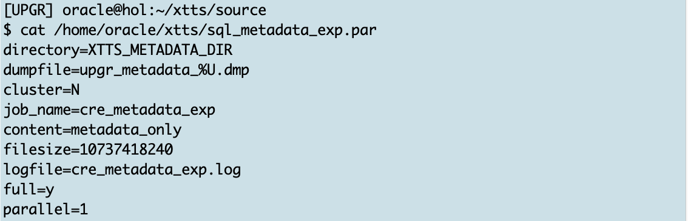
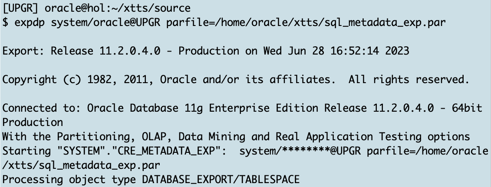
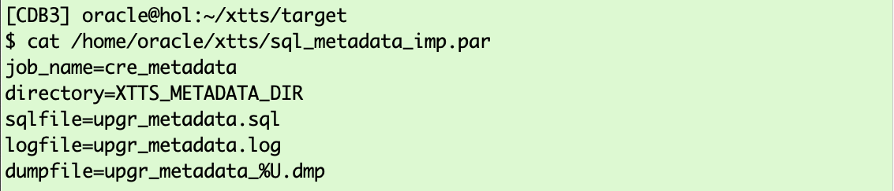
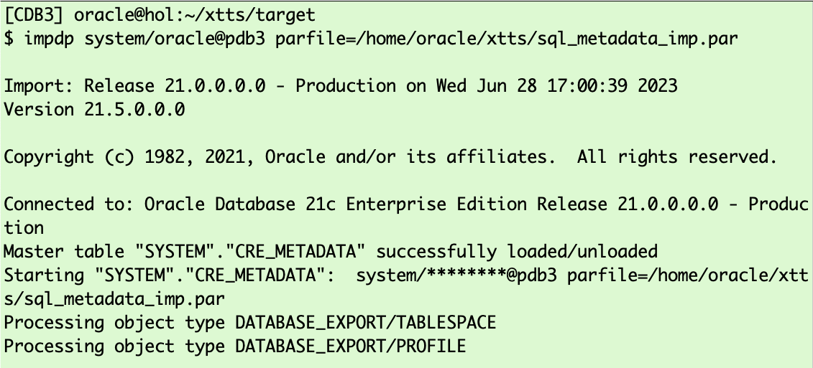
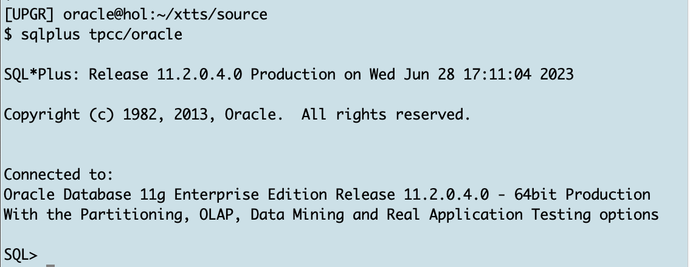
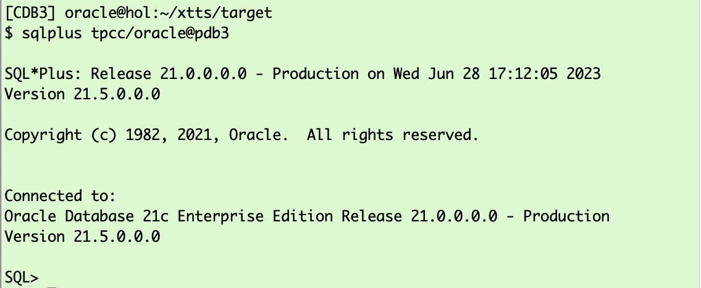
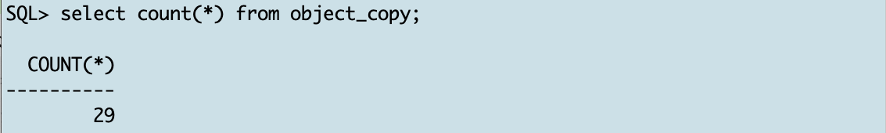
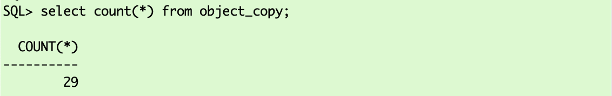
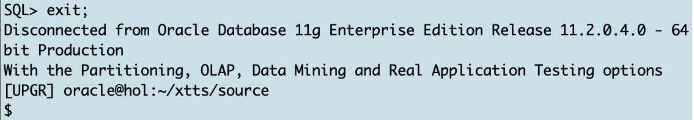
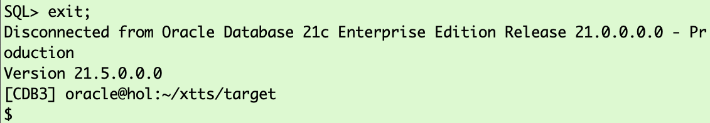

# Checks  

## Introduction

This final lab lists some checks you might perform after a migration. It also gives you a quick way to create a metadata SQL output for all objects in your database.

Estimated Time: 15 minutes

### Objectives

- Export metadata using Data Pump
- Import metadata using Data Pump


### Prerequisites

This lab assumes you have:

- Connected to the lab
- A terminal window open on the source
- Another terminal window open on the target
- Prepared the source
- Successfully executed initial backup (prepare phase)
- Successfully executed initial restore (prepare phase)
- Successfully executed incremental backup(s) (roll forward phase)
- Successfully executed incremental restore(s) (roll forward phase)
- Successfully executed final backup (transport phase)
- Successfully executed final restore (transport phase)
- Executed the TTS export and import (transport phase)


## Task 1: Metadata Export (SOURCE)
Sometimes you need to analyze the root cause of an import failure. Did you know, you can extract the metadata of your database into a regular text file using Data Pump?

1. Prepared Export Data Pump Parameter File (SOURCE)

    ```
    <copy>
    cat /home/oracle/xtts/sql_metadata_exp.par
    </copy>
    ```

    

    <details>
    <summary>*click here if you want to see the Data Pump export parameter file and a short description*</summary>


    | Parameter | Comment |
    | :-------- | :-----|
    | directory=XTTS\_METADATA\_DIR | Specifies the default location to which export can write the dump file set and the log file |
    | dumpfile=upgr\_metadata\_%U.dmp | Is the name of the dump file |
    | cluster=N | Restricts to execute the current job on the node where it was started  |
    | job_name=cre\_metadata\_exp | Specifies a job name for the metadata export  |
    | content=metadata\_only | Exports only metadata  |
    | filesize=10737418240 | Restricts the export of the Data Pump export to given amount of bytes  |
    | logfile=cre\_metadata\_exp.log | This parameter specifies the name for the log file of the export job. |
    | full=y | FULL specifies that you want to perform a full database mode export  |
    | parallel=1 | In 11.2 metadata is only exported with parallelism of 1  |
    {: title="Data Pump Metadata Export Parameter File"}

    </details>

2. Execute Export Data Pump (SOURCE) </br>
Execute a metadata export using this par file:

    ```
    <copy>
    expdp system/oracle@UPGR parfile=/home/oracle/xtts/sql_metadata_exp.par
    </copy>
    ```

    

    <details>
    <summary>*click here to see the full metadata EXPDP log file*</summary>

    ``` text
    [UPGR] oracle@hol:~/xtts/source
    $ expdp system/oracle@UPGR parfile=/home/oracle/xtts/sql_metadata_exp.par

    Export: Release 11.2.0.4.0 - Production on Wed Jun 28 16:52:14 2023

    Copyright (c) 1982, 2011, Oracle and/or its affiliates.  All rights reserved.

    Connected to: Oracle Database 11g Enterprise Edition Release 11.2.0.4.0 - 64bit Production
    With the Partitioning, OLAP, Data Mining and Real Application Testing options
    Starting "SYSTEM"."CRE_METADATA_EXP":  system/********@UPGR parfile=/home/oracle/xtts/sql_metadata_exp.par
    Processing object type DATABASE_EXPORT/TABLESPACE
    Processing object type DATABASE_EXPORT/PROFILE
    Processing object type DATABASE_EXPORT/SYS_USER/USER
    Processing object type DATABASE_EXPORT/SCHEMA/USER
    Processing object type DATABASE_EXPORT/ROLE
    Processing object type DATABASE_EXPORT/GRANT/SYSTEM_GRANT/PROC_SYSTEM_GRANT
    Processing object type DATABASE_EXPORT/SCHEMA/GRANT/SYSTEM_GRANT
    Processing object type DATABASE_EXPORT/SCHEMA/ROLE_GRANT
    Processing object type DATABASE_EXPORT/SCHEMA/DEFAULT_ROLE
    Processing object type DATABASE_EXPORT/SCHEMA/TABLESPACE_QUOTA
    Processing object type DATABASE_EXPORT/RESOURCE_COST
    Processing object type DATABASE_EXPORT/TRUSTED_DB_LINK
    Processing object type DATABASE_EXPORT/SCHEMA/SEQUENCE/SEQUENCE
    Processing object type DATABASE_EXPORT/DIRECTORY/DIRECTORY
    Processing object type DATABASE_EXPORT/DIRECTORY/GRANT/OWNER_GRANT/OBJECT_GRANT
    Processing object type DATABASE_EXPORT/CONTEXT
    Processing object type DATABASE_EXPORT/SCHEMA/PUBLIC_SYNONYM/SYNONYM
    Processing object type DATABASE_EXPORT/SCHEMA/SYNONYM
    Processing object type DATABASE_EXPORT/SCHEMA/TYPE/TYPE_SPEC
    Processing object type DATABASE_EXPORT/SYSTEM_PROCOBJACT/PRE_SYSTEM_ACTIONS/PROCACT_SYSTEM
    Processing object type DATABASE_EXPORT/SYSTEM_PROCOBJACT/PROCOBJ
    Processing object type DATABASE_EXPORT/SYSTEM_PROCOBJACT/POST_SYSTEM_ACTIONS/PROCACT_SYSTEM
    Processing object type DATABASE_EXPORT/SCHEMA/PROCACT_SCHEMA
    Processing object type DATABASE_EXPORT/SCHEMA/TABLE/TABLE
    Processing object type DATABASE_EXPORT/SCHEMA/TABLE/PRE_TABLE_ACTION
    Processing object type DATABASE_EXPORT/SCHEMA/TABLE/GRANT/OWNER_GRANT/OBJECT_GRANT
    Processing object type DATABASE_EXPORT/SCHEMA/TABLE/COMMENT
    Processing object type DATABASE_EXPORT/SCHEMA/PACKAGE/PACKAGE_SPEC
    Processing object type DATABASE_EXPORT/SCHEMA/FUNCTION/FUNCTION
    Processing object type DATABASE_EXPORT/SCHEMA/PROCEDURE/PROCEDURE
    Processing object type DATABASE_EXPORT/SCHEMA/PACKAGE/COMPILE_PACKAGE/PACKAGE_SPEC/ALTER_PACKAGE_SPEC
    Processing object type DATABASE_EXPORT/SCHEMA/FUNCTION/ALTER_FUNCTION
    Processing object type DATABASE_EXPORT/SCHEMA/PROCEDURE/ALTER_PROCEDURE
    Processing object type DATABASE_EXPORT/SCHEMA/TABLE/INDEX/INDEX
    Processing object type DATABASE_EXPORT/SCHEMA/TABLE/CONSTRAINT/CONSTRAINT
    Processing object type DATABASE_EXPORT/SCHEMA/TABLE/INDEX/STATISTICS/INDEX_STATISTICS
    Processing object type DATABASE_EXPORT/SCHEMA/VIEW/VIEW
    Processing object type DATABASE_EXPORT/SCHEMA/VIEW/GRANT/OWNER_GRANT/OBJECT_GRANT
    Processing object type DATABASE_EXPORT/SCHEMA/VIEW/COMMENT
    Processing object type DATABASE_EXPORT/SCHEMA/PACKAGE_BODIES/PACKAGE/PACKAGE_BODY
    Processing object type DATABASE_EXPORT/SCHEMA/TABLE/CONSTRAINT/REF_CONSTRAINT
    Processing object type DATABASE_EXPORT/SCHEMA/TABLE/STATISTICS/TABLE_STATISTICS
    Processing object type DATABASE_EXPORT/SCHEMA/TABLE/POST_TABLE_ACTION
    Processing object type DATABASE_EXPORT/SCHEMA/TABLE/TRIGGER
    Processing object type DATABASE_EXPORT/SCHEMA/POST_SCHEMA/PROCACT_SCHEMA
    Processing object type DATABASE_EXPORT/AUDIT
    Master table "SYSTEM"."CRE_METADATA_EXP" successfully loaded/unloaded
    ******************************************************************************
    Dump file set for SYSTEM.CRE_METADATA_EXP is:
      /home/oracle/xtts/dump/upgr_metadata_01.dmp
    Job "SYSTEM"."CRE_METADATA_EXP" successfully completed at Wed Jun 28 16:53:02 2023 elapsed 0 00:00:47

    [UPGR] oracle@hol:~/xtts/source
    $
    ```
    </details>


## Task 2: Generate Metadata SQL Using Import (TARGET)

1. Prepared Metadata SQL Import Parameter File

    ```
    <copy>
    cat /home/oracle/xtts/sql_metadata_imp.par
    </copy>
    ```

    

    <details>
    <summary>*click here if you want to see the Data Pump import parameter file and a short description*</summary>


    | Parameter | Comment |
    | :-------- | :-----|
    | DIRECTORY=XTTS\_METADATA\_DIR | Specifies the default location to which Export can write the dump file set and the log file |
    | DUMPFILE=exp\_metadata.dmp | Is the name of the dump file |
    | logfile=xtts\_export\_metadata.log | This parameter specifies the name for the log file of the export job. |
    | sqlfile=upgr\_metadata.sql | The name of the file containing SQL statements of the metadata  |
    | job\_name=cre\_metadata | The name of the import Data Pump job  |
    {: title="Data Pump Metadata Import SQL Parameter File"}

    </details>

    So you're going to create a SQL file containing all metadata called "upgr\_metadata.sql" located in the database directory "XTTS\_METADATA\_DIR" 


2.  Generating Metadata SQL

    ```
    <copy>
    impdp system/oracle@pdb3 parfile=/home/oracle/xtts/sql_metadata_imp.par
    </copy>
    ```

    

    <details>
    <summary>*click here to see the full metadata IMPDP log file*</summary>

    ``` text
    [CDB3] oracle@hol:~/xtts/target
    $ impdp system/oracle@pdb3 parfile=/home/oracle/xtts/sql_metadata_imp.par

    Import: Release 21.0.0.0.0 - Production on Wed Jun 28 17:00:39 2023
    Version 21.5.0.0.0

    Copyright (c) 1982, 2021, Oracle and/or its affiliates.  All rights reserved.


    Connected to: Oracle Database 21c Enterprise Edition Release 21.0.0.0.0 - Production
    Master table "SYSTEM"."CRE_METADATA" successfully loaded/unloaded
    Starting "SYSTEM"."CRE_METADATA":  system/********@pdb3 parfile=/home/oracle/xtts/sql_metadata_imp.par
    Processing object type DATABASE_EXPORT/TABLESPACE
    Processing object type DATABASE_EXPORT/PROFILE
    Processing object type DATABASE_EXPORT/SYS_USER/USER
    Processing object type DATABASE_EXPORT/SCHEMA/USER
    Processing object type DATABASE_EXPORT/ROLE
    Processing object type DATABASE_EXPORT/GRANT/SYSTEM_GRANT/PROC_SYSTEM_GRANT
    Processing object type DATABASE_EXPORT/SCHEMA/GRANT/SYSTEM_GRANT
    Processing object type DATABASE_EXPORT/SCHEMA/ROLE_GRANT
    Processing object type DATABASE_EXPORT/SCHEMA/DEFAULT_ROLE
    Processing object type DATABASE_EXPORT/SCHEMA/TABLESPACE_QUOTA
    Processing object type DATABASE_EXPORT/RESOURCE_COST
    Processing object type DATABASE_EXPORT/TRUSTED_DB_LINK
    Processing object type DATABASE_EXPORT/SCHEMA/SEQUENCE/SEQUENCE
    Processing object type DATABASE_EXPORT/DIRECTORY/DIRECTORY
    Processing object type DATABASE_EXPORT/DIRECTORY/GRANT/OWNER_GRANT/OBJECT_GRANT
    Processing object type DATABASE_EXPORT/CONTEXT
    Processing object type DATABASE_EXPORT/SCHEMA/TYPE/TYPE_SPEC
    Processing object type DATABASE_EXPORT/SYSTEM_PROCOBJACT/PRE_SYSTEM_ACTIONS/PROCACT_SYSTEM
    Processing object type DATABASE_EXPORT/SYSTEM_PROCOBJACT/PROCOBJ
    Processing object type DATABASE_EXPORT/SYSTEM_PROCOBJACT/POST_SYSTEM_ACTIONS/PROCACT_SYSTEM
    Processing object type DATABASE_EXPORT/SCHEMA/PROCACT_SCHEMA
    Processing object type DATABASE_EXPORT/SCHEMA/TABLE/TABLE
    Processing object type DATABASE_EXPORT/SCHEMA/TABLE/PRE_TABLE_ACTION
    Processing object type DATABASE_EXPORT/SCHEMA/TABLE/GRANT/OWNER_GRANT/OBJECT_GRANT
    Processing object type DATABASE_EXPORT/SCHEMA/TABLE/COMMENT
    Processing object type DATABASE_EXPORT/SCHEMA/PACKAGE/PACKAGE_SPEC
    Processing object type DATABASE_EXPORT/SCHEMA/PROCEDURE/PROCEDURE
    Processing object type DATABASE_EXPORT/SCHEMA/PACKAGE/COMPILE_PACKAGE/PACKAGE_SPEC/ALTER_PACKAGE_SPEC
    Processing object type DATABASE_EXPORT/SCHEMA/PROCEDURE/ALTER_PROCEDURE
    Processing object type DATABASE_EXPORT/SCHEMA/TABLE/INDEX/INDEX
    Processing object type DATABASE_EXPORT/SCHEMA/TABLE/CONSTRAINT/CONSTRAINT
    Processing object type DATABASE_EXPORT/SCHEMA/TABLE/INDEX/STATISTICS/INDEX_STATISTICS
    Processing object type DATABASE_EXPORT/SCHEMA/VIEW/VIEW
    Processing object type DATABASE_EXPORT/SCHEMA/PACKAGE_BODIES/PACKAGE/PACKAGE_BODY
    Processing object type DATABASE_EXPORT/SCHEMA/TABLE/CONSTRAINT/REF_CONSTRAINT
    Processing object type DATABASE_EXPORT/SCHEMA/TABLE/STATISTICS/TABLE_STATISTICS
    Processing object type DATABASE_EXPORT/SCHEMA/TABLE/POST_TABLE_ACTION
    Processing object type DATABASE_EXPORT/SCHEMA/TABLE/TRIGGER
    Processing object type DATABASE_EXPORT/SCHEMA/POST_SCHEMA/PROCACT_SCHEMA
    Processing object type DATABASE_EXPORT/AUDIT
    Job "SYSTEM"."CRE_METADATA" successfully completed at Wed Jun 28 17:01:00 2023 elapsed 0 00:00:15

    [CDB3] oracle@hol:~/xtts/target
    $
    ```
    </details>

    If you want to take a look at the metadata SQL file, you can use this command on __target__:

    ```
    <copy>
    more /home/oracle/xtts/dump/upgr_metadata.sql
    </copy>
    ```

     


## Task  3: Check 
Do you remember creating a table "object_copy" in "tpcc" at the beginning of the roll forward phase?
You can now check if source and target match using SQL*Plus:

1. Open SQL*Plus (SOURCE)

    ```
    <copy>
    sqlplus tpcc/oracle
    </copy>
    ```

     

2. Open SQL*Plus (TARGET)

    ```
    <copy>
    sqlplus tpcc/oracle@pdb3
    </copy>
    ```

     

3. SQL Statement (SOURCE and TARGET)

    ```
    <copy>
    select count(*) from object_copy;
    </copy>
    ```

    | Output Source | Output Target |
    | :--------: | :-----:|
    |   |  |
    {: title="Compare table on source and target"}

4. Exit SQL*Plus (SOURCE and TARGET)

    ```
    <copy>
    exit
    </copy>
    ```

    Output on __source__:

    

    and output on __target__:

    


## Congratulations! 
You successfully completed all stages of this XTTS lab migrating an Oracle 11g database directly into a 21c PDB!

## Acknowledgments
* **Author** - Klaus Gronau
* **Contributors** Mike Dietrich, Daniel Overby Hansen  
* **Last Updated By/Date** - Klaus Gronau, June 2023
