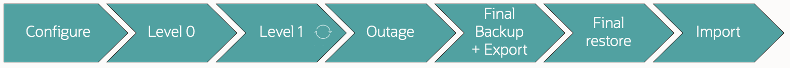

# Introduction

## About this Workshop

In this lab, you will migrate a non-CDB database on Oracle Database 19c  directly into a PDB on Oracle Database 23ai using a combination of transportable tablespaces, full transportable export/import, and RMAN backups. For this purpose, Oracle delivers the M5 script, which automates the steps and makes such migrations easier. You will use the M5 script for the migration.

Typically, the procedure is used for cross-platform migrations from big-endian platforms, like AIX and SPARC/Solaris, to little-endian platforms, like the Exadata Database Machine. It requires that the source and target databases are on Oracle Database 19c (Release Update 18) or later and uses the [Data Pump Bundle Patch](https://support.oracle.com/epmos/faces/DocumentDisplay?id=2819284.1).

For simplicity, this lab teaches you to migrate a database from Linux to Linux, but the script and procedures are identical to those of a cross-platform migration.

Estimated Workshop Time: 1 hour

[Next-Level Platform Migration with Cross-Platform Transportable Tablespaces -  Introduction](youtube:fgyDy-QcV_o?start=10)

### Objectives

In this workshop, you will:

* Migrate a non-CDB database directly into a PDB
* Migrate from Oracle Database 19c to Oracle Database 23ai
* Use the M5 script
* Use RMAN incremental backups to minimize downtime
* Use full transportable export/import

## About the workshop contents

This workshop comes with pre-installed Oracle homes and pre-created databases.
You can switch between environments using the shortcuts shown in the last column of the diagram below.

This lab uses only the *FTEX* and *CDB23* databases. You will create a new PDB, *VIOLET*, in *CDB23*. 

The diagram shows the different phases of the migration.

* *Configure* - You download and configure the M5 script and create a new empty target database.
* *Level 0* - You start the initial level 0 backup and restore the data files in the target database.
* *Level 1* - You do incremental backup and restore. You repeat this process as many times as needed.
* *Outage* - The maintenance window begins.
* *Final backup* - You set tablespaces read-only and perform the final incremental backup. In addition, you perform a Data Pump full transportable export.
* *Final restore* - You restore the final incremental backup.
* *Import* - You start a full transportable import.

## Migration methods and processes

### TTS

Transportable tablespaces transports data that resides in user-defined tablespaces. Use the transportable tablespaces feature to move a set of tablespaces between databases.

### FTEX

Full transportable export/import combines the ease of use familiar to users of original Export/Import and Data Pump export/import, with the speed of migration possible with transportable tablespaces.

### RMAN 

You can use RMAN to transport tablespaces across platforms with different endian formats. An incremental backup copies only those data blocks that have changed since a previous backup. You use incremental backups to minimize downtime while data files are copied to the new database.

### M5

M5 is an Oracle script that combines different existing methods to migrate a database. The result is a simple, reliable, and fast migration solution with minimal downtime.

M5 procedure supports:
* Encrypted tablespaces
* Use of multisection backups (for bigfile tablespaces)
* Compressed backup sets (requires appropriate license)
* Better parallelism than previous methods

You may now *proceed to the next lab*.

## Learn More

* [Webinar, Cross Platform Migration – Transportable Tablespaces to the Extreme](https://dohdatabase.com/webinars/)
* [M5 Cross Endian Platform Migration using Full Transportable Data Pump Export/Import and RMAN Incremental Backups (Doc ID 2999157.1)](https://support.oracle.com/epmos/faces/DocumentDisplay?id=2999157.1)
* [Blog post series](https://dohdatabase.com/xtts/)
* [YouTube channel](https://www.youtube.com/@upgradenow/)

## Acknowledgments
* **Author** - Daniel Overby Hansen
* **Contributors** - Rodrigo Jorge, Mike Dietrich, Klaus Gronau, Alex Zaballa
* **Last Updated By/Date** - Daniel Overby Hansen, July 2024
