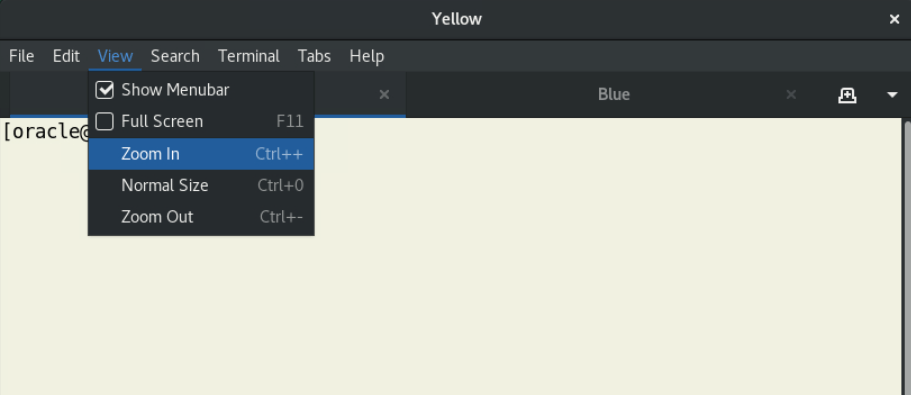

# Initialize Environment

## Introduction

In this lab, you will review and start-up all components required to run this workshop successfully.

Estimated Time: 5 Minutes.

### Objectives

In this lab, you will:

* Familiarize yourself with the workshop environment
* Initialize the workshop environment

## Task 1: Familiarize yourself with the workshop environment

1. The easiest way to complete the lab is to copy/paste the lab instructions directly into a terminal. Be sure to execute all commands in a code block. After pasting, you must hit *RETURN*.

2. Before copy/pasting, take notice of the commands that you execute; it is important to understand what the commands will do.

3. You can use any terminal to run the lab. The lab sets the environment when appropriate.

4. Double-click on the *Terminal* shortcut on the desktop. 


5. The terminal has two tabs, *yellow* and *blue*. You can use any of them to perform the labs. All labs start by setting the appropriate environment.

6. Optionally, in the terminal, you can zoom in to make the text larger. 

    

## Task 2: Initialize the workshop environment

1. Open a terminal or use an existing one. When you start the lab, the following components should be started.

    - Database Listener
        - LISTENER
    - Database Server Instances
        - FTEX
        - CDB23

2. Ensure the listener is started.

    ```
    <copy>
    ps -ef | grep LISTENER | grep -v grep
    </copy>
    ```

    <details>
    <summary>*click to see the output*</summary>
    ``` text
    $ ps -ef | grep LISTENER | grep -v grep
    oracle     11158       1  0 04:57 ?        00:00:00 /u01/app/oracle/product/23/bin/tnslsnr LISTENER -inherit
    ```
    </details>

3. Ensure that the databases (*FTEX* and *CDB23*) are started.

    ```
    <copy>
    ps -ef | grep ora_ | grep pmon | grep -v grep
    </copy>
    ```

    * You might see other databases started as well. It doesn't matter.

    <details>
    <summary>*click to see the output*</summary>
    ``` text
    $ ps -ef | grep ora_ | grep pmon | grep -v grep
    oracle      3851       1  0 20:19 ?        00:00:00 ora_pmon_UPGR
    oracle      5110       1  0 20:19 ?        00:00:00 ora_pmon_FTEX
    oracle      5345       1  0 20:19 ?        00:00:00 ora_pmon_CDB23
    ```
    </details>

You may now *proceed to the next lab*.

## Acknowledgments

* **Author** - Daniel Overby Hansen
* **Contributors** - Rodrigo Jorge, Mike Dietrich, Klaus Gronau, Alex Zaballa
* **Last Updated By/Date** - Daniel Overby Hansen, July 2024
