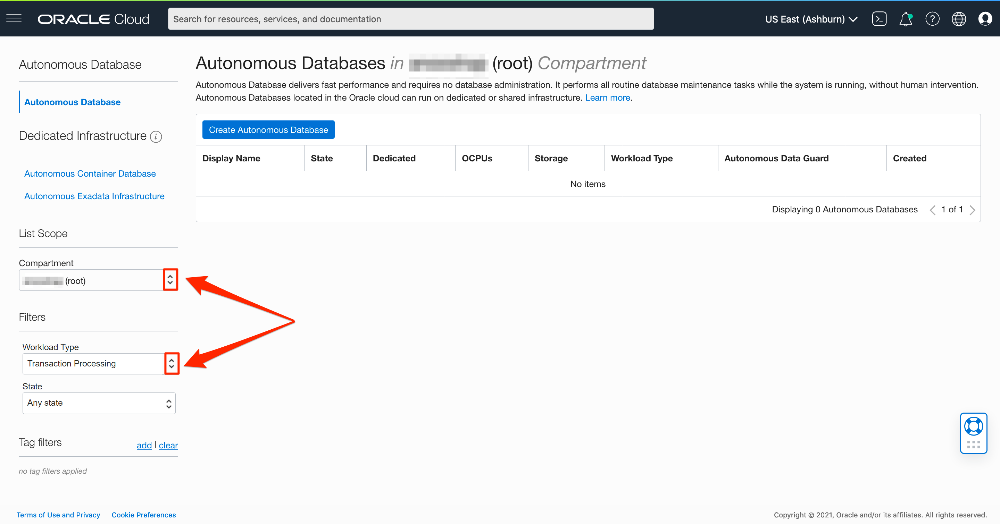
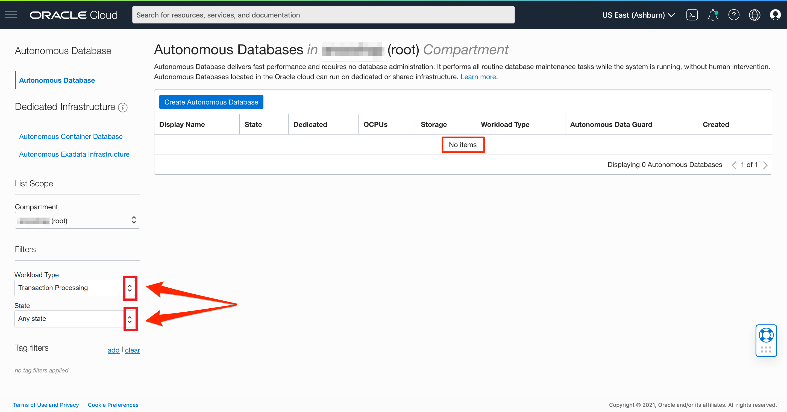
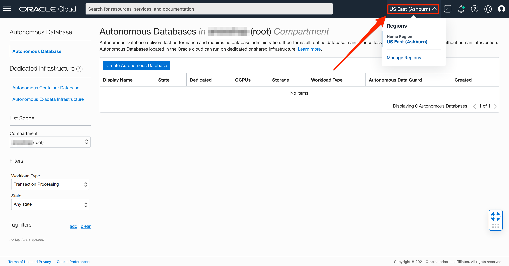
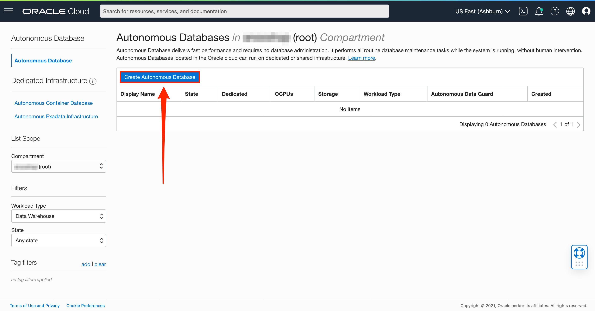
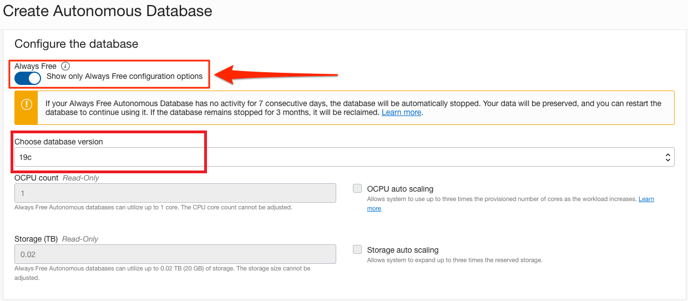
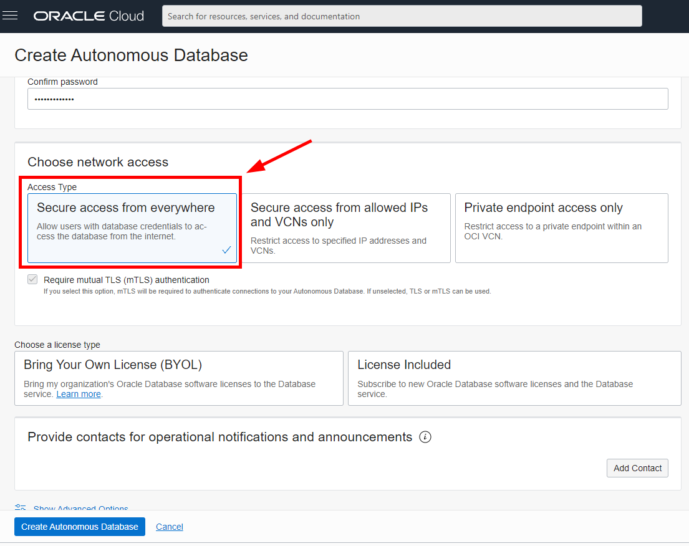
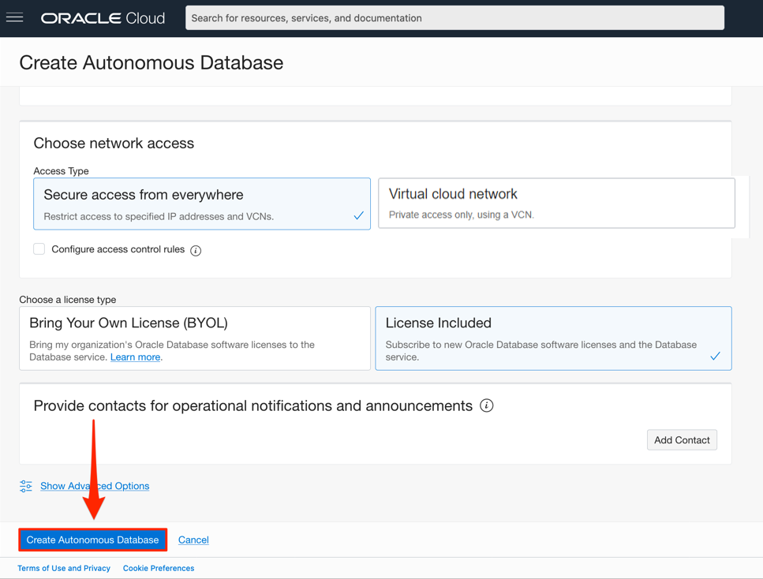
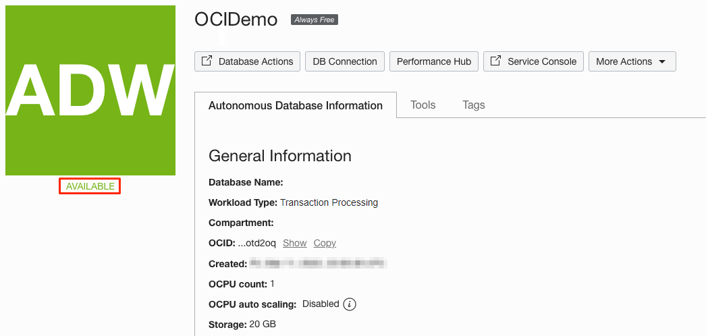

# Provision an Oracle Autonomous Database (ADW and ATP)

## Introduction

This lab walks you through the steps to get started using the Oracle Autonomous Database (Autonomous Data Warehouse [ADW] and Autonomous Transaction Processing [ATP]) on Oracle Cloud. In this lab, you will provision a new ATP instance.

 **Note:** While this lab uses ATP, the steps are the same for creating an ADW database.

Estimated Time: 5 minutes

Watch the video below for a quick walk through of the lab.

[Provision Autonomous Database Instance](youtube:a6Jm7lYaCWI)

### Objectives

In this lab, you will:

-   Learn how to provision a new Oracle Autonomous Database

### Prerequisites

- This lab requires completion of the Get Started section in the Contents menu on the left.

## Task 1: Choose ADW or ATP from the services menu

1. Log in to the Oracle Cloud.
2. Once you log in, the cloud services dashboard shows all the services available to you. Click the navigation menu in the upper left to show top level navigation choices.

    > **Note:** You can also directly access your Autonomous Data Warehouse or Autonomous Transaction Processing service in the __Quick Actions__ section of the dashboard.

    

3. The following steps apply similarly to either Autonomous Data Warehouse or Autonomous Transaction Processing. This lab shows provisioning of an Autonomous Data Warehouse database, so click **Oracle Database**, then **Autonomous Transaction Processing**.

    

4. Make sure your Workload Type is **Transaction Processing** or **All** to see your Autonomous Data Warehouse instances. Use the **List Scope** drop-down menu to select a compartment. 

    
 

5. This console shows that no databases yet exist. If there were a long list of databases, you could filter the list by the **State** of the databases (Available, Stopped, Terminated). You can also sort by **Workload Type**. In this example, **Data Warehouse** is the workload type.

    

6. If you are using a Free Trial or Always Free account, and you want to use Always Free Resources, you need to be in a region where Always Free Resources are available. You can see your current default **region** in the top, right hand corner of the page.

    

## Task 2: Create an Oracle Autonomous Database instance

1. Click **Create Autonomous Database** to start the instance creation process.

    

2.  This brings up the *Create Autonomous Database* screen where you will specify the configuration of the instance.

3. Specify basic information for the autonomous database:

    | **Field**  | **Value** | Note |
    |---|---|---|
    | Compartment | (Defaut) | |
    | Display Name | `OCIDemo` | Enter a memorable name for the database for display purposes |
    | Database Name | `OCIDEMO` | Use letters and numbers only, starting with a letter. Maximum length is 14 characters. |
    |

4. Choose a workload type. Select the workload type for your database from the choices:

    - **Transaction Processing** - For this lab, choose **Transaction Processing** as the workload type.
    - **Data Warehouse** - Or, you could have chosen Data Warehouse as the workload type.

    

5. Choose a deployment type. Select the deployment type for your database from the choices:

    - **Shared Infrastructure** - For this lab, choose **Shared Infrastructure** as the deployment type.
    - **Dedicated Infrastructure** - Or, you could have chosen Dedicated Infrastructure as the deployment type.

6. Configure the database:

    - **Always Free** - If your Cloud Account is an Always Free account, you can select this option to create an always free autonomous database. An always free database comes with 1 CPU and 20 GB of storage. For this lab, we recommend you check **Always Free** option.
    - **Choose database version** - Select database version 19c from the available versions.
    - **OCPU count** - Number of CPUs for your service. For this lab, specify **1 CPU**. If you choose an Always Free database, it comes with 1 CPU.
    - **Storage (TB)** - Select your storage capacity in terabytes. For this lab, specify **1 TB** of storage. Or, if you choose an Always Free database, it comes with 20 GB of storage.
    - **Auto Scaling** - For always free accounts (this lab), auto scaling will be disabled.
    - **New Database Preview** - If a checkbox is available to preview a new database version, do NOT select it.

    > **Note:** You cannot scale up/down an Always Free autonomous database.

    

7. Create administrator credentials:

    - **Password and Confirm Password** - Specify the password for *ADMIN* user of the service instance. The password must meet the following requirements:
    - The password must be between 12 and 30 characters long and must include at least one uppercase letter, one lowercase letter, and one numeric character.
    - The password cannot contain the username.
    - The password cannot contain the double quote (") character.
    - The password must be different from the last 4 passwords used.
    - The password must not be the same password that you set less than 24 hours ago.
    - Re-enter the password to confirm it. Make a note of this password.

8. Choose network access:
    - For this lab, accept the default, **Secure access from everywhere**.
    - If you want to restrict access to specified IP addresses and VCNs, select "Secure access from allowed IPs and VCNs only." You can control and restrict access to your Autonomous Database by setting network access control lists (ACLs). You can select from 4 IP notation types: IP Address, CIDR Block, Virtual Cloud Network, Virtual Cloud Network OCID).
    - If you want a private endpoint, to enable traffic only from the VCN you specify - and to block access to the database from all public IPs or VCNs, select "Private endpoint access only" in the Choose network access area.
    - If you select "Secure access from allowed IPs and VCNs only" or "Private endpoint access only", you can use the checkbox to require mutual TLS (mTLS) authentication to authenticate connections to your database. If you don't select this checkbox, TLS or mTLS can be used.

    

9. Choose a license type. For this lab, choose **License Included**. The two license types are:

    - **Bring Your Own License (BYOL)** - Select this type when your organization has existing database licenses.
    - **License Included** - Select this type when you want to subscribe to new database software licenses and the database cloud service.

    

10. Click **Create Autonomous Database**.

    

11.  Your instance will begin provisioning. In a few minutes, the state will turn from *Provisioning* to *Available*. At this point, your Autonomous Data Warehouse database is ready to use! Have a look at your instance's details here including its name, database version, OCPU count, and storage size.

    

Please *proceed to the next lab*.

## Learn more

Go to [the documentation](https://docs.oracle.com/en/cloud/paas/autonomous-data-warehouse-cloud/user/autonomous-workflow.html#GUID-5780368D-6D40-475C-8DEB-DBA14BA675C3) on the typical workflow for using Autonomous Data Warehouse.

## Acknowledgements

- **Author** - Nilay Panchal, Oracle Autonomous Database Product Management
- **Adapted for Cloud by** - Richard Green, Principal Developer, Database User Assistance
- **Contributors** - Killian Lynch, Product Manager. Oracle LiveLabs QA Team (Jeffrey Malcolm Jr, Intern | Arabella Yao, Product Manager Intern)
- **Last Updated By/Date** - Killian Lynch (July 2022)
