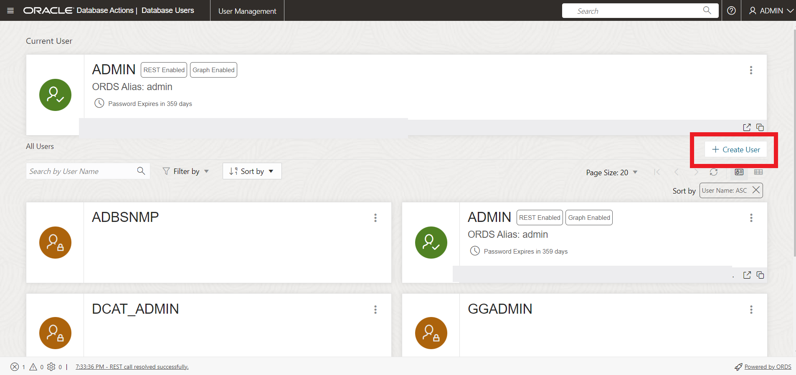
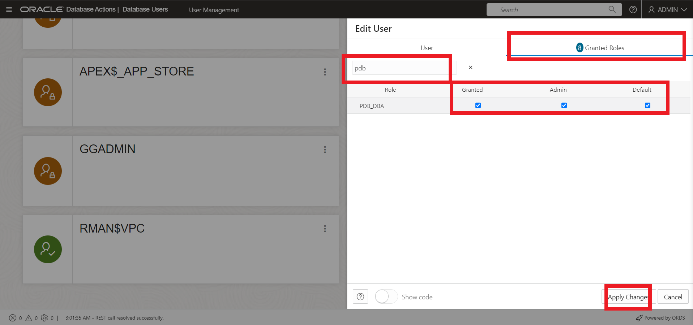
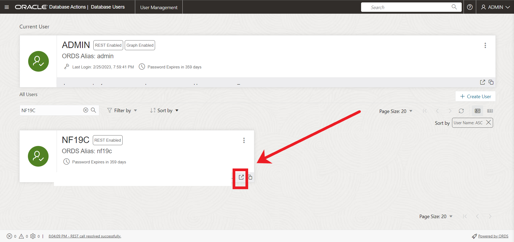
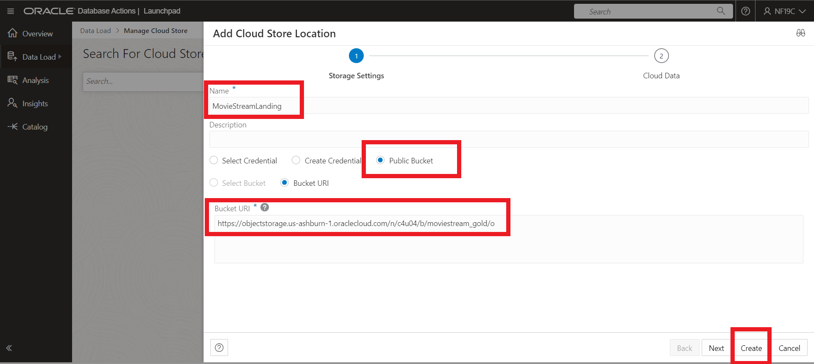
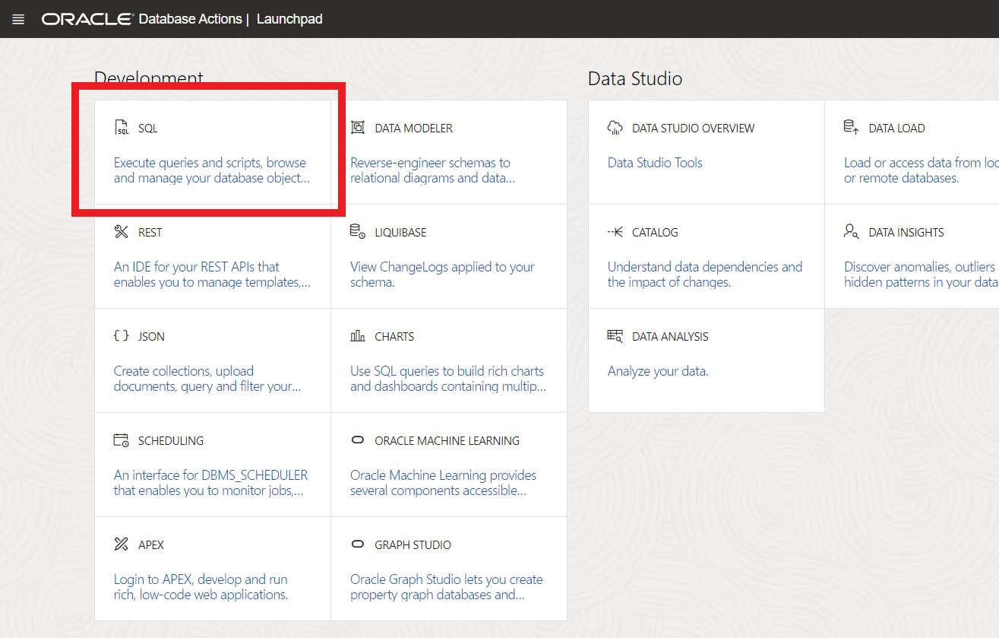

# Provision an Oracle Autonomous Database (ADW and ATP)

## Introduction

This lab provides a step-by-step guide to help you get started using the Oracle Autonomous Database (Autonomous Data Warehouse [ADW] and Autonomous Transaction Processing [ATP]) on Oracle Cloud. In this lab, you will learn how to provision a new ATP instance.

**Note:** While this lab uses ATP, the steps are the same for creating an ADW database.

Estimated Time: 5 minutes

Watch the video below for a quick walk through of the lab.

[Provision Autonomous Database Instance](youtube:a6Jm7lYaCWI)

### Objectives

In this lab, you will:

- Learn how to provision a new Oracle Autonomous Database

### Prerequisites

- Completion of the Get Started section in the Contents menu on the left is required for this lab.

## Task 1: Choose ADW or ATP from the services menu

1. Log in to the Oracle Cloud.
2. Once logged in, the cloud services dashboard displays all the available services. Click the navigation menu in the upper left to show top-level navigation choices.

    > **Note:** You can also directly access your Autonomous Data Warehouse or Autonomous Transaction Processing service in the __Quick Actions__ section of the dashboard.

    

3. The following steps apply similarly to either Autonomous Data Warehouse or Autonomous Transaction Processing. This lab shows provisioning of an Autonomous Transaction Processing database, so click **Oracle Database**, then **Autonomous Transaction Processing**.

    

4. In the **List Scope** drop-down menu, select **Transaction Processing** or **All** to see your Autonomous Transaction Processing instances.

    
 

5. This console shows that no databases yet exist. If there were a long list of databases, you could filter the list by the **State** of the databases (Available, Stopped, Terminated). You can also sort by **Workload Type**. In this example, **Transaction Processing** is the workload type.

    

6. If you are using a Free Trial or Always Free account, and you want to use Always Free Resources, you need to be in a region where Always Free Resources are available. You can see your current default **region** in the top right-hand corner of the page.

    


## Task 2: Create an Oracle Autonomous Database instance

1. Start the instance creation process by clicking on the "Create Autonomous Database" button.

    


2.  Clicking on the "Create Autonomous Database" button will bring up the configuration screen.


3. Specify basic information for the autonomous database:

    | **Field**  | **Value** | Note |
    |---|---|---|
    | Compartment | (Defaut) | |
    | Display Name | `OCIDemo` | Enter a memorable name for the database for display purposes |
    | Database Name | `OCIDEMO` | Use letters and numbers only, starting with a letter. Maximum length is 14 characters. |
    |


4. Choose a workload type. Select the workload type for your database from the choices:

    - **Transaction Processing** - For this lab, choose **Transaction Processing** as the workload type.
    - **Data Warehouse** 

    


5. Choose a deployment type. Select the deployment type for your database from the choices:

    - **Shared Infrastructure** - For this lab, choose **Shared Infrastructure** as the deployment type.
    - **Dedicated Infrastructure** - Or, you could have chosen Dedicated Infrastructure as the deployment type.


6. Configure the database:

    - **Always Free** - If your Cloud Account is an Always Free account, you can select this option to create an always free autonomous database. An always free database comes with 1 CPU and 20 GB of storage. For this lab, we recommend you check **Always Free** option.
    - **Choose database version** - Select database version 19c from the available versions.
    - **OCPU count** - Number of CPUs for your service. For this lab, specify **1 CPU**. If you choose an Always Free database, it comes with 1 CPU.
    - **Storage (TB)** - Select your storage capacity in terabytes. For this lab, specify **1 TB** of storage. Or, if you choose an Always Free database, it comes with 20 GB of storage.
    - **Auto Scaling** - For always free accounts (this lab), auto scaling will be disabled.
    - **New Database Preview** - If a checkbox is available to preview a new database version, do NOT select it.

    > **Note:** You cannot scale up/down an Always Free autonomous database.

    


7. Create administrator credentials:

    - **Password and Confirm Password** - Specify the password for *ADMIN* user of the service instance. The password must meet the following requirements:
    - The password must be between 12 and 30 characters long and must include at least one uppercase letter, one lowercase letter, and one numeric character.
    - The password cannot contain the username.
    - The password cannot contain the double quote (") character.
    - The password must be different from the last 4 passwords used.
    - The password must not be the same password that you set less than 24 hours ago.
    - Re-enter the password to confirm it. Make a note of this password.


8. Choose network access:
    - For this lab, accept the default, **Secure access from everywhere**.
    - If you want to restrict access to specified IP addresses and VCNs, select "Secure access from allowed IPs and VCNs only." You can control and restrict access to your Autonomous Database by setting network access control lists (ACLs). You can select from 4 IP notation types: IP Address, CIDR Block, Virtual Cloud Network, Virtual Cloud Network OCID).
    - If you want a private endpoint, to enable traffic only from the VCN you specify - and to block access to the database from all public IPs or VCNs, select "Private endpoint access only" in the Choose network access area.
    - If you select "Secure access from allowed IPs and VCNs only" or "Private endpoint access only", you can use the checkbox to require mutual TLS (mTLS) authentication to authenticate connections to your database. If you don't select this checkbox, TLS or mTLS can be used.

    


9. Choose a license type. For this lab, choose **License Included**. The two license types are:


    - **Bring Your Own License (BYOL)** - Select this type when your organization has existing database licenses.
    - **License Included** - Select this type when you want to subscribe to new database software licenses and the database cloud service.


    


10. Click **Create Autonomous Database**.

    

11.  Your instance will begin provisioning. In a few minutes, the state will turn from *Provisioning* to *Available*. At this point, your Autonomous Transaction Processing database is ready to use! Have a look at your instance's details here including its name, database version, OCPU count, and storage size.


    


You may  *proceed to the next lab*.

## Task 3: Create the Lab User
1. After your Autonomous Database has finished provisioning, click on the **Database Actions** button located at the top of the screen. 

	

2. If you're not automatically logged in, sign in as ADMIN. Your password will be the password you specified when you created the database.

	

3. (Optional database password reset) If you need to reset your database password its very simple to do so. Click on **More actions** from the OCI console screen and select **Administrator Password**. Fill in your new password and select **Change**. After you select **Change**, follow from step 1 above.

	

4. Once logged in as the Admin user, we can create our workshop user one of two ways. Either by writing sql statements or by using  Database Users tile in Database Actions. We'll do that later. Scroll down on the Database Actions page to the **Database Users** tile under the Administration Section and select it.

    

5. Here we'll create our lab user. **Select Create User**

	

6. The **Create User** form will appear on the right-hand side of your browser window. Use the settings below to complete the form:

    - username: **NF19C**
    - password: create a suitably strong password, and make note of it, as you will need to provide it in an upcoming step.

    >**Note:** Rules for User Passwords: Autonomous Database requires strong passwords. User passwords user must meet the following default password complexity rules:

    - Password must be between 12 and 30 characters long

    - Must include at least one uppercase letter, one lowercase letter, and one numeric character

    - Limit passwords to a maximum of 30 characters

    - Cannot contain the username

    - Cannot be one of the last four passwords used for the same username

    - Cannot contain the double quote (") or exclamation (!) characters

    There is more information available in the documentation about password rules and how to create your own password rules; see here: [Create Users on Autonomous Database](https://docs.oracle.com/en/cloud/paas/autonomous-database/adbsa/manage-users-create.html#GUID-B5846072-995B-4B81-BDCB-AF530BC42847)

    - Toggle the **Graph** button to **On**.
    - Toggle the **Web Access** button to **On**.
    - Toggle the **OML** button to **On**.
    - In the upper-right section of the Create User dialog, select **UNLIMITED** from the drop down menu for Quota on tablespace DATA.

    - Leave the **Password Expired** toggle button as off (Note: this controls whether the user is prompted to change their password when they next log in).
    - Leave the **Account is Locked** toggle button as off. 

	

7. Click **Granted Roles** and search for PDB_DBA

    - Check the boxes for **Granted**, **Admin** and **Default**.
    - Click **Create User** at the bottom of the form.

	

8. Once we have the lab user created, we can open Database actions and log in as our new user. **Click the Open in New tab** icon to the right of the new user URL.

	

9. Once the new tab opens, we can now log in as our NF19C user.

## Task 4: Install Sample Data

To make this workshop as realistic as possible, let us introduce the business scenario you will use during this workshop - **Oracle MovieStream**.


Oracle MovieStream is a fictitious online movie streaming company. Customers log into Oracle MovieStream using their computers, tablets and phones where they are presented with a targeted list of movies based on their past viewing habits. The company is now looking for better, smarter ways to track performance, identifying customers to target with campaigns that promote new services, new movies and new viewing platforms. Many of the scenarios in this workshop will based on challenges companies are seeing in their own businesses and we hope the following labs and accompanying workshops will give you some insight into how Oracle can help you solve these common everyday business and technical challenges.

1. Now that were signed in as user **NF19C** we can load our data. Select the Data Load card.

	

2. To make things easier, the data needed for todays lab is stored in Oracle's Object Storage. Scroll down and select **Cloud Locations**.

	

3. Select **Add Cloud Store Location** in the top right and fill in the following:
    * Name: MovieStreamLanding
    * **Public Bucket**
    * Bucket URI

    	```
	<copy>
		https://objectstorage.us-ashburn-1.oraclecloud.com/n/c4u04/b/moviestream_gold/o
	</copy>
	```

    

4. Using the navigation bar on the left select **Data Load** and **Load Cloud Store**

	

5. Drag and drop the **customer_contact, custsales, genre,** and **movie** folders into the data loading area. **Select yes** when prompted if you would like to load object in the folder to the table or SODA Collection. Once all the folders have been moved to the loading area and **press start and run** .


	

6. Wait for the jobs to finish running. Depending on the size of the database the jobs may take longer may take up to ~7 min to complete.  

7. Once the Jobs have finished - click the launchpad in the top left corner to go back to the database actions home screen.

	

8. Select the SQL tile. 

	

9. run the following SQL to verity the data was loaded into the NF19C user. 

    ```
	    <copy>
		SELECT  (
        SELECT COUNT(*)
        FROM   customer_contact
        ) AS customer_contact,
        (
        SELECT COUNT(*)
        FROM   custsales
        ) AS custsales,
        (
        SELECT COUNT(*)
        FROM   genre
        ) AS genre,
        (
        SELECT COUNT(*)
        FROM   movie
        ) AS movie
        FROM    dual 
	    </copy>
	```
    
    

You may now **proceed to the next lab**.


## Learn more

Go to [the documentation](https://docs.oracle.com/en/cloud/paas/autonomous-data-warehouse-cloud/user/autonomous-workflow.html#GUID-5780368D-6D40-475C-8DEB-DBA14BA675C3) on the typical workflow for using Autonomous Database.

## Acknowledgements

- **Author** - Killian Lynch, Oracle Database Product Management
- **Contributors** - 
- **Last Updated By/Date** - Killian Lynch (February 2023)
