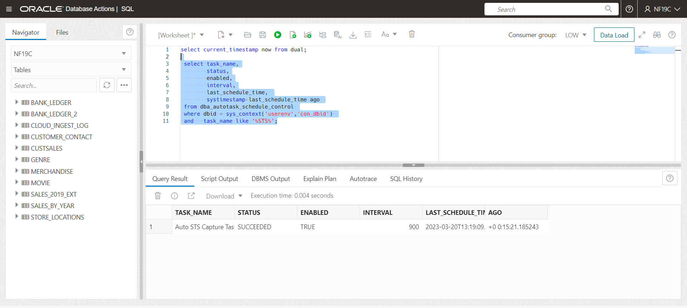
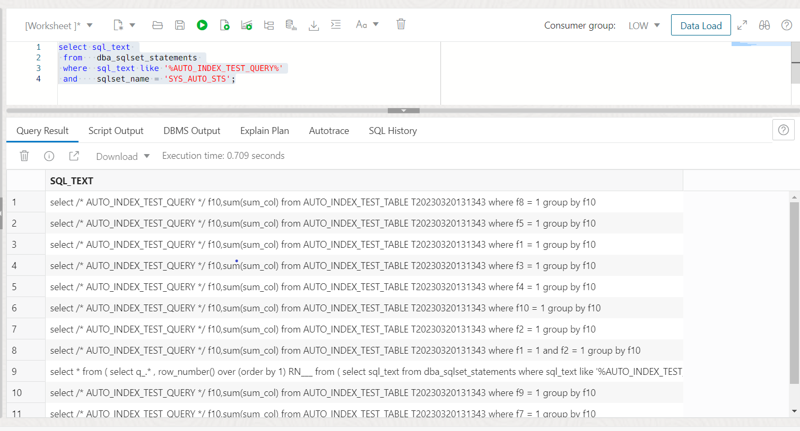
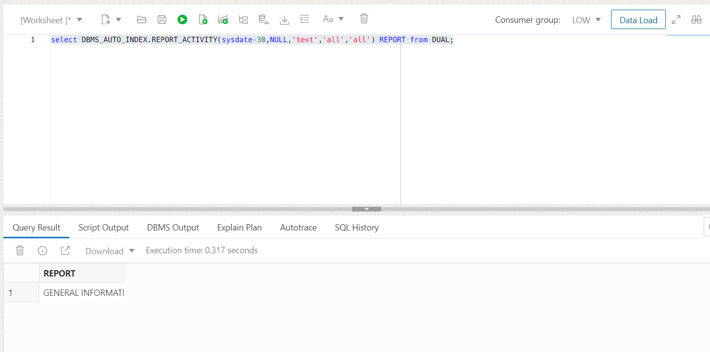
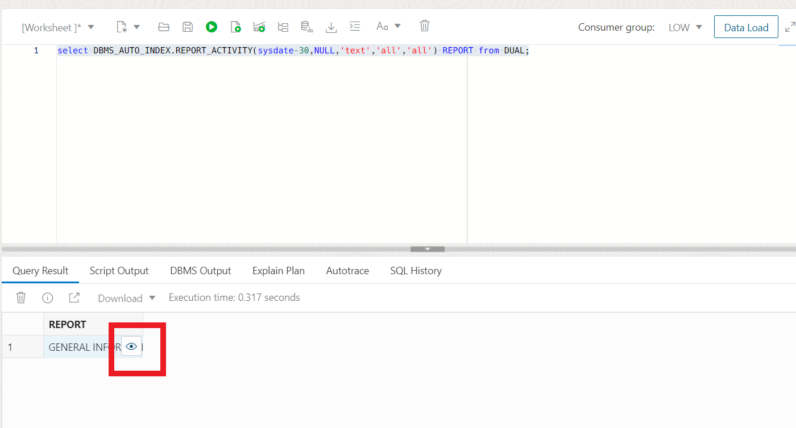

# The Power of Automatic Indexing
Indexes are at the center of performance management for any OLTP application. While writing good SQL code tops the list, creating the right set of indexes is the next best thing you can do to improve the performance of your application. As applications changes over time and new ad-hoc queries start hitting the database, they may impact performance. Developers and DBAs react by creating additional indexes and over time the number of indexes may become too large and cumbersome to manage. Index lifecycle management becomes a significant part of database maintenance and performance management.

The automatic indexing feature of Oracle 19c database can autonomously detect and create indexes based on application workload. It can also keep track of index usage and remove indexes that have not been using for a period of time. All of this with the right set of controls to make sure the DBA/Developer has full control over how this automation works.

## Introduction
In this hands-on lab we take a look at the Oracle Automatic Indexing, which uses machine learning algorithms to identify the most beneficial indexes for your queries and automatically create and manage them.

Workload information is collected in an Autonomous Database for analysis. Indexes are created based on workload analysis with verification and quantification of performance benefits:

- SQL statement predicate usage information is used to identify candidate indexes.
- Candidate indexes are created internally, hidden from the application workload.
- Internally, application workload SQL is test executed with the candidate indexes and analyzed for performance.
- Indexes that improve performance beyond internally specified performance and regression criteria are made visible to the application workload.
- SQL plan baselines prevent execution plan changes for SQL statements that do not benefit from an otherwise-beneficial index.


Estimated Time: 45 minutes

### Objectives

In this lab, you will:
* Use Automatic Indexing

### Prerequisites 
This lab assumes you have:

* Have provisioned an Autonomous Database instance
* Have completed the 19C Setup Lab

## Task 1: Configure Automatic Indexing

1. **If you already have SQL Developer Web up and are logged in as the NF19C user, skip to step 4.** If you're not already looking at the SQL Developer Web interface, locate your Autonomous Database by clicking the hamburger menu in the top left of the screen, selecting Oracle Databases and choose Autonomous Database. 
 
  
 
2. Select the name of your database and click on the Database Actions button located at the top of the screen.

   
   
3. Log into Database Actions as the NF19C user. Use the picture below to navigate to the SQL editor
	
	
	

4. The DBMS\_AUTO\_INDEX package is used to manage the automatic indexing feature. The CDB\_AUTO\_INDEX\_CONFIG view shows the current automatic indexing configuration. Let's check our current index mode.

      ```
      <copy>
      SELECT parameter_name, parameter_value 
      FROM cdb_auto_index_config;
      </copy>
      ``` 
   

5. To configure automatic indexing, you can use the CONFIGURE procedure of the DBMS\_AUTO\_INDEX package. The AUTO\_INDEX\_MODE property controls the on-off switch for automatic indexing and can have one of the following allowed values:

    * IMPLEMENT: This value turns on automatic indexing and creates new indexes that enhance performance. The new indexes are visible and available for use by the optimizer.
    * REPORT ONLY: This value also turns on automatic indexing, but any new indexes created will remain invisible.
    * OFF: This value turns off automatic indexing altogether.

6. The SQL to switch between modes is:

    ```
     EXEC DBMS_AUTO_INDEX.CONFIGURE('AUTO_INDEX_MODE', 'IMPLEMENT');
     EXEC DBMS_AUTO_INDEX.CONFIGURE('AUTO_INDEX_MODE', 'REPORT ONLY');
     EXEC DBMS_AUTO_INDEX.CONFIGURE('AUTO_INDEX_MODE', 'OFF');
    ```


## Task 2: Create and Populate an Application Table
1. Create an application table and prepare it for auto indexing. This will take around three minutes.

	```
	<copy>
    create table AUTO_INDEX_TEST_TABLE as
    select 1                sum_col,
        rownum              f1,
        mod(rownum,1000)  f2,
        mod(rownum,10000) f3,
        mod(rownum,5000)  f4,
        mod(rownum,2000)  f5,
        mod(rownum,1000)  f6,
        mod(rownum,100)   f7,
        mod(rownum,50)    f8,
        mod(rownum,10)    f9,
        mod(rownum,10)     f10,
        pad
    from   (select dbms_random.string('u',1000) pad from dual connect by level<=100) a,
        (select 1 c from dual connect by level<=1000) b;
	
	--
	-- Statistics will be generated during table creation (above), 
	-- but we'll perform this step to remind ourselves that 
	-- statistics must not be stale. Auto indexing will
	-- not consider new indexes for tables with stale statistics.
	--
	exec dbms_stats.gather_table_stats(user,'AUTO_INDEX_TEST_TABLE')
	--
	-- Oracle Autonomous Database has optimizations 
	-- for aggregate queries,improving query performance
	-- using database statistics.
	--
	-- For the sake of this demo, we'll make sure 
	-- that this will not kick in and queries will
	-- need to scan the table or use the result cache.
	--
	insert into AUTO_INDEX_TEST_TABLE 
	            values (0,0,0,0,0,0,0,0,0,0,0,'X');
	commit;
	</copy>

	```

2.  Enable automatic indexing by setting the auto index mode to IMPLEMENT.
	
	```
	<copy>
    exec dbms_auto_index.configure('AUTO_INDEX_MODE', 'IMPLEMENT')
    </copy>
    ```


3.  Set the result cache mode to MANUAL. The database result cache is enabled by default in ADW. In this lab we want to clearly see before vs after performance, so we'll set it to manual-only for now.
	
	```
	<copy>
	alter system set result_cache_mode = manual;
    </copy>
    ```

## Task 3: Execute an Application Workload   

1. Execute a workload on the application table, AUTO\_INDEX\_TEST\_TABLE. The statements use a variety of different predicates, some of which will benefit from index access. Auto indexing tests _new_ application workload SQL statements as soon as possible and will not test them again for at least 30 days. To ensure that our SQL statements are tested as soon as possible (even if you have run this lab before), the PL/SQL block below generates unique SQL statements each time it is executed. It does this using a table alias name incorporating a time-stamp. Note that workload SQL statements need to be executed more than once to be considered by auto indexing.

    ````
    <copy>
    set serveroutput on
    declare
        qry varchar2(1000);
        talias  varchar2(30);
        n1  number;
        n2  number;
    begin
        for i in 1..10
        loop
            talias := 'T'||to_char(sysdate,'YYYYMMDDHH24MISS');
            qry := 'select /* AUTO_INDEX_TEST_QUERY */ f10,sum(sum_col) from AUTO_INDEX_TEST_TABLE '||talias||' where f'||i||' = 1 group by f10';
            execute immediate qry into n1,n2;
            execute immediate qry into n1,n2;
            execute immediate qry into n1,n2;
            dbms_output.put_line('QRY = '||qry);
            dbms_output.put_line('SUM = '||n2);
        end loop;
        qry := 'select /* AUTO_INDEX_TEST_QUERY */ f10,sum(sum_col) from AUTO_INDEX_TEST_TABLE '||talias||' where f1 = 1 and f2 = 1 group by f10';
        execute immediate qry into n1,n2;
        execute immediate qry into n1,n2;
        execute immediate qry into n1,n2;
        dbms_output.put_line('QRY = '||qry);
        qry := 'select /* AUTO_INDEX_TEST_QUERY */ f10,sum(sum_col) from AUTO_INDEX_TEST_TABLE '||talias||' where f1 = 1 and f2 = 1 group by f10';
        execute immediate qry into n1,n2;
        execute immediate qry into n1,n2;
        execute immediate qry into n1,n2;
        dbms_output.put_line('QRY = '||qry);
    end;
    /
    set serveroutput off
    </copy>
    ````
    
## Task 4: Wait for Workload Capture

The Oracle Autonomous Database collects workload SQL periodically (every 15 minutes). The _Auto STS Capture Task_ stores workload statements in a SQL tuning set called SYS\_AUTO\_STS. This is the _automatic SQL tuning set_ (ASTS). The whole process is self-managing, so all we have to do now is sit back and wait for our new indexes to appear! Nevertheless, we will take a closer look at what happens once a workload has been executed.

1. Using the following query, check if the Auto STS task has executed recently. Wait until it has executed, _after_ the workload queries were executed. This will take up to 15 minutes.

    ````
    <copy>
     select current_timestamp now from dual;
     
     select task_name,
            status,
            enabled,
            interval,
            last_schedule_time, 
            systimestamp-last_schedule_time ago 
     from dba_autotask_schedule_control 
     where dbid = sys_context('userenv','con_dbid') 
     and   task_name like '%STS%';
    </copy>
    ````

2. Keep running the query, and monitor the LAST\_SCHEDULE\_TIME. Wait for the time to change. Alternatively, look at the "AGO" column value and wait for it to show that the task ran a few seconds ago. The interval is 900 seconds, so you will need to wait up to 15 minutes.

    

3. After 15 minutes-or-so, the Autonomous Database will have captured the workload queries. You can confirm that this by inspecting the automatic SQL tuning set. You will see the latest and previous workload SQL statements if you have run this lab before.

    ````
    <copy>
     select sql_text 
     from   dba_sqlset_statements 
     where  sql_text like '%AUTO_INDEX_TEST_QUERY%'
     and    sqlset_name = 'SYS_AUTO_STS';
    </copy>
    ````
    

## Task 5: Generate the Automatic Indexing Report   

1. If the auto indexing task has _just_ completed dealing with your workload, you can view the most recent report. To generate the report, run the following.

    ````
    <copy>
    select DBMS_AUTO_INDEX.REPORT_ACTIVITY(sysdate-30,NULL,'text','all','all') REPORT from DUAL;
    </copy>
    ````
    

2. Open the report for viewing. To do this, click inside the report to view the expand icon (this will look like an eye) and select the expand icon.

    
    


## Task 6: View the Automatic Indexing Report   

1. The summary section of the report will look something like this.

    

You might see some differences in your report because the results depend on measured workload performance, and relative SQL performance may change over time.

In the report above, we can see:

- Ten index candidates were identified. Auto indexing identifies table columns used in query predicates. These columns are candidates for indexing. In general, auto indexing will identify a many candidates.
- Six indexes were created. Usually, a _subset_ of candidates will be deemed potentially useful by the Oracle Optimizer. Auto indexing test parses the workload SQL to see which indexes are likely to be useful. These candidates are built and internal workload performance testing will decide which ones are _sufficiently_ useful to be made visible to the workload.
- Four indexes were made visible. These indexes were found to improve the performance of the workload (above a threshold value).
- Two indexes remain invisible because, when tested using the workload, they did not improve workload sufficiently to be made visible to the workload. If no new workload queries are found that benefit from these indexes, they will remain INVISIBLE and the auto index task will make them INVALID after a period of 24 hours.
- Four queries in the workload we found to have improved performance with the new indexes.
- One workload query suffers a potential performance regression due to the new auto indexes. A SQL plan baseline has been created to prevent this.

2. The indexes created are listed in the report (invisible ones are asterisked):

    

3. In a detailed report, individual SQL performance improvements are listed, including SQL execution plans:

    

    


3. The report includes details of SQL plan baselines and an error section. It is common to see _ORA-00942: table or view does not exist_ errors in the final section if you are testing on a volatile environment. This is normal and indicative of captured workload queries for tables or views that have subsequently been dropped.

    

Automatic indexing enables Autonomous Database users to benefit from indexing without the risks inherent in making changes without analyzing the effect changes will make to the application workload. This Lab is intended to show a small sample of what the Automatic Indexing capabilities can do. For a complete in depth look at automatic indexing try the lab below.

- [Automatic Indexing for Oracle Autonomous Database](https://livelabs.oracle.com/pls/apex/f?p=133:180:11731666531056::::wid:3328)

You may now proceed to the next lab.
## Acknowledgements

*Great Work! You successfully created a client machine and connected to your autonomous database instance using SQL Developer and command line tools.*

- **Contributors** - Nigel Bayliss
- **Last Updated By/Date** - Killian Lynch, June 2024

## See an issue or have feedback?  
Please submit feedback [here](https://livelabs.oracle.com/pls/apex/f?p=133:1:::::P1_FEEDBACK:1).   Select 'Autonomous DB on Dedicated Exadata' as workshop name, include Lab name and issue / feedback details. Thank you!
