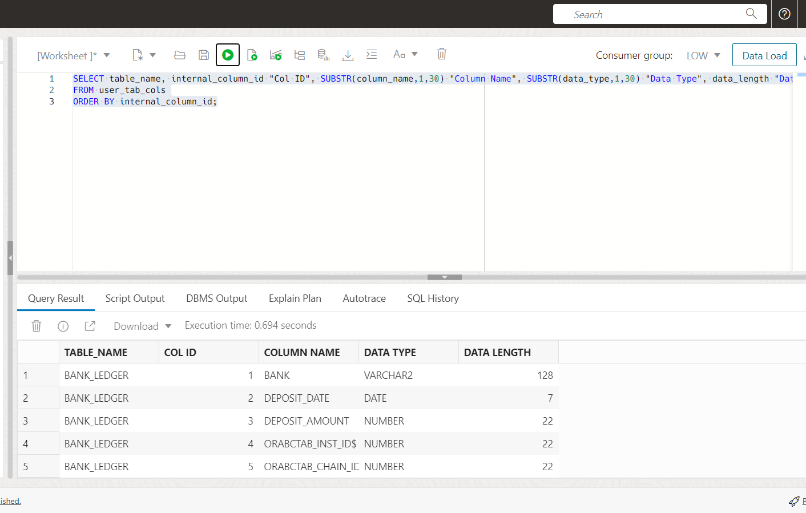
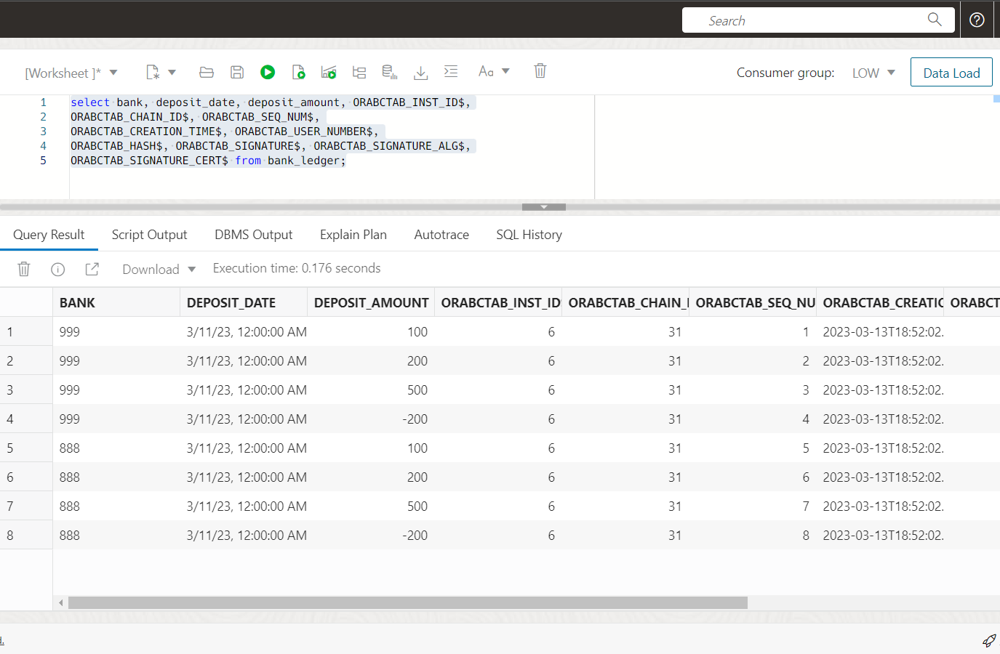
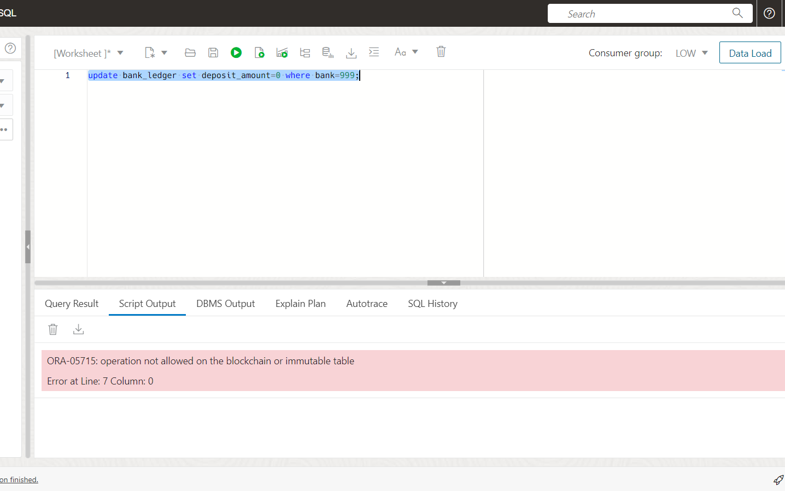

# Manage Blockchain Tables

## Introduction

In the upcoming lab, we will be delving into the exciting world of blockchain technology, albeit focusing on a specific subset of its capabilities. Specifically, our primary objective will be to create and manage blockchain tables. Through this, we will learn how to efficiently insert data into the tables and how to manage rows in the blockchain.

Beyond this, blockchain technology presents us with the opportunity to sign a specific record and verify the entire blockchain ledger. This is made possible by utilizing a certificate directory, which enables us to ensure the integrity of the blockchain. To sign a record, we can generate a certificate and add it to the directory, generate the byte code for the record we want to sign, and then use the certificate to sign the record. Subsequently, to verify the integrity of the entire blockchain, we can cross-check that all signed records match their respective byte codes and that the digital signatures match the certificates in the directory.

In this lab, we will examine a banking example, deviating from our previous scenario of Oracle MovieStreams.

Estimated Lab Time: 20 minutes

### Objectives

In this lab, you will:

* Create the Blockchain table and insert rows
* Manage blockchain tables and rows in a blockchain table
* Check the validity of rows in the blockchain table without signatures

### Prerequisites

* An Oracle Free Tier, Always Free, Paid or LiveLabs Cloud Account
* Provisioned an Oracle Database 19c Instance
* Have successfully completed the Setup lab

## Task 1: Connect to ADB with SQL Developer Web

1. **If you already have SQL Developer Web up and are logged in as the NF19C user, skip to step 4.** If you're not already looking at the SQL Developer Web interface, locate your Autonomous Database by clicking the hamburger menu in the top left of the screen, selecting Oracle Databases and choose Autonomous Database. 
 
  
 
2. Select the name of your database and click on the Database Actions button located at the top of the screen.

   
   
3. Log into Database Actions as the NF19C user. Use the picture below to navigate to the SQL editor
	
	
	

4. The `CREATE BLOCKCHAIN TABLE` statement requires additional attributes. The `NO DROP`, `NO DELETE`, `HASHING USING`, and `VERSION` clauses are mandatory.

    Create a Blockchain table named `bank_ledger` that will maintain a tamper-resistant ledger of current and historical transactions using the SHA2_512 hashing algorithm. Rows of the `bank_ledger` blockchain table can never be deleted. Moreover, the blockchain table can be dropped only after 16 days of inactivity.

	```
	<copy>
	CREATE BLOCKCHAIN TABLE bank_ledger (bank VARCHAR2(128), deposit_date DATE, deposit_amount NUMBER)
	NO DROP UNTIL 16 DAYS IDLE
	NO DELETE LOCKED
	HASHING USING "SHA2_512" VERSION "v1";
	</copy>
	```

	

5. Describe the `bank_ledger` blockchain table to view the columns. Notice that the description displays only the visible columns.

	```
	<copy>
	DESC bank_ledger;
	</copy>
	```

	

6. Insert records into the `bank_ledger` blockchain table.

	```
	<copy>
	INSERT INTO bank_ledger VALUES (999,to_date(sysdate,'dd-mm-yyyy'),100);
	INSERT INTO bank_ledger VALUES (999,to_date(sysdate,'dd-mm-yyyy'),200);
	INSERT INTO bank_ledger VALUES (999,to_date(sysdate,'dd-mm-yyyy'),500);
	INSERT INTO bank_ledger VALUES (999,to_date(sysdate,'dd-mm-yyyy'),-200);
	INSERT INTO bank_ledger VALUES (888,to_date(sysdate,'dd-mm-yyyy'),100);
	INSERT INTO bank_ledger VALUES (888,to_date(sysdate,'dd-mm-yyyy'),200);
	INSERT INTO bank_ledger VALUES (888,to_date(sysdate,'dd-mm-yyyy'),500);
	INSERT INTO bank_ledger VALUES (888,to_date(sysdate,'dd-mm-yyyy'),-200);
	commit;
	</copy>
	```

7. Query the `bank_ledger` blockchain table to show the records.

	```
	<copy>
	select * from bank_ledger;
	</copy>
	```

	

8. Run the command to view all the blockchain tables.

	```
	<copy>
	select * from user_blockchain_tables;
	</copy>
	```

	

9. Use the `USER_TAB_COLS` view to display all internal column names used to store internal information like the user's number, the user's signature.

	```
	<copy>
	SELECT table_name, internal_column_id "Col ID", SUBSTR(column_name,1,30) "Column Name", SUBSTR(data_type,1,30) "Data Type", data_length "Data Length"
	FROM user_tab_cols
	ORDER BY internal_column_id;
	</copy>
	```

	

10. Query the `bank_ledger` blockchain table to display all the values in the blockchain table, including values of internal columns.

	```
	<copy>
	select bank, deposit_date, deposit_amount, ORABCTAB_INST_ID$,
	ORABCTAB_CHAIN_ID$, ORABCTAB_SEQ_NUM$,
	ORABCTAB_CREATION_TIME$, ORABCTAB_USER_NUMBER$,
	ORABCTAB_HASH$, ORABCTAB_SIGNATURE$, ORABCTAB_SIGNATURE_ALG$,
	ORABCTAB_SIGNATURE_CERT$ from bank_ledger;
	</copy>
	```

	

## Task 2: Manage blockchain tables and rows in a blockchain table

When you try to manage the rows using update, delete, truncate you get the error `operation not allowed on the blockchain table` if the rows are not outside the retention period.

1. Update a record in the `bank_ledger` blockchain table by setting deposit\_amount=0.

	```
	<copy>
	update bank_ledger set deposit_amount=0 where bank=999;
	</copy>
	```

	

2. Delete a record in the `bank_ledger` blockchain table.

	```
	<copy>
	delete from bank_ledger where bank=999;
	</copy>
	```

	

3. Truncating the table `bank_ledger`.

	```
	<copy>
	truncate table bank_ledger;
	</copy>
	```

	

Similar to managing rows within the retention period, managing the blockchain table using alter, drop will throw an error.

4. Drop the table `bank_ledger`. It will drop successfully if no row exists in the table.

	```
	<copy>
	drop table bank_ledger;
	</copy>
	```

	

5. Alter the table `bank_ledger` to not delete the rows until 20 days after insert.

	```
	<copy>
	ALTER TABLE bank_ledger NO DELETE UNTIL 20 DAYS AFTER INSERT;
	</copy>
	```

	

6. Create another table `bank_ledger_2`.

	```
	<copy>
	CREATE BLOCKCHAIN TABLE bank_ledger_2 (bank VARCHAR2(128), deposit_date DATE, deposit_amount NUMBER)
	NO DROP UNTIL 16 DAYS IDLE
	NO DELETE UNTIL 16 DAYS AFTER INSERT
	HASHING USING "SHA2_512" VERSION "v1";
	</copy>
	```

	

7. Alter the table `bank_ledger_2` by specifying that the rows cannot be deleted until 20 days after they were inserted.

	```
	<copy>
	ALTER TABLE bank_ledger_2 NO DELETE UNTIL 20 DAYS AFTER INSERT;
	</copy>
	```

8. Run the command to view all the blockchain tables.

	```
	<copy>
	select * from user_blockchain_tables;
	</copy>
	```

	

## Task 3: Verify rows without signature

1. Verify the rows in blockchain table using DBMS\_BLOCKCHAIN\_TABLE.VERIFY_ROWS.

	```
	<copy>
	DECLARE
		verify_rows NUMBER;
		instance_id NUMBER;
	BEGIN
		FOR instance_id IN 1 .. 4 LOOP
			DBMS_BLOCKCHAIN_TABLE.VERIFY_ROWS('NF19C','BANK_LEDGER',
	NULL, NULL, instance_id, NULL, verify_rows);
		DBMS_OUTPUT.PUT_LINE('Number of rows verified in instance Id '||
	instance_id || ' = '|| verify_rows);
		END LOOP;
	END;
	/
	</copy>
	```

	

2. DBA view of blockchain tables.

	```
	<copy>
	select * from dba_blockchain_tables;
	</copy>
	```

	

In the lab, we focused on a subset of the capabilities of blockchain, primarily on creating and managing blockchain tables. We learned how to insert data into these tables and manage rows in the blockchain. Additionally, we explored the process of signing a record and verifying the integrity of the entire blockchain through a certificate directory. By generating a certificate and adding it to the directory, we were able to sign a specific record, and by cross-checking that all signed records match their respective byte codes and digital signatures, we verified the integrity of the entire blockchain.

If you're keen on exploring the fascinating world of blockchain technology and learning more about signing records and verifying ledgers, we highly recommend checking out the LiveLab below. This interactive and immersive learning experience will provide you with hands-on experience in creating and managing blockchain tables, signing specific records, and verifying the entire blockchain's integrity through a certificate directory.

- [Blockchain in the Oracle Database](https://livelabs.oracle.com/pls/apex/f?p=133:180:114026617672312::::wid:746)

You may now proceed to the next lab.

## Acknowledgements

* **Author** - Rayes Huang, Mark Rakhmilevich, Anoosha Pilli
* **Contributors** - Anoosha Pilli, Didi Han, Database Product Management, Oracle Database
* **Last Updated By/Date** - Killian Lynch June 2024
