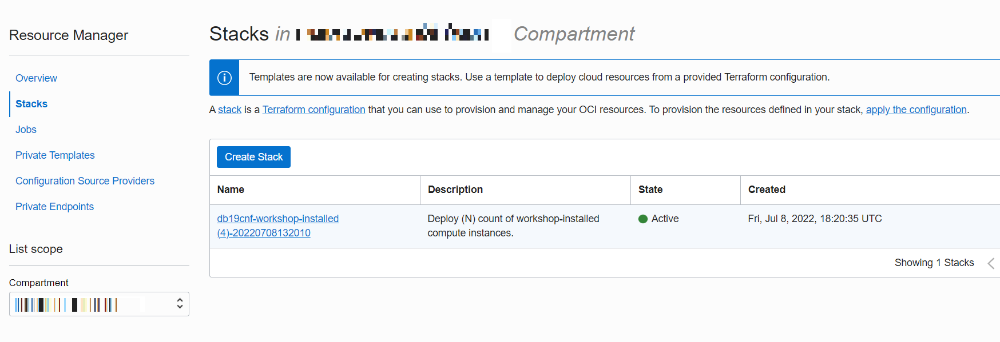
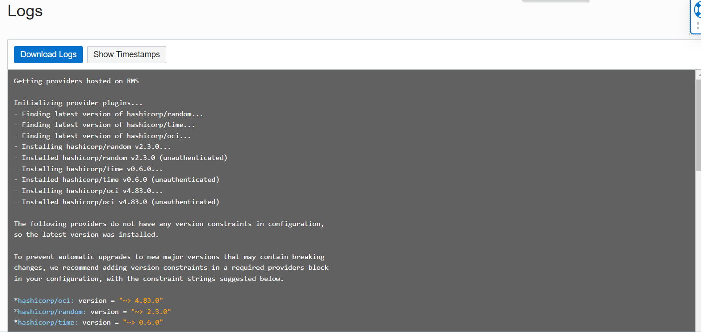

# Clean your environment

## Introduction

Congrats! Now that you are done with the workshop, you can now clean up your OCI resources. This lab will guide you through the steps to do that.

### Objectives

In this lab, you will:

- Clean your environment

### Prerequisites

This lab assumes you have:
- Obtained your `workshop-installed` compute instance.

## Task 1: Clean your environment

1. In the OCI console, go to **Developer Services** > **Stacks**.

    

2. Click on the stack that was created at the beginning of the workshop. It should be titled **db19cnf-workshop-installed-####**.

    

3. Click **Destroy**. This will destroy all of the resources that were created at the start of the workshop. 

    

4. Once the **Destroy** job is completed, you may delete the stack, although you may keep it if you'd like to redo the workshop.

    
   
## Learn More

- [Resource Manager](https://docs.oracle.com/en-us/iaas/Content/ResourceManager/Concepts/landing.htm#ResourceManager)
- [Video about Resource Manager](https://youtu.be/udJdVCz5HYs)
- [Oracle Cloud Marketplace](https://cloudmarketplace.oracle.com/marketplace/en_US/homePage.jspx)

## Acknowledgements
* **Author** - Matthew McDaniel, Platform Specialists, July 12, 2022
* **Last Updated By/Date** - Matthew McDaniel , Platform Specialists, July 12, 2022
