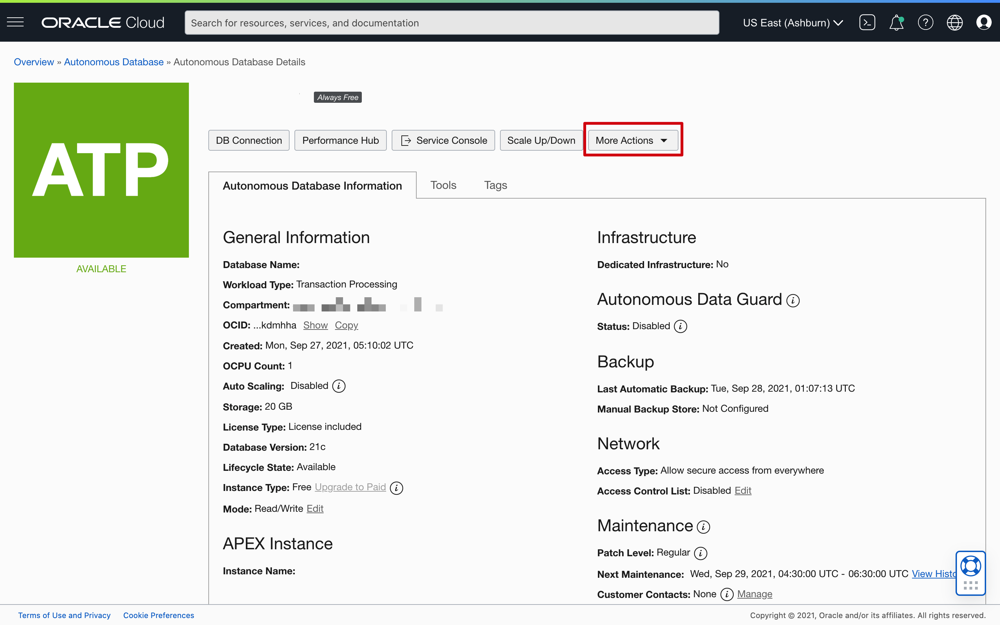
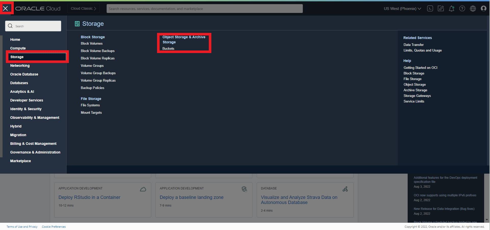

# How can I terminate Oracle Autonomous Database and my Object Storage Bucket?

## Introduction
Duration: 5 minutes

You can permanently delete (terminate) instances that you no longer need. Terminating an Oracle Autonomous Database permanently deletes the database data. However, automatic backups are not deleted if you have chosen Recovery Appliance or NFS as a backup destination. You can delete automatic backups directly from the Recovery Appliance or NFS.

In this sprint, we will be deleting an always free demo Oracle Autonomous Transaction Processing database instance named DEMOATP in a compartment. You should have an Oracle Autonomous Database instance provisioned with Lifecycle Status - Available or Stopped.

> **Note:** While this sprint terminates an Oracle Autonomous Transaction Processing database, the steps are the same for terminating an Oracle Autonomous Data Warehouse database.

### Objectives

In this lab, you will:
* Terminate an Oracle Autonomous Database Instance
* Terminate an Oracle Object Storage Bucket

### Prerequisites
* Have an Autonomous Database provisioned and an Object storage created

## Task 1: Terminate an Oracle Autonomous Database Instance

1. If you are using a Free Trial or Always Free account, in the Oracle Cloud console, you need to be in the region where your Oracle Autonomous Database resources is provisioned. You can see your current default **Region** in the top right-hand corner of the page. To change the default region, click on the **Region** drop-down and choose the region where your Oracle Autonomous Database resource is provisioned.

    

2. Click on navigation menu, search **Oracle Database** and choose **Autonomous Transaction Processing** (ATP).

    **Note:** You can also directly access your Oracle Autonomous Transaction Processing service in the **Quick Actions** section of the dashboard.

    

3. From the compartment drop-down menu select the **Compartment** where your Oracle Autonomous Database resource is provisioned. If there were a long list of databases, you could filter the list by the **State** of the databases (Available, Stopped, Terminated, etc). You can also sort by **Workload Type**. In this demo, the **Transaction Processing** workload type is selected.

    
    

4. From the databases displayed, click **Display Name** of the database you wish to terminate.

    Here, we are terminating the available **OCIDemo** Oracle Autonomous Transaction Processing database instance. (Or the name you used when you created the database). Click **OCIDemo**.

    

5. Click **More Actions**.

    

6. From the more actions drop-down, scroll down and click **Terminate**.

    

7. Confirm that you wish to terminate your Oracle Autonomous Database in the confirmation dialog. Type your database name in the input field and click **Terminate Autonomous Database**.

    Here, as we wish to terminate **DEMOATP** Oracle Autonomous Database, we type **DEMOATP** and click **Terminate Autonomous Database**.

    

8.  Your instance will begin to terminate, the Lifecycle State will turn from Available to Terminating.

    

9. After a few minutes, once the instance is terminated, the Lifecycle state will change from Terminating to Terminated.

    

You have successfully terminated an Oracle Autonomous Database instance.
## Task 2: Terminate an Oracle Object Storage Bucket
1. Using the Hamburger Menu in the top left hand corner, select **Storage** and **Object Storage and Archive Storage**.
    

2. Click the **3 dots** located to the right side of the bucket name and **select Delete**.

   

3. Type the Bucket name into the space provided and **select Delete**.

   

## Learn More

* Click [here](https://docs.oracle.com/en-us/iaas/exadata/doc/eccmanagingadbs.html#GUID-A00BC3BB-3AE6-4FBF-AEAF-2D9C14CD1D9A) to know more about Managing Autonomous Databases.
